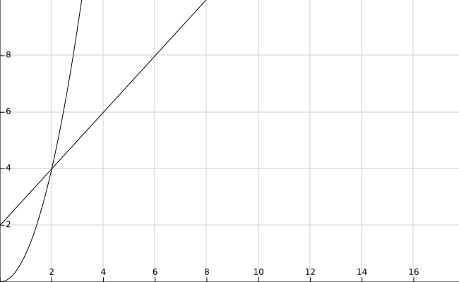
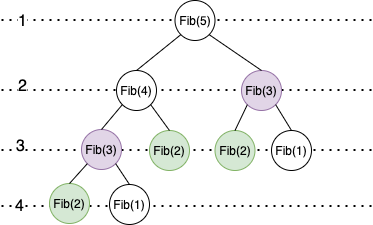
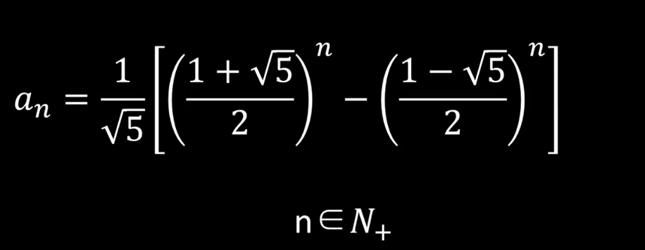

# 计算时间复杂度

[（数据结构）十分钟搞定时间复杂度（算法的时间复杂度）-- 原文链接](https://www.jianshu.com/p/f4cca5ce055a)

时间维度：是指执行当前算法所消耗的时间，我们通常用「时间复杂度」来描述。

一个算法执行所耗费的时间，从理论上是不能算出来的，必须上机运行测试才能知道，

时间频度T(n)中，n称为问题的规模，当n不断变化时，时间频度T(n)也会不断变化。但有时我们想知道它变化时呈现什么规律，为此我们引入时间复杂度的概念。算法的时间复杂度也就是算法的时间度量，记作：T(n) = O(f(n))。它表示随问题规模n的增大，算法执行时间的增长率和f(n)的增长率相同，称作算法的渐进时间复杂度，简称「时间复杂度」。

但我们不可能也没有必要对每个算法都上机测试，只需知道哪个算法花费的时间多，哪个算法花费的时间少就可以了。并且一个算法花费的时间与算法中语句的执行次数成正比例，哪个算法中语句执行次数多，它花费时间就多。一个算法中的语句执行次数称为语句频度或「时间频度」。记为T(n)。

这种表示方法我们称为「大$O$符号表示法」，又称为**渐进符号**，是用于描述函数渐进行为的数学符号
常见的时间复杂度量级有：

* 常数阶$O(1)$
* 线性阶$O(n)$
* 平方阶$O(n^2)$
* 立方阶$O(n^3)$
* 对数阶$O(logn)$
* 线性对数阶$O(nlogn)$
* 指数阶$O(2^n)$
* 常数阶$O(1)$

$O(1)$，表示该算法的执行时间（或执行时占用空间）总是为一个常量，不论输入的数据集是大是小，只要是没有循环等复杂结构，那这个代码的时间复杂度就都是$O(1)$，如：

我们假设计算机运行一行基础代码需要执行一次运算。

```C
int aFunc(void) {
    printf("Hello, World!\n");      //  需要执行 1 次
    return 0;       // 需要执行 1 次
}
```

那么上面这个方法需要执行 2 次运算

```C
int aFunc(int n) {
    for(int i = 0; i<n; i++) {         // 需要执行 (n + 1) 次
        printf("Hello, World!\n");      // 需要执行 n 次
    }
    return 0;       // 需要执行 1 次
}
```
这个方法需要 (n + 1 + n + 1) = 2n + 2 次运算。

我们把 算法需要执行的运算次数 用 输入大小 n 的函数 表示，即 T(n) 。
此时为了 **估算算法需要的运行时间** 和 **简化算法分析**，我们引入时间复杂度的概念。

定义：存在常数 c 和函数 f(N)，使得当 N >= c 时 T(N) <= f(N)，表示为 T(n) = O(f(n)) 。
如图：



当 N >= 2 的时候，f(n) = n^2 总是大于 T(n) = n + 2 的，于是我们说 f(n) 的增长速度是大于或者等于 T(n) 的，也说 f(n) 是 T(n) 的上界，可以表示为 T(n) = $O(f(n))$。

因为 f(n) 的增长速度是大于或者等于 T(n) 的，即T(n) = $O(f(n))$，所以我们可以用 f(n) 的增长速度来度量 T(n) 的增长速度，所以我们说这个算法的时间复杂度是 $O(f(n))$。

**算法的时间复杂度，用来度量算法的运行时间，记作: T(n) = $O(f(n))$。它表示随着 输入大小n 的增大，算法执行需要的时间的增长速度可以用 f(n) 来描述。**

显然如果 T(n) = n^2，那么 T(n) = $O(n^2)$，T(n) = $O(n^3)$，T(n) = $O(n^4)$ 都是成立的，但是因为第一个 f(n) 的增长速度与 T(n) 是最接近的，所以第一个是最好的选择，所以我们说这个算法的复杂度是 O(n^2) 。

那么当我们拿到算法的执行次数函数 T(n) 之后怎么得到算法的时间复杂度呢？

1. 我们知道常数项对函数的增长速度影响并不大，所以当 T(n) = c，c 为一个常数的时候，我们说这个算法的时间复杂度为 $O(1)$；如果 T(n) 不等于一个常数项时，直接将常数项省略。

>比如  
>第一个 Hello, World 的例子中 T(n) = 2，所以我们说那个函数(算法)的时间复杂度为 $O(1)$。  
>T(n) = n + 29，此时时间复杂度为 $O(n)$。

2. 我们知道高次项对于函数的增长速度的影响是最大的。n^3 的增长速度是远超 n^2 的，同时 n^2 的增长速度是远超 n 的。 同时因为要求的精度不高，所以我们直接忽略低此项。

> 比如  
> T(n) = n^3 + n^2 + 29，此时时间复杂度为 O(n^3)。

3. 因为函数的阶数对函数的增长速度的影响是最显著的，所以我们忽略与最高阶相乘的常数。

>比如  
>T(n) = 3n^3，此时时间复杂度为 $O(n^3)$。

**综合起来：如果一个算法的执行次数是 T(n)，那么只保留最高次项，同时忽略最高项的系数后得到函数 f(n)，此时算法的时间复杂度就是 $O(f(n))$。为了方便描述，下文称此为 大$O$推导法。**

由此可见，由执行次数 T(n) 得到时间复杂度并不困难，很多时候困难的是从算法通过分析和数学运算得到 T(n)。对此，提供下列四个便利的法则，这些法则都是可以简单推导出来的，总结出来以便提高效率。

1. 对于一个循环，假设循环体的时间复杂度为 $O(n)$，循环次数为 m，则这个
循环的时间复杂度为 $O(n×m)$。

```C
void aFunc(int n) {
    for(int i = 0; i < n; i++) {         // 循环次数为 n
        printf("Hello, World!\n");      // 循环体时间复杂度为 O(1)
    }
}
```

此时时间复杂度为 $O(n × 1)$，即 $O(n)$。

2. 对于多个循环，假设循环体的时间复杂度为 $O(n)$，各个循环的循环次数分别是a, b, c...，则这个循环的时间复杂度为 $O(n×a×b×c...)$。分析的时候应该由里向外分析这些循环。

```C
void aFunc(int n) {
    for(int i = 0; i < n; i++) {         // 循环次数为 n
        for(int j = 0; j < n; j++) {       // 循环次数为 n
            printf("Hello, World!\n");      // 循环体时间复杂度为 O(1)
        }
    }
}
```

此时时间复杂度为 $O(n × n × 1)$，即 $O(n^2)$。

3. 对于顺序执行的语句或者算法，总的时间复杂度等于其中最大的时间复杂度。

```C
void aFunc(int n) {
    // 第一部分时间复杂度为 O(n^2)
    for(int i = 0; i < n; i++) {
        for(int j = 0; j < n; j++) {
            printf("Hello, World!\n");
        }
    }
    // 第二部分时间复杂度为 O(n)
    for(int j = 0; j < n; j++) {
        printf("Hello, World!\n");
    }
}
```

此时时间复杂度为 $max(O(n^2), O(n))$，即 $O(n^2)$。

4. 对于条件判断语句，总的时间复杂度等于其中 时间复杂度最大的路径 的时间复杂度。

```C
void aFunc(int n) {
    if (n >= 0) {
        // 第一条路径时间复杂度为 O(n^2)
        for(int i = 0; i < n; i++) {
            for(int j = 0; j < n; j++) {
                printf("输入数据大于等于零\n");
            }
        }
    } else {
        // 第二条路径时间复杂度为 O(n)
        for(int j = 0; j < n; j++) {
            printf("输入数据小于零\n");
        }
    }
}
```

此时时间复杂度为 $max(O(n^2), O(n))$，即 $O(n^2)$。

**时间复杂度分析的基本策略是：从内向外分析，从最深层开始分析。如果遇到函数调用，要深入函数进行分析。**

最后，我们来练习一下

一. 基础题

求该方法的时间复杂度

```C
void aFunc(int n) {
    for (int i = 0; i < n; i++) {
        for (int j = i; j < n; j++) {
            printf("Hello World\n");
        }
    }
}
```
<b><details><summary>参考答案：</summary>
当 i = 0 时，内循环执行 n 次运算，当 i = 1 时，内循环执行 n - 1 次运算……当 i = n - 1 时，内循环执行 1 次运算。
所以，执行次数 $T(n) = n + (n - 1) + (n - 2)……+ 1 = n(n + 1) / 2 = n^2 / 2 + n / 2$。
根据上文说的 大$O$推导法 可以知道，此时时间复杂度为 $O(n^2)$。
</details>
<br/>

二. 进阶题

求该方法的时间复杂度

```C
void aFunc(int n) {
    for (int i = 2; i < n; i++) {
        i *= 2;
        printf("%i\n", i);
    }
}
```

<b><details><summary>参考答案：</summary>
假设循环次数为 t，则循环条件满足 $2^t < n$。
可以得出，执行次数$t = log(2)(n)$，即 $T(n) = log(2)(n)$，可见时间复杂度为 $O(log(2)(n))$，即 $O(log n)$。
</details>
<br/>

三. 再次进阶

求该方法的时间复杂度

```C
long aFunc(int n) {
    if (n <= 1) {
        return 1;
    } else {
        return aFunc(n - 1) + aFunc(n - 2);
    }
}
```

<b><details><summary>参考答案：</summary>
显然运行次数，$T(0) = T(1) = 1$，同时 $T(n) = T(n - 1) + T(n - 2) + 1$，这里的 1 是其中的加法算一次执行。
显然 $T(n) = T(n - 1) + T(n - 2)$ 是一个[斐波那契数列](https://baike.baidu.com/item/斐波那契数列)，通过**归纳证明法**可以证明，当 $n >= 1$ 时 $T(n) < (5/3)^n$，同时当 n > 4 时 $T(n) >= (3/2)^n$。
所以该方法的时间复杂度可以表示为 $O((5/3)^n)$，简化后为 $O(2^n)$。
可见这个方法所需的运行时间是以指数的速度增长的。如果大家感兴趣，可以试下分别用 1，10，100 的输入大小来测试下算法的运行时间，相信大家会感受到时间复杂度的无穷魅力。


下面是一个 二叉树的解法：



|||
|---|--|
|二叉树的层数=n-1|当 N=5 时，二叉树有四层|
|二叉树第 h 层的个数 $2^h$(从第0开始)||
|二叉树总结点数=(2^(n-1))-1|前三层总节点数=$(2^3)-1=7$ 所有终结点=(2^3)-1+2=9|

总结点数=斐波那契数执行次数  当 N=5 时，时间复杂度= $O(f(5))=O(2^3)+1$
所以斐波那契数的时间复杂度$T(n)=O(f(n))=O$(2^(n-2))+1)=$O(2^n)$


斐波那契通项公式：


</details>

<br/>

一些规则：

1. 复杂度为常数，如23，9999，等等 都表示为O(1)

2. 复杂度包含n时，省略系数与常数项，只取n的最高阶项

​ 如：$2n+45$ 为 $O(n)$ ； $4n^3+6n^2+n$ 为$O(n^3)$

3. 复杂度为对数时：如$log5(n)$、$log2(n)$ 等等 都表示为 $O(logn)$

3. 省略低阶，只取高阶 (即取最大的)

​ 如：$logn+nlogn$ 表示为$O(nlogn)$

## 复杂度的大小

$O(1) < O(logn) < O(n) < O(nlogn) < O(n^2) < O(n^3) < O(2^n) < O(n!) < O(n^n)$