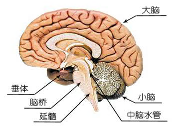
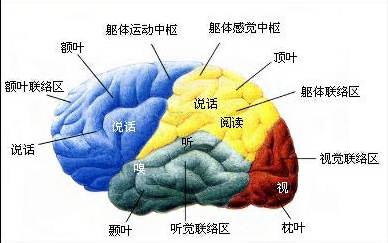
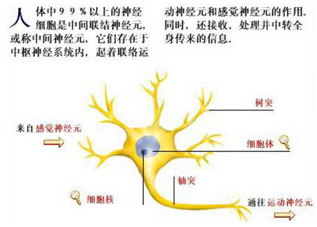
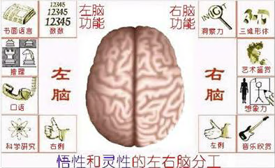
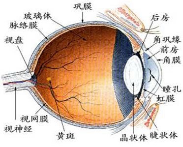
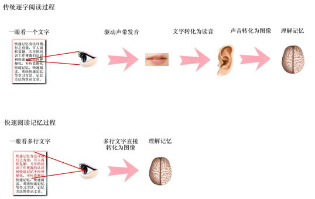
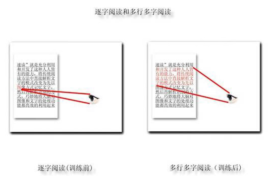
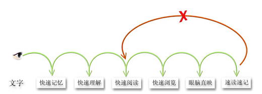

# 超级速读原理

## 生理基础，人人具备

速读是今文化、教育、及经济等领域中一个迅速升温的热点课题。它对国家来说是提高整本国民素质的一个必然趋势；它对公民个人来说是人们提高自身素质的一个行之有效的手段和方法。让我们以平常的心态来认识和揭开它层层神秘而又真实的面纱吧。

一、认识您神奇的大脑

当您惊叹电脑运算如此之快，存贮量如此之大、程序如此之复杂的时候，您可曾想到：您自已也拥有一台世界上功能最强，存贮量最大的电脑！它只有一千多克，像小椰子那么大，可轻易放在手掌之上，但它比世界上最强大的电脑还要强上千万倍。它，就是属于您的神奇的大脑!

1.人脑的组成:人类的脑由大脑、小脑及连接大脑、小脑的间脑、中脑和延髓组成。间脑、中脑、延髓统称为脑干。

人脑的结构图:

(1) 脑干：位于脊髓的上端。由脊髓传至脑的神经冲动，先传到脑干，再由脑干传至大脑。它对维持觉醒和抑制、过滤各感觉器官传入的信息起着重要的作用。主要功能是维持个体生命的心跳、呼吸、消化、体温、睡眠等重要生理活动。

(2) 小脑：位于大脑和枕叶的下方，在脑干之后。主要功能是：和大脑皮质运动区共同控制肌肉的运动，调节姿势和身体的平衡。

(3) 大脑：是脑的最高层部分，也是人脑中最复杂最重要的神经中枢。人脑的平均重量在1550克左右，仅占体重的2％—3％，然而它的血流量却是全身的20％，消耗的氧气是全身的25％。原因就在于人脑高度发达的大脑皮层。

大脑不同的部位有着不同的功能。当不同的部位出现障碍将不能进行相应的思维。

大脑皮层功能分布图：

2．神经元：即神经细胞，具有高度的敏感性。主要由三部分组成：细胞体、多个树突和一个轴突组成。

人体中99％以上的神经细胞是中间联结神经元，或称中间神经元，它们存在于中枢神经系统内，起着联络运动神经元和感觉神经元的作用。同时，还接收、处理并中转全身传来的信息。

神经元结构图：

3．大脑的左右半球分工：

自从16世纪，笛卡尔提出“心是一个，大脑为何是两个？”这一疑问后，世界各国的生物学家开始对大脑机能的分工，进行了几个世纪的探索和研究，最后发现了大脑左右半球分别担任着不同的工作：

左脑主管抽象思维，具体有：辨认时间、计算、逻辑分析、理解、听觉、语言（议论、听、说、读、写）等。 
右脑主管形象思维，具体有：认识空间、感受音乐、情感等。

人的左右脑分工图：

二、灵敏宽广的视觉

人的眼睛一瞬间即可接收到大量的图形信息，它在我们的速读和记忆训练中占了极其重要位置。

眼睛是在怎样的情况下工作的呢？

进入眼球的光线，经晶状体的折射，聚焦到视网膜上。视网膜分布着上亿个感光细胞。光能转换为电信号，再经视网膜神经元组成的复杂网络进行编码、处理，最后由视神经传到视皮层中枢：

视觉机能有两个指标。一个是视力，它直接影响人们的生活、学习和工作，这您已经很熟悉了。别一个是视野,指当眼球向正前方直视不动时所能看见的空间范围。距注视点30度角以内为中心视野,此部分较为清晰；30度以外为周边视野，俗称"余光"。

充分使用中心视野的清晰范围，可让我们的阅读速度提高十倍以上。传统的逐字阅读，只使用了中心视野的一个点；阅读快一点的人，可一眼识别4-6个字；经过训练的人，可在中心视野范围内一眼识别30-300字以上。很简单，一眼能识别几十几百字，比一眼看一个字，速度要快多少倍啊！速读速记系统，正是充分发挥了这方面的潜力！

三、唤醒沉睡的巨人

"您的大脑就像一个沉睡的巨人！"英国的作家、心理学家、教育家托尼•布赞如此形容："人脑是由亿万个脑细胞构成的，个个脑细胞就其形状而言就像是最复杂的小章鱼。它有中心、有许多分支。每一个分支有许多连接点。上百亿脑细胞中的每一个脑细胞都比今天地球上大多数的电脑强大和复杂许多倍。每一个脑细胞与几万至几十万个脑细胞连接。它们来回不断地传送着信息，这被称为迷人的织造术。其复杂和美丽程度在世间万物中无与伦比，而我们每个人都有一个。"

人类有100亿个脑细胞，每个脑细胞可以组成2万个不同的连接，这种组合排列，其可能性巨大得不可想象-—用科学家的话："也许比宇宙中的原子数还多！"即使象爰因斯坦那样伟大的科学家，也只发挥了大脑不到1/10的功能，绝大多数脑细胞仍然处于"待业"状态。更别说连大脑功能1/100也没发挥的普通人了。因此科学家们说："脑的创造力是无穷无尽的。"

人的任何限制，都是从自己的内心开始的。由于传统的教育，当您自己与爰因斯坦、比尔•盖茨相比时，唯一点不同就是您的内心认为自己不行。正是这副枷锁，束缚了您本来就具有的能力的发挥，限制了您潜力的挖掘！人类潜能的发挥，就是要打破一个又一个自设的枷锁。远古的人们，可曾想到可以制造电脑、汽车甚至飞机；现在记忆大师可背出小数点后两万位，一般人经过几分钟学习后可背出几百至几千位。简单的学习，您的阅读速度和记忆能力可以提高十倍以上！

打开这副枷锁，开启您的大脑，您会发现您的潜能几乎是无限的！您的大脑就是一座巨大的金矿！科学家们说"充分开发左右脑，可以考取21个博士！"

眼睛一次可以看清楚的是"一块一块"而不是"一个一个"的字，大脑一次可以处理的也不是"一点一点"而是巨大得无法想象的信息。速读记忆训练，正是为唤醒您沉睡的大脑而设计的！

## 眼脑直映，阅读提速

传统阅读者的阅读路线往往是由视觉中心传至说话中心，经发音器官发出声音传至听觉中心，再由听觉中心传到阅读中心，最后才达到理解文字意义的过程。这样的过程曲折迂回路线太长，不仅费精力、易疲劳，而且直接影响到理解和记忆的效果。

速读记忆则是培养阅读者直接把视觉器官感知的文字符号转换成意义，消除头脑中潜在的发声现象，形成眼脑直映，从而实现阅读速度的飞跃。

如图：

普通阅读和超级速读的信息处理过程对比

在这一过程中，人们从感知文字到理解内容，除眼睛和神经系统外，一般不需要其他感觉器官参与，所以我们把它称为"眼脑直映"。眼脑直映的关键是排除头脑里潜在的发音现象，即阅读时做到不朗读、不唇读、不喉诵、不心诵。

眼脑直映的原理依据是，语言表达与阅读理解的不一致性。语言表达必须运用明确的、线形的、连贯的语言，而思维活动却可以是片状的、块状的，具有极大的压缩性、高度的跳跃性。读者在理解文字时，是按自己的思维习惯，用自己内潜性的"语言"来理解。因此，阅读中经常出现理解速度大于视觉速度的现象。

再者，读者在阅读过程中的主要任务是理解，即掌握文中表达的观点、要旨、意图、情趣等。而很多文字注入了过多的"水分"（并不是完全没有作用）是不需要关注或阅读的。训练有素的读者对同类文体的阅读已经形成了思维定势，阅读时可以忽略次要的内容，抓住某些与阅读目的相关的关键字、关键词、关键段，按预定的程序去思考，使大脑即刻作出相应的反应，瞬间形成自己的概念，从而高速有效地完成阅读理解任务。由此可见，快速阅读的实质是快速的思维和快速的信息摄入有效配合的过程。

## 扩展视幅，一目十行

视幅广度是指一个视点所感知的文字范围，又称"视音距"或"视域"。视幅广度不是一个点、一条线，而是一个面。视幅广度越大，阅读速度就越快。
阅读心理学研究表明，大脑和眼睛识别一个词和多个词所需时间几乎是相同的，因为信息数量都处于一个视幅广度之内。虽然每个人的视幅广度因生理条件、文化水平、阅读目的、阅读习惯不同而有一定的差异，但都能经过训练充分利用和逐渐扩大。

如图：

那么，人的视知觉范围到底有多大？有多少潜力可以挖掘呢？实验结果表明，在0.1秒时间内，成人一般能够感知6 ~ 8个黑色圆点或4 ~ 6个彼此不相联系的外文字母，也就是说，一分钟可以感知到4,200个点。如果我们把一个字看作一个点的话，那么，一分钟就可以看到4,200个字。这是未经过训练者的能力。美国空军的心理学家和战术教育专家用速视仪进行的训练证明，经过训练的普通人可以在1/500秒的时间辨认4个英文字母。那么,一秒钟即可辨认120,000个英文字母。根据统计，英文单词的平均字母数为6个，也就是说，经过训练的人可以在一分钟辨认20,000个英文单词。视知觉范围的扩大，或者说整体感知能力的提高，完全可以通过训练达到。如把一些短语或短句写在卡片上，在极短时间内在眼前闪示，然后说出上面的内容。熟练后逐渐加长卡片上的短语或句子，缩短卡片闪示的时间，就可以使视知觉范围逐步扩大，瞬间感知能力渐渐提高。

所以，对于快速阅读来说，扩大视幅的广度和范围要比加快眼球运动速度更为重要，如果这两个方面经过正确而持续的训练，同时提高，就可以得到事半功倍的效果，就能真正做到"一目十行"。

## 消除回跳，效率倍增

一个有趣的发现：请您仔细观察旁边的人阅读时的眼睛运动过程，并不是平滑转动的，而是一停一动的。科学证明，人在阅读时眼睛只能处于两种状态，即眼停和眼跳状态。眼睛只有处于眼停状态的时候才能感知文章的内容，眼跳的过程是基本不吸收信息的。

阅读时眼球的移动和消除回跳：

在阅读过程中，眼睛的注视不仅从一个定点移到另一个定点，有时因意义不明了，或未看清楚，也会倒退到原定点或者前定点，以便对不同位置上的字、词进行综合的理解、记忆，或寻找遗漏的信息。这种逆向的返回运动,阅读学上叫做"回跳"或"回视"。回跳次数越多，注视次数和耗费的时间也必然增多。显然，回跳的次数与读者的阅读能力、读物难易程度和阅读要求有关，不熟练的读者，不仅注视次数多，每次注视所覆盖的字、词少，回雕欠数也必然高，约占注视的30% ;而阅读能力强的读者，则不仅注视次数少，每次注视所覆盖的字、词多，回跳欠数也只占注视次数的10%。

与"回跳"相近似的情况，还有扫视，又叫做"行间移动"，是眼动的特殊情况。阅读时的扫视，是从一行文字的末端移至下一行文字的开端的眼动。刚开始学习阅读的小学生反复扫视的运动较多，而且容易发生窜行或反复寻找的情况。初步掌握阅读技能的学生，反复扫视的现象会逐渐减少，但扫视时，视线从上一行文字末端跳到下一行文字的开端，一般都是跳得很近，往往需要短距离地再跳一次。

在美国阅读心理学家古德•伊洛费看来，造成阅读速度慢的主要因素中，有关眼球运动的有三点：一是注视的次数过多，二是每次注视时间过长，三是回视过多。这些已经成为许多研究阅读的专家学者的共识。因此，我们只要在阅读过程中有意识地减少注视次数，缩短每次注视的时间，尽量避免不必要的回视，就可以使阅读速度得到提高。如果能长期坚持下去，就会形成快速阅读的能力，当然，这还仅仅是一个方面。

通过统计发现：善于阅读的人，阅读时眼睛极少有回跳现象发生；而阅读慢的人，因担心前面的内容记不住，无意识中眼球经常回跳扫视，大大降低了速度和理解力。我们通过眼脑直映和扩张视幅等提高阅读速度和记忆力等方法的引导训练，消除了回跳，将迅速提高阅读速度、注意力和理解记忆力。

## α脑电波，轻松学习

在脑电图上，大脑可产生四类脑电波。当您在紧张状态下，大脑产生的是β波；当您感到睡意朦胧时，脑电波就变成θ波；进入深睡时，变成δ波；当您的身体放松，大脑活跃，灵感不断的时候，就导出了α脑电波。

到现在为止，我们讲述的大部分内容是属于逻辑性的，是"左脑"活动。但为了利用你右脑和潜意识的惊人力量，西方研究者用两个单词-—relaxed alertness一来揭示"高效学习的钥匙"，即"放松性警觉"。这种放松的心态是你每次开始学习时必须具备的。许多研究人员和教师相信，人们可以通过潜意识很好地学习大量信息。最适于与潜意识的脑电波活动是以8 ~ 12周/秒速度进行的，那就是α波。英国快速学习革新家科林•罗斯说："这种脑电波以放松和沉思为特征，是你在其中幻想、施展想象力的大脑状态。它是一种放松性警觉状态，能促进灵感、加快资料收集、增强记忆。α波让你进入潜意识，而且由于你的自我形象主要在你的潜意识之中，因而它是进入潜意识唯一有效的途径。"

你怎样取得捋IW状态呢？数以千计的人通过每天的静心或放松性活动、特别是深呼吸来取得。但是，越来越多的教师确信，几种音乐能更快、更容易地取得这些效果。韦伯指出："某些类型的音乐节奏有助于放松身体、安抚呼吸、平静β波振颤,并引发极易于进行新信息学习的、舒缓的放松性警觉状态。"当然，正如电视和电台广告每天证实的那样，当音乐配以文字，许多种音乐能帮助你记住信息内容。但是研究人员现在已经发现，一些巴洛克音乐是快速提高学习的理想音乐，一部分原因是因为巴罗克音乐每分钟60 ~ 70拍的节奏与α脑电波一致。

技巧丰富的教师现在将这种音乐用作所有快速学习教学的一个重要组成部分。但对于自学者来说，眼前的意义是显而易见的，即当你晚上想要复习学习内容时，放恰当的音乐就会极大地增强你的回忆能力。α波也适合于开始每一次新的学习。很简单，在开始前，你当然得清理思路。将办公室的问题带到高尔夫球场上，你就打不好球，会心不在焉。学习也是如此。从高中法语课马上转上数学课，这会难于"换档"。但是花一会儿时间做做深呼吸运动，你就会开始放松。放一些轻松的音乐，闭上眼睛，想想你能想象到的最宁静的景象————你很快会进入放松性警觉状态.这种状态会更易于使信息"飘进"长期记忆之中。

因此可以说，α脑电波它可以通过冥想、放松、深呼吸等方法获得，而巴洛克音乐，是效果最快，最好的导出方式。因此，在我们的训练过程中，始终辅以轻快优雅的巴洛克音乐背景，既排除外界干扰,又可使大脑处于最佳学习状态，达到事半功倍的学习效果。

## 左脑右脑，充分协作

阅读是大脑活动的一种最复杂的过程。大脑是决定理解方法、阅读速度和读书效果的首要因素。阅读效果的好坏，很大程度上取决于人的大脑对已获得的信息重新编码的速度,取决于大脑能否灵活地应用、选择、修改和完善思维活动的程序。

据神经生理学和心理学研究，阅读主要是由大脑皮层的言语视觉中枢、言语运动中枢和言语听觉中枢协同活动的结果。言语视觉中枢和言语听觉中枢没有特殊的外周感受器，它们以眼睛、耳朵为感受器，但在大脑皮层的分工是专门化的。这类研究和实验发现大脑两半球各有相对独立的意识功能：左半球主管言语活动（听、说、读、写）、数学运算、逻辑推理等具有连续性、有序性、分析等功能，是进行抽象思维的中枢；右半球主管音乐节奏、空间定向、图形识别、情感、做梦等，具有不连续性、弥漫性、整体性等功能，是处理表象知觉，进行形象思维的中枢。当然，人的左右脑各有所长，又互相联结，互相交错，以一个统一的实体进行活动。现代学校教育重视了抽象思维的培养，对左脑的开发有一定作用，而对右脑的开发一直没有得到重视。

左右脑分工理论告诉我们，阅读理解就有了双管齐下的可能：由右脑承担形象思维的任务，左脑承担逻辑思维的重任，左右脑协调，以全脑来控制阅读过程，自然会取得出人意料的高效率。左、右脑的精神机能分担论使人们明白了左脑分管听、说、读、写之类的语言功能，是传统阅读法的生理基础；而在作不发生语言音声化现象的阅读时，是纯粹的视觉性行为，是可以用擅长处理视觉性信息的右脑来出色完成的。

右脑具有高度的图形识别、记忆能力，如果在阅读中利用右脑这一功能，可以充分发挥其处理大量信息的机能。这样一来,阅读中的理解和记忆也有了双管齐下、比翼齐飞的可能：由右脑承担处理视觉性信息的部分，由左脑承担意义性信息的部分。这样就使左右脑协同起来，以全脑来处理阅读过程中所获得的各种信息，自然就会让你具有卓越超凡的速读效果与记忆效率了。

## 汉字特点，直观达意

汉字是象形文字，其显著的特点是字形和字义的联系非常密切，具有明显的直观性和表意性。

汉字的表意性使汉字成为世界上惟一能跨越时空的文字。只有中国的儿童，仍能读懂2500年前的《诗经》,朗诵"关关雎鸠，在河之洲，窈窕淑女，君子好逑"；只有中国的教材，能把唐诗、宋词作为儿童必读的启蒙材料。而三四百年前的英文，除了专家之外，其他人很难读懂。可见，汉字更有利于读者形成"形-义"的直接联结。

汉字的表意性使汉字成为世界上单位字符信息量最大的文字，因此容易辨识，利于联想，这也为加快阅读速度带来极大的便利。

现代的快速阅读法，首先是在欧美国家产生和发展起来的，他们的文字有一个共同特征————都是表音的拼音文字，单个字母没有任何意义，只有若干个字母组合起来才构成单词。这样在阅读时，由于符合认知心理学的组块原则，所以有利于快速阅读的进行。而我们的文字却是与拼音文字截然不同的表意文字。那么，汉语和汉字构成的阅读材料能不能进行快速阅读呢？答案当然是非常肯定的：汉语和汉字不仅能进行快速阅读，而且更适合快速阅读。具体来讲有以下几大方面：首先，汉字的表意性便于形意互见，为快速阅读提供了天然有利条件；其次，汉字作为语素文字,构词能力强，常用字集中，为速读提供了便利；其三，汉字作为拼形文字,同音异义字差别明显，也是快速阅读的有利条件；其四，汉字的书写形式便于整体认知，也有利于进行快速阅读；其五，汉字作为复脑文字，认读充分发挥了大脑两半球的功能；最后,汉语语法的意合特点，使其言简意赅，容易意会神摄,便于快速阅读，直观达意。

汉字有着区别于世界其他各种语言的根本特点，这就是汉语语法自身的特殊性即意合。无论是词组合成句子，还是单句组合成复句，首先考虑的因素往往是语意的配合，而不是语法形式的使用，只要几个负载着重要信息的关键词语在意义上大致搭配得拢，就能言简意赅地达到交际目的，这几个词就可以组合在一起，这就是所谓的"意合"。汉语语法的这一特点，使它结构独特，灵活多变，颇多隐含，着重意念，其意合性、灵活性和简约性是其它语言所不能比拟的。汉语语法的上述特点，有利于我们在阅读中运用意会的方式来进行感知和理解，这对于加快阅读速度就有极大的便利。

汉字的以上六个方面的特点，无疑会使其在阅读心理方面较拼音文字具有相当大的优势，使汉字的书面语在感知、理解的各个方面都有较高的速度和效率，能够实现阅读速度、理解速度、记忆速度的协调发展，快速阅读。

## 超级速读记忆与普通阅读相比的优势

超级速读记忆在阅读速度、注意力、理解力、记忆效率等各方面的效率都是普通阅读望尘莫及无法相比的。

### 一、超级速读记忆采用的是眼脑直映的信息处理过程

普通阅读，是一种"音化"的阅读。即使在默读时不念出来，但每个字的读音都是在大脑里反映出来的。文字信息由视觉中心传至说话中心，经发音器官发出声音传至听觉中心，再由听觉中心传到阅读中心，最后才理解文字的意义。这样曲折迂回的路线太长，不仅费时费力、易疲劳，而且影响到理解和记忆的效果。一眼看到并识别的景物，若用声音文字来描述，那得多慢啊！

超级速读记忆是"眼脑直映"，省去了中间的字-音、音-义的转化过程及相应器官工作时间，文字信息直接由大脑识别记忆。这才是真正的"看书"。速度极快，效率极高！英国有句有名的彦语："千言万语不如一幅图"。许多人怀疑自己的眼脑直映能力，其实就像人人都能识别漫画一样，只要把对图像的识别方法用于阅读即可。稍加训练，人人都会！
  
### 二、超级速读记忆视幅宽广，信息摄入效率极高

研究表明，人在阅读时眼睛只能处于两种状态，即固定状态和移动状态。眼睛只有当它处于固定状态的时候才能感知文章的内容。而眼睛处理信息的速度依赖于它每次停顿时所获得的信息量。因此，阅读速度快和阅读速度慢的区别，主要在于眼球固定时眼睛感知的信息量的多寡。读得快的人能够比读得慢的人更迅速地感知、理解和记忆大量信息。换句话说，即前者的视觉器官此时能够更有效、更合理地发挥作用。

普通阅读逐字读书，每一眼只处理一个字的关联信息，这样效率极低。超级速读同样单位时间内的一眼，可摄入几十至几百字的文章并识别完毕，效率自然高出至少几十倍。

### 三、超级速读记忆眼睛和大脑的处理速度配合默契，使注意力高度集中

普通阅读时，由于"音化"，注意力一会儿度放在信息接收上,一会儿要放在大脑的信息处理上,加上逐字处理，信息量小，大脑空余时间多，无用信息易钻入，时间一长注意力便难以集中。这正是许多孩子和成年人看书爰走神的原因。

人眼及大脑对图形的识别速度比对声音的识别速度快上千万倍。在超级速读记忆中，由于消除了"音化"，眼睛摄入的文字信息，直接由大脑识别，眼脑协调同步充分工作，避免了无关信息的打扰中断。因此可让注意力长时间高度集中，使大脑细胞处于高度活跃的最佳学习状态。

### 四、超级速读记忆无浪费时间的"眼睛回跳"

眼睛回跳是普通阅读中常见的视觉器官重复运动。由于音化、合成式感知，使阅读速度慢，理解力低、记忆效果差,所以得反复感知和理解，并使文章内容支离破碎，形成恶性循环。 
超级速读记忆通过训练杜绝眼睛回跳，使阅读速度加快，对文章理解更完整，注意力更集中，对文章的理解和记忆效果自然更加显著，形成了良性循环。

### 五、高速度的阅读、理解和记忆，让我们的看书、学习兴趣大增、信心十足

普通阅读中，每分钟200-400字的慢速度,加上理解和记忆率低，往往一本书要几天甚至几十天才能看完,太累、时间又紧；某天一被打断，再要继续学习，更是难上加难了，甚至有始无终了。每个人都有体会：很想看许多书以获得更多知识，但因为以上原因一瞬间便放弃了看书的念头，遗憾不已！

掌握了速读记忆方法，一个或几个小时便看完一本书，又更多更牢地掌握了其中的要义和精华，真是痛快的享受！一天能读几本书，一月能读几十本，一年能读几百本，这让我们战胜自卑，更加自信！

通过以上对比我们可以看出，速读记忆是一种纯粹运用视觉的阅读，是一种讲求效率的阅读，是一种更符合人的思维特征的阅读，是一种更有利于记忆的阅读。它结合了语言学、教育学、信息论、生理学和脑神经学等学科的研究成果而得出的现代科学快速阅读记忆方法。是现代社会中，每一个人都应该掌握的高效学习方法。学习、工作、生活、交友，拥有渊博和专业的知识，将使您游刃有余，心想事成！

## 速读在国外的发展

现代快速阅读起源于美国。快速阅读是适应20世纪初的"经济巨浪"和"文化巨浪"的冲击，社会生活节奏明显加快的形势而产生的。当时，出版物猛增，读者若依靠传统阅读法来阅读，便不得不陷入茫茫书海之中，被信息淹没。然而，这只不过是快速阅读的起因，其科研进程在初期是很缓慢的，好像不知从何处着手。取得突破性进展并确立最早的训练方法和训练器材，却是建立在一个意料之外的基础之上————这个基础是美国空军提供的。

当时，美国空军战术专家面临一个严峻的课题：许多驾驶员在飞行时不能及时辨别远处的飞机，亟待提高他们的瞬间感知能力。在生死攸关的空战中，在这方面的无能为力实在是个巨大的失利，将永远失去战斗的主动权。因此，空军的心理学家和教育学家都来着手解决这个问题。他们发明了一种叫做速视仪的装置，让敌机和友机的形象在屏幕上显现的时间可长可短，尺寸可大可小。开始时，飞机图像显现的时间长,尺寸大；然后逐渐缩短显现的时间,尺寸也逐渐缩小。他们惊奇地发现，当小得像一个斑点似的飞机图像以1/500秒的速度在屏幕上显现时,经过训练的普通人都可以分辨出来。由此可见，过去人们对眼睛的瞬间感知能力估计得实在太低。

阅读学家得到这一信息后，马上意识到，这是对快速阅读有重大意义的成果。他们决定把这一成果应用到快速阅读训练当中，并照猫画虎地使用上述装置和方法。首先，以5秒之久显现一个大字母在屏幕上，然后逐渐缩小字母大小和缩短显现时间，直到屏幕上同时显现出四个非常小的字母而显现时间只有1/500秒时，受训者仍可以辨认。这一结果证明，经过训练的普通人可以在一分钟分辨12万个字母，如果按每个单词平均6个字母来计算，就相当于2万个单词；而现在美国人的平均阅读速度———每分钟200个单词，只是其l%。可见，人在阅读速度方面的潜力是相当巨大的！

第二次世界大战后，随着美国经济、科技、文化的进一步发展,快速阅读开始进入推广阶段。最初，是举世闻名的哈佛大学开办了第一期快速阅读训练班。在其带动下，这种训练班很快在各地的大、中、小学校中普及，国家和各种基金会纷纷投资，集中一批专家学者专门进行研究和推广，并创办学校,出版专著，设立学位，使这一新学科很快茁壮成长起来。现在，美国有专门研究和传授快速阅读的速读学院，可以为学习者授博士学位，现代化的计算机、多媒体技术，也在快速阅读训练中发挥其作用，使训练的过程更富于趣味性，更多姿多彩，也更易于见成效。

玛利蒂斯是一位15岁的少女，出生于菲律宾的马尼拉市。她在美国芝加哥西北大学选修了速读课程，经过5个月的学习后，参加了结业的公开考试。当其他同学以每分钟3,000字符的速度通过考试时,玛利蒂斯竟然惊人地在35秒钟内读完了40页书，共计31,350个字符。也就是说，她在一分钟内能看53,700个字符。更令人惊讶的是，她能详细地说明文中的内容，并正确回答全部测试题。

目前，美国80%以上的高等院校都开设有快速阅读课程，许多中小学校都把快速阅读列入教学计划，使学生尽早掌握这种高效率的学习方法和工作方法。由此可见，快速阅读这一新兴学科在美国已经得到社会各界的广泛认同，并已具备了相当高的学术地位。

### 速读在英国

剑桥大学应用心理研究中心引进了哈佛大学的教学方法，并进行了改进,利用电影胶片的长度来控制银幕上的阅读材料的显现时间，采用电影教学的方式开办成人快速阅读训练班,使这一方法有了新发展,推广的步伐更大些。

### 速读在法国

1966年在巴黎成立了国际速读协会，许多学者从语言学、心理学、生理学、哲学和社会学的角度研究阅读的本质、阅读的心理特点以及阅读效果最优化的问题，用以解决读物设计、阅读指导等具体问题,并设计出各种快速阅读和快速学习的训练程序。同年，《快速阅读课本》被定为教科书向全国发行。到20世纪70年代，快速阅读法在法国成为独立学科,并把它列入国家重点科研项目。80年代初，法国在全国的小学校推行"创造性阅读法"，其目的在于利用儿童掌握的文化知识及其应用知识的能力，培养他们独立阅读的能力。

这是因为，法国的心理学家和语言学家的研究成果证明，成人学习快速阅读要比青少年困难的多，原因是成人的思维方法比较僵化，而青少年的思维方法则灵活的多，且可塑性强。法国快速阅读专家的研究也证明，整体阅读法适合于教给8~12岁的核子，选择阅读法适合于教给不超过15岁的孩子。

法国圣德尼斯市的A·德法尔克已经进行了十几年快速阅读实验。他说："在我的学校里，六年级学生已经掌握了快速阅读法。然而，没有经过速读训练的学生可不同，他们虽然已经识字，但不会无声阅读。这是一个严重的现象，因为这会影响他们阅读更多的东西。”他还说："11岁的学生们的阅读能力差距很大，掌握快速阅读的孩子每分钟能读238个字,而没有受训的同学，每分钟只能读91个字。这两种孩子的理解能力也有明显的差距。"

### 速读在前苏联

前苏联也是开展快速阅读研究和推广比较早的国家。早在20世纪20年代，列别利斯撰写了《脑力劳动入门》、波瓦尔宁撰写了《如何读书》、乌斯诺夫撰写了《提高口语和书面语的技巧》等书，呼吁社会各界对快速阅读给予足够的重视。1966年,敖德萨的两名研究人员波斯托洛夫斯基和谢苗诺夫，用他们自己制造的阅读加速器开始试验快速阅读法。1970年，代号"量子——700号"的试验小组的实验表明：经过一定时间训练的人，阅读速度能提高3倍。后来，他们又训练了四五百人，其中大部分学习者的阅读速度提高了两三倍。

此后，快速阅读实验室、快速阅读学校在前苏联各地纷纷建立，他们把普及工作的重点放在中小学，把快速阅读作为正式课程列入教学计划，取得了丰硕成果。1982年，前苏联在新库兹涅斯克召开了快速阅读法科学实验会议，来自各加盟共和国的200多位科研工作者和教师出席，有60多人在会上做报告或发表演说。这次会议对宣传推广快速阅读和进一步发展有关的理论研究，起了巨大的推动作用。

### 速读在韩国

速读专家 金龙镇首次突破快速阅读的速度万字/分钟大关。欧美国家的速读研究和推广，起步很早，运用了机械、光学、电子等现代化的手段进行教学，但是学生的普遍水平只能达到每分钟几千字，极少有人能达到万字以上。

把速读训练效果推向每分钟万字以上,并取得大面积优异的教学成果的，是韩国速读专家金龙镇（也译作金涌真）先生。金龙镇把气功的强身健体、开慧益智的功能与快速阅读相结合，使其如虎添翼，教学效果大大提高，远远超过了欧美。

韩国政府认识到快速阅读法是一项极具价值的成果，在1981年12月颁布的"私设讲习法令"中允许采用速读课程作为教学科目，在此基础上建立的速读学院、速读讲习所也得到认可。教育委员会也推荐速读法，使它在许多中小学被列入特别活动。教师一旦取得速读讲师的资格，工资就会提升。而成为专职速读讲师的人，其工资将比原来高出一倍。因此，以中小学教师为首，从事教育的人们都尽可能地学习快速阅读。

不仅如此，韩国不论是政界、军警，还是企业界的各种组织,都希望通过快速阅读训练来提高学习和工作效率，持有速读讲师证书的军官，除能得到技能徽章外，还能得到特别津贴。所以，传授快速阅读的学校几乎遍布所有城市，仅汉城一地就有几十家。对快速阅读起巨大推动作用的，还有每年一度举行的"最佳速读竞赛大会"。从全国各地预选出来的200名左右选手汇集在汉城，进行竞赛表演，大会由KBS （韩国广播电视）向全国转播实况。竞赛时，根据年龄层次分别制定规则、标准，比赛阅读速度和理解记忆程度。
  
### 速读在日本

快速阅读专家加古德次、芦田献之、田崎仁、佐藤泰正等人，分别从韩国、美国引进快速阅读法，并组织团体，开办学校，出版专门教材和与之配套的录音、录像磁带，进行快速阅读的研究和推广，并培养出每分钟读1万字到2万字的速读能手。为了推动快速阅读的发展,日本速读协会还制定了类似围棋段位的速读段位，对达到不同阅读速度的选手分别授予一段至四段的称号。快速阅读在日本已经形成潮流。"新日本速读协会"标榜："提倡快速阅读法是时代潮流。"

在现代市场经济发达的国家中，高级管理人员，特别是担任董事长或总经理一类职务的人，每天的业务工作中，有3/4时间消耗在阅读各种文件资料上，用于创造性工作的时间仅为1/4。这是因为，在这些国家中，所有的社会活动都特别注重契约，所有的事项都要写在书面上，一切活动都要严格按契约书上的条款来办事。像我们中国人这样靠口头承诺进行业务往来的现象，在那里是根本不可能存在的。因此，地位越高，每天处理契约文件的工作就会越多，越重要。这种社会生活上的必要性，才正是快速阅读记忆在欧美日韩等发达国家率先被作为一门新学科而加以研究、推广和应用，并得以迅速普及的根本原因。

## 速读在国内的发展与现状

### 古代中国

很早就有关于快速阅读和高效记忆的文献记载：东汉时期的天文学家张衡就有"一览便知"的本领并对其学深有研究。《后汉书•张衡传》曰："吾虽一览，犹能识之。"以及当时的哲学家王充："幼时家贫,无钱买书"，"尝游洛阳书肆，阅所卖书，一见辄能诵忆，遂精通众流百家之言。" 《三国志》记载："诗人王粲，能够一览便知，过目成诵。"《三国演义》第六十四回：蜀别驾张松，出使魏国，名士杨修拿出曹操所著兵书《孟德新书》十三篇，向其炫耀曹操的文韬武略。张松看了一遍，就从头至尾背诵出来，竟无一字差错。宋代刘克庄《后村集》中诗曰："五更三点待漏，一目十行读书。"以上记载均证明：快速阅读和高效记忆，在我国远古时代就已经产生了。

### 现代中国

早期最有影响的是王梦石先生和他的王氏速读出版社。20世纪60年代创立了一套系统的理论、和训练方法，为社会培养了大批速读人才，到20世纪80年代，学员累计逾10万人。出版了10多种针对不同对象的速读教材，其中除了他自己的著作外，还有他的老师鄢慕荣撰写的《速读自练法》和他的学生刘振鲲撰写的《如何激发您的速读潜力》也非常有影响。他还研制了专门用于速读训练的目力训练机。

### 改革开放以来

快速阅读和高效记忆在我国也逐渐开展起来,研究、推广的成果越来越显著，这一新兴学科正在被越来越多的人所接受和喜爰。

1980年，王秉钦翻译了前苏联库兹涅佐夫和赫莫罗夫合著的《速读法》。 
1981年，著名语言学家、语文教育家张志公先生指出："现在具备一目十行、过目成诵的能力，已经不是神童才子的事，而是每个人都能并且应该具备的阅读能力。"同年，吕缜毅、黄少良、张学仁、徐道明、张建敏等合作翻译了美国速读学院院长卡特勒博士的专著《加快您的阅读》。黄少良、吕缜毅、徐建民、徐道明等编译了《汉语快速阅读》。 
1982年，时任中共中央总书记的胡耀邦在同青年干部谈话时指出："我认为，应该培养快读的能力和习惯。有许多书是可以快读的，快读的能力是可以训练出来的。" 
1984年，河南省成立快速阅读研究会，并在一些学校开设了快速阅读课。 
1985年，前苏联快速阅读专家库兹涅佐夫和赫莫罗夫的专著《快速阅读法》又由杨春华等译出，由中国青年出版社出版。 
1986年，鲁宝元在《语文教学通讯》杂志上，连续发表快速阅读法系列讲座。1987年，吕缜毅主编的《快速阅读》作为锦州市记忆研究会主办的"三快"（快速阅读、快速记忆、快速作文）教材之一出版。 
1988年，日本快速阅读专家芦田献之的《实用速读法》，由吴树文翻译，上海文化出版社出版。同年，快速阅读专家、特级教师程汉杰撰写、中国铁道出版社出版了《高效阅读能力训练》。此后，他陆续编写了与中学语文教学相结合的快速阅读教材，成为我国快速阅读与中学语文正规教学相结合的开拓者，其科研成果多次获得奖励。他提出的"必须在语文教学中提高中学生阅读速度"的主张被纳入现行中学语文教学大纲。四川辞书出版社出版了李德成主编的《阅读辞典》，快速阅读法是其中有关阅读方法的重要内容。江苏省东台市师范学校也于本年度开始进行气功益智教学实验，快速阅读是其中重要内容之一。后来，薛峰在题为《开发右脑 提高素质》的实验报告中写道："阅读能力的测试结果：1990年10月，实验班的同学在气功功能态下开始进行快速阅读记忆训练，一段时间后，全班平均阅读效率（阅读效率=阅读速度x理解记忆率）由原来的每分钟60.2字提高到689.3字，提高了10.45倍。"（《气功》杂志第13卷第六期第195页） 
1989年，王彦良、陈俊杰翻译，新华出版社出版了日本快速阅读专家加古德次的《神奇速读记忆法》。同年，胡雪梅、李志强翻译了美国曼尔斯的《高效速读法》，由陕西人民出版社出版。 
1990年，日本快速阅读专家佐滕泰正的《使大脑敏捷的速读法》由三联书店出版。同年，赵元编译的《超级速读术》由学苑出版社出版，此书主要参考了日本快速阅读专家佐藤泰正的《速读术》和台湾省艾天喜编著的《惊人的速读术》。 
1991年，李志强、僵群力合作翻译了美国弗兰的《速读教育指南》，福建教育出版社出版。 
1992年，浙江少儿出版社出版了浙江省舟山市特级教师乐连珠的《小学速读教学》。该书表述平实，深入浅出，既有理论上的提示，实验的引证；又有教学实例，具体生动，引人入胜；更有分年级训练要点和目标等等。编排的内容比较翔实,具有较好的可读性和实用性。同年，朱敏才翻译了美国谢夫特的《自学快速阅读法》，中国国际广播出版社出版。由速读专家晏茂心和蒋瑛、易明惠合著的《初中四级台阶速读训练法》也在这一年由四川少儿出版社出版。该训练法的特点是与中学语文教学同步，由易到难，由分而合，循序渐进，逐步提高，对于将速读教学正式纳入中学语文教学又是一个有益的、上啜成功的尝试。安徽人民出版社还出版了沈慧等人合作的《高效阅读》一书。1993年，知识出版社出版了程汉杰、石鼎风编著的《超快速阅读法》。它的特点是不仅有一般的快速阅读法，而且有各种文体的快速阅读法。山西教育出版社还出版了由王宇鸿等主编的《现代快速系列学习方法》，快速阅读是其中的重要内容之一。 
1995年，香港大脑潜能中心主席谢家安的《有效发挥大脑潜能》简体字版，由科学出版社出版。该书用一半的篇幅讲解"有效的读书方法"，速读便是其中重要内容之一。同年，日本加藤周一的《读书术：快捷有效的读书技巧》一书,由李翠薇、李宇楠、朱福来翻译，中国青年出版社出版。 
1997年，顾瑞荣、陈标、许静共同翻译了新西兰德菜顿和美国沃斯合著的《学习的革命》，由上海三联书店出版。快速阅读是该书的重点内容之一。

现在经我们多年的研究的实践，开发出训练效果更加显著的计算机《超级速读记忆》训练系统及软件进行训练和普及，已经为和继续为我国快速阅读和高效记忆的发展起到重大的推进作用。

## 卓越人士与速读记忆

世界上许多卓越的人物都具有快速阅读能力。

马克思是个名符其实的速读高手，他读书的速度奇快：为了写《资本论》，他阅读了1500多种书，在书中引用了十几个学科、数百个作者的观点，留下了100多本读书笔记。勤奋是一方面，但假设没有高超的速读能力，完成如此艰巨的工作几乎是不可能的。可以说正是由于他异乎寻常的速读能力，使他有可能在所研究的每个领域涉猎了无数有用的资料。他有极为丰富的哲学、政治经济学、历史、法律等社会科学知识。对文字艺术也有极高的修养，海湿、歌德、但丁，巴尔扎克、莎士比亚等作家的作品，他如数家珍，随口吟通。他几乎能掌握欧洲的一切国家语言，能以流畅的英语、法语普书立说，对自然科学也有很深造谐。他运用快速阅读的方法，在头脑里储存了取之不尽、用之不竭的信息和资料，使他的头脑成为一艘升火待发的战舰，随时准备开往任何一片思想的海洋。

列宁看书习惯于一目十行，迅速抓住整段整页的意思。他在《列宁全集》中引用自己看过的书竟达16000多册。他在研究帝国主义这个专题时，读了148本书，49种期刊中的232篇文章，写下60多万字的札记。

斯大林也是一位速读能手。1938年夏，几位苏联红军将领来到斯大林的住宅，看到办公桌上堆着一厚叠印刷厂送来的新书，大为惊愕。斯大林笑着说：“无论如何，我每天一定要读完500页书，这是我的定额...”

法国的拿破仑就是一个酷爱读书，有惊人的记忆能力和快速阅读能力的人。他能在一天内读完20本书，即使外出或率军队远征，也要让人带几十箱书籍来供他阅读。在一次和俄国沙皇作战时，拿破合被打得落花流水，他的书也被俄军缴获。回国后，拿破仑凭记忆开出清单，派人重新购置，当人们将清单和上次的书单核对时，发现竟然一模一样，无一差错和遗漏。

大发明家爱迪生在研究打字机的一个部件时，有一次和制造商们约好某一天把各种打字机的样子都送来，在客人们来的前一天晚上爱迪生集中精力将有关这个部件的书全部看了一遍。第二天，爱迪生就对客人们头头是道地讲起来。事后，他的助手把他那天晚上读过的书借来通读一遍，结果用了11天才读完。

文学家高尔基，也是具备令人吃惊的快速阅读能力的人。他看书不是从左向右来读，而是从上往下看，像下楼梯一样。后来，前苏联学者研究出来的垂直阅读法，可能就与这些记载的线索有关。

美国第35任总统肯尼迪，40多岁就当选此职，是美国最年轻的总统。他每分钟能阅读1200多个英文词，而一般美国人的阅读速度仅为200多个英文词。肯尼迪的阅读速度是一般美国人的五六倍。他曾提出过“平面凸现”的阅读方法，即眼睛就像照相机镜头一样，可以一次阅读整整一页的内容。另外一名美国前总统罗斯福也都是一个快速阅读的高手。据记载，他常常是眼睛一扫，就可以看完一段文章；一坐下来，就看完一本书。美国前总统卡特在当选之后，就专门抽出两个星期时间，请专家来为他传授快速阅读，以便到白宫后能及时处理由总统签发的堆积如山的文件。象肯尼迪、布什等美国历界总统中大多数都是速读高手，甚至是速读协会的成员。

中国也不乏快速阅读的高手，联想集团的主席柳传志每天要进行约十万字的阅读，以便及时把握IT行业的高速变化。之所以这些中外名人都掌握快速阅读的能力，并不是一个偶然的巧合。它恰恰说明了阅读是一种非常重要的成功技能。尤其在进入信息时代之后，这个能力的重要性就进一步的突显出来了。

显然，这些杰出人物之所以能取得令世人瞩目的成就，和他们具备异乎寻常的阅读速度和阅读效率是具有密切关系的。

我国党委、政府的各级领导，每日面对庞大复杂的事务，堆积如山的文件审阅。没有快速阅读记忆的能力，将倍感吃力，无法胜任。全国各大、中型企、事业单位负责人面对瞬息万变的市场，供求、经营、管理都需大量掌握信息提高多方面竞争力，没有快速阅读记忆的技能，将在竞争中被无情的淘汰。

现代市场经济发达的国家中，高级管理人员，特别是担任董事长或总经理一类职务的人，每天的业务工作中，有3/4时间消耗在阅读各种文件资料上，用于创造性工作的时间仅为1/4。这是因为，在这些国家中，所有的社会活动都特别注重契约，所有的事项都要写在书面上，一切活动都要严格按契约书上的条款来办事。像我们中国人这样靠口头承诺进行业务往来的现象，在那里是根本不可能存在的。因此，职位越高，每天处理契约文件的工作就会越多，越重要。这种社会生活上的必要性，才正是快速阅读记忆在欧美日韩等发达国家率先被作为一门新学科而加以研究、推广和应用，并得以迅速普及的根本原因。

## 速读的级别与段位标准介绍

### 一、理解和记忆率的考核标准

1、什么也写不出来。理解和记忆程度为：0。 
2、能写出与文章主题（中心思想）有关的只言片语。理解和记忆程度为：10%--30% 
3、能就某一部分写出大致的内容。理解和记忆程度为：40%--50% 
4、尽管有的部分漏的干干净净，但大部分能具体地写出来；或者，能概要地写出整体性的内容。理解和记忆程度为：60%--70% 
5、漏掉的很少，能按照原文正确、具体地写出内容的发展过程。理解和记忆程度为：80%--90%。 
6、几乎能像背下来似的写出原文。理解和记忆程度为：100%。

### 二、国际快读协会制定的考核标准

快速阅读级别与段位标准：

|级别标准| |段位标准| |
|---|---|---|---|
|级别|阅读速度|段位|阅读速度|
|十级|2100字/分钟|一段|20000字/分钟|
|九级|3000字/分钟|二段|30000字/分钟|
|八级|4000字/分钟|三段|40000字/分钟|
|七级|5000字/分钟|四段|50000字/分钟|
|六级|6000字/分钟|五段|60000字/分钟|
|五级|7000字/分钟|六段|70000字/分钟|
|四级|8000字/分钟|七段|80000字/分钟|
|三级|10000字/分钟|八段|90000字/分钟|
|二级|12000字/分钟|九段|100000字/分钟|
|一级|15000字/分钟|十段|150000字/分钟|

以上标准为国际快读协会制定

注：以上阅读速度对读物内容的理解记忆测试方式为笔试，试卷共计20题，总分100分（其中主观、客观题型各半），答题得分达到60分以上者为合格，方能获得相应的级别或段位。
