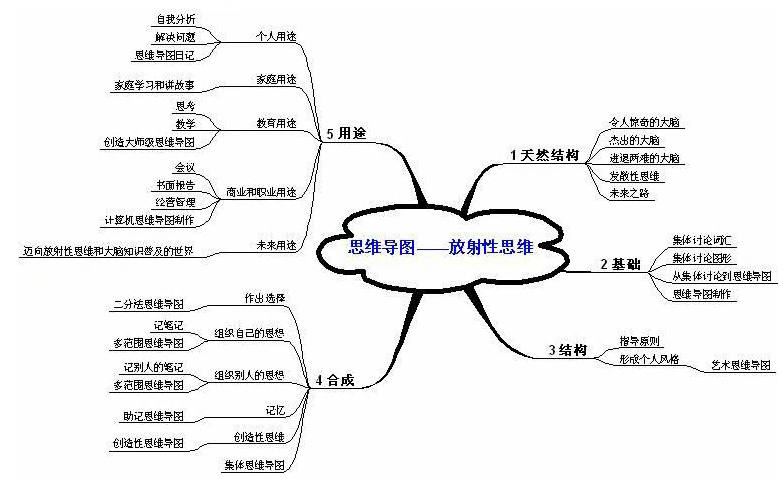

# 超级记忆的原理

我们说阅读是对知识“记”的存储过程，而对知识的再现和运用往往是“忆”的提取体现。记忆的关键不在于储存，而在于提取、检索。我们掌握快速记忆法的关键就是人们当需要知识的时候，能有效地把记下的内容，大量地、准确地“忆”出来。这就要求我们不仅能把记的内容牢固地记（储存）在脑海里，而且能在适当的时候快速地把这些内容忆“提取”出来。其实，这种能力开发的巨大潜力我们每个人都具备，只不过人自身还没有自觉地认识和发现它，去科学的训练和系统地掌握它罢了。

人类的大脑由大脑纵裂分成左、右两个大脑半球，两半球经胼胝体，即连接两半球的横向神经纤维相连。大脑的奇妙之处在于两半球分工不同。美国斯佩里教授通过割裂脑实验，证实了大脑不对称性的“左右脑分工理论”，并因此荣获1981年度的诺贝尔医学生理学奖。

按照这一理论，人的左脑支配右半身的神经和器官，是理解语言的中枢，主要完成语言、分析、逻辑、代数的思考、认识和行为。也就是说，左脑进行的是有条不素的条理化思维，即逻辑思维。与此不同，右脑支配左半身的神经和器官，是一个没有语言中枢的哑脑。但右脑具有接受音乐的中框，负责可视的、综合的、几何的、绘画的思考行为。观赏绘画、欣赏音乐、凭直觉观察事物、纵览全局这都是右脑的功能。

研究还发现，人脑所储存的信息绝大部分在右脑中，并在右脑中正确的加以记忆。右脑如同一个书架，架上分类摆放不同的书籍，每本书有自己的书名，书中再分章划节层层记述，右脑信息储存量是左脑的一百万倍。思考的过程是左脑一边观察提取右脑所描绘的图象，一边将其符号化、语言化。换言之，右脑储存的形象的信息经左脑进行逻辑处理，变成语言的、数字的信息。

爱因斯坦曾这样描述他的思考问题时的情景：“我思考问题时，不是用语言进行思考，而是用活动的跳跃的形象进行思考，当这种思考完成以后，我要花很大力气把它们转化成语言。”显然，正是左右脑协同工作，使人类具有感知力、创造力。

特别值得提出的是人对自身右脑潜力的开发与运用尚处于低级阶段。科学家们已经证明：右脑具备的图形、空间、绘画、形象的认识能力，即形象思维的能力，使它处于大脑感知世界的前沿。创造性思维中的“知觉”和“一闪念”是极其重要的，这一个“火花”往往孕育一个新理论、新学说，有的甚至催毁了原有的思想体系。此时，右脑具有的直观的、综合的、形象的思维机能发挥巨大的作用。一句话，创新必须充分调动右脑。

我们强调开发右脑的重要性，并不是要用右脑思维取代左脑思维，事实上右脑思维也不可能取代左脑思维。右脑储存的大量信息、它的知觉都必须经左脑语言的描述和逻辑的加工才具有最终的价值。然而右脑毕竟是我们使用的“弱项”，注重开发右脑潜能，也许更能“少投入、多产出”。正确使用右脑，人生才能更加充实美好。尽管人人都得使用左脑，因为左脑掌管语言功能。但以左脑为中心的生活方式却是单色调的，因为左脑是以利害得失计算和愉悦感情统治的世界，用非常狭溢的视野观察人生和社会，人们难免迷失于纷纷扰扰的现实社会。右脑是基于人类遗传信息考虑问题，因而更豁达，视角更宽广。学会用右脑思考，您会发现，原来生活可以更美好，学习可以更轻松，您的潜在能力更巨大。

在美国，荣获1981年度医学、生物学奖的斯佩里博士做过一个有名的实验。斯佩里博士切断患者的位于左右脑连接部的脑梁，然后挡住其左视野，在其右视野放上画或图形给患者看，患者可以使用语言说明图形或画上的东西是什么。可是，如果在左视野显示数字、文字、实物，哪怕是读法很简单，他也不能用语言说出它们的名称。

通过实验，人的两脑分工情景越来越清楚了。如前所述，左脑有理解语言的语言中枢，而右脑有与之对应的接受音乐的音乐中枢。这一点，从左、右脑的外形差别便一目了然。其次，语言中枢的左脑与人的意识相连。如果打击左脑，人的意识会立即变得模糊。

右脑支配左手、左脚、左耳等人体的左半身神经和感觉，而左脑支配右半身的神经和感觉，右视野同左脑，左视野同右脑相连。因为语言中枢在左脑，所以左脑主要完成语言的、逻辑的、分析的、代数的思考认识和行为。而右脑则主要负责直观的、综合的、几何的、绘图的思考认识和行为。

中央电视台曾播放过一次现场表演：一位青年书画家，他用左手作画，右手写书法，龙飞凤舞、左右开弓。画图是非线性的直观行为，所以是右脑发挥作用，指挥左手完成；而右手写书法（诗词），需要完成记忆性的语言和思维，所以是左脑指挥右手完成。这个例子生动地说明了左、右脑的分工情况。所以日本著名右脑专家春山茂雄形象科学地把左脑称为包含感情的“自身脑”，把右脑称为继承祖先遗传因子的“祖先脑”。

超级速读记忆训练系统在训练学员的快速阅读能力基础上，融入了快速记忆的训练，速读训练本身就可以提高注意力、理解力和记忆力，再经过记忆训练系统的理论和实践训练，您的记忆能力将会有显著提高。快速阅读和快速记忆的实质是在开发您的学习潜能，使您的左脑和右脑协调使用，抽象思维和形象思维结合使用，当您养成这样的用脑习惯并坚持学以致用后，您会发现自己拥有卓越的记忆能力，而且不仅是记忆能力在不断增强，您的想像力、创造力、注意力等将变得越来越好，思维敏捷，头脑清醒，越来越自信！

## 思维导图的由来

科学研究已经充分证明：人类的思维特征是呈放射性的，进入大脑的每一条信息、每一种感觉、记忆或思想（包括每一个词汇、数字、代码、食物、香味、线条、色彩、图像、节拍、音符和纹路），都可作为一个思维分支表现出来，它呈现出来的就是放射性立体结构。

英国教育学家托尼·巴赞（Tony Buzan）在大学时代，在遇到信息吸收、整理及记忆等困难，前往图书馆寻求协助，却惊讶地发现没有教导如何正确有效使用大脑的相关书籍资料，于是开始思索和寻找新的思想或方法来解决。

托尼·巴赞开始研究心理学、神经生理学等科学，渐渐地发现人类头脑的每一个脑细胞及大脑的各种技巧如果能被和谐而巧妙地运用，将比彼此分开工作产生更大的效率。以放射性思考（Radiant Thinking）为基础的收放自如方式，比如：鱼网、河流、树、树叶、人和动物的神经系统、管理的组织结构等，逐渐地，整个架构慢慢形成，Tony Buzan也开始训练一群被称为“学习障碍者”、“阅读能力丧失”的族群，这些被称为失败者或曾被放弃的学生，很快的变成好学生，其中更有一部份成为同年纪中的佼佼者。

1971年托尼·巴赞开始将他的研究成果集结成书，慢慢形成了发射性思考（Radiant Thinking）和思维导图法（Mind Mapping）的概念。

思维导图是大脑放射性思维的外部表现。依据大脑思维放射性特点，后来成为英国大脑基金会主席、著名教育家的托尼·巴赞（Tony Buzan）在思维研究领域取得了令世人瞩目的成就。思维导图利用色彩、图画、代码和多维度等图文并茂的形式来增强记忆效果，使人们关注的焦点清晰地集中在中央图形上。思维导图允许学习者产生无限制的联想，这使思维过程更具创造性。

托尼·巴赞1942年出生于英国伦敦，毕业于英属哥伦比亚大学，先后获得心理学、英语语言学、数学和普通科学等多种学位。他所撰写的二十多种大脑方面的图书已被翻译成几十种语言，在全球五十多个国家出版，并成为世界顶级公司进行高级人员培训的必选教材。另外，他还出任一些政府部门、大学和研究院以及大跨国集团公司的咨询专家，包括国际商用机器公司（IBM）、惠普公司、巴克莱国际公司、数字设备公司等。他主持的大脑知识讲座已成为西方家喻户晓的节目，在广播、电视及录像节目中大受欢迎。业内人士称他为“大脑先生”。

## 思维导图概要

思维导图是表达放射性思维的有效的图形思维工具。思维导图运用图文并重的技巧，把各级主题的关系用相互隶属与相关的层级图表现出来，把主题关键词与图像、颜色等建立记忆链接，思维导图充分运用左右脑的机能，利用记忆、阅读、思维的规律，协助人们在科学与艺术、逻辑与想象之间平衡发展，从而开启人类大脑的无限潜能。因此，利用思维导图可以协助并强化思维活动。

思维导图是一种将放射性思考具体化的方法。我们知道放射性思考是人类大脑的自然思考方式，每一种进入大脑的资料，不论是感觉、记忆或是想法—包括文字、数字、符码、食物、香气、线条、颜色、意象、节奏、音符等，都可以成为一个思考中心，并由此中心向外发散出成千上万的关节点，每一个关节点代表与中心主题的一个连结，而每一个连结又可以成为另一个中心主题，再向外发散出成千上万的关节点，而这些关节的连结可以视为您的记忆，也就是您的个人数据库。人类从一出生即开始累积这些庞大且复杂的数据库，大脑惊人的储存能力使我们累积了大量的资料，经由思维导图的放射性思考方法，除了加速资料的累积量外，更多的是将数据依据彼此间的关联性分层分类管理，使资料的储存、管理及应用因更有系统化而增加大脑运作的效率。同时，思维导图是最能善用左右脑的功能，藉由颜色、图像、符码的使用，不但可以协助我们记忆、增进我们的创造力，也让思维导更轻松有趣，且具有个人特色及多面性。

思维导图以放射性思考模式为基础的收放自如方式，除了提供一个正确而快速的学习方法与工具外，运用在创意的联想与收敛、项目企划、问题解决与分析、会议管理等方面，往往产生令人惊喜的效果。它是一种展现个人智力潜能极至的方法，将可提升思考技巧，大幅增进记忆力、组织力与创造力。它与传统笔记法和学习法有量子跳跃式的差异，主要是因为它源自脑神经生理的学习互动模式，并且开展人人生而具有的放射性思考能力和多感官学习特性。

思维导图为人类提供一个有效思维图形工具，运用图文并重的技巧，开启人类大脑的无限潜能。心智图充分运用左右脑的机能，协助人们在科学与艺术、逻辑与想象之间平衡发展。近年来思维导图完整的逻辑架构及全脑思考的方法更被广泛应用在学习及工作方面，大量降低所需耗费的时间以及物质资源，对于每个人或公司绩效的大幅提升，必然产生令人无法忽视的巨大功效。

思维导图的创始人托尼·巴赞，他也因此以大脑先生闻名国际，成为了英国头脑基金会的总裁，身兼国际奥运教练与运动员的顾问、也担任英国奥运划船队及西洋棋队的顾问；又被遴选为国际心理学家委员会的会员，是“心智文化概念”的创作人，也是“世界记忆冠军协会”的创办人，发起心智奥运组织，致力于帮助有学习障碍者，同时也拥有全世界最高创造力IQ的头衔。截至1993年，托尼·巴赞已经出版了二十本书，包括十九本关于头脑、创意和学习的专书，以及一本诗集。

## 思维导图对速读的巨大作用

自我们接受学校的教育以来，在阅读或学习过程中，为记住学习内容，养成了按顺序做常规笔记的习惯。然而我们很少意识到：此种传统的笔记方法存在着非常致命的弱点！托尼·巴赞在经过长期的研究和实践后，明确而深刻地对传统笔记的弊端作出了简明而精辟的阐述：

1. 埋没了关键词：重要的内容要由关键词来表达，然而常规标准笔记中，这些关键词却埋没在一大堆相对不重要的词汇之中，阻碍了大脑对各关键概念之间作出合适的联想。
2. 不易记忆：单调的笔记看起来很枯燥，要点也很相似，会使大脑处于一种催眠状态，让大脑拒绝和抵触吸收信息。
3. 浪费时间：要求记些不必要的内容；读些不需要的材料；复习不需要的材料；再次寻找关键词。
4. 不能有效刺激大脑：标准笔记的线性表达阻碍大脑作出联想，因此对创造性和记忆造成消解效果，抑制思维过程。

与传统笔记相比，思维导图对我们的记忆和学习可产生巨大的作用：

1. 只记忆相关的词可以节省时间：50％到95％；
2. 只读相关的词可节省时间：90％多；
3. 复习思维导图笔记可节省时间：90％多；
4. 不必在不需要的词汇中寻找关键词可省时间：90％；
5. 集中精力于真正的问题；
6. 重要的关键词更为显眼；
7. 关键词并列在时空之中，可灵活组合，改善创造力和记忆力；
8. 易于在关键词之间产生清晰合适的联想；
9. 做思维导图的时候，人会处在不断有新发现和新关系的边缘，鼓励思想不间断和无穷尽地流动；
10. 大脑不断地利用其皮层技巧，越来越清醒，越来越愿意接受新事物。

作为助记术的思维导图为您提供了一个“十拿九稳”的记忆方法，使您的记忆能力成倍增长；同样创造性思维导图也把您简单的创造性思维模式向四周无限地发散！书山有路勤奋是路，学海无涯方法是舟，思维导图将是您一生受益的优秀学习方法！

## 思维导图的优势与作用

### 一、思维导图的优势

您是否经常遇到过这样的情况：

1、您买了很多书，可惜很多都没有读？就是有幸读过也掌握不了多少？ 
2、走进书店发现新书、想买的书层出不穷，可是总担心买回去也没有时间消化？ 
3、如果在图书馆的书海中遨游，您是不是望书兴叹，游不了多久就没有时间了？ 
4、作为学生您是不是感觉学习教材都比较吃力，只有刻苦才能通过考试？ 
5、已经工作的您是不是感觉学习能力不如学生时代，在激烈的竞争面前感觉知识更新缓慢？ 
6、当您面对的无限丰富的知识、智慧和技能您是不是感到力不从心？

是我们的能力不够吗？是我们的大脑不好使？NO！！！

您的大脑是一个沉睡的巨人，心理学家告诉我们普通人终其一生才用了4—6％的大脑潜能。我们大脑的潜能绝大部分还在沉睡！我们的一生可能花费90％以上的学习时间学习各种各样的业务知识，也许只花了10％不到的时间学习训练学习的方法。

现在有一种方法可以全面解决这些问题，这就是思维导图！有没有听说过？我们都有体会，形象的、具体的、直观的事物要比抽象的语言容易记得多。美国图论学者哈里有一句名言：“千言万语不及一张图。”说的就是这种道理。俗话说：“百闻不如一见。”也是这个意思。

思维导图和传统的学习记忆方法相比有较大的优势。

1、使用思维导图进行学习，可以成倍提高学习效率，增进了理解和记忆能力。如通过使用关键字强迫我们在做笔记的时候就要思考句子的要点到底是什么，这使我们可以积极地倾听讲课者。而且思维导图还激发我们的右脑，因为我们在创作导图的时候还使用颜色、形状和想象力。根据科学研究发现人的大脑是由两部分组成的。左大脑负责逻辑、词汇、数字，而右大脑负责抽象思维、直觉、创造力和想象力。巴赞说：“传统的记笔记方法是使用了大脑的一小部分，因为它主要使用的是逻辑和直线型的模式。”所以，图像的使用加深了我们的记忆，因为使用者可以把关键字和颜色、图案联系起来，这样就使用了我们的视觉感官。

2、把学习者的主要精力集中在关键的知识点上。您不需要浪费时间在那些无关紧要的内容上。节省了宝贵的学习时间。 
通过使用关键字强迫我们在开展业务或做笔记的时候就要思考句子的要点到底是什么，这使我们可以积极地倾听讲课者。关键知识点之间的连接线会引导您进行积极主动思考。快速系统的整合知识，可以为您的知识融会贯通创造了极其有利的条件。发展创造性思维和创新能力。发散思维是创新思维的核心。画思维导图的方法恰恰是发散思维的具体化、形象化。

3、思维导图具有极大的可伸缩性，它顺应了我们大脑的自然思维模式。从而，可以使我们的主观意图自然地在图上表达出来。它能够将新旧知识结合起来。学习的过程是一个由浅入深的过程，在这个过程中，将新旧知识结合起来是一件很重要的事情，因为人总是在已有知识的基础上学习新的知识，在学习新知识时，要把新知识与原有认知结构相结合，改变原有认知结构，把新知识同化到自己的知识结构中，能否具有建立新旧知识之间的联系是学习的关键。

4、思维导图极大地激发我们的右脑。因为我们在创作导图的时候还使用颜色、形状和想象力。根据科学研究发现人的大脑是由两部分组成的。左大脑负责逻辑、词汇、数字，而右大脑负责抽象思维、直觉、创造力和想象力。巴赞说：“传统的记笔记方法是使用了大脑的一小部分，因为它主要使用的是逻辑和直线型的模式。”所以，图像的使用加深了我们的记忆，因为使用者可以把关键字和颜色、图案联系起来，这样就使用了我们的视觉感官。

### 二、思维导图的作用

随着人们对思维导图的认识和掌握，思维导图可以应用于生活和工作的各个方面，包括学习、写作、沟通、演讲、管理、会议等，运用思维导图带来的学习能力和清晰的思维方式会改善人的诸多行为表现：

（1）成倍提高您的学习速度和效率，更快地学习新知识与复习整合旧知识。 
（2）激发您的联想与创意，将各种零散的智慧、资源等融会贯通成为一个系统。 
（3）让您形成系统的学习和思维的习惯，并使您将能够达到众多您想达到的目标，包括：快速的记笔记，顺利通过考试，轻松的表达沟通、演讲、写作、管理等等！ 
（4）让您具有超人的学习能力，向您喜欢的优秀人物学习，并超越您的偶像和对手。 
（5）让您尽快掌握思维导图这个能打开大脑潜能的强有力的图解工具。它能同时让您运用大脑皮层的所有智能，包括词汇，图象，数字，逻辑，韵律，颜色和空间感知。它可以运用于生活的各个层面，帮助您更有效地学习，更清晰地思维，让您的大脑最佳表现。

### 三、思维导图适合应用的领域

思维导图可以用于工作、学习和生活中的任何一个领域里。

1、作为个人：计划，项目管理，沟通，组织，分析解决问题等；<br.>
2、作为学习者：记忆，笔记，写报告，写论文，做演讲，考试，思考，集中注意力等； 
3、作为职业人士：计划，沟通，项目管理，组织，会议，培训，谈判，面试，评估，掀起头脑风暴等。

所有这些应用可以极大地提高您的效率，增强思考的有效性和准确性以及提升您的注意力和工作乐趣。

### 四、您是否想听听使用过思维导图的是怎么说的？

“使用思维导图是波音公司的质量提高项目的有效组成部分之一。这帮助我们公司节省了一千万美元。”——Mike Stanley，波音公司，美国

美国波音公司在设计波音747飞机的时候就使用了思维导图。据波音公司的人讲，如果使用普通的方法，设计波音747这样一个大型的项目要花费6年的时间。但是，通过使用思维导图，他们的工程师只使用了6个月的时间就完成了波音747的设计！并节省了一千万美元。思维导图的威力惊人吧？！

“我们的课程建立在思维导图的基础上。这帮助我们获得了有史以来最高的毕业分数。思维导图教学必然是未来的教学工具。”一Jean Luc Kastner，高级经理，惠普医疗产品，德国

“Buzan的思维导图在我们办公室内的重要性越来越明显。它在帮助我们打开思路上的作用是惊人的。我们使用思维导图安排会议议程，做头脑风暴，设计组织结构图，记笔记和写总结报告。这是一个通向未来的必备工具。”——Wiliam L. Maxilae，副总裁，Fluor Daniel，美国

“作为一个头脑风暴的工具，思维导图让我们感觉到想象力一下子打开了，新点子层出不穷，真是思如泉涌，这种感觉以前从来没有过，真是太棒了。”一—Sean Adams，总裁， Alpha Learning，荷兰

“大脑的力量是我们未来成功的金钥匙”—Keith Bradley，国际管理教授，英国公开大学商学院

“思维导图可以让复杂的问题变得非常简单，简单到可以在一张纸上画出来，让您一下看到问题的全部。它的另一个巨大优势是随着问题的发展，您可以几乎不费吹灰之力地在原有的基础上对问题加以延伸。”一Dr Tony Turril，管理学作家，英国

## 奇像顺序记忆法原理

远古时代，人们就已发现有关记忆的许多规律了。三千多年前的古埃及文献《阿德·海莱谬》有过记载：“我们每天所见到的琐碎的、司空见惯的小事，一般情况下是记不住的，而听到或见到的那些稀奇的、意外的、惊人的异乎寻常的事情，却能长期记忆。这真是神奇的现象！”

现代心理学、神经学揭示：人的大脑各构成的皮层及左右脑是各有分工的，右脑主管空间的、色彩等形象的思维，当碰到与常规不同的信号刺激，细胞异常兴奋，从而留下深刻的记忆痕迹，因此奇特专张、生动强烈的图像容易
产生强烈的记忆印象；而左脑擅长记忆逻辑性强的顺序关联事物。奇像顺序超级记忆法，正是根据现代科学研究成果，充分发挥和结合左右脑的优势，并经过长期实践证明效果令人惊奇的记忆方法。

奇像顺序记忆法：就是把平凡的、枯燥的事物转化成奇特夸张、生动强烈、顺序关联的图像进行记忆的方法。

核心在于联想出奇特的的画面，尽可能地使之新颖独特、荒诞离奇、鲜明生动、超脱现实、违背逻辑，从而留下深刻的印象。

联想的具体方法如下：

1. 静态的事物动态化

    动态的事物要比静态的事物吸引人。如熊，睡着时的景象不如张牙舞爪向您扑来时的景象深刻。记“葡萄酒、风”，可想象迎面吹来带着葡萄酒香味的风；记“汽车、椅子、花瓣”，可想象汽车撞飞椅子，椅子上酒落片片花瓣。

2. 夸张地联想

    夸张联想即将事物夸大或缩小、增加或减少的联想方法。如记小鸟与大楼，可想象：小鸟撞倒大楼、小鸟托着大楼飞；记“牙签、电筒、闪电”，可想象牙签变成电池那么粗，放到电筒里，一按开头，电简射出闪电。

3. 荒诞离奇

    使奇像违背逻辑，超脱现实，容易形成强烈刺激。如记“汽车、木材”，可想象一根大圆木长着四个汽车轮子在跑，或汽车在巨大的圆木上飞驰；记“面包、太阳帽、扑克”，可想象几个面包正在戴着太阳帽打扑克。 
    记很多词语时，只要把相关场景串联起来，即形成逻辑关系，由第一个词语联想出第二个、第二个联想出第三个......直到最后一个。如记“汽车、木材，面包、太阳帽、扑克”，可联想为大圆木长着汽车轮子在飞驶，上面坐着几个面包，正戴着太阳帽打扑克。

奇像顺序记忆法，可轻易记几十个各不相关的词语。我们在实际应用中，记住了这些词后，再根据文宾浩斯遗忘曲线中的关键时间复习一下，即可形成深刻的长期记忆。

## 让我们共同开发记忆的宝库吧

记忆是大脑系统思维活动的过程，一般可分为识记、保持和重现三个阶段。识记，就是通过感觉器官将外界信息留在脑子里；保持，是将识记下来的信息，短期或长期地留在脑子里，使其暂时不遗忘或者许久不遗忘；重现，包括两种情况，凡是识记过的事物，当其重新出现在自己面前时，有一种似曾相识的熟悉之感，甚至能明确地把它辩认出来，称作再认；凡是识记过的事物不在自己面前，仍能将它表现出来，称作再现。因此，重现就是指在人们需要时，能把已识记过的材料从大脑里重新分辩并提取出来的过程。

从信息论的角度着，识记是大脑皮层内信息的输入与获得；保持是大脑皮层内信息的编码和储存；而重现是信息的提取和运用。记忆的这三个环节是相互联系和相互制约的。

根据记忆的内容，大致可分为下列四种

1、形象记忆，这是以感知过的事物和形象为内容的记忆，如进入商场和参观展览会留下的记忆。 
2、逻辑记忆，这是以概念、公式和规律等的逻辑思维过程为内容的记忆，如学习某种理论以及对定理、公式的记忆。 
3、情绪记忆，这是以体验过的某种情绪或情感为内容的记忆，如对第一天进入大学校园和第一次领取工资的愉快心情的记忆。 
4、运动记忆，这是以做过的运动或动作为内容的记忆，如学习游泳和初学骑自行车时，对一个接一个动作的记忆。在日常生活中，上述四种记忆是相互联系，交叉进行的。

根据记忆的时间长短不同，一般分为短时记忆和长时记忆。短时记忆如我们从电话薄上查到一个号码，拨打过后，随即忘了。听课时边听边做笔记，也是依靠短时记忆。长时记忆指经过很长时间仍能记住，或能保持终生不忘。人的长时记忆大多要经过对短时记忆的不断加工，心理学家对长时记忆的编码、储存和提取进行了不懈的探索。这里列举的种种提高记忆的方法，都是针对于此的。

恩格斯曾说：“我们的意识和思维不论它看起来是多么超感觉的，总是物质的、肉体的器官即人脑的产物。”心理现象是神经系统的属性，大脑是“灵魂和意识的所在地”，各国科学家研究记忆的生理和生化方面，认知心理学家对记忆进行了大量研究，实际上这是对大脑奥秘的挖掘。在某些方面他们达到了共识，如认为记忆存在于覆盖在人脑表面的大脑皮质之中，记忆的获得与整个大脑的突触的抑制和促进有关。他们认为大脑一旦受到刺激，则在每一神经细胞（神经元）上生长出更多的突起，这些突起将使人脑内部的突触连接。神经联系的总量增加，形成记忆。不断的刺激，细胞间联络密切，枝叉型的突触不断增多，信息才易通过。经多次反复，促进突触愈加发达。反之，如形成的突触长期不用，会变弱、缩小，突触数也减少，使信息不能顺利通过。所以为了增强记忆，就要经常用脑，就像经常要进行体育锻炼一样，进行头脑锻炼。

我们知道人的大脑结构功能单元就是神经细胞，每个神经细胞相当于一个记忆元件，它有兴奋和抑制两种状态，就像一个双稳态继电器。神经细胞记忆的信息用二进制数的单位“比特”来计量，它的总数为1×10^10 — 1.4×10^10个，就是100亿到140亿个之间。如果人的一生用60年计算，神经细胞每秒钟接受的信息量是14比特（最高可达25比特），那么一个人毕生的总记忆储量大约是2.8×10^10比特。这种储量究竟有多大？打个比方来说，美国国会图书馆是世界上最大的图书馆之一，藏书近2000万册，我们大脑的信息储量可以容下三四个美国国会图书馆。看来一个人活到老、学到老，也只占用了自己大脑记忆储量的一丁点儿，事实上当今社会的每一个人的大脑都具有巨大的潜力尚待进一步开发，而少数已经完成开发的大脑超前者有着令世人惊叹称羡的记忆力。

历史上不少经过认真地看、听、默诵、观察以及种种刻苦的磨炼，造就了非凡的记忆力。据传我国东汉时，有一位名叫贾逵的人，他五岁时还不会开口说话，他的姐姐听到隔壁私塾里传来琅琅读书声，常抱着他到篱笆旁倾听。到了贾逵10岁时，他姐姐发现他在暗诵五经的内容，感到十分吃惊，原来私塾里学生反反复复地念书，使贾逵耳熟能详。姐姐帮助他将庭院里桑树皮剥下来，裁成薄片，使他能边诵边写，经过几年的努力，贾逵已能够通晓五经和其他史书了。

报载美国纽约一所中学的生物教师霍华德·贝格在1990年以一分钟阅读并理解25000字的速度，被载入《吉尼斯世界纪录大全》。他接受了一家杂志的采访和测试，采访者给了他一本刚刚印刷完毕的《戴安娜传》，这是本厚达320页的书，仅仅花了五分钟便读完了这本书。然后他接受提问，结果令人昨舌：10个问题中他竞准确无误地答对9题，而唯一没有回答出的是一个次要的问题一戴安娜就读过的一所中学的校名，采访者又拿出另一本近500页的新小说《卧房》，他用12分钟读完并答对了10个问题。据《体育生活》报道，俄罗斯棋手卡斯帕格夫具有超群的记忆力，他记下了1800多人的通信地址和450多人的电话号码，熟记了12000个棋谱。《太原日报》载文说英国伦敦举行了第四届世界记忆力大赛，经过一番角逐，决出最好的选手汉克和奥彬，在最关键的一项比赛（一小时必须记住2000位的数字，再用45分钟写下来），奥彬战胜了汉克，他记住了1140位数字，然后用45分钟写了出来。陕西省吱山县有一个过目不忘的人，名叫张宏斌，是个医生。他陆续看过11遍《红楼梦》，能把443个主要人物的来龙去脉、相互关系，道个清清楚楚。《红楼梦》中225首诗词皆烂熟于心。1995年5月张给县中学高三学生讲授唐诗宋词，所有的诗词全是背出来的，讲稿上没有。全国各地名胜镌刻的楹联，他可背出4000多幅。金元时代的《药性歌赋》，记载着几百种药性，他在一个星期内就全部背了下来。当人们询问他有什么记忆决窍时，他说：一是头脑高度集中，二是博学，博学引起联想，找出内部规律，三是讲究科学性。

不过面对这些记忆大师，我们不能“望洋兴叹”“妄自菲薄”，树立信心更要急起直追，努力实践，开发自己尚在沉睡的大脑。爱因斯坦把正确的方法纳入成功的要素之中。

即：成功 = 艰苦劳动 + 正确方法 + 少说空话

我们要刻苦地学习记忆的知识并研究它的规律，找到科学的记忆方法，进一步把大脑的潜能发挥出来，这叫“梅以寒而茂，荷以暑而清”，艰辛而精心地培植，一定能结出美丽的记忆之花。

## 什么是人的记忆

《辞海》中“记忆”的定义是；“人脑对经历过的事物的识记、保持、再现或再认。识记即识别和记住事物特点及联系，它的生理基础为大脑皮层形成了相应的暂时神经联系；保持即暂时联系以痕迹的形式留存于脑中；再现或再认则为暂时联系的再活跃。通过识记和保持可积累知识经验。通过再现或再认可恢复过去的知识经验。从现代的信息论和控制论的观点来看，记忆就是人们把在生活和学习中获得的大量信息进行编码加工，输入并储存于大脑里面，在必要的时候再把有关的储存信息提取出来，应用于实践活动的过程。把两者结合起来，可以将记忆的含义表述得更确切一些。所谓记忆，就是人们对经验的识记、保持和应用过程，是对信息的选择、编码、储存和提取过程。

李白的《静夜思》：“床前明月光，疑是地上霜。举头望明月，低头思故乡。”虽然历经数十年，仍有人能背诵不忘。再如：您相遇几十年前儿时的朋友，却立刻能认出他并叫出他的姓名，尽管您好像早已把他忘得无影无踪了。还有，您过去学过的成语、外语单词、看过的电视、听过的歌曲，一旦在一定场所，你就会很快地在脑海中重现出来......。这些都是记忆的具体体现。

人的记忆能力，实质上就是向大脑储存信息，以及进行反馈的能力。人的大脑主要有神经细胞构成，每个神经细胞的边缘又都有若干向外突出的部分，被称作树突和轴突。在轴突的末端有个膨大的突起，叫做突触小体。每个神经元的突触小体跟另一个神经元的树突或轴突接触。这种结构叫做“突触”。神经元通过“突触”跟其他神经元发生联系，并且接受许许多多其它的神经元的信息。神经元传递和接受信息的功能，正是大脑具有记忆的生理基础。每个神经元上有多少个突触呢？有人估计，在人们大脑皮层每个神经元上平均有三万个突触。那么，人脑有多少神经元呢？大约有140亿个。这140亿个神经细胞之间突触联系的数量，用天文数字也难以表达。这样的结构特点，就使大脑成为一个庞大的信息储存库。一个人脑的网络系统远比当今英特网还复杂。科学家认为，一个人大脑储存信息的容量，相当于十亿册书的内容，一个人的大脑即使每一秒钟输入十个信息，这样持续一辈子，也还有余地容纳别的信息。这说明：我们大脑的记忆容量是无限的，有很大的记忆能力。

如前所说，记忆在人们的生活实践中无时不有，无处不在。它是人的生理、心理活动的一种本质特性。人生是充满活力创造力的，而一切活力与创造力都离不开记忆这个源泉。失去了记忆人的行为就必然失去活力和创造力，甚至会失去许多属于“本能”的本领，人就很难生活下去。

人类之所以能够认识世界、改造世界而成为“万物之灵”，关键就在于人类具有卓越的思维能力、记忆能力。正是依靠这些思维、记忆能力，人类才得以学习、积累和应用各种知识、经验，才能不断地推动历史的发展和社会的进步。

## 记忆的起源、研究及发展

自从有了人类之后，记忆便跟随并服务于人们的生活中。远古时代，人们为了生存就要记住周围的环境，要分辨出哪些动物、植物对人们有害，哪些有益，如何寻找食物，如何应付各种自然灾害。把这些经验一代一代地传递下去，就需要保存住记忆。同时，增强记忆力，也成了十分重要的学问，倘若发生什么大灾害，人类自身及所有知识记录惨遭毁灭性打击的时候，如果民族首领侥幸存活的话，他们就需要尽一切努力去恢复一切已经失去的知识，所以他们平时要训练增强记忆的能力，把一切圣典记在自己的大脑中。据记载，新西兰毛利族的首领卡马塔那能背诵全族长达1000年的，包括45代人的历史，这些内容足足够他背上3天3夜，而他却从不看笔记之类的东西。

为了解决记忆问题，古人还用结绳记事的方法，据说印加人能够用结绳记下十分复杂的长篇史诗。

但是人类究竟从什么时候开始研究记忆力的，现在人们已很难说清楚了。不过关于记忆力的第一批概念的形成却应该归功于古希腊人。尽管有些理论在现代人看来显得很幼稚，但他们的确是第一批提出记忆力的学术概念的人。

公元前6世纪，古希腊人帕蒙尼德认为，人的记忆是由明暗（或冷热）两种物质构成的混合体，只要混合体没有受到干扰，记忆就是完整的，一旦混合体发生变化就会出现遗忘现象。

公元前5世纪，古希腊人迪奥泽尼提出了另一种看法。他认为记忆是由使体内空气保持均匀分布的东西所组成的，与帕蒙尼德一样，他也认为一旦平衡遭到破坏，就会出现遗忘现象。

在记忆问题上提出重要概念的第一人是公元前4世纪的思想家柏拉图。他的理论被称为“蜡板假说”。他认为，人对事物获得印象，就象有楼角的硬物放在蜡版上所留下的印记一样。人对事物获得了印象之后，随着时间的推移该印
象将缓慢的淡薄下去乃至完全消失。这就象蜡版表面逐渐恢复了光滑一样。所谓“光滑的蜡版”相当于完全遗忘。这种学说虽然也不完善准确，但还是影响了许多人。

亚里士多德在公元前4世纪末，提出了一个较为科学的概念。今天我们所认为的一些大脑功能，在他那时主要被当作了心脏的功能。他认识到了心脏的部分功能与血液有关，而记忆则是以血液流动为基础的。遗忘的发生主要是血液流动减缓所致。亚里士多德还提出了联想法则，这是他在记忆研究领域所做出的另一个重大贡献。直到现在，有些联想法则还在影响着我们。

古罗马人在记忆理论上的研究很少，不过他们使用的“罗马家居法”和“直接联想法”一直传到了今天。这几种方法很实用，现在许多书上讲的快速记忆方法都有这两种方法的影子，有的只是变通了叫法或则略加了改进，但实质内容是一样的。

一直到公元17世纪，记忆研究几乎没有什么大的进展。

17世纪中叶，英国出现了以霍布斯、洛克为代表的“联想主义”心理学派。霍布斯对记忆现象做了唯物主义的分析：洛克则在欧洲心理学史上第一次提出了重要的记忆现象--“联想”一词，此后“联想”便成了专门的术语了。

第一个在心理学史上对记忆进行系统实验的是德国著名心理学家艾宾浩斯。他对记忆研究的主要贡献一是对记忆进行严格数量化的测定，二是对记忆的保持规律作了重要研究并绘制出了著名的“艾宾浩斯遗忘曲线”1885年他出版了《论记忆》一书。从此，记忆成了心理学研究的重要领域。

第二次世界大战后，特别是60年代以来，记忆研究越来越得到人们的重视。美、英、日、苏等国家或设立记忆法专科学校，或开办函授教学，开始对人们进行增进记忆的普及教育。

我国从1980年左右开始，有关记忆研究的专著、译著相继出版问世，1984年我国第一家记忆研究会-锦州市记忆研究会在辽宁省锦州市成立。1984年末辽宁社会科学院文学研究所举办了最早的快速记忆函授。梦真、王维、曾宪礼、王进收等第一批有影响力的记忆专家们对于中国快速记忆方法的普及推广做出了巨大贡献，其后的倪新威至今在中国快速记忆领域也仍旧很有影响力。近几年，快速记忆培训班在各地如雨后春笋般遍地开花，有越来越多人加入到传播快速记忆方法的阵营中，也使得更多的人从中受益！

现代人类对记忆的研究仍在继续，尽管当今的科学技术已经有了长足的发展，但到揭开记忆之谜还相距甚远，在探索记忆内在机理的同时，我们现在谈的快速记忆多是指运用那些经过实践后能有效提高记忆力的方法、技巧，使之更好地服务于我们的工作、生活、学习中。我们普通人能熟练应用这些技巧和方法就可以了，至于大脑是如何记忆的等内在机理就留给科学家们去研究吧。

记忆研究在当代的发展，很大程度上得益于科学技术和方法的进步。从50年代开始研究记忆现象的生物学基础理论认为，在记忆过程中有一种复杂的分子-一核糖核酸，由它来充当化学介质。核糖核酸产生于一种决定着遗传物质的脱氧核糖核酸中。人的眼睛的颜色就是由脱氧核糖核酸决定的。人们已经对核糖核酸做了一些实验来支持核糖核酸与记忆很有关系的观点。例如人们发现，对动物进行一定的训练，其某些细胞中的核糖核酸就会发生变化。此外，如果动物体内的核糖核酸的产生被停止下来，它就会失去学习和记忆的能力。还有一个令人感兴趣的实验：当把一只老鼠的核糖核酸取出来移植给另一只老鼠时，第二只老鼠就能“想起”第一只老鼠学过的而它本身从未学过的东西。

直接刺激脑细胞的研究工作是由加拿大的潘费尔博士开始的。他在为癫痫病患者实施开颅手术时（需切除一小部分脑子），第一次取下了部分脑壳骨。手术之前，潘费尔对打开的脑子进行了全面的电刺激，意识清醒的病人则回答每次刺激后的感觉。在早期的一次案例中，当潘费尔刺激患者脑子的颞叶部分时，病人说自己想起了童年的经历。潘费尔发现，刺激大脑皮层的不同区域所得到的反应都很多，但只有刺激颞叶部分才能产生清晰而集中的记忆感觉。这些感觉常常是很全面的，包括了以往体验过的那些色彩、声音、动作和情感等等。

这些研究中有一个特别值得一提的事实是：潘费尔教授通过电刺激所引发出来的记忆，在正常回想条件下却想不起来。此外，刺激出来的回忆体验要比正常的回想准确、清晰、全面得多。这使得我们相信，一个人在下意识中注意的任何事物都会记录在脑子里，而且这种记录基本是永久性的，尽管它们在日常生活中可能被“遗忘”了。

## 人的记忆的分类

人们在漫长的社会生活与学习中需要记忆来学习和工作，但人的记忆却因人的个体差异不同其记忆的好坏也不同。根据学术界上对记忆的一般性结论，人的记忆力的好坏有很大差距，这种差距通过分类更容易看清。

1．记忆内容的分类：

根据记忆内容的变化，记忆的类型有：形象记忆型、抽象记忆型、情绪记忆型和动作记忆型。

①形象记忆型是以事物的具体形象为主要的记忆类型。 
②抽象记忆型也称词语逻辑记忆型。它是以文字、概念、逻辑关系为主要对象的抽象化的记忆类型，如，“哲学”、“市场经济”、“自由主义”等词语文字，整段整篇的理论性文章，一些学科的定义、公式等。 
③情绪记忆型，情绪、情感是指客观事物是否符合人的需要而产生的态度体验。这种体验是深刻的、自发的、情不自禁的。所以记忆的内容可以深刻的牢固的保持在大脑中。 
④动作记忆型，动作记忆是以各种动作、姿势、习惯和技能为主的记忆。动作记忆是培养各种技能的基础。

2．感知器官的分类：

视觉记忆型是指视觉在记忆过程中起主导作用的记忆类型。视觉记忆中，主要是根据形状印象和颜色印象记忆的。

①听觉记忆型是指听觉感知在记忆过程中起主导地位的记忆类型。 
②嗅觉记忆型是指嗅觉感知在记忆过程中起主导地位的记忆类型。嗅觉记忆是常人都具备的一种记忆。 
③味觉记忆型是指味觉感知在记忆过程中起主导地位的记忆类型。味记忆也是常人都具备的一种记忆。 
④肤觉记忆型是指肤觉感知在记忆过程中起主导地位的记忆类型。 
⑤混合记忆型是指两种以上（包括两种）感知器官在记忆过程中同时起主导作用的记忆类型。

3．保持时间的分类

科学家们根据信息论的观点，根据记忆过程中信息保持的时间长短不同，将记忆分为短期记忆和长期记忆两个保持阶段。并通过一系列实验，进一步将这两个阶段分为：瞬时记忆、短时记忆、长时记忆和永久记忆四种。

4．意识类型的分类

按心理活动是否带有意志性和目的性分类，可以将记忆分为无意记忆和有意记忆。（其中的“意”，心理学上的解释是指“意识”，意识问题很复杂，我们在这里将他解释为“意志性”和“目的性”，仅为了掌握。）结合记忆过程，还可以进一步分为：无意识记、无意回忆、有意识记和有意回忆四种。

①无意记忆的四个特征：

一是没有任何记忆的目的、要求； 
二是没有做出任何记忆的意志努力； 
三是没有采取任何的记忆方法； 
四是记忆的自发性，并带有片面性。

②有意记忆相对于无意记忆，也具有四个特征：

一是有预定的记忆目的和要求； 
二是需要作出记忆的意志努力 
三是需要运用一定的记忆方法 
四是具有自控性和创造性。

无意记忆和有意记忆是相辅相成的，并在一定的条件下可以相互转化。也就是说，无意记忆可以向有意记忆转化，有意记忆也可以向无意记忆转化。这些条件包括：

第一，实践或认识任务的需要是两者相互转化的根本条件。 
第二，信息强度的变化是转化的重要条件。 
第三，人的主观处于何种状态是转化的重要条件。 
第四，所掌握的记忆技能的熟练程度是转化的必要条件。 
第五，精神高度集中，然后思想放松，常常是有意记忆向无意记忆转化的有利时机。

## 什么是人的记忆品质

有的人记得快，但忘得也快；有的人记得多，但用时想不起来。这种“快”和“多”是没有什么用的。这样的记忆就不能算好的。还有的人，虽然记得慢，但却记得牢；也有的人虽说记得少，但能灵活运用。这样的记忆就比较好，完全用不着因为记得慢一点，少一点而沮丧。

那么判断记忆优劣的标准是什么呢？综合起来看，一个人的记忆力水平，可以从记忆品质的敏捷性、持久性、正确性和备用性等四个方面来衡量和评价。

**敏捷性**。记忆的敏捷性体现记忆速度的快慢，指个人在一定时间内能够记住的事物的数量。

人们记忆的速度有相当大的差异。有人做过这方面的实验：让受试者背诵一首唐诗，有的人重复5次就记住了，而有的却需要重复26次才能记住。有的学者让受试者识记一系列图形，有的人只需看33次就能记住，有的却需要看75次才能记住。这就说明了人的记忆在速度方面即敏捷性方面存在着明显的差别。

记忆是否敏捷取决于大脑皮层中条件反射形成的速度。条件反射形成得快，记忆就敏捷；条件反射形成得慢，记忆就迟钝。每个人都希望自己的记忆具有敏捷性，因为这样就可以在单位时间里获得更多的知识。要增强记忆力首先就是记忆的敏捷性。要想达到这个目的，一是平时要加强锻炼，通过锻炼使自己的记忆敏捷起来；二是在记忆时要集中注意力；三是要充分利用原有的知识，以此来获得新的知识。也就是在旧有的条件反射基础上去建立新的条件反射，这样记忆就会逐渐敏捷起来。

**持久性**。记忆的持久性是指记住的事物所保持的时间的长短。

仅有敏捷性还不能称之为良好的记忆。像前面讲的，记得快也忘得快，那就没有什么实际意义了。所以，良好的记忆必须具备的第二个标准就是持久性。

记忆的持久性，顾名思义，就是指记忆的事物能在头脑中保持长久的时间。它是记忆巩固程度的体现。从生理学角度来说，记忆的持久性取决于条件反射的牢固性。条件反射建立得越巩固，记忆就越持久；条件反射建立得越松散，记忆就越短暂。人们的记忆在持久性方面也有很大差别。有的人记忆十分长久，可以维持多年；而有的人却十分健忘，记不了多久就忘掉了。

人们都希望自己的记忆长久，但是仅仅持久仍然是不够的，如果不善于灵活运用也是枉然。既有持久性又有运用的灵活性，才能牢固地掌握所学到的知识。记忆不长久，一般是功夫不深，复习记忆密度不够有关。要经常地并在适当的时机进行复习，使条件反射不断强化而得到巩固，这样就可以使记忆获得持久性。

**正确性**。记忆的正确性是指对原来记忆内容的性质的保持。

一个人的记忆，如果既有敏捷性，又具有持久性，但是不具备正确性，记得又快又牢固，可就是记错了。显然这样的记忆也毫无用处。完全可以说，“正确性”是良好记忆的最重要的特点。如果记忆总是不正确，那它只能对我们的学习知识和积累经验帮倒忙。正像开汽车时弄反了方向，开得越快，距离目的地越远。所以，记忆的正确性是保持人们获得正确知识的重要的心理品质。

我们常常可以看到有的人记忆总是非常正确，回答问题，处理事情总是那么信心十足，准确而全面，从不丢三落四或添枝加叶。而有的人的记忆不是错误百出，就是犹豫不决，拿不定主意，总是“大概”、“或许”、“差不多”等。这说明人们的记忆在正确性方面也是大不相同的。记忆的不正确，不准确与识记以及遗忘的选择性有很大关系。对同一件事情，人们识记的角度和识记后遗忘的角度都不完全相同。例如：几个人都看了某本书，看后即问他们记住了什么内容，他们的回答不可能是一样的。

从生理上说，记忆的正确与否与条件反射有关。如果条件反射形成得准确、牢固，记忆的正确性就好，反之，如果条件反射形成得不正确、不准确、不牢固，记忆的正确性就差。因此，要想使自己的记忆具有最大限度的正确性，就要从条件反射建立的正确性和准确性上去努力。一般来说，人们对某一事物的最初印象往往都是最深刻的。这和在白纸上画画看得最清楚是一个道理。心理学的研究证实，最初印象往往对人的心理活动发生很大影响。要保证记忆的正确性，首先要进行认真、正确的识记。其次，必须勤于自我监督。要养成良好的习惯，随时分清自己记忆中正确记忆和错误记忆、精确记忆和模糊记忆的内容。对于正确和精确记住的事物，要不断通过强化条件反射去巩固它；对错误记忆和模糊记忆的内容，要通过修正条件反射之后再去加强它。这样才能有效地保证记忆的正确性。

**备用性**。记忆的备用性是指能够根据自己的需要，从记忆中迅速而准确地提取所需要的信息。

记忆备用性，指的是能够迅速地从已识记的知识储备中提取当时所需用的信息的性能。记忆的备用性是决定记忆效能的主要因素，是判断记忆品质的最重要的标准。记忆的备用性也是记忆的敏捷性、持久性、正确性、系统性和广阔性的体现。

人们进行活动的目的是为了储备知识，并使之备而有用，备而能用。记忆如果没有备用性，它了就失去了存在的价值。正像一个仓库，尽管里面储满了货物，如果取货非常困难，那就起不到仓库应有的作用。人们的记忆好比是储存知识的“智慧仓库”，如果管理得当，进货、发货就会迅速、顺利。也就是说，当需要使用某种知识时能够很快提取应用，这样都有实际意义。就像学生进考场那样，记忆备用性好的学生，能够迅速、正确地从自己记忆的仓库中提取相应的知识，顺利答完试题。而备用性不好的学生常常会发懵或答非所问，影响考试成绩。

现实中有些人，知道的事情并不少甚至可以称得上“渊博”。可是当需要回忆某些事物时，需要的总是想不起来。这就说明他们的记忆缺乏备用性，而另一些人，掌握的知识尽管少一些，但使用时总是得心应手，并在回忆时随时能够再现需要的东西。这就说明他们的记忆具有较好的备用性。备用性是良好记忆的品质中最重要的一种品质。

记忆的备用性并不是天生就有的，而是后天培养、锻炼的结果。要想使自己的记忆具有良好的备用性，首先要使记忆具有正确性，系统性和持久性；还要通过各种方法培养锻炼自己回忆的技巧，并多运用已经记忆的知识，达到“熟能生巧”的程度，这样记忆也就具有较好的备用性了。特别要强调的是，从识记一开始就不要随随便便、马马虎虎。因为记忆的备用性是在识记的过程中形成的。我们应该有意识地记那些有意义的事物，并在识记当时就立刻建立起识记和同需要使用这些知识场合之间的联系。另外还要强调积累知识的系统性，因为记忆和系统性对形成记忆的备用性也是很重要的。拿破仑曾经说过：“一切事情和知识在我头脑里放得像在橱柜的抽屉里一样，只要我打开某个，就能准确地取出所需要的材料。”苏联军事家苏沃洛夫也曾说过：“记忆是智慧的仓库，但是这个仓库有许多隔断，因而应该尽快地把一切都放得井井有条。”

记忆的四种品质是有机联系，缺一不可的。为了使自己具有良好的记忆能力，就必须建立丰富、系统、精确而牢固的条件反射，具备所有优秀的记忆品质。忽视记忆品质中的任何一个方面都是片面的。所以检验一个人的记忆力的好坏，不能单看某一方面品质，而必须用四个方面的品质去全面的衡量。
