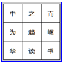
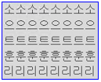

# 速读训练

按以下顺序进行训练效果最佳：消除音读—整体感知—视幅扩展—焦点移动—速读实战—水平测试

以上六个训练可以循环反复进行。其中“消除音读”和“整体感知”是速读记忆的基础辅助训练，不做为级别升降考核依据，若您已经掌握，可跳过该项训练。其余速读训练项目必须完成1次，且至少有5次“速读训练—水平测试”成绩后，可以“上传更新”，以获取下一阶段训练材料并获得相应的训练级别提升！

## 消除音读训练

【训练原理】

当我们最初学习阅读书籍时，老师教给我们的方法是“逐字阅读”，以及用手指“划读”；当我们看到文字时，习惯性地会“读”出看到的每一个字，有些人会动嘴默念，有些人虽然不动嘴，但是会在脑海中“念”出，这就是“音读”现象，也叫“默读”。

逐字阅读并伴随着音读的过程，是我们学习阅读的必经之路，我们称之为“传统阅读”；当我们的阅读量增大，并且阅读时间有限时，传统阅读就明显地制约着我们获取信息的能力了，要提高阅读速度，就必须改变传统阅读方式。要做到“快速阅读”，首先要通过训练做到尽量一眼看更多的文字，更要朝着“消除音读”的目标努力。

人脑研究表明，人的大脑从分工上划分为左脑和右脑。左脑负责逻辑思维活动，右脑负责形象思维活动。消除音读训练，就是通过外部手段，干扰并最终抑制左脑参与“默读”活动，调动右脑的形象思维能力。这一外部手段就是，阅读的同时，一边聆听有节奏的韵律，一边用左右手指配合敲击。当阅读、聆听和敲击同时进行时，左脑的“音读”会得到抑制，久而久之形成下意识后，即可消除音读，并充分调动右脑，为快速阅读打下基础。

消除音读训练中的“聆听节奏”和“手指敲击”将应用到速读训练各个单元中，这一训练虽然枯燥，但却是基础中的基础，请务必熟练掌握，并形成下意识的动作。

### 1.单一节奏训练

【姿势】

身体端坐在椅子上，双眼平视电脑屏幕中央，双腿自然弯曲，双手自然平放在桌面上或大腿上，手指自然弯曲，保持一个较为舒服的姿势；

【方法】

训练时会听到简单而熟悉的拍手节奏音“啪 啪 啪啪啪 啪 啪 啪啪啪”，跟随该节奏，用您习惯的手指轻轻敲击（建议用食指），敲击只是一个动作，不要敲击出声，越轻越好； 
当A闪烁时，左手手指敲击，当B闪烁时，右手手指敲击；敲击后，手指保持状态，不用收回; 
对应节奏，敲击的规律是这样的“左 右 左左左 右 左 右右右”，循环反复，直到熟练。

【目标】

当闭上眼睛，聆听节奏就能熟练准确地敲击时，说明您已经掌握该方法，可以进入下一训练。

【提示】

本训练是速读训练入门的基础练习，未熟练掌握前，切勿进行后续训练；对于熟练者，也可经常进行练习。 
“铃听节奏”和“手指敲击”将应用到速读训练各个单元中，这一训练虽然枯燥，但却是基础中的基础，请务必熟练掌握，并形成下意识的动作。 
每次训练时间为2分钟，左下角有倒计时显示，可以针对弱项进行多次训练。中途退出，系统将不记录训练成绩，请合理安排训练时间。

### 2.位置循环训练

【姿势】

身体端坐在椅子上，双眼平视电脑屏幕中央，双腿自然弯曲，双手自然平放在桌面上或大腿上，手指自然弯曲，保持一个较为舒服的姿势；

【方法】

训练时会听到简单而熟悉的拍手节奏音“啪 啪 啪啪啪 啪 啪 啪啪啪”，跟随该节奏，用您习惯的手指轻轻敲击（建议用食指），敲击只是一个动作，不要敲击出声，越轻越好； 
当A、C闪烁时，左手手指敲击，敲击A时手指微微向前，敲击C时手指微微向后； 
当B、D闪烁时，右手手指敲击；敲击B时手指微微向前，敲击D时手指微微向后； 
敲击后，手指保持状态，不用收回； 
跟随节奏，手指敲击时，不仅要左右交替，而且敲击位置也要变化； 
左右手敲击的规律仍然是“左 右 左左左 右 左 右右右”，敲击位置的规律是“A B CCC D A BBB C D AAA B C DDD”，循环反复，直到熟练。

【目标】

当闭上眼睛，聆听节奏就能熟练准确地敲击时，说明您已经掌握该方法，可以进入下一训练。

【提示】

本训练是速读训练入门的基础练习，未熟练掌握前，切勿进行后续训练；对于熟练者，也可经常进行练习。 
“聆听节奏”和“手指敲击”将应用到速读训练各个单元中，这一训练虽然枯燥，但却是基础中的基础，请务必熟练掌握，并形成下意识的动作。 
每次训练时间为2分钟，左下角有倒计时显示，可以针对弱项进行多次训练。中途退出，系统将不记录训练成绩，请合理安排训练时间。

### 3.变奏位置训练

【姿势】

身体端坐在椅子上，双眼平视电脑屏幕中央，双腿自然弯曲，双手自然平放在桌面上或大腿上，手指自然弯曲，保持一个较为舒服的姿势；

【方法】

训练时会听到简单而熟悉的拍手节奏音“啪 啪 啪啪啪 啪 啪 啪啪啪”，跟随该节奏，用您习惯的手指轻轻敲击（建议用食指），敲击只是一个动作，不要敲击出声，越轻越好； 
当A、C闪烁时，左手手指敲击，敲击A时手指微微向前，敲击C时手指微微向后； 
当B、D闪烁时，右手手指敲击；敲击B时手指微微向前，敲击D时手指微微向后； 
敲击后，手指保持状态，不用收回； 
注意聆听节奏音，节奏不再是单一的，会出现时快时慢的变化，无论节奏如何变化，请跟随节奏进行手指敲击； 
手指敲击时，不仅要左右交替，而且敲击位置也要变化； 
左右手敲击的规律仍然是“左 右 左左左 石 左 右右右”，敲击位置的规律是“A B CCC D A BBB C D AAA B C DDD”，循环反复，直到熟练。

【目标】

当闭上眼睛，聆听节奏就能熟练准确地敲击时，说明您已经掌握该方法，可以进入下一训练

【提示】

本训练是速读训练入门的基础练习，未熟练掌握前，切勿进行后续训练；对于熟练者，也可经常进行练习。 
“聆听节奏”和“手指敲击”将应用到速读训练各个单元中，这一训练虽然枯燥，但却是基础中的基础，请务必熟练掌握，并形成下意识的动作。 
每次训练时间为2分钟，左下角有倒计时显示，可以针对弱项进行多次训练。中途退出，系统将不记录训练成绩，请合理安排训练时间。

### 4.无声看图训练

【姿势】

身体端坐在椅子上，双眼平视电脑屏幕中央，双腿自然弯曲，双手自然平放在桌面上或大腿上，手指自然弯曲，保持一个较为舒服的姿势。

【方法】

聆听节奏音，手指做“变奏位置训练”，当屏幕出现图片时，思考或想象以下问题：

1、图片的上有些什么？ 
2、图片表达了什么内容？ 
3、发生了什么事情？ 
4、还会发生怎样的故事？ 
5、如果我在图片的场景中会怎样？ 
6、任由思绪天马行空展开想象，甚至可以是一些荒诞怪异的想象.....

以上面的飞机图片为例，可以这样思考和想象：有一架满载乘客的大飞机正在跑道上降落，由于飞机机械故障却无法减速，着陆后仍然在飞快地滑行，机长几次尝试要将飞机重新飞起，都失败了，眼着飞机就要冲出跑道酿成大祸，这时，身怀绝技力量超凡的我，像蜘蛛侠一样从天而降，迎向飞机正前方，双手抵住飞机机头，由于轮子与地面的强烈摩擦，要那间，掀起了巨大的灰尘和烟雾，烟雾过后飞机终于停下了，一场灾难避免了……

【目标】

刚开始，由于节奏音和手指动作，您可能无法进行思考，或者只能逐个问题进行思考，这时，思考每一幅图的时间可能需要几十秒或更长，请继续坚持不要放弃，这是左脑逻辑思维与右脑形象思维同时工作的不适应。 
通过训练，当左右脑得到协调，尤其是右脑逐步参与后，整幅图片映入脑海，所有思考和想象应该像放电影一样在脑海里快速闪现。 
最高目标是，看一眼图片，闭上眼睛，所有问题和想象一闪而过。

【提示】

本训练是消除音读的进阶练习，主要是协调左右脑机能，激活右脑参与阅读，为后续的整体感知和多行阅读莫定基础；对于熟练者，也可经常进行练习。 
每次训练时间为2分钟，左下角有倒计时显示，可以针对弱项进行多次训练。中途退出，系统将不记录训练成绩，请合理安排训练时间。

### 5.无声思考训练

【姿势】

身体端坐在椅子上，双眼平视电脑屏幕中央，双腿自然弯曲，双手自然平放在桌面上或大腿上，手指自然弯曲，保持一个较为舒服的姿势；

【方法】

聆听节奏音，手指做“变奏位置训练”，屏幕上会出现四个不同颜色的词语，它们分别代表场景（如：碧水蓝天）、植物（如：水仙花）、动物（如：天鹅）、动作（如：捧），您需要展开想象，把它们融合到一个想象的画面中，画面越是荒诞离奇就越容易在脑海中留下记忆。

以上图为例，可以这样想象：一群美丽的天鹅在一片碧水蓝天下戏水，它们口中都衔着一株美丽的水仙花。

【目标】

刚开始，由于节奏音和手指动作，您可能无法进行思考，或者每一组词语的想象时间可能需要几十秒或更长，请继续坚持不要放弃，这是左脑逻辑思维与右脑形象思维同时工作的不适应。 
通过训练，当左右脑得到协调，尤其是右脑逐步参与后，看到四个词语，马上就能够在脑海里想象出一个画面。

【提示】

本训练是消除音读的进阶练习，主要是协调左右脑机能，激活右脑参与阅读，为后续的整体感知和多行阅读莫定基础；对于熟练者，也可经常进行练习。 
每次训练时间为2分钟，左下角有倒计时显示，可以针对弱项进行多次训练。中途退出，系统将不记录训练成绩，请合理安排训练时间。

## 整体感知训练

【训练原理】

“整体感知”顾名思义，就是对眼睛看到的信息（包括文字、图形、数字等），从整体上进行把握，通过训练，扩大我们的视野，并且能像拍照一样，将信息瞬间映射到脑海里，然后通过大脑的思维对信息进行处理。

我们的眼睛就像相机的镜头，它可以捕捉所看到的一切信息，而大脑就像一张胶片，可以把这些信息以图像的方式呈现在胶片上，最后通过思维活动的处理，我们就读懂了这些信息。这一“捕捉信息—成像—思维”的过程能够瞬间完成的话，就达到了“眼脑直映”的效果。

整体感知训练，主要强调对图形、数字和文字的数量进行感知，它们都是一些无意义的离散信息，不要求对其进行理解和记忆，仅通过对数量的感知，协调眼睛和左右脑的机能，为将来的快速阅读和理解记忆奠定基础。

### 1.单一图形感知

【方法】

聆听节奏音，手指做“变奏位置训练”，每次倒计时后，会闪现一个画面，请在4个选项中选择正确答案。 
右手自然轻握鼠标，食指在鼠标上轻轻地做节奏敲击动作。 
只有在操作鼠标答题时，可以暂停节奏敲击，其它时间请一直保持节奏敲击。答题完毕，迅速将鼠标移到画面之外，当倒计时开始时调整手指，继续“变奏位置训练”。

【提示】

本训练中出现的是三角形、正方形、圆形中的一种，当图形闪现后，可以闭上眼睛，脑海里重现着到的画面。 
**注意，不要去数个数，而是依靠对画面的整体重现，感知准确数量**。 
刚开始对数量的感知不会准确，但请坚持下去，不要放弃，经过循序渐进、由少到多地训练您会越来越准确地感知出数量。 
图形数量会随着训练级别和难度逐步增加，一定要从“低级别数量少”逐渐向“高级别数量多”循序渐进过渡。请上传真实训练成绩，不要贪功冒进，最后因难度过大而打击自信。 
每次训练时间为2分钟，左下角有倒计时显示，当回答问题时，倒计时停止，直到您完成答案选择后才继续计时。 
可以针对弱项进行多次训练。中途退出，系统将不记录训练成绩，请合理安排训练时间。

### 2.多图形感知

【方法】

聆听节奏音，手指做“变奏位置训练”，每次倒计时后，会闪现一个画面，请在4个选项中选择正确答案。 
右手自然轻握鼠标，食指在鼠标上轻轻地做节奏敲击动作。 
只有在操作鼠标答题时，可以暂停节奏敲击，其它时间请一直保持节奏敲击。答题完毕，迅速将鼠标移到画面之外，当倒计时开始时调整手指，继续“变奏位置训练”。

【提示】

本训练中出现的图形是三角形、正方形、圆形的随机组合，每次出现的形状可能是其中的一种、两种或三种。每一种形状着一种颜色。当图形闪现后，可以闭上眼睛，脑海里重现看到的画面。您首先要通过颜色感知出现了哪些形状，然后再分别感知其数量。 
**注意，不要去数个数，而是依靠对画面的整体重现，感知准确数量**。 
刚开始对数量的感知不会准确，但请坚持下去，不要放弃，经过循序渐进、由少到多地训练您会越来越准确地感知出数量。 
图形数量会随着训练级别和难度逐步增加，一定要从“低级别数量少”，逐渐向“高级别数量多”循序渐进过渡。请上传真实训练成绩，不要贪功冒进，最后因难度过大而打击自信。 
每次训练时间为2分钟，左下角有倒计时显示，当回答问题时，倒计时停止，直到您完成答案选择后才继续计时。 
可以针对弱项进行多次训练。中途退出，系统将不记录训练成绩，请合理安排训练时间。

### 3.数字感知

【方法】

聆听节奏音，手指做“变奏位置训练”，每次倒计时后，会闪现一个画面，请在4个选项中选择正确答案。 
右手自然轻握鼠标，食指在鼠标上轻轻地做节奏敲击动作。 
只有在操作鼠标答题时，可以暂停节奏敲击，其它时间请一直保持节奏敲击。答题完毕，迅速将鼠标移到画面之外，当倒计时开始时调整手指，继续“变奏位置训练”。

【提示】

本训练中出现的是一组数字，不要逐一观察画面上的数字，而是把它们看作特殊的形状，尽量一眼看清整个画面。因为闪现的瞬间，您不可能有足够时间去逐一观察的。当数字闪现后，可以闭上眼睛，脑海里重现看到的画面。 
**注意，不要去数个数，而是依靠对画面的整体重现，感知准确数量**。 
刚开始对数量的感知不会准确，但请坚持下去，不要放弃，经过循序渐进、由少到多地训练您会越来越准确地感知出数量。 
图形数量会随着训练级别和难度逐步增加，一定要从“低级别数量少”，逐渐向“高级别数量多”循序渐进过渡。请上传真实训练成绩，不要贪功冒进，最后因难度过大而打击自信。 
每次训练时间为2分钟，左下角有倒计时显示，当回答问题时，倒计时停止，直到您完成答案选择后才继续计时。 
可以针对弱项进行多次训练。中途退出，系统将不记录训练成绩，请合理安排训练时间。

### 4.文字感知

【方法】

聆听节奏音，手指做“变奏位置训练”，每次倒计时后，会闪现一个画面，请在4个选项中选择正确答案。 
右手自然轻握鼠标，食指在鼠标上轻轻地做节奏敲击动作。 
只有在操作鼠标答题时，可以暂停节奏敲击，其它时间请一直保持节奏敲击。答题完毕，迅速将鼠标移到画面之外，当倒计时开始时调整手指，继续“变奏位置训练”。

【提示】

本训练中出现的是一组文字，不要逐一去理解或记忆画面上的文字，而是把它们看作特殊的形状，尽量一眼看清整个画面。因为闪现的瞬间，您不可能有足够时间去逐一观察的。当文字闪现后，可以闭上眼睛，脑海里重现看到的画面。 
**注意，不要去数个数，而是依靠对画面的整体重现，感知准确数量**。 
刚开始对数量的感知不会准确，但请坚持下去，不要放弃，经过循序渐进、由少到多地训练您会越来越准确地感知出数量。 
图形数量会随着训练级别和难度逐步增加，一定要从“低级别数量少”，逐渐向“高级别数量多”循序渐进过渡。请上传真实训练成绩，不要贪功冒进，最后因难度过大而打击自信。 
每次训练时间为2分钟，左下角有倒计时显示，当回答问题时，倒计时停止，直到您完成答案选择后才继续计时。 
可以针对弱项进行多次训练。中途退出，系统将不记录训练成绩，请合理安排训练时间。

## 视幅扩展训练

【训练原理】

人眼对画面感知的研究及实践表明：视幅广度不是一个点、一条线，而是一个面。阅读心理学研究和实践同时表明，大脑和眼睛识别一个词和多个词所需时间几乎是相同的，因为信息数量都处于一个视幅广度之内。视幅广度越大，阅读速度就越快，经过视幅扩展训练就可以充分扩大清晰视幅。

每个人具备一眼识别多个字的能力。汉字及英文单词本身就由多个字组成，如“谢”字，由“言身寸”三个字组成，您一眼就可以识别“言身寸”是谢字，而不用分别念每个偏旁才能识别；英语单词由多字字母组成，每一个字母都有自己的发音，但我们一眼就能辨认出单词整体意思；更具体的例子：您一眼就能看懂含有两三个字的熟悉而简单的词语。既然您具备一眼看两三个字的能力，为什么不能经过训练一眼看更多的五个十个字呢？突破从小逐字朗读而养成逐字看书的习惯吧！

现在，扩张您的清晰视幅，为一目一句甚至更高的阅读速度奠定坚实的基础吧！

### 1.方形扩展

【方法】

身体端坐，保持舒适坐姿，眼睛距离屏幕30-40厘米，保持平视。 
训练过程中，有多个黑色圆点构成的正方形会不断扩展和收缩，注意力集中在屏幕中央的黑点上，当黑色圆点扩展或收缩时，尽量看清楚每一个黑色圆点。

【提示】

本项目提供三种训练模式，请根据自身情况加以选择：

1、消除音读模式：如您还未消除音读现象，请勾选“消音节奏音效”，按照“变奏位置训练”的要求，一边进行手指敲击，一边进行本训练； 
2、训练提示模式：如您已经消除音读现象，请勾选“训练提示音效”，根据音效提示，有节奏地扩展和收缩视幅； 
3、静默训练模式：如您已经具备一定速读基础，且已经消除音读，可以两种音效都不选，此时没有任何音效出现。

训练时，由于眼睛肌肉运动量大，会有酸涩感，请适当休息或做一做眼保健操，有助于缓解疲劳和保护视力。 
每次训练时间为2分钟，左下角有倒计时显示，可以针对弱项进行多次训练。中途退出，系统将不记录训练成绩，请合理安排训练时间。

### 2.圆形扩展

【方法】

身体端坐，保持舒适坐姿，眼睛距离屏幕30-40厘米，保持平视。 
训练过程中，有一个黑色圆圈会不断扩展和收缩，注意力集中在屏幕中央的黑点上，视野随圆圈扩展和收缩，努力看清楚圆圈的边线。

【提示】

本项目提供三种训练模式，请根据自身情况加以选择：

1、消除音读模式：如您还未消除音读现象，请勾选“消音节奏音效”，按照“变奏位置训练”的要求，一边进行手指敲击，一边进行本训练； 
2、训练提示模式：如您已经消除音读现象，请勾选“训练提示音效”，根据音效提示，有节奏地扩展和收缩视幅； 
3、静默训练模式：如您已经具备一定速读基础，且已经消除音读，可以两种音效都不选，此时没有任何音效出现。

训练时，由于眼睛肌肉运动量大，会有酸涩感，请适当休息或做一做眼保健操，有助于缓解疲劳和保护视力。 
每次训练时间为2分钟，左下角有倒计时显示，可以针对弱项进行多次训练。中途退出，系统将不记录训练成绩，请合理安排训练时间。

### 3.数字舒尔特表

【训练原理】

舒尔特表，是训练我们眼睛在清晰视野中提取有效信息的最佳训练方法。 
通过练习可以锻炼视神经末梢的活动能力，从而培养对注意力的集中、分配和控制能力，并可以拓展视幅、提高视觉的稳定性、辩别力以及定向搜索能力。 
该训练对达到一目十行、一目一页的速读目的非常有效。

【方法】

身体端坐，保持舒适坐姿，眼睛距离屏幕30-40厘米，保持平视。 
训练时，不要逐行逐个扫视，而是将目光和注意力集中在表格的中央，以视野扩展和收缩的方式，均衡地看清整个表格的所有数字，可以多看几遍，使得所有数字位置在脑海里留有大致的印象。 
在寻找数字过程中，保持头和眼睛不动，尽量用扩大视野的方法去搜寻数字。

【提示】

按顺序从1开始找出数字并点击，当数字1被点击时，系统开始计时。 
找出并点击一个数字最多能用1秒钟，即4格用4秒、9格用9秒、16格用16秒，以此类推。 
在规定时间内连续完成3个表格点击，系统会进入“挑战模式”，让您挑战更高级别的舒尔特表。 
训练时，由于眼睛肌肉运动量大，会有酸涩感，请适当休息或做一做眼保健操，有助于缓解疲劳和保护视力。 
每次训练时间为2分钟，左下角有倒计时显示，可以针对弱项进行多次训练。中途退出，系统将不记录训练成绩，请合理安排训练时间。

### 4.文字舒尔特表

【训练原理】

舒尔特表，是训练我们眼睛在清晰视野中提取有效信息的最佳训练方法。 
通过练习可以锻炼视神经末梢的活动能力，从而培养对注意力的集中、分配和控制能力，并可以拓展视幅、加快视频、提高视觉的稳定性、辩别力以及定向搜索能力。 
该训练对达到一目十行、一目一页的速读目的非常有效。

【方法】

身体端坐，保持舒适坐姿，眼睛距离屏幕30-40厘米，保持平视。 
训练时，不要逐行逐个扫视，而是将目光和注意力集中在表格的中央，以视野扩展和收缩的方式，均衡地看清整个表格的所有文字，可以多看几遍，使得所有文字位置在脑海里留有大致的印象。 
在寻找文字过程中，保持头和眼睛不动，尽量用扩大视野的方法去搜寻文字。

【提示】

表格下方会出现一行文字，请熟读并记住文字内容，然后依次在表格中找出并点击每一个字。第一个字点击正确时，系统开始计时。 
找出并点击一个字最多能用1秒钟，即4格用4秒、9格用9秒、16格用16秒，以此类推。 
在规定时间内连续完成3个表格点击，系统会进入“挑战模式”，让您挑战更高级别的舒尔特表。 
训练时，由于眼睛肌肉运动量大，会有酸涩感，请适当休息或做一做眼保健操，有助于缓解疲劳和保护视力。 
每次训练时间为2分钟，左下角有倒计时显示，可以针对弱项进行多次训练。中途退出，系统将不记录训练成绩，请合理安排训练时间。

### 5.字符扩展

【训练原理】

以接近实际阅读的方式，用无意义的符号来扩展视幅，进一步提高眼睛对视野中信息的感知程度。

【方法】

身体端坐，保持舒适坐姿，眼睛距离屏幕30-40厘米，保持平视。 
训练时，注意力保持在屏幕中央，当字符扩展或收缩时，头和眼睛均不要动，让视野均衡而清晰地着清闪现出来的每个符号。

【提示】

本项目提供三种训练模式，请根据自身情况加以选择：

1、消除音读模式：如您还未消除音读现象，请勾选“消音节奏音效”，按照“变奏位置训练”的要求，一边进行手指敲击，一边进行本训练； 
2、训练提示模式：如您已经消除音读现象，请勾选“训练提示音效”，根据音效提示，有节奏地扩展和收缩视幅； 
3、静默训练模式：如您已经具备一定速读基础，且已经消除音读，可以两种音效都不选，此时没有任何音效出现。

训练时，由于眼睛肌肉运动量大，会有酸涩感，请适当休息或做一做眼保健操，有助于缓解疲劳和保护视力。 
每次训练时间为2分钟，左下角有倒计时显示，可以针对弱项进行多次训练。中途退出，系统将不记录训练成绩，请合理安排训练时间。

### 6.文字扩展

【训练原理】

以接近实际阅读的方式，对文字内容及其含义进行整体感知，进一步提高眼睛对视野中信息的感知程度。

【方法】

身体端坐，保持舒适坐姿，眼睛距离屏幕30-40厘米，保持平视。 
训练时，注意力保持在屏幕中央，当文字扩展或收缩时，头和眼睛均不要动，让视野均衡而清晰地着清闪现出来的每个文字。 
请不要从左到右扫视文字，而是采用整体感知的方式，将文字内容整体映入脑海，并尽量理解。

【提示】

本项目提供三种训练模式，请根据自身情况加以选择：

1、消除音读模式：如您还未消除音读现象，请勾选“消音节奏音效”，按照“变奏位置训练”的要求，一边进行手指敲击，一边进行本训练； 
2、训练提示模式：如您已经消除音读现象，请勾选“训练提示音效”，根据音效提示，有节奏地扩展和收缩视幅； 
3、静默训练模式：如您已经具备一定速读基础，且已经消除音读，可以两种音效都不选，此时没有任何音效出现。

训练时，由于眼睛肌肉运动量大，会有酸涩感，请适当休息或做一做眼保健操，有助于缓解疲劳和保护视力。 
每次训练时间为2分钟，左下角有倒计时显示，可以针对弱项进行多次训练。中途退出，系统将不记录训练成绩，请合理安排训练时间。

## 焦点移动训练

【训练原理】

在前面的视幅扩展训练中，是在眼睛不动的情况下，扩大视野幅度，让我们一眼能够尽量多地捕获信息。

那么在此基础上，再让我们的眼睛动起来：即目光的焦点从一个位置快速移动到另外一个位置并停住，在短暂的停留时间内去捕获尽量多的信息，这一个“动静结合”的过程，就是“焦点移动”。

本训练共有6个项目，即：圆形移动、波形横向移动、波形纵向移动、交又移动、文字横向移动和文字纵向移动。

其中，“圆形移动”、“波形横向移动”、“波形纵向移动”和“交又移动”四个项目为焦点移动的基础训练，以大幅度的眼球移动为训练目的，从而锻炼眼睛肌肉，提高眼球灵活性；而“文字横向移动”和“文字纵向移动”两个项目则是焦点移动的重要训练。在实际阅读中，无论左右还是上下移动，两个焦点之间的跨度都不可能超过训练中的要求，当您通过训练能够适应这种“大跨度”的焦点移动后，再回到实际阅读中，您的焦点移动将变得灵活自如。

### 1.圆形移动

【方法】

身体端坐，保持舒适坐姿，眼睛距离屏幕30-40厘米，保持平视。 
眼球随黑色圆圈的移动而移动，反复做顺时针和逆时针圆形移动。

【提示】

训练过程中，眼动头不动，在跟随黑圈移动时，目光盯住黑圈的同时，视野中要能够同时看清屏幕中央的白色圆点，这样能够达到焦点移动的同时，保持视野扩展的目的。 
训练时，由于眼睛肌肉运动量大，会有酸涩感，请适当休息或做一做眼保健操，有助于缓解疲劳和保护视力。 
每次训练时间为2分钟，左下角有倒计时显示，可以针对弱项进行多次训练。中途退出，系统将不记录训练成绩，请合理安排训练时间。

### 2.波形横向移动

【方法】

身体端坐，保持舒适坐姿，眼睛距离屏幕30-40厘米，保持平视。 
眼球随黑色圆圈的移动而移动，反复做从左到右以及从右到左的波形移动。 

【提示】

训练过程中，眼动头不动，在跟随黑圈移动时，目光盯住黑圈的同时，视野中要能够同时看清屏幕中央的白色圆点，这样能够达到焦点移动的同时，保持视野扩展的目的。 
训练时，由于眼睛肌肉运动量大，会有酸涩感，请适当休息或做一做眼保健操，有助于缓解疲劳和保护视力。 
每次训练时间为2分钟，左下角有倒计时显示，可以针对弱项进行多次训练。中途退出，系统将不记录训练成绩，请合理安排训练时间。

### 3.波形纵向移动

【方法】

身体端坐，保持舒适坐姿，眼睛距离屏幕30-40厘米，保持平视。 
眼球随黑色圆圈的移动而移动，反复做从上到下以及从下到上的波形移动。

【提示】

训练过程中，眼动头不动，在跟随黑圈移动时，目光盯住黑圈的同时，视野中要能够同时看清屏幕中央的白色圆点，这样能够达到焦点移动的同时，保持视野扩展的目的。 
训练时，由于眼睛肌肉运动量大，会有酸涩感，请适当休息或做一做眼保健操，有助于缓解疲劳和保护视力。 
每次训练时间为2分钟，左下角有倒计时显示，可以针对弱项进行多次训练。中途退出，系统将不记录训练成绩，请合理安排训练时间。

### 4.交叉移动

【方法】

身体端坐，保持舒适坐姿，眼睛距离屏幕30-40厘米，保持平视。 
眼球随黑色圆圈的移动而移动，反复做交又移动。

【提示】

训练过程中，眼动头不动，在跟随黑圈移动时，目光盯住黑圈的同时，视野中要能够同时看清屏幕中央的白色圆点，这样能够达到焦点移动的同时，保持视野扩展的目的。 
训练时，由于眼睛肌肉运动量大，会有酸涩感，请适当休息或做一做眼保健操，有助于缓解疲劳和保护视力。 
每次训练时间为2分钟，左下角有倒计时显示，可以针对弱项进行多次训练。中途退出，系统将不记录训练成绩，请合理安排训练时间。

### 5.文字横向移动

【方法】

身体端坐，保持舒适坐姿，眼睛距离屏幕30-40厘米，保持平视。

【提示】

训练过程中，眼动头不动，眼球进行左右快速移动和暂停。 
特别注意，在暂停时不要逐行逐个扫视文字，应当以扩展视幅的方式尽量看清楚所有文字。即目光焦点停留在文字块的中央，一眼看清楚所有文字内容。刚开始您只能看清楚文字而无法进行理解内容，请坚持下去，经过训练，您可以做到眼脑直映。

本项目提供三种训练模式，请根据自身情况加以选择：

1、消除音读模式：如您还未消除音读现象，请勾选“消音节奏音效”，按照“变奏位置训练”的要求，一边进行手指敲击，一边进行本训练； 
2、训练提示模式：如您已经消除音读现象，请勾选“训练提示音效”，根据音效提示，有节奏地扩展和收缩视幅； 
3、静默训练模式：如您已经具备一定速读基础，且已经消除音读，可以两种音效都不选，此时没有任何音效出现。

训练时，由于眼睛肌肉运动量大，会有酸涩感，请适当休息或做一做眼保健操，有助于缓解疲劳和保护视力。 
每次训练时间为2分钟，左下角有倒计时显示，可以针对弱项进行多次训练。中途退出，系统将不记录训练成绩，请合理安排训练时间。

### 6.文字纵向移动

【方法】

身体端坐，保持舒适坐姿，眼睛距离屏幕30-40厘米，保持平视。

【提示】

训练过程中，眼动头不动，眼球进行上下快速移动和暂停。 
特别注意，在暂停时不要逐行逐个扫视文字，应当以扩展视幅的方式尽量看清楚所有文字。即目光焦点停留在文字块的中央，一眼看清楚所有文字内容。刚开始您只能看清楚文字而无法进行理解内容，请坚持下去，经过训练，您可以做到眼脑直映。

本项目提供三种训练模式，请根据自身情况加以选择：

1、消除音读模式：如您还未消除音读现象，请勾选“消音节奏音效”，按照“变奏位置训练”的要求，一边进行手指敲击，一边进行本训练； 
2、训练提示模式：如您已经消除音读现象，请勾选“训练提示音效”，根据音效提示，有节奏地扩展和收缩视幅； 
3、静默训练模式：如您已经具备一定速读基础，且已经消除音读，可以两种音效都不选，此时没有任何音效出现。

训练时，由于眼睛肌肉运动量大，会有酸涩感，请适当休息或做一做眼保健操，有助于缓解疲劳和保护视力。 
每次训练时间为2分钟，左下角有倒计时显示，可以针对弱项进行多次训练。中途退出，系统将不记录训练成绩，请合理安排训练时间。

## 速读实战训练

当您经过“消除音读”、“整体感知”、“视幅扩展”和“焦点移动”的相关训练后，已经具备一定的快速阅读基础，此时，您一定对全新的阅读方式跃跃欲试了，那么就请进入到实战训练吧！

【训练原理】

速读实战是综合应用了“消除音读”、“整体感知”、“视幅扩展”和“焦点移动”的所有训练成果和技巧，以接近实际阅读的方式，进一步将这些成果和技巧进行融合，通过循序渐进的训练，让您逐步掌握快速阅读。

训练过程中，始终有一个阅读提示块逐次、逐批地引导阅读文字，您的注意力跟随提示块的方向对文字进行捕获和感知，在此训练中，您不仅需要看清文字，还需要理解文字的意思。

通过本课程，您将逐步适应并掌握这种“块状”阅读的速读方式，其中最为重要的是“不要默读也不要发音”，使文字通过眼睛直接反应到大脑，进而由大脑进行理解。

随着您训练级别的不断提高，您一眼所能感知的文字将由几个字逐步提高的十几个字、几十个字，进而提高到一目一行、一目数行。

为了使您能更好地过渡到下一阶段的训练系统在训练中提供了“横向提速”和“纵向提速”两个训练单元，它们是在当前课程要求基础上，适当增加阅读速度和感知文字字数让您的阅读速度不断提高更好地适应下一步训练。

### 1.横向阅读

【方法】

身体端坐，保持舒适坐姿，眼睛距离屏幕30-40厘米，保持平视。 
本训练综合应用了“消除音读”、“整体感知”、“视幅扩展”和“焦点移动”的所有训练成果和技巧，以接近实际阅读的方式，进一步将这些成果和技巧进行融合，通过循序渐进的训练，让您逐步掌握快速阅读。

【提示】

训练过程中，眼动头不动，目光焦点跟随阅读提示块逐次、逐批地阅读文字，不要扫视文字，而是采用整体感知的方式一眼看清文字，并理解文字的意思。 
刚开始，您可能只能看清楚文字而无法进行理解，请继续坚持，这需要一个适应过程，通过训练，使得左右脑协调后，您将逐步具备眼脑直映的能力。

本项目提供三种训练模式，请根据自身情况加以选择：

1、消除音读模式：如您还未消除音读现象，请勾选“消音节奏音效”，按照“变奏位置训练”的要求，一边进行手指敲击，一边进行本训练； 
2、训练提示模式：如您已经消除音读现象，请勾选“训练提示音效”，根据音效提示，有节奏地扩展和收缩视幅； 
3、静默训练模式：如您已经具备一定速读基础，且已经消除音读，可以两种音效都不选，此时没有任何音效出现。

训练时，由于眼睛肌肉运动量大，会有酸涩感，请适当休息或做一做眼保健操，有助于缓解疲劳和保护视力。 
每次训练时间为2分钟，左下角有倒计时显示，可以针对弱项进行多次训练。中途退出，系统将不记录训练成绩，请合理安排训练时间。

### 2.纵向阅读

【方法】

身体端坐，保持舒适坐姿，眼睛距离屏幕30-40厘米，保持平视。 
本训练综合应用了“消除音读”、“整体感知”、“视幅扩展”和“焦点移动”的所有训练成果和技巧，以接近实际阅读的方式，进一步将这些成果和技巧进行融合，通过循序渐进的训练，让您逐步掌握快速阅读。

【提示】

训练过程中，眼动头不动，目光焦点跟随阅读提示块逐次、逐批地阅读文字，不要扫视文字，而是采用整体感知的方式一眼看清文字，并理解文字的意思。 
刚开始，您可能只能看清楚文字而无法进行理解，请继续坚持，这需要一个适应过程，通过训练，使得左右脑协调后，您将逐步具备眼脑直映的能力。

本项目提供三种训练模式，请根据自身情况加以选择：

1、消除音读模式：如您还未消除音读现象，请勾选“消音节奏音效”，按照“变奏位置训练”的要求，一边进行手指敲击，一边进行本训练； 
2、训练提示模式：如您已经消除音读现象，请勾选“训练提示音效”，根据音效提示，有节奏地扩展和收缩视幅； 
3、静默训练模式：如您已经具备一定速读基础，且已经消除音读，可以两种音效都不选，此时没有任何音效出现。

训练时，由于眼睛肌肉运动量大，会有酸涩感，请适当休息或做一做眼保健操，有助于缓解疲劳和保护视力。 
每次训练时间为2分钟，左下角有倒计时显示，可以针对弱项进行多次训练。中途退出，系统将不记录训练成绩，请合理安排训练时间。

### 3.横向提速

横向提速，在横向阅读基础上适当增加难度，为您过渡到下一阶段训练莫定基础。

【方法】

身体端坐，保持舒适坐姿，眼睛距离屏幕30-40厘米，保持平视。 
本训练综合应用了“消除音读”、“整体感知”、“视幅扩展”和“焦点移动”的所有训练成果和技巧，以接近实际阅读的方式，进一步将这些成果和技巧进行融合，通过循序渐进的训练，让您逐步掌握快速阅读。

【提示】

训练过程中，眼动头不动，目光焦点跟随阅读提示块逐次、逐批地阅读文字，不要扫视文字，而是采用整体感知的方式一眼看清文字，并理解文字的意思。 
刚开始，您可能只能看清楚文字而无法进行理解，请继续坚持，这需要一个适应过程，通过训练，使得左右脑协调后，您将逐步具备眼脑直映的能力。

本项目提供三种训练模式，请根据自身情况加以选择：

1、消除音读模式：如您还未消除音读现象，请勾选“消音节奏音效”，按照“变奏位置训练”的要求，一边进行手指敲击，一边进行本训练； 
2、训练提示模式：如您已经消除音读现象，请勾选“训练提示音效”，根据音效提示，有节奏地扩展和收缩视幅； 
3、静默训练模式：如您已经具备一定速读基础，且已经消除音读，可以两种音效都不选，此时没有任何音效出现。

训练时，由于眼睛肌肉运动量大，会有酸涩感，请适当休息或做一做眼保健操，有助于缓解疲劳和保护视力。 
每次训练时间为2分钟，左下角有倒计时显示，可以针对弱项进行多次训练。中途退出，系统将不记录训练成绩，请合理安排训练时间。

### 4.纵向提速

纵向提速，在纵向阅读基础上适当增加难度，为您过渡到下一阶段训练真定基础。

【方法】

身体端坐，保持舒适坐姿，眼睛距离屏幕30-40厘米，保持平视。 
本训练综合应用了“消除音读”、“整体感知”、“视幅扩展”和“焦点移动”的所有训练成果和技巧，以接近实际阅读的方式，进一步将这些成果和技巧进行融合，通过循序渐进的训练，让您逐步掌握快速阅读。

【提示】

训练过程中，眼动头不动，目光焦点跟随阅读提示块逐次、逐批地阅读文字，不要扫视文字，而是采用整体感知的方式一眼看清文字，并理解文字的意思。 
刚开始，您可能只能看清楚文字而无法进行理解，请继续坚持，这需要一个适应过程，通过训练，使得左右脑协调后，您将逐步具备眼脑直映的能力。

本项目提供三种训练模式，请根据自身情况加以选择：

1、消除音读模式：如您还未消除音读现象，请勾选“消音节奏音效”，按照“变奏位置训练”的要求，一边进行手指敲击，一边进行本训练； 
2、训练提示模式：如您已经消除音读现象，请勾选“训练提示音效”，根据音效提示，有节奏地扩展和收缩视幅； 
3、静默训练模式：如您已经具备一定速读基础，且已经消除音读，可以两种音效都不选，此时没有任何音效出现。

训练时，由于眼睛肌肉运动量大，会有酸涩感，请适当休息或做一做眼保健操，有助于缓解疲劳和保护视力。 
每次训练时间为2分钟，左下角有倒计时显示，可以针对弱项进行多次训练。中途退出，系统将不记录训练成绩，请合理安排训练时间。

## 训练水平测试

在经过上述一系列的训练之后，通过阅读文章并完成相应测试题，以此来检验训练成果。

在阅读文章过程中，请综合应用“消除音读”、“整体感知”、“视幅扩展”和“焦点移动”的方法，阅读完毕，请完成两部分测试题：文章测试和闪读测试。

文章测试题，是一些与文章内容相关的选择题，请根据阅读理解，勾选正确答案；

闪读测试题，请一眼着清楚一闪而逝的文字，并在测试题中勾选出出现过的文字。

**“视幅扩展”、“焦点移动”和“速读实战”项目中的每个训练必须完成1次，且至少有5次“水平测试”成绩后，才能上传本阶段训练成绩并更新训练课程**。

### 1.横向测试

【方法】

身体端坐，保持舒适坐姿，眼睛距离屏幕30-40厘米，保持平视。 
阅读过程中，请综合应用“消除音读”、整体感知”、“视幅扩展”和“焦点移动”的方法。

阅读完毕，请完成两部分测试题：

文章测试题，是一些与文章内容相关的选择题，请根据阅读理解，勾选正确答案； 
闪读测试题，请一眼着清楚一闪而逝的文字，并在测试题中勾选出出现过的文字。

当您完成两部分测试题时，即为一次有效测试，系统将记录成绩；若中途放弃，则本次测试无效，系统不记录成绩。
**“视幅扩展”、“焦点移动”和“速读实战”项目中的每个训练必须完成1次，且至少有5次“水平测试”成绩后，才能上传本阶段训练成绩并更新训练课程**。

【提示】

阅读过程中，眼动头不动，目光焦点跟随阅读提示块逐次、逐批地阅读文字，不要扫视文字，而是采用整体感知的万式一眼看清文字，并理解文字的意思。 
如果您的阅读速度超过提示块，可以在文字区域双击鼠标向后翻页。 

本项目提供三种训练模式，请根据自身情况加以选择：

1、消除音读模式：如您还未消除音读现象，请勾选“消音节奏音效”，按照“变奏位置训练”的要求，一边进行手指敲击，一边进行本训练； 
2、训练提示模式：如您已经消除音读现象，请勾选“训练提示音效”，根据音效提示，有节奏地扩展和收缩视幅； 
3、静默训练模式：如您已经县备一定速读基础，，且已经消除首读，可以两种首效都不选，此时没有任何首效出现。

### 2.纵向测试

【方法】

身体端坐，保持舒适坐姿，眼睛距离屏幕30-40厘米，保持平视。 
阅读过程中，请综合应用“消除音读”、整体感知”、“视幅扩展”和“焦点移动”的方法。

阅读完毕，请完成两部分测试题：

文章测试题，是一些与文章内容相关的选择题，请根据阅读理解，勾选正确答案； 
闪读测试题，请一眼着清楚一闪而逝的文字，并在测试题中勾选出出现过的文字。

当您完成两部分测试题时，即为一次有效测试，系统将记录成绩；若中途放弃，则本次测试无效，系统不记录成绩。
**“视幅扩展”、“焦点移动”和“速读实战”项目中的每个训练必须完成1次，且至少有5次“水平测试”成绩后，才能上传本阶段训练成绩并更新训练课程**。

【提示】

阅读过程中，眼动头不动，目光焦点跟随阅读提示块逐次、逐批地阅读文字，不要扫视文字，而是采用整体感知的万式一眼看清文字，并理解文字的意思。 
如果您的阅读速度超过提示块，可以在文字区域双击鼠标向后翻页。 

本项目提供三种训练模式，请根据自身情况加以选择：

1、消除音读模式：如您还未消除音读现象，请勾选“消音节奏音效”，按照“变奏位置训练”的要求，一边进行手指敲击，一边进行本训练； 
2、训练提示模式：如您已经消除音读现象，请勾选“训练提示音效”，根据音效提示，有节奏地扩展和收缩视幅； 
3、静默训练模式：如您已经县备一定速读基础，，且已经消除首读，可以两种首效都不选，此时没有任何首效出现。
