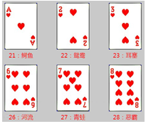
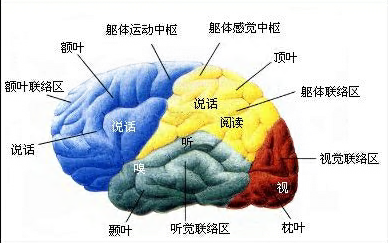
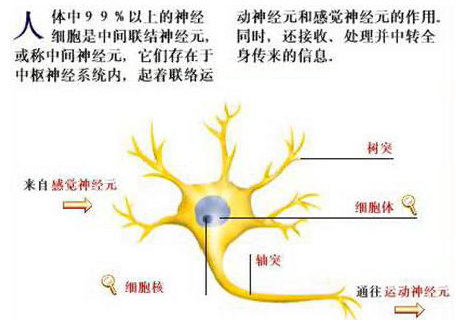
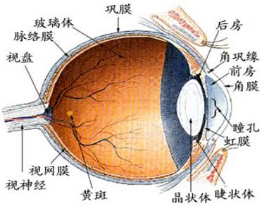

# 记忆训练

请按以下顺序训练效果最佳：基础训练－编码定位训练－扑克牌训练－思维导图训练

记忆训练需要长期坚持和不断巩固，以上四个训练可以循环反复进行

## 基础训练


【训练原理】

对事物保持专注力和注意力，是进行记忆的前提条件。<br/>
本训练包含四个项目：点选数字、点选奇数、寻找同数和寻找图片。在训练过程中，一旦注意力不集中或思想开小差，就很容易训练出错，因此，通过训练，可以有效地让训练者保持专注力和注意力。<br/>
这几项训练也可以当作记忆训练前的“热身操”，每次做其它训练前，先做几次“热身操”，可以很好地调节情绪、集中注意力，使自己逐渐进入良好的训练状态。

### 1.点选数字


【方法】

身心放松，集中注意力，从“1”开始顺序点击数字。

【目标】

在规定的时间内（2分钟），快速而准确地点击数字（错误越少点击的数字就越多）。

【提示】

这是一个培养训练者的专注力、让训练者保持注意力的训练方法。<br/>
如果你不能快速进入训练状态，除了做“静心调息”训练外，还可以做几次本训练。

### 2.点选奇数


【方法】

身心放松，集中注意力，从“1”开始顺序点击“奇数”数字。

【目标】

在规定的时间内（2分钟），快速而准确地点击数字（错误越少点击的数字就越多）。

【提示】

这是一个培养训练者的专注力、让训练者保持注意力的训练方法。<br/>
如果你不能快速进入训练状态，除了做“静心调息”训练外，还可以做几次本训练。<br/>
本训练比“点选数字”稍微增加一些难度，能有效提升你的专注力。

### 3.寻找同数


【方法】

身心放松，集中注意力，仔细观察，寻找题目中所给数字出现的次数。<br/>
每次训练需要完成20道题目。

【提示】

在培养训练者的专注力、保持注意力的同时，要求训练者具备准确的观察力。<br/>
如果你不能快速进入训练状态，除了做“静心调息”训练外，还可以做几次本训练。

### 4.寻找图片


【方法】

身心放松，集中注意力，仔细观察。需要记住的图片会展示5秒，然后在后续出现的众多图片中找出该图片。<br/>
每次训练需要完成20道题目。

【提示】

在5秒内，观察图片中出现的物体、形状、颜色及内容等，记住图片的特点。<br/>
这是一种短时记忆训练，目标是达到“直接将图像映入脑海，短时又能回想出来，就可以不用去记忆图片中的特定内容”，这样的训练能够进一步调动右脑的“形象记忆”功能。

## 编码定位训练


【训练原理】

采用编码是保持记忆的一个重要手段，也是人们保持长期记忆的基础。<br/>
持久的记忆是通过编码开始的，没有编码就没有高效和神奇的记忆。<br/>
人在记忆过程中有“编码（识记）——保持（存储）——重现（提取）”三个阶段，而编码就是其中一个重要的阶段，在这个阶段里我们要把数不胜数的数字和文字等内容有效地记住，就必须把这些内容按照一定的方法和规律在大脑中以编码的形式来保存。

在数字记忆中，对需要记忆的数字进行有效编码特别重要，即将无意义的数字使用有意义的谐音和形象来编码记忆。<br/>
在世界记忆大师和记忆专家的大脑中，他们都有一套适合于自己特点并十分好用的数字编码，当然也有不同的叫法：有的称为“数字密码”，有的叫做“数字挂钩”，还有的称为“数字代码”、“数字定桩”等等，其诀窍就是：记忆者综合自己的知识背景和编码喜好，形成了一套属于自己的独特编码系统。

最常用且应用范围最广的就是1——100数字的编码了。在大家都十分熟悉的1——100的数字范围内，将无意义的数字赋予有意义和有形象的编码并将它们记住，在自己大脑中形成可随时使用的记忆联结点，在需要记忆时进行有效运用。

本训练包含三个项目：数字编码、人体编码和家居定位编码。它们都是从数字角度出发，帮助你创建一套属于自己的编码系统。

### 1.数字编码


【原理简介】

数字，就其本身而言是没有任何意义的，所有数字都是由简单的“1、2、3、4、5、6、7、8、9、0”十个数字根据需要组合而成。在一般情况下人们是无法分清它们之间的区别，那怎么记忆它们呢？

般来说，可以用以下三种记忆方法：

1、谐音记忆法

利用数字的谐音，赋予数字串以声音形象。这种方法在我国应用非常广泛，很多人都在自觉或不自觉地运用。如“16”的谐音是“石榴”，“21”的谐音是“鳄鱼”，“98”的谐音是“酒吧”等等，如果要记住“219816”这个数字，利用谐音可以这样记忆：鳄鱼在酒吧喝石榴汁。一副怪诞夸张的画面展现出来，更容易记住。

2、形象转化法

如“230215”这组数字，我们可以把“23”看作是“乔丹”，因为“23”是他的球衣号码；把“0”看作是连接；把“21”看作是“鳄鱼”；把“5”看作是“跳舞”。这样一联系起来马上就得到这样一组“乔丹和鳄鱼在跳舞”的图像画面了，十分容易记住。

又如中国历史中的“淝水之战”发生于公元383年，通过“淝”可联想到“肥胖”，由“肥胖”想到“胖娃娃”，而8字的两个圆正好是胖娃娃的头和身体，两个3则是两只耳朵。这样一想就记牢了。

3、意义转化法

一个有关爱因斯坦的趣闻：有一次一位朋友与爱因斯坦通电话时说：“我的电话号码很不好记，是24361。爱因斯坦马上回答：“这有什么难记的，两打加19的平方就是了。”大家算一下，两打是24，19的平方就是
361。这样一来，原本没有联系的几个数字产生了联系，有助于简化我们的记忆。

从上述三种常用的数字记忆法可以看出，其实要记住数字的关键就是为数字进行“编码”，让本身无意义的数字，变成耳熟能详或喜闻乐见的各种物体或形象。

在记忆训练中，我们把需要编码的数字分为“0到9”和“00到99”共计110个，只要把这110个数字进行了编码，并熟记下来，无论多长的数字你都能够把它记住了。

训练系统为这110个数字中的每一个提供了可选的多个编码，这些编码综合使用了“谐音编码”、“形象转化编码”和“意义转化编码”，你也可以根据自身情况，结合自己的知识背景和编码喜好，重新对这110个数字进行编码。

【训练说明】

1、参考系统推荐编码，完成自己的110个数字编码；这些数字编码不要频繁改变，最好能够在一开始就固定下来。若经常改变，势必导致编码记忆的混乱，反而不能发挥编码对记忆的辅助作用。<br/>
2、点击“编码检测”按钮，系统会随机抽取“数字”，让你填“编码”，或者抽取“编码”，让你填“数字”；每次检测训练，都有110道题目，请逐题完成。<br/>
3、经过一段时间的熟悉，你已经能够记住110个编码后，仍然需要不断加强熟练程度，因此，建议经常进行“编码检测”练习。

### 2.人体编码


【原理简介】

我们每个人的身体各部位是自己每天都亲密切触的，只要对身体上的各个部位稍加编号并确定顺序后，它将成为我们记忆联想时的最好联结点。

用人体编码来记忆各种对象时，它往往会产生“奇异感觉”，“对比反差”和“形像鲜明”的效果，用它来记忆所需要记住的东西事半功倍。

列如，记住5个词语：椅子，书，河流，树枝，剪刀。

按人体编码“1到5”的顺序，我们依次想象：头顶椅子，额头上贴着一本书，左眉流消着一条河流，右眉挂着树枝，左眼插着剪刀。这样一副奇异怪诞的画面，在脑海中是印象深刻的，当你需要再次回想这5样东西时，脑海里会浮现出这幅画面，自然就能回忆起要记忆的东西了。

又如，某篇文章有10个要点需要记忆，我们可以把这些要点的关键词整理出来，按照人体编码“1到10”的顺序，依次将这些要点关键词与身体部位挂钩，也是一副奇异的画面，进而帮助加深记忆。

人体编码方法应用于记忆对象数量少（1－20个）且时效性短（数小时或1-2天内）的场合，是非常有效的。

比如要记住出门时携带的各种物品、外出时需要办理的事情或需要购买的物品、演讲稿的要点等等……

俗话说“身怕不动，脑怕不用”，经常进行这种短时记忆训练，非常有利于促进右脑机能，也有利于从根本上改善记忆能力。

通过本训练，你应当按顺序熟记身体的20个部位，并在生活学习中不断加以运用，久而久之也就熟能生巧、运用自如了。

【训练说明】

1、20个身体部位按“从上到下，从左到右”的顺序进行记忆。<br/>
2、点击“编码检测”按钮，人体图片中的编码标记会消失，请你按照顺序，逐个写出20个身体部位，每填写一个按“回车”确认。

### 3.家居定位


【原理简介】

家，是我们最熟悉的地方，其中的各种家居物品也是我们每天亲密接触和非常熟悉的。你想过吗，它们居然可以用来帮助我们进行记忆？！

其实，利用家居物品的位置进行编码，与“人体编码”的原理是一样的。当我们对家居物品进行编号确定顺序后，它们一样成为我们记忆联想时的联结点。

利用家居定位编码进行记忆时，也会产生“奇异感觉”，“对比反差”和“形像鲜明”的效果，用它来记忆所需要记住的东西事半功倍。

定位规则：从进入家门开始，沿着左边以顺时针方向，把你的家走一圈，又回到家门口。

物品数量：家居物品会很多，不是所有物品都选用，你需要选择其中26件物品即可。之所以选择26件物品，是为后续“扑克牌训练”奠定编码基础，记忆扑克牌时，一件家居物品关联2张扑克牌，26件家居物品正好可以关联一副扑克牌（52张，大小王除外）。

列如，记住5个词语：椅子，书，河流，树枝，剪刀。

段如前5个家居物品是：鞋柜、挂钟、餐桌、沙发、茶几，那么依次想象：鞋柜上有一把椅子摇啊摇，挂钟的钟摆是一本书摆啊摆，餐桌上一条弯弯曲曲的河流，沙发上躺着一根树枝，茶几上播着一把剪……，这幅奇特的画面你一定已经记住了，那么那关联的5个词语也就记住了。

以此类推，当要记忆的对象不超过26个时，家居定位就可以帮助你记住它们；那么当超过26个记忆对象时，家居编码还能用吗？

答案是肯定的

方法是这样：把2个或多个记忆对象关联到一件家居物品上，给它们配上足够奇特的场景。那么上面的场景就是：鞋柜上一把椅子在看书，挂钟是一条河流的出口，不断淌出大把的树枝和剪刀……

【训练说明】

1、以你的家居摆放为依据，选择26个家居物品，按顺序编码。这些家居定位编码不要频繁改变，最好能够在一开始就固定下来。若经常改变，势必导致编码记忆的混乱，反而不能发挥编码对记忆的辅助作用。<br/>
2、点击“编码检测”按钮，请你在26个空格中按顺序填写出你的家居物品，以此助你尽快记住定位编码，经过一段时间巩固，家居定位编码就牢记在你心中了。

## 扑克牌训练



【训练原理】

扑克牌记忆训练是记忆界十分常用且经常讲授的一个记忆项目，它同时也是一项极具挑战性和记忆难度的记忆技能。

世界记忆锦标赛的创始人托尼·巴赞说：“记忆扑克牌是一种锻炼我们大脑的工具，就像我们在健身房看到很多人利用健身器材来锻炼身体一样，当你记忆扑克牌的速度越来越快，你的大脑的灵敏度也就越来越高。你再去记其他东西时，就可以很快地记住了。

扑克牌训练在锻炼大脑对“数字、图像、色彩、人物”的综合记忆方面，具有十分明显的作用，同时将大大加强人的逻辑思维和记忆联想能力，如：从甲事物到乙事物，再从丙事物到丁事物有效转化和相互联结，将新信息与和已知信息紧密联系起来，从而加强记忆，提高处理信息的能力。

本训练包含五个项目：编码原理、记忆12张牌、记忆24张牌、记忆36张牌、记忆52张牌。

### 1.编码原理


【原理简介】

在扑克牌的记忆训练中，一般用到的扑克牌为52张：即除去大小王，每种花色各13张，其中数字牌10张，人物牌3张。<br/>
如果要死记硬背这52张扑克牌，几乎是不可能的，而且在记忆训练中也不提倡死记硬背，那样记住的东西是无法灵活运用的。<br/>
那么，如何能够把扑克牌牢牢记住，并且还要能灵活运用呢？这就需要对扑克牌进行有效的关联编码。<br/>
编码分为三类：花色编码、数字牌编码和人物牌编码。

编码方法如下：

一花色编码

数字“1”代表“黑桃”（有一个手柄）<br/>
数字“2”代表“红桃”（有两个圆弧）<br/>
数字“3”代表“草花（有三片叶子）<br/>
数字“4”代表“方块”（是四方形）

二、数字牌编码

数字“1-9”分别代表数字牌“A-9”，数字“0”代表数字牌“10”。<br/>
我们采用两位数来编码“花色+数字”牌面，“个位”代表“数字牌”，“十位”代表“花色”，那么所有数字牌对应的编码如下：

黑桃数字牌编码：11、12......19、10<br/>
红桃数字牌编码：21、22......29、20<br/>
草花数字牌编码：31、32......39、30<br/>
方块数字牌编码：41、42......49、40

三、人物牌编码

12张人物牌，用12个熟悉的人物代表。训练软件使用四大名著中的人物来编码，如：<br/>
黑桃J、Q、K用《三国演义》人物代替：刘备、关羽、张飞
红桃J、Q、K用《红楼梦》人物代替：宝玉、黛玉、宝钗
草花J、Q、K用《水浒传》人物代替：宋江、林冲、李逵
方块J、Q、K用《西游记》人物代替：悟空、八戒、沙僧

你可以按你的喜好，重新设定它们。请仔细考虑好，一旦设定后，不要频繁修改

【训练说明】

1、做好“数字编码”是进行本训练的前提，请熟练记忆自己设定好的110个数字编码。

2、点击“编码检测”按钮，请完成52个题目，系统会随机抽取“牌面”，让你填写“编码”，或者抽取“编码”，让你填写“牌面”。此项测试，能够帮助你建立起“牌面”与“数字编码”的关联记忆，训练初期需要大量练习，即便是熟练以后，也需要不断练习加以巩固。

3、经过训练，熟记“10-49”这40个数字编码与扑克牌的关联，建立起扑克牌与数字编码的记忆联结。如“黑桃A”就是“11”，而“11”的编码是“筷子”，那么“黑桃A”就与“筷子”关联起来了，在记忆时，看到“黑桃A”就想到“筷子”，而着到“筷子”就能想到“黑桃A”。

4、12张人物牌的记忆有一定难度，它不是与数字挂钩，而是直接与某个人物关联。为了加强记忆联结，可以发掘牌面与人物之间的关联特征，比如“草花”，与“落草为寇”有关，因此选择《水浒传》人物，“J”代表“江”的声母，于是用“草花J”关联到“宋江”；再比如“方块”，想到“云游四方”，《西游记》就有这个意思，那么按师兄弟的顺序就可以把“J、Q、K”与“悟空、八戒、沙僧”关联起来了。以此类推，发挥你的想象力，将人物牌关联编码后熟记。

### 2.12张牌

【原理简介】

针对12张扑克牌的记忆，可以采用“人体编码”或“家居编码”两种方式来进行记忆关联。

方法一：按顺序选取“人体编码”中的“头顶、额头、左眉、右眉、左眼、右眼”6个位置，每个位置关联2张扑克牌；<br/>
方法二：按顺序选取“家居定位编码”中的“鞋柜、挂钟、餐桌、沙发、茶几、电视柜”6个位置，每个位置关联2张扑克牌。展开奇特夸张的联想，把每两张扑克牌编码想象一个场景，将它们关联到每一个“位置”上。

例如：<br/>
需要记忆的扑克牌是：方块Q、黑桃10、黑桃9、方块7、黑桃Q、草花9……<br/>
对应的扑克牌编码是：八戒、棒球、药酒、司机、关羽、三角尺.....<br/>
人体编码关联记忆：头顶上八戒在打棒球，额头上司机在喝药酒，左眉上关羽在耍三角尺......<br/>
家居编码关联记忆：鞋柜上八戒在打棒球，挂钟上司机在喝药酒，餐桌上关羽在耍三角尺......<br/>
剩余扑克牌的关联记忆以此类推，这样一幅幅奇特夸张的画面将深深印记在脑海里，在需要回忆时，按位置顺序再现这些画面，那么关联的扑克牌也就可以回忆出来了。

【训练说明】

1、点击“翻牌”按钮，每次显示2张扑克牌，根据编码提示，迅速想象出关联记忆的场景；<br/>
2、点击“回忆牌面”按钮，回忆场景，选择每张扑克牌的花色和点数；<br/>
3、答题完毕，点击“回忆完毕提交成绩”按钮，系统会评判答题结果，显示正确牌面。

### 3.24张牌

【原理简介】

针对24张扑克牌的记忆，可以采用“人体编码”或“家居编码”两种方式来进行记忆关联。

方法一：按顺序选取“人体编码”中的“头顶、额头、左眉、右眉、左眼、右眼、左耳、右耳、鼻子、嘴巴、左肩、右肩”12个位置，每个位置关联2张扑克牌；<br/>
方法二：按顺序选取“家居定位编码”中的“鞋柜、挂钟、餐桌、沙发、茶几、电视柜、电视机、背景墙、衣柜、梳妆台、大床、穿衣镜”12个位置，每个位置关联2张扑克牌。展开奇特夸张的联想，把每两张扑克牌编码想象一个场景，将它们关联到每一个“位置”上。

例如：

需要记忆的扑克牌是：方块Q、黑桃10、黑桃9、方块7、黑桃Q、草花9……<br/>
对应的扑克牌编码是：八戒、棒球、药酒、司机、关羽、三角尺......<br/>
人体编码关联记忆：头顶上八戒在打棒球，额头上司机在喝药酒，左眉上关羽在耍三角尺......<br/>
家居编码关联记忆：鞋柜上八戒在打棒球，挂钟上司机在喝药酒，餐桌上关羽在耍三角尺......<br/>
剩余扑克牌的关联记忆以此类推，这样一幅幅奇特夸张的画面将深深印记在脑海里，在需要回忆时，按位置顺序再现这些画面，那么关联的扑克牌也就可以回忆出来了。

【训练说明】

1、点击“翻牌”按钮，每次显示2张扑克牌，根据编码提示，迅速想象出关联记忆的场景；<br/>
2、点击“回忆牌面”按钮，回忆场景，选择每张扑克牌的花色和点数；<br/>
3、答题完毕，点击“回忆完毕提交成绩”按钮，系统会评判答题结果，显示正确牌面。

### 4.36张牌

【原理简介】

针对36张扑克牌的记忆，可以采用“人体编码”或“家居编码”两种方式来进行记忆关联。

方法一：按顺序选取“人体编码”中的“头顶、额头、左眉、右眉、左眼、右眼、左耳、右耳、鼻子、嘴巴、左肩、右肩、胸口、肚子、左手、右手、左膝、右膝”18个位置，每个位置关联2张扑克牌；<br/>
方法二：按顺序选取“家居定位编码”中的“鞋柜、挂钟、餐桌、沙发、茶几、电视柜、电视机、背景墙、衣柜、梳妆台、大床、穿衣镜、屏风、书柜、书桌、钢琴、酒柜、浴室柜”18个位置，每个位置关联2张扑克牌。展开奇特夸张的联想，把每两张扑克牌编码想象一个场景，将它们关联到每一个“位置”上。

例如：

需要记忆的扑克牌是：方块Q、黑桃10、黑桃9、方块7、黑桃Q、草花9……<br/>
对应的扑克牌编码是：八戒、棒球、药酒、司机、关羽、三角尺.....<br/>
人体编码关联记忆：头顶上八戒在打棒球，额头上司机在喝药酒，左眉上关羽在耍三角尺......<br/>
家居编码关联记忆：鞋柜上八戒在打棒球，挂钟上司机在喝药酒，餐桌上关羽在耍三角尺.....<br/>
剩余扑克牌的关联记忆以此类推，这样一幅幅奇特夸张的画面将深深印记在脑海里，在需要回忆时，按位置顺序再现这些画面，那么关联的扑克牌也就可以回忆出来了。

【训练说明】

1、点击“翻牌”按钮，每次显示2张扑克牌，根据编码提示，迅速想象出关联记忆的场景；<br/>
2、点击“回忆牌面”按钮，回忆场景，选择每张扑克牌的花色和点数；<br/>
3、答题完毕，点击“回忆完毕提交成绩”按钮，系统会评判答题结果，显示正确牌面。

### 5.52张牌

【原理简介】

针对52张扑克牌的记忆，可以采用“家居编码”来进行记忆关联。

现在，你的26个“家居定位编码”就全部派上用场了，按顺序熟记这26个家居位置，每个位置关联2张扑克牌。<br/>
展开奇特夸张的联想，把每两张扑克牌编码想象一个场景，将它们关联到每一个“位置”上。

例如：

需要记忆的扑克牌是：方块Q、黑桃10、黑桃9、方块7、黑桃Q、草花9……<br/>
对应的扑克牌编码是：八戒、棒球、药酒、司机、关羽、三角尺……<br/>
人体编码关联记忆：头顶上八戒在打棒球，额头上司机在喝药酒，左眉上关羽在耍三角尺……<br/>
家居编码关联记忆：鞋柜上八戒在打棒球，挂钟上司机在喝药酒，餐桌上关羽在耍三角尺……<br/>
剩余扑克牌的关联记忆以此类推，这样一幅幅奇特夸张的画面将深深印记在脑海里，在需要回忆时，按位置顺序再现这些画面，那么关联的扑克牌也就可以回忆出来了。

【训练说明】

1、点击“翻牌”按钮，每次显示2张扑克牌，根据编码提示，迅速想象出关联记忆的场景；<br/>
2、点击“回忆牌面”按钮，回忆场景，选择每张扑克牌的花色和点数；<br/>
3、答题完毕，点击“回忆完毕提交成绩”按钮，系统会评判答题结果，显示正确牌面。

## 思维导图训练


【训练原理】

科学研究已经充分证明：人类的思维特征是呈放射性的，进入大脑的每一条信息、每一种感觉、记忆或思想（包括每一个词汇、数字、代码、食物、香味、线条、色彩、图像、节拍、音符和纹路），都可作为一个思维分支表现出来，它呈现出来的就是放射性立体结构。

思维导图是表达放射性思维的有效的图形思维工具。思维导图运用图文并重的技巧，把各级主题的关系用相互隶属与相关的层级图表现出来，把主题关键词与图像、颜色等建立记忆链接，思维导图充分运用左右脑的机能，利用记忆、阅读、思维的规律，协助人们在科学与艺术、逻辑与想象之间平衡发展，从而开启人类大脑的无限潜能。因此，利用思维导图可以协助并强化思维活动。

本训练对思维导图的原理、历史发展和绘制方法等进行了简明扼要的介绍，并通过各种有代表性的文章实例的讲解，让您熟悉思维导图。通过训练，应当掌握思维导图的方法，并在实际阅读中加以应用。

我们鼓励大家手工绘制思维导图，这样可以充分调动眼脑手协同工作，能够更好地提高阅读和记忆的效率。当然，您也可以利用电脑上的绘图工具或专门的思维导图软件来制作思维导图，这些工具软件大多都是免费的，您可以通过网络搜索获取它们。

### 1. 原理讲解

#### 思维导图的由来

科学研究已经充分证明：人类的思维特征是呈放射性的，进入大脑的每一条信息、每一种感觉、记忆或思想（包括每一个词汇、数字、代码、食物、香味、线条、色彩、图像、节拍、音符和纹路），都可作为一个思维分支表现出来，它呈现出来的就是放射性立体结构。

英国教育学家托尼·巴赞（Tony Buzan）在大学时代，在遇到信息吸收、整理及记忆等困难，前往图书馆寻求协助，却惊讶地发现没有教导如何正确有效使用大脑的相关书籍资料，于是开始思索和寻找新的思想或方法来解决。

托尼·巴赞开始研究心理学、神经生理学等科学，渐渐地发现人类头脑的每一个脑细胞及大脑的各种技巧如果能被和谐而巧妙地运用，将比彼此分开工作产生更大的效率。以放射性思考（Radiant Thinking）为基础的收放自如方式，比如：鱼网、河流、树、树叶、人和动物的神经系统、管理的组织结构等，逐渐地，整个架构慢慢形成，Tony Buzan也开始训练一群被称为“学习障碍者”、“阅读能力丧失”的族群，这些被称为失败者或曾被放弃的学生，很快的变成好学生，其中更有一部份成为同年纪中的佼佼者。

1971年托尼·巴赞开始将他的研究成果集结成书，慢慢形成了发射性思考（Radiant Thinking）和思维导图法（Mind Mapping）的概念。

思维导图是大脑放射性思维的外部表现。依据大脑思维放射性特点，后来成为英国大脑基金会主席、著名教育家的托尼·巴赞（Tony Buzan）在思维研究领域取得了令世人瞩目的成就。思维导图利用色彩、图画、代码和多维度等图文并茂的形式来增强记忆效果，使人们关注的焦点清晰地集中在中央图形上。思维导图允许学习者产生无限制的联想，这使思维过程更具创造性。

托尼·巴赞1942年出生于英国伦敦，毕业于英属哥伦比亚大学，先后获得心理学、英语语言学、数学和普通科学等多种学位。他所撰写的二十多种大脑方面的图书已被翻译成几十种语言，在全球五十多个国家出版，并成为世界顶级公司进行高级人员培训的必选教材。另外，他还出任一些政府部门、大学和研究院以及大跨国集团公司的咨询专家，包括国际商用机器公司（IBM）、惠普公司、巴克莱国际公司、数字设备公司等。他主持的大脑知识讲座已成为西方家喻户晓的节目，在广播、电视及录像节目中大受欢迎。业内人士称他为“大脑先生”。

#### 思维导图概要

思维导图是表达放射性思维的有效的图形思维工具。思维导图运用图文并重的技巧，把各级主题的关系用相互隶属与相关的层级图表现出来，把主题关键词与图像、颜色等建立记忆链接，思维导图充分运用左右脑的机能，利用记忆、阅读、思维的规律，协助人们在科学与艺术、逻辑与想象之间平衡发展，从而开启人类大脑的无限潜能。因此，利用思维导图可以协助并强化思维活动。

思维导图是一种将放射性思考具体化的方法。我们知道放射性思考是人类大脑的自然思考方式，每一种进入大脑的资料，不论是感觉、记忆或是想法—包括文字、数字、符码、食物、香气、线条、颜色、意象、节奏、音符等，都可以成为一个思考中心，并由此中心向外发散出成千上万的关节点，每一个关节点代表与中心主题的一个连结，而每一个连结又可以成为另一个中心主题，再向外发散出成千上万的关节点，而这些关节的连结可以视为您的记忆，也就是您的个人数据库。人类从一出生即开始累积这些庞大且复杂的数据库，大脑惊人的储存能力使我们累积了大量的资料，经由思维导图的放射性思考方法，除了加速资料的累积量外，更多的是将数据依据彼此间的关联性分层分类管理，使资料的储存、管理及应用因更有系统化而增加大脑运作的效率。同时，思维导图是最能善用左右脑的功能，藉由颜色、图像、符码的使用，不但可以协助我们记忆、增进我们的创造力，也让思维导更轻松有趣，且具有个人特色及多面性。


思维导图以放射性思考模式为基础的收放自如方式，除了提供一个正确而快速的学习方法与工具外，运用在创意的联想与收敛、项目企划、问题解决与分析、会议管理等方面，往往产生令人惊喜的效果。它是一种展现个人智力潜能极至的方法，将可提升思考技巧，大幅增进记忆力、组织力与创造力。它与传统笔记法和学习法有量子跳跃式的差异，主要是因为它源自脑神经生理的学习互动模式，并且开展人人生而具有的放射性思考能力和多感官学习特性。

思维导图为人类提供一个有效思维图形工具，运用图文并重的技巧，开启人类大脑的无限潜能。心智图充分运用左右脑的机能，协助人们在科学与艺术、逻辑与想象之间平衡发展。近年来思维导图完整的逻辑架构及全脑思考的方法更被广泛应用在学习及工作方面，大量降低所需耗费的时间以及物质资源，对于每个人或公司绩效的大幅提升，必然产生令人无法忽视的巨大功效。

思维导图的创始人托尼·巴赞，他也因此以大脑先生闻名国际，成为了英国头脑基金会的总裁，身兼国际奥运教练与运动员的顾问、也担任英国奥运划船队及西洋棋队的顾问；又被遴选为国际心理学家委员会的会员，是“心智文化概念”的创作人，也是“世界记忆冠军协会”的创办人，发起心智奥运组织，致力于帮助有学习障碍者，同时也拥有全世界最高创造力IQ的头衔。截至1993年，托尼·巴赞已经出版了二十本书，包括十九本关于头脑、创意和学习的专书，以及一本诗集。

#### 思维导图对速读的巨大作用

自我们接受学校的教育以来，在阅读或学习过程中，为记住学习内容，养成了按顺序做常规笔记的习惯。然而我们很少意识到：此种传统的笔记方法存在着非常致命的弱点！托尼·巴赞在经过长期的研究和实践后，明确而深刻地对传统笔记的弊端作出了简明而精辟的阐述：

1. 埋没了关键词：重要的内容要由关键词来表达，然而常规标准笔记中，这些关键词却埋没在一大堆相对不重要的词汇之中，阻碍了大脑对各关键概念之间作出合适的联想。
2. 不易记忆：单调的笔记看起来很枯燥，要点也很相似，会使大脑处于一种催眠状态，让大脑拒绝和抵触吸收信息。
3. 浪费时间：要求记些不必要的内容；读些不需要的材料；复习不需要的材料；再次寻找关键词。
4. 不能有效刺激大脑：标准笔记的线性表达阻碍大脑作出联想，因此对创造性和记忆造成消解效果，抑制思维过程。

与传统笔记相比，思维导图对我们的记忆和学习可产生巨大的作用：

1. 只记忆相关的词可以节省时间：50％到95％；
2. 只读相关的词可节省时间：90％多；
3. 复习思维导图笔记可节省时间：90％多；
4. 不必在不需要的词汇中寻找关键词可省时间：90％；
5. 集中精力于真正的问题；
6. 重要的关键词更为显眼；
7. 关键词并列在时空之中，可灵活组合，改善创造力和记忆力；
8. 易于在关键词之间产生清晰合适的联想；
9. 做思维导图的时候，人会处在不断有新发现和新关系的边缘，鼓励思想不间断和无穷尽地流动；
10. 大脑不断地利用其皮层技巧，越来越清醒，越来越愿意接受新事物。

作为助记术的思维导图为您提供了一个“十拿九稳”的记忆方法，使您的记忆能力成倍增长；同样创造性思维导图也把您简单的创造性思维模式向四周无限地发散！书山有路勤奋是路，学海无涯方法是舟，思维导图将是您一生受益的优秀学习方法！

#### 思维导图的优势与作用

##### 一、思维导图的优势

您是否经常遇到过这样的情况：

1、您买了很多书，可惜很多都没有读？就是有幸读过也掌握不了多少？<br/>
2、走进书店发现新书、想买的书层出不穷，可是总担心买回去也没有时间消化？<br/>
3、如果在图书馆的书海中遨游，您是不是望书兴叹，游不了多久就没有时间了？<br/>
4、作为学生您是不是感觉学习教材都比较吃力，只有刻苦才能通过考试？<br/>
5、已经工作的您是不是感觉学习能力不如学生时代，在激烈的竞争面前感觉知识更新缓慢？<br/>
6、当您面对的无限丰富的知识、智慧和技能您是不是感到力不从心？

是我们的能力不够吗？是我们的大脑不好使？NO！！！

您的大脑是一个沉睡的巨人，心理学家告诉我们普通人终其一生才用了4—6％的大脑潜能。我们大脑的潜能绝大部分还在沉睡！我们的一生可能花费90％以上的学习时间学习各种各样的业务知识，也许只花了10％不到的时间学习训练学习的方法。

现在有一种方法可以全面解决这些问题，这就是思维导图！有没有听说过？我们都有体会，形象的、具体的、直观的事物要比抽象的语言容易记得多。美国图论学者哈里有一句名言：“千言万语不及一张图。”说的就是这种道理。俗话说：“百闻不如一见。”也是这个意思。

思维导图和传统的学习记忆方法相比有较大的优势。

1、使用思维导图进行学习，可以成倍提高学习效率，增进了理解和记忆能力。如通过使用关键字强迫我们在做笔记的时候就要思考句子的要点到底是什么，这使我们可以积极地倾听讲课者。而且思维导图还激发我们的右脑，因为我们在创作导图的时候还使用颜色、形状和想象力。根据科学研究发现人的大脑是由两部分组成的。左大脑负责逻辑、词汇、数字，而右大脑负责抽象思维、直觉、创造力和想象力。巴赞说：“传统的记笔记方法是使用了大脑的一小部分，因为它主要使用的是逻辑和直线型的模式。”所以，图像的使用加深了我们的记忆，因为使用者可以把关键字和颜色、图案联系起来，这样就使用了我们的视觉感官。

2、把学习者的主要精力集中在关键的知识点上。您不需要浪费时间在那些无关紧要的内容上。节省了宝贵的学习时间。<br/>
通过使用关键字强迫我们在开展业务或做笔记的时候就要思考句子的要点到底是什么，这使我们可以积极地倾听讲课者。关键知识点之间的连接线会引导您进行积极主动思考。快速系统的整合知识，可以为您的知识融会贯通创造了极其有利的条件。发展创造性思维和创新能力。发散思维是创新思维的核心。画思维导图的方法恰恰是发散思维的具体化、形象化。

3、思维导图具有极大的可伸缩性，它顺应了我们大脑的自然思维模式。从而，可以使我们的主观意图自然地在图上表达出来。它能够将新旧知识结合起来。学习的过程是一个由浅入深的过程，在这个过程中，将新旧知识结合起来是一件很重要的事情，因为人总是在已有知识的基础上学习新的知识，在学习新知识时，要把新知识与原有认知结构相结合，改变原有认知结构，把新知识同化到自己的知识结构中，能否具有建立新旧知识之间的联系是学习的关键。

4、思维导图极大地激发我们的右脑。因为我们在创作导图的时候还使用颜色、形状和想象力。根据科学研究发现人的大脑是由两部分组成的。左大脑负责逻辑、词汇、数字，而右大脑负责抽象思维、直觉、创造力和想象力。巴赞说：“传统的记笔记方法是使用了大脑的一小部分，因为它主要使用的是逻辑和直线型的模式。”所以，图像的使用加深了我们的记忆，因为使用者可以把关键字和颜色、图案联系起来，这样就使用了我们的视觉感官。

##### 二、思维导图的作用

随着人们对思维导图的认识和掌握，思维导图可以应用于生活和工作的各个方面，包括学习、写作、沟通、演讲、管理、会议等，运用思维导图带来的学习能力和清晰的思维方式会改善人的诸多行为表现：

（1）成倍提高您的学习速度和效率，更快地学习新知识与复习整合旧知识。<br/>
（2）激发您的联想与创意，将各种零散的智慧、资源等融会贯通成为一个系统。<br/>
（3）让您形成系统的学习和思维的习惯，并使您将能够达到众多您想达到的目标，包括：快速的记笔记，顺利通过考试，轻松的表达沟通、演讲、写作、管理等等！<br/>
（4）让您具有超人的学习能力，向您喜欢的优秀人物学习，并超越您的偶像和对手。<br/>
（5）让您尽快掌握思维导图这个能打开大脑潜能的强有力的图解工具。它能同时让您运用大脑皮层的所有智能，包括词汇，图象，数字，逻辑，韵律，颜色和空间感知。它可以运用于生活的各个层面，帮助您更有效地学习，更清晰地思维，让您的大脑最佳表现。

##### 三、思维导图适合应用的领域

思维导图可以用于工作、学习和生活中的任何一个领域里。

1、作为个人：计划，项目管理，沟通，组织，分析解决问题等；<br.>
2、作为学习者：记忆，笔记，写报告，写论文，做演讲，考试，思考，集中注意力等；</br>
3、作为职业人士：计划，沟通，项目管理，组织，会议，培训，谈判，面试，评估，掀起头脑风暴等。

所有这些应用可以极大地提高您的效率，增强思考的有效性和准确性以及提升您的注意力和工作乐趣。

##### 四、您是否想听听使用过思维导图的是怎么说的？

“使用思维导图是波音公司的质量提高项目的有效组成部分之一。这帮助我们公司节省了一千万美元。”——Mike Stanley，波音公司，美国

美国波音公司在设计波音747飞机的时候就使用了思维导图。据波音公司的人讲，如果使用普通的方法，设计波音747这样一个大型的项目要花费6年的时间。但是，通过使用思维导图，他们的工程师只使用了6个月的时间就完成了波音747的设计！并节省了一千万美元。思维导图的威力惊人吧？！

“我们的课程建立在思维导图的基础上。这帮助我们获得了有史以来最高的毕业分数。思维导图教学必然是未来的教学工具。”一Jean Luc Kastner，高级经理，惠普医疗产品，德国

“Buzan的思维导图在我们办公室内的重要性越来越明显。它在帮助我们打开思路上的作用是惊人的。我们使用思维导图安排会议议程，做头脑风暴，设计组织结构图，记笔记和写总结报告。这是一个通向未来的必备工具。”——Wiliam L. Maxilae，副总裁，Fluor Daniel，美国

“作为一个头脑风暴的工具，思维导图让我们感觉到想象力一下子打开了，新点子层出不穷，真是思如泉涌，这种感觉以前从来没有过，真是太棒了。”一—Sean Adams，总裁， Alpha Learning，荷兰

“大脑的力量是我们未来成功的金钥匙”—Keith Bradley，国际管理教授，英国公开大学商学院

“思维导图可以让复杂的问题变得非常简单，简单到可以在一张纸上画出来，让您一下看到问题的全部。它的另一个巨大优势是随着问题的发展，您可以几乎不费吹灰之力地在原有的基础上对问题加以延伸。”一Dr Tony Turril，管理学作家，英国

#### 如何画思维导图

人的脑细胞和思维都是呈放射性的（如图1），思维导图是放射性思维的表达：


思维导图的四个基本特征（如图2）：


1. 注意的焦点清晰地集中在中央图形上；
2. 主题的主干作为分枝从中央图形向四周放射；
3. 分枝由产生联想的线条上的关键词或图构成；
4. 各分枝形成一个连接的节点结构。

思维导图的画法（如图3）：


1. 把表达主题的关键词放在思维导图的中央；
2. 表达次主题的关键词放在主题放射出来的线条上，依次类推；
3. 主题、次主题等关键词可用数字编号，以增强顺序性；
4. 尽可能用图形、色彩来配合或代替所有关键词，可大大加深记忆。若为求快捷方便，也可省略图形。

最简单的导图画法（用上述要点为例，仅用线条和文字。如图4）：


### 2. 基础训练

#### 《思维导图的好处》

看完下面的文章后，用纸和笔画思维导图，换完后点击参考答案对照。

```txt
思维导图做笔记的好处

1. 只记忆相关的词可以节省时间：50％到95％；
2. 只读相关的词可节省时间：90％多；
3. 复习思维导图笔记可节省时间：90％多；
4. 不必在不需要的词汇中寻找关键词可省时间：90％；
5. 集中精力于真正的问题；
6. 重要的关键词更为显眼；
7. 关键词并列在时空之中，可灵活组合，改善创造力和记忆力；
8. 可以在关键词之间产生清晰合适的联想；
9. 大脑更易于接受和记忆有视觉刺激、多重色彩、多维度的思维导图，而不是单调烦人的线性笔记；
10. 大脑不断地利用其所有的皮层结构，越来越清醒，越来越愿意接受新事物。
```

<details><summary>查看参考答案</summary>暂无</details>

#### 《高效速读记忆的重要性》

看完下面的文章后，用纸和笔画思维导图，换完后点击参考答案对照。

```txt
高效速读记忆的重要性
信息剧增的时代：20世纪未以来，人们进入了信息爆炸式增长的现代社会，各种学科不断细分，不断渗透。人类文明发展前5000年的文献资料，还不如现在1年出版的文献资料多！常规的逐字阅读方法已无法适应知识积累的要求！
国家级科研项目：速读训练由于其对于提高国民素质的重要性，已成为国家教育部十五计划中的重点科研项目。
国外：2002年2月22日美国总统布什在赴清华大学的演讲中提到：现在在美国的小学生，如果四年级还达不到快速阅读能力要求的话，那他到了初二的时候就更不能阅读了，他毕业了以后，根本无法继续上大学。美国政府拨款50亿美元，提高学生的快速阅读能力。要求每个孩子上三年级时都已经学会快速阅读。
工作：不论是政府、企业，还是个人职场中，挑战越来越大。只有掌握丰富的工作知识，才能做到临危不惧、游刃有余，从而在剧烈的竞争中胜出。
生活：大量的报刊杂志，一目十行，便掌握其精要，做到知识面广。生活、交友、爱情、处世.....心想事成。
学习：“书山有路勤为径，学海无涯苦作舟”若再加上有十倍效率的学习方法，同样的时间，知识的积累量将是别人十倍！您将成为知识渊博的人。
考试：中考、高考、考研的文科类及英语的试题文字阅读量较1988年翻了三倍以上，很多考生已来不及做完。掌握速读技巧，中考、高考、自考、职考、MBA、考研、考博.....让您备考过目不忘，应试自如、信心十足。
无数研究和学员的实践证明，把阅读速度提高10倍的能力，人人具备，但被传统老式的教育方法屏蔽了。只需稍加训练，您便可：一目十行，过目不忘！
```

<details><summary>查看参考答案</summary>暂无</details>

#### 《快速阅读的生理基础》

*看完下面的文章后，用纸和笔画思维导图，换完后点击参考答案对照*。

快速阅读的生理基础——您完全具备

当您惊叹电脑运算如此之快，存贮量如此之大、程序如此之复杂的时候，您可曾想到：您自已也拥有一台世界上功能最强，存贮量最大的电脑！它只有一千多克，像小椰子那么大，可轻易放在手掌之上，但它比世界上最强大的电脑还要强上千万倍。它，就是属于您的神奇的大脑!

1.人脑的组成:人类的脑由大脑、小脑及连接大脑、小脑的间脑、中脑和延髓组成。间脑、中脑、延髓统称为脑干。结构如图:


(1) 脑干：位于脊髓的上端。由脊髓传至脑的神经冲动，先传到脑干，再由脑干传至大脑。它对维持觉醒和抑制、过滤各感觉器官传入的信息起着重要的作用。主要功能是维持个体生命的心跳、呼吸、消化、体温、睡眠等重要生理活动。

(2) 小脑：位于大脑和枕叶的下方，在脑干之后。主要功能是：和大脑皮质运动区共同控制肌肉的运动，调节姿势和身体的平衡。

(3) 大脑：是脑的最高层部分，也是人脑中最复杂最重要的神经中枢。人脑的平均重量在1550克左右，仅占体重的2％—3％，然而它的血流量却是全身的20％，消耗的氧气是全身的25％。原因就在于人脑高度发达的大脑皮层。

大脑不同的部位有着不同的功能。当不同的部位出现障碍将不能进行相应的思维。如下图：



2．神经元：即神经细胞，具有高度的敏感性。主要由三部分组成：细胞体、多个树突和一个轴突组成。如下图：



3．大脑的左右半球分工：

自从16世纪，笛卡尔提出“心是一个，大脑为何是两个？”这一疑问后，世界各国的生物学家开始对大脑机能的分工，进行了几个世纪的探索和研究，最后发现了大脑左右半球分别担任着不同的工作：

左脑主管抽象思维，具体有：辨认时间、计算、逻辑分析、理解、听觉、语言（议论、听、说、读、写）等。<br/>
右脑主管形象思维，具体有：认识空间、感受音乐、情感等。


二、灵敏宽广的视觉

眼睛是怎样工作的呢？进入眼球的光线，经晶状体的折射，聚焦到视网膜上。视网膜分布着上亿个感光细胞。光能转换为电信号，再经视网膜神经元组成的复杂网络进行编码、处理，最后由视神经传到视皮层中枢。如下图：



视觉机能有两个指标。一个是视力，它直接影响人们的生活、学习和工作，这您已经很熟悉了。别一个是视野,指当眼球向正前方直视不动时所能看见的空间范围。距注视点30度角以内为中心视野,此部分较为清晰；30度以外为周边视野，俗称"余光"。

人的眼睛一瞬间即可接收到大量的图形信息，它在我们的速读和记忆训练中占了极其重要位置。

充分使用中心视野的清晰范围，可让我们的阅读速度提高十倍以上。传统的逐字阅读，只使用了中心视野的一个点；阅读快一点的人，可一眼识别4-6个字；经过训练的人，可在中心视野范围内一眼识别30-300字以上。很简单，一眼能识别几十几百字，比一眼看一个字，速度要快多少倍啊！速读速记系统，正是充分发挥了这方面的潜力！

三、唤醒沉睡的巨人

"您的大脑就像一个沉睡的巨人！"英国的作家、心理学家、教育家托尼•布赞如此形容："人脑是由亿万个脑细胞构成的，个个脑细胞就其形状而言就像是最复杂的小章鱼。它有中心、有许多分支。每一个分支有许多连接点。上百亿脑细胞中的每一个脑细胞都比今天地球上大多数的电脑强大和复杂许多倍。每一个脑细胞与几万至几十万个脑细胞连接。它们来回不断地传送着信息，这被称为迷人的织造术。其复杂和美丽程度在世间万物中无与伦比，而我们每个人都有一个。"

人类有100亿个脑细胞，每个脑细胞可以组成2万个不同的连接，这种组合排列，其可能性巨大得不可想象-—用科学家的话："也许比宇宙中的原子数还多！"即使象爰因斯坦那样伟大的科学家，也只发挥了大脑不到1/10的功能，绝大多数脑细胞仍然处于"待业"状态。更别说连大脑功能1/100也没发挥的普通人了。因此科学家们说："脑的创造力是无穷无尽的。"

人的任何限制，都是从自己的内心开始的。由于传统的教育，当您自己与爰因斯坦、比尔•盖茨相比时，唯一点不同就是您的内心认为自己不行。正是这副枷锁，束缚了您本来就具有的能力的发挥，限制了您潜力的挖掘！人类潜能的发挥，就是要打破一个又一个自设的枷锁。远古的人们，可曾想到可以制造电脑、汽车甚至飞机；现在记忆大师可背出小数点后两万位，一般人经过几分钟学习后可背出几百至几千位。简单的学习，您的阅读速度和记忆能力可以提高十倍以上！

建立您的自信心，开启您的大脑，您会发现您的潜能几乎是无限的！您的大脑就是一座巨大的金矿！科学家们说“充分开发左右脑，可以考取21个博士！”，眼睛一次可以看清楚的是许多而不是“一个一个”的字，大脑一次可以处理的也不是“一点一点”而是巨大得无法想象的信息。超级速读记忆训练，正是为唤醒您沉睡的大脑而设计的！

<details><summary>查看参考答案</summary>暂无</details>

### 3. 实战训练

#### 《洪水中的神父》

```txt
洪水中的神父

在某个小村落，下了一场非常大的雨，洪水开始淹没全村，一位神父在教堂里祈祷，眼看洪水已经淹到他跪着的膝盖了。一个救生员驾着舢板来到教堂，跟神父说：“神父，赶快上来吧！不然洪水会把你淹死的！”神父说：“不！我深信上帝会来救我的，你先去救别人好了。
过了不久，洪水已经淹过神父的胸口了，神父只好勉强站在祭坛上。这时，又有一个警察开着快艇过来，跟神父说：“神父，快上来，不然你真的会被淹死的！”神父说：“不，我要守住我的教堂，我相信上帝一定会来救我的。你还是先去救别人好了。
又过了一会，洪水已经把整个教堂淹没了，神父只好紧紧抓住教堂顶端的十字架。一架直升飞机缓缓的飞过来，飞行员丢下了绳梯之后大叫：“神父，快上来，这是最后的机会了，我们可不愿意见到你被洪水淹死！！”神父还是意志坚定的说：“不，我要守住我的教堂！上帝一定会来救我的。你还是先去救别人好了。上帝会与我共在的！！”
洪水滚滚而来，固执的神父终于被淹死了....神父上了天堂，见到上帝后很生气的质问：“主啊，我终生奉献自己，战战兢兢的侍奉您，为什么你不肯救我！”上帝说：“我怎么不肯救你？第一次，我派了舢板来救你，你不要，我以为你担心舢板危险；第二次，我又派一只快艇去，你还是不要；第二次，我以国宾的礼仪待你，再派一架直升飞机来救你，结果你还是不愿意接受。所以，我以为你急着想要回到我的身边来，可以好好陪我。”
其实，生命中太多的障碍，皆是由于过度的固执与愚昧的无知所造成。在别人伸出援手之际，别忘了，惟有我们自己也愿意伸出手来，人家才能帮得上忙的！！！

根据范文回答以下思考题

请学员对所阅读的范文进行认真分析，根据思维导图的关键词要求回答考题并完成该文关键词的提取。

1、第一次是什么人用什么工具来救神父？
2、第二次是什么人用什么工具来救神父？
3、第三次是用什么工具来救神父？神父被淹死后怎样质问上帝？
5、上帝怎样答复神父的？
6、范文主题是什么？
```

<details><summary>查看参考答案</summary>暂无</details>

#### 《领导的影响力来自哪里》

```txt
领导的影响力来自哪里

领导的影响力一般主要有两个方面，即强制性影响力和自然性影响力。强制性影响力往往同领导地位及权力属性相伴，自然性影响力多半与领导自身人格、品质和素质相联系。

一、强制性影响力

    强制性影响力，又称权力性影响力。权力既是一种控制力，又是一种影响力。权力是构成一切正式组织的必要条件。一个组织的领导如不拥有某些合法权力，就不能称之为领导，也不能维持正式组织并发挥其作用。所谓权力影响力，就是合法权力所产生的效果。合法权力是一切权力的基础，而由影响力所产生的种种权力，只是合法权力的派生物。
    权力影响力在于它对人的影响带有强迫性、不可抗拒性。它的产生主要有以下几个方面原因：
    （1）传统因素。传统因素是指人们对领导者的一种由历史沿传而来的传统观念。历史学家研究指出，传统首先来源于恐惧，其次是社会服从，从恐惧到服从经过不断的制度化，深入到社会的各个阶级结构与意识形态，从而成为人类社会一种特殊的影响力量。
    （2）权力因素。社会心理学认为，社会权力是形成领导影响力的基础。权力是一种制度化的力量。美国社会学家克特·W·巴克认为，权力就是在个人或集团的双方或多方之间发生利益冲突或价值冲突的形势下执行强制性控制。在现实生活中，权力往往表现为一种“位置”或“地位”的力量，即“职权”。由于他们担任不同的职务，就拥有不同程度的控制权。现代社会所有的组织结构，几乎都有一个完美的金字塔形式，每个人按地位顺序置于一个特定的位置上。权力和控制是从金字塔的顶端逐渐向下延伸的，而服从和负责则是从金字塔最基层由下而上的。
    （3）资历因素。领导者影响力的大小，与他自身的资历是密切相关的。资历是资格和经历的合称，在一定程度上能够反映出一个人的实践经验和能力。领导人物的光荣历史、非凡经历，往往能使被领导者产生一种敬重感。

二、自然性影响力

    自然性影响力，又称非权力性影响力。它与权力性影响力不同的是，它不是外界赋予的那种奖励和惩罚别人的手段，而是来自于个人的自身因素。其中包括领导者的道德品质、文化知识、工作才能和交往艺术等等。
    自然性影响力的构成因素包括品格因素、能力因素、知识因素和感情因素。
    领导者有效的影响力，除了来自于他自身必须具备的一定的影响力之外，还与群体接受影响的心理机制密不可分。这一心理机制就是导致群体一致行动的模仿、暗示和认同。
    （1）模仿。模仿是由非强制性社会刺激引起的使个人再现某一榜样的一种社会心理行为。这种社会刺激可以是榜样本身，也可以是其他事物，其特点是非强制性。
    在领导活动中，下级对上级的模仿，被授权者的授权者的模仿，是一种极为普遍的社会心理现象。由于领导者本身所处的地位，其品德、行为、处理问题的方法，以及言谈举止和喜怒衰乐等情绪都容易被下级自觉或不自觉地接受、模仿；而领导者也往往利用“模仿”这一心理机制，来发挥自己在群众中的影响作用。
    （2）暗示。是在无对抗条件下，用含蓄间接的方法对人们的心理和行为产生影响，从而使人们按照一定的方式去行动或接受一定的意见，使其思想、行为与暗示者的意志相符合。
    在领导活动中，领导者的一个恰当的暗示，能够直接沟通上下级之间的思想感情；一个赞许的目光，将会使下级乐于受命，勇气倍增。领导者可以运用暗示的心理机制，把自己的意志和情绪，作为一种特殊信息，传递给下级，从而充分发挥其效力。
    （3）认同。就是个体将自己和另一对象“视为等同”、“相同”，从而形成彼此之间的整体性感觉。
    认同是保证群体或组织整体性的重要因素。在群体活动中，大体上都有一种强烈的从感情上要将自己认同于另一个个体，尤其是认同于领导者人格特质的心理趋向。正是这种心理趋向，加强了群体或组织的整体性。高度的认同，还会使个体与对象休威与共，荣辱相依。
    我们常说领导要和群众打成一片，就是指领导者要具有一定的透明度，在感情上尽可能接受群众，与群众要有共同的语言，成为群众中的普通的一员，以取得群众的认同。人与人若具有共同的态度与价值观，则不但容易获得对方的支持和共鸣，同时也容易预测对方的反应倾向。因此，在交互作用过程中，彼此容易建立起融洽的人际关系。

根据范文回答以下思考题：
请学员对所阅读的范文进行认真分析，根据思维导图的关键词要求回答考题并完成该文关键词的提取。

1、领导的影响力包括哪些方面？
2、强制性影响力的特点是什么？
3、强制性影响力产生的原因是什么？
4、自然性影响力的构成因素是什么？
5、自然性影响力的心理机制是什么？
```

<details><summary>查看参考答案</summary>暂无</details>

#### 《新道路交通安全法解读》

```txt
新道路交通安全法解读

一、肇事逃逸终生禁驾
道路交通安全法规定，如果机动车驾驶人造成交通事故后逃逸，将被吊销驾照，且终生不得重新取得机动车驾驶证。

二、高速飙车将受重罚
道路交通安全法规定，机动车行驶超过规定时速百分之五十的，公安机关交管部门将处二百元以上二千元以下罚款，可以并处吊销机动车驾驶证。

三、考核交警禁看罚款
道路交通安全法明确规定，任何单位不得给公安机关交通管理部门下达或者变相下达罚款指标，公安机关交通管理部门也不得以罚款数额作为考核交通警察的标准。

四、无照驾车可处拘留
道路交通安全法规定，未取得机动车驾驶证、机动车驾驶证被吊销或者机动车驾驶证被暂扣期间驾驶机动车的，由公安机关交通管理部门处二百元以上二千元以下的罚款，还可并处十五日以下拘留。

五、拖车不得收取费用
道路交通安全法规定，公安机关交通管理部门拖车不得向当事人收取费用，并应当及时告知当事人停放的地点。因采取不正确的方法拖车造成机动车损坏的，应当依法承担补偿责任。

六、交通事故可以私了
道路交通安全法规定，在道路上发生交通事故，未造成人身伤亡，当事人对事实及成因无争议的，可以即行撤离现场，恢复交通，自行协商处理损害赔偿事宜。这意味着，一些小的交通事故可以由双方当事人协商“私了，而不必通过公安机关交通管理部门处理。

七、号牌不能故意遮挡
道路交通安全法规定，机动车号牌应当按照规定悬挂并保持清晰、完整，不得故意遮挡、污损。故意遮挡、污损或者不按规定安装机动车号牌的，将处警告或者二十元以上二百元以下罚款。

八、行人违反交规受罚
道路交通安全法规定，行人、乘车人、非机动车驾驶人违反道路交通安全法律、法规关于道路通行规定的，处警告或者五元以上五十元以下罚款；非机动车驾驶人拒绝接受罚款处罚的，可以扣留其非机动车。

九、酒后驾车加大处罚
道路交通安全法严禁酒后驾车，加大了对饮酒、醉酒后驾车的法律处罚力度。饮酒后驾驶机动车的，处暂扣一个月以上三个月以下机动车驾驶证，并处二百元以上五百元以下罚款。醉酒后驾驶机动车的，由公安机关交通管理部门约束至酒醒，处十五日以下拘留和暂扣三个月以上六个月以下机动车驾驶证，并处五百元以上二千元以下罚款。

十、违法施工包赔损失
道路交通安全法规定，未经批准，擅自挖掘道路、占用道路施工或者从事其他影响道路交通安全活动的，由道路主管部门责令停止违法活动，并恢复原状，可以依法给予罚款；致使通行的人员、车辆及其他财产遭受损失的，依法承担赔偿责任。

十一、电动车算做非机动车
电动自行车到底算机动车还是非机动车？它能不能上路行驶？道路交通安全法明确将电动自行车纳入了非机动车的范畴，能否上路将由省级人民政府决定。

根据范文回答以下思考题：
请学员对所阅读的范文进行认真的分析，根据思维导图的关键词要求回答考题并完成该文关键词的提取。

1、肇事逃逸该怎样罚？
2、高速飙车怎样处罚？
3、考核交警禁看什么？
4、无照驾车怎样处罚？
5、拖车是否收取费用？
6、简易交通事故怎样处理？
7、号牌不能什么？
8、行人违反交规要受什么处罚？
9、酒后驾车将受什么处罚？
10、违法施工是否包赔损失？
11、电动自行车到底算什么车？
```

<details><summary>查看参考答案</summary>暂无</details>

#### 《林肯轿车将十岁女童拖出3000米致死》

```txt
林肯轿车将十岁女童拖出3000米致死

    本报长春2月3日电（记者梁国栋曹景常）一辆挂着外省车牌照的白色林肯牌轿车，将街边一名十岁女孩剐入车下拖出3000米远致死，肇事车逃逸。吉林省省长王珉得知后，甚为关切，当即批示公安机关从速破案。
    2月1日下午1时30分许，在吉林省长春市亚泰大街铁北开关厂门前，一男子驾驶一辆车牌照为“黑R32168”的白色林肯轿车将10岁女孩肖金萍撞倒拖出3000米后致死。2月2日省长王珉，省委常委、政法委书记、公安厅厅长聂文权先后做出批示，要求公安机关限期破案。长春市公安局在案发后迅速组织警力勘查现场、走访见证人、搜查证据，设卡堵截，追捕肇事司机，并向邻近省、市发出协查通报。经核查，确定该肇事车上挂的车牌照是黑龙江省建三江农管局一辆桑塔纳轿车的牌照，与肇事车辆不符。
    记者从有关部门获悉，目前，公安机关在长春市绿园区五环高尔夫家园小区内已发现肇事车辆。经查，车主为倪东涛，男，长春市个体业主。自色林肯车的车牌照是套牌；犯罪嫌疑人付中涛，男，29岁，户口在吉林省九台市纪家镇，现在长春市做小买卖。其借用此车肇事后逃逸。现公安机关正在全力追捕中。

根据范文回答以下思考题：
请学员对所阅读的范文进行认真分析，根据思维导图的关键词要求回答考题并完成该文关键词的提取。

1、这起交通肇事案涉及的时间有哪些？
2、这起交通肇事案件涉及的地点？
3、这起交通肇事案件的受害者是谁？
4、这起交通肇事案件的车辆是什么样的车？
5、这起重大交通肇事案件的真正作案者？
6、这起重大交通肇事造成了什么样的结果？
```

<details><summary>查看参考答案</summary>暂无</details>

#### 《老年人的合理营养》

```txt
老年人的合理营养

合理营养的重要性

人类为了维持生命与健康，必须每天从食物中获取人体所必须的各种营养物质。以往许多人往往看重营养不良的危害，认为营养不足可致体弱多病，会影响人体健康；相反对营养过度及营养不平衡的危害却认识不足。
举个简单的例子，以往人们往往认为肥胖是福相、富贵体型，是营养好的象征和健康的标志，而实际上肥胖是热量入超导致的营养不平衡的结果。肥胖有许多危害，使活动能力减弱自不必说，还与高血压、高血脂、冠心病等心血管疾病以及糖尿病的发生有密切关系。因此，讲究营养要讲合理营养，也就是每日由食物摄入营养物质要适度，既不能缺乏，也不能过度。缺则不能满足机体生理活动的需要，严重时可引起机体生理机能的改变和生化活动异常，甚至发生机体形态结构的异常，影响人体健康；过了也会引起机体异常改变，或体内积聚过多，或干扰其它营养物质的利用，使代谢异常，有时甚至可产生中毒现象，而这对人体的危害也绝不能低估。近年来被人们称为现代文明的疾病，其中许多疾病包括癌症在内，就同营养过剩或营养不平衡有关。老年时期这种营养过剩或营养不平衡对健康的危害就更大。这已引起越来越多人的重视。总之，合理的营养能促进机体的正常生理活动，改善机体的健康状况，增强机体的抗病能力，提高免疫力。合理营养可使老年人精力充沛，提高工作效率，对抗老防衰、延年益寿，具有极其重要的作用。

合理营养的基本要求

所谓合理营养是指膳食营养在满足机体需要方面能合乎要求，也就是说由膳食提供给人体的营养素，种类齐全，数量充足，能保证机体各种生理活动的需要。
达到合理营养要求的膳食一般称为平衡膳食，基本要求是：
①膳食中热量和各种营养素必须能满足人体生理和劳动的需要。即膳食中必须含有蛋白质、脂肪、糖类、维生素、无机盐及微量元素、水和膳食纤维等人体必须的营养素，且保持各营养素之间的数量平衡，避免有的缺乏、有的过剩。因此，食物应多样化。因为任何一种天然食物都不能提供人体所必须的一切营养素，所以多样化的食物是保证膳食平衡的必要条件。
②合理的饮食制度。如餐次安排得当，可采取早晨吃好、中午吃饱、晚上吃少的原则。
③适当的烹调方法。要以利于食物的消化吸收，且有良好的食品感官性状，能刺激食欲为原则。老年人的膳食宜嫩、软，容易消化，一般应限制油腻食物。
④食品必须卫生且无毒生态。
当然由于人们的生活环境不同，饮食习惯、健康状况等也千差万别，对营养的要求也就各不相同。在实际生活中只有根据合理营养的基本要求，按照每个人的性别、年龄、劳动状况、健康情况等方面综合考虑，安排好每日膳食，才能真正达到合理膳食的要求。

（三）平衡膳食的构成

1.平衡膳食的内容：平衡膳食是由多种食物构成的，它能为人体提供足够数量的热量和营养素，且能保持各营养素之间的数量平衡。主要包括：
（1）热量及热源质配比平衡。热量摄入适应性别、年龄、劳动强度及生理需要，摄入与消耗呈动态平衡，蛋白质、脂肪、碳水化合物比例适当，热能比分别是10~15%，20~25%，60~70%。
（2）氨基酸平衡。食物中蛋白质所含的色氨酸、苯丙氨酸、赖氨酸、苏氨酸、蛋氨酸、亮氨酸、异亮氨酸、缬氨酸为人体所必须的8种氨基酸，一般在肉、蛋、奶等动物性食品和豆类食品中含量充足、比例恰当，故肉、蛋、奶和豆类食品的营养价值较高，而粮谷等植物性食品中则常有几种氨基酸缺乏，故其营养价值较低。因此，搞好动、植物食品的合理搭配，实现食物氨基酸互补，达到比值平衡，可提高食物蛋白质的利用率和营养价值。
（3）脂肪酸平衡。脂肪可来自动物性食品、粮食、坚果及食用油等多种食品。脂肪由甘油和脂肪酸所组成。脂肪酸可分为饱和脂肪酸、多不饱和脂肪酸和单不饱和脂肪酸。膳食中饱和脂肪酸在动物性油脂中含量较高，如猪油、牛油、奶油等，过多摄入可致高血脂、动脉粥样硬化，故应控制其摄入量。而多不饱和脂肪酸一般在植物性油脂中含量较高，如豆油、葵花子油、芝麻油、花生油等，其中有的多不饱和脂肪酸如亚油酸，是人体不能合成，必须由食物提供的必须脂肪酸，故通常认为植物油的营养价值较高。因此，应尽量控制动物油的摄入量，适当增加植物油摄入量，对老年人更应如此。当然，也不是植物油摄入多多益善，因为多不饱和脂肪酸在体内氧化易产生过氧化物，具有促进衰老作用。所以食用油脂还应控制适量，一般以食用油脂加上其它食物脂肪不超过总热能的25%为宜，在这个前提下尽量多采用植物油作为烹调用油，其用量一般应占全日用油至少一半以上。
（4）酸碱平衡。人体在正常情况下血液酸碱处于平衡状态，pH值稳定在7.3~7.4之间。食品中，含磷、硫、氯等非金属元素较多的，在机体内经代谢后可生成酸根，称为酸性食品，如米、面粉、肉、鱼、蛋等；而含钠、钾、镁、钙等金属元素较多的，则在体内氧化，产生带阳离子的碱性氧化物，称为碱性食品，如大多数蔬菜、水果、黄豆等。膳食中酸性食品和碱性食品应搭配适当，否则一旦超过机体缓冲系统代偿能力，就会导致酸碱失衡。如酸性食品摄入过多可使血液偏酸性，严重时还可致酸中毒。
（5）维生素平衡。脂溶性维生素摄入过多，在体内易造成蓄积，引起中毒，这在食用强化食品或口服鱼肝油丸等制剂时应予注意；在我国膳食结构中，维生素A、D膳食来源不充分，应注意动物肝脏等食品摄入。水溶性维生素如维生素B1、维生素B2、尼克酸、维生素C等，体内贮备少，且烹调加工及贮存过程中易损失破坏，因而易发生供给不足的问题，应注意膳食补充。维生素B1、维生素B2、尼克酸等，还参与体内生物氧化过程，同能量代谢有关，因此，在热量摄入增加时也应相应增加这几种维生素的供给量。各种维生素之间也存在互相影响问题，如维生素B1、维生素B2可促进维生素C合成；维生素B1与B2之间也存在相互影响的问题。
（6）无机盐平衡。膳食中磷酸盐过多可与食物中的钙结合，使其溶解度降低，影响钙的吸收率。膳食中膳食纤维过多或脂肪过高或蛋白质缺乏也会影响钙的吸收。食物中含草酸、植酸较高时能与某些元素结合生成难溶物质，可影响钙、铁、锌等的吸收。

2.平衡膳食的构成：平衡膳食应由尽可能多样的食物组成，这些食物大致上可分为两大类：第一类是保护性食品，富于无机盐、维生素及优质蛋白质，例如肉类食品、蔬菜、水果等；第二类是热能食品，是热能的主来源，如粮食、食用油、糖类食品等。保护性食品对于维持机体正常生理功能具有保护作用，是每日膳食不可忽视的组成部分。而保护性食品只有在摄入足够热能食品的前提下才能发挥作用，故二者应相辅相成，不可偏废。日本提倡每日膳食应保证30种以上食物，而我国膳食结构的特点则要求每天至少能吃到20种以上的食物，大致可按以下种类和数量予以安排（以一般轻体力活动老年人为例）：粮谷类及薯类3种，约300～450克；豆类及其制品20～30克；蛋类及其制品50克；畜、禽肉类20～30克；乳类及其制品250克；水产品1种，每周50克；动物内脏1种，每周50克；蔬菜3~4种，300~500克，其中至少1/3以上为绿色、黄色、红色等深色蔬菜；水果1～2种，约200克；菌藻类食品1种，10克；坚果类食品1种，30～50克；植物油15克。

根据范文回答以下思考题：
请学员对所阅读的范文进行认真分析，根据思维导图的关键词要求回答考题并完成该文关键词的提取。

1、人类维持生命与健康，必须获取营养的重要性有哪些方面？
2、营养不足的危害体现哪两个方面？
3、营养过度的危害有哪些方面？
4、营养过度可能引起的疾病有哪些？
5、认为肥胖有好处的错误认识有哪些？
6、合理吸收营养要注意哪两个方面？
7、合理营养的作用有？
8、合理营养的功效有？
9、平衡膳食的基本要求是什么？
10、平衡膳食的内容有些什么？
11、平衡膳食的构成是指什么？
```

<details><summary>查看参考答案</summary>暂无</details>

#### 《安利如何打造自己的品牌》

```txt
安利如何打造自己的品牌

    创立于1959年的美国安利品牌曾在1992年就进入了中国，曾经以“疯狂的传销”品牌而著名，同时，也因此而蒙受了巨大的损失。我们在安利品牌身上目睹了跨国品牌在中国“水土不服”最为经典的一幕。
    经过几年偃旗息鼓的转型经营之后，安利品牌策路从“直销”转向“店铺+直销”，今年元月十日，安利一反常态开始大规模地在全国13个省市电视台和其他媒体投放广告，并推出跳水明星伏明霞作为其营养补充食品品牌——纽崔莱的形象代言人。
    安利的产品已经遍布全球80个国家和地区，1999年销售额达50亿美金，作为一个很老道的直销品牌，，向来是不在媒体公开大张旗鼓地作广告的，今天，为什么会在媒体大作广告，它究竟打得是什么牌？
    借推广产品新品牌重树企业形象这是安利打的第一张牌。1998年的传销风波，让安利经历了品牌创建以来最痛苦的磨难，为了摆脱传销给安利品牌造成的负面影响，在原安利洗涤用品和雅姿护肤用品产品线基础之上，安利推出了营养补充食品产品线的新品牌一—纽崔莱，它承担了安利企业转型之后企业品牌提升的作用。一个企业品牌形象的建立和改变都是借助于具体的产品或服务而逐步完成的，脱离了产品而孤立地宣传企业形象，如果最终产品填充不起所诉求的内容，大而无当的所谓企业品牌也就成为无源之水，很快，无需和竞争对手过招自己就先倒下了。纽崔莱能否用“店铺+雇佣推销员”的营销方式将安利企业品牌引向阳光明媚的未来，这幕戏还仅仅是开场。
    品牌的人性化是安利出手的第二张牌，也是最没有悬念的一张创意牌。其实，中国过去风起云涌的保健品，几乎所有的广告都曾高举过“人性”这面大旗来感召消费者，只不过那种人性化的概念已经是被泛化了的类似“让十亿人聪明起来”的商业口号。安利纽崔莱巧用了体跳水明星伏明霞和她父亲伏宜君的形象，父女情深的创意赋予纽崔莱不是一个高高在上的品牌，而是一个可信可亲的形象。将创意寓于平凡之中，并站在一个较高的起点上将产品和创意有机地结合在一起，摒弃空洞的概念去诉求产品，这是大多成熟品牌的创意之道。安利采用的手法并未有惊人之处，它的第二张品牌创意的打法也落入了利用名人做广告的俗套，用不平凡的人打动平凡人的创意，安利这张人性化的牌不知道还能打多久？。
    用形象广告建立产品品牌形象，可以称之为安利的第三张牌。这张牌没有按照常规健康产品那样出牌，不是侧重于功能诉求，着重宣传产品的功效，而是直接推出品牌形象代言人。用知名人物传播品牌知名度是最捷径同时也是最具有风险的一条道路，如何拿捏的好完全看企业驾驭品牌的功力如何。安利延续了纽崔莱曾被指定为避免27届奥运会中国体育代表团唯一专用营养品的公关效应，借奥运会明星继续打造纽崔莱的品牌形象，试图突破单纯诉求产品营养健康功能的套路，很重要的一点是基于以往安利企业品牌所积淀的品牌资产。产品品牌如果没有公司品牌作后盾，一上市就打形象牌，这类品牌往往是昙花一现。我们相信安利的纽崔莱应该不会这样。
    打一场没有终结的品牌持久战，安利的第四张牌可能是最具杀伤力的。中国的营养补充食品市场尚在开发和萌芽状态，巨大的潜在市场将会吸引喜欢“扎堆”的中国人前赴后继地涌入这一市场。显然，冷眼旁观过中国保健食品市场“城头变换大王旗”景象的安利，很清楚他们面临的将是一个怎样的市场。好在有50多年品牌发展的实力，安利无论从主观上还是从客观上都已拉开在国营养补充食品市场打一场“持久战”的架势：安利（中国）在中国的投资总额为1亿美元；目前已经在全国建立了55家专卖店；至2000年8月，有销售记录的营销人员已达九万之多。纵观世界知名的消费品牌，哪个不是经过日积月累、一砖一瓦地构建起品牌的大厦呢？如果本土品牌依然抱着急功近利的心态幻想在短期内迅速赢得市场的话，安利的“持久战”很容易结束这场没有悬念的品牌战斗。
    成为中国营养补充食品的领导品牌，这是安利最后要亮出的一张牌。依托安利在全球的品牌实力和影响，安利在中国推出纽崔莱营养补充食品品牌，其目的不仅在于改变原有的公司品牌形象，带动其各产品线品牌在中国的成长，更重要的是建立领导品牌的地位。当然，安利元月十日在全国全线推出的广告只是一个信号而已，能不能奠定纽崔莱在中国营养补充食品中领导品牌的地位，特别是面对未来市场的不确定性，安利建立传统品牌的策略未必完全能够奏效。按照美国著名品牌研究与管理专家DAVID A.AAKER的观点，要成为未来十年内的领导品牌，企业必须接受四个方面的挑战：第一，要创建品牌构造型的组织结构；第二、开发可以提供战略性发展方向的综合品牌架构；第三、为核心品牌建立一套品牌策略，该策略不仅有利于推动品牌的识别，而且还包括区别于竞争品牌的定位；第四、建立一套行之有效的可以跟踪其效果的品牌规划方案。
    看来，安利要成为中国营养补充食品的第一品牌，光有手里这几张牌还是不够的。

根据范文回答以下思考题：
请学员对所阅读的范文进行认真分析，根据思维导图的关键词要求回答考题并完成该文关键词的提取。

1、美国安利品牌进入了中国后，曾经以什么而著名？
2、安利品牌策略有什么转向？
3、安利产品在全球影响如何？
4、安利打的第一张牌是什么？
5、安利出手的第二张牌是什么？
6、安利的第三张牌是什么？
7、安利的第四张牌是什么？
8、安利最后要亮出的一张牌是什么？
9、安利企业必须接受的挑战是什么？
```

<details><summary>查看参考答案</summary>暂无</details>

#### 《甲申年的中国外交》

```txt
甲申年的中国外交

2004年的中国外交务实、活跃、高效。越来越多的国家从战略高度加强对华合作
回首即将过去的2004年，和平、发展、合作是国际形势的主流，但影响世界和平与发展的不稳定、不确定因素也在增加。
作为维护世界和平、促进共同发展的一支生力军，中国在国际事务中发挥着建设性作用。经过20多年的改革开放，我国已成为世界经济增长的一个重要拉动力量。越来越多的国家从战略高度加强对华合作。我国的国际影响与日俱增。
2004年的中国外交务实、活跃、高效。我们以邓小平理论和“三个代表”重要思想为指导，国绕为全面建设小康社会服务这一根本任务，认真落实党的十六届四中全会和第十次驻外使节会议精神，在以胡锦涛同志为总书记的党中央正确领导下，高举和平、发展、合作的旗帜，坚持独立自主的和平外交政策，按照和平共处五项原则处理国家关系，争取和平稳定的国际环境、睦邻友好的周边环境、平等互利的合作环境和客观友善的舆论环境，维护我国发展的重要战略机遇期，外交工作又有了新的进展。
中国外交取得丰硕成果。
外交工作的一个重要任务是稳定、改善和发展与各大国的关系。
中美两国元首在智利出席亚太经合组织（APEC）领导人非正式会议期间举行会晤，积极评价中美建设性合作关系取得的进展，并就今后四年进一步推动中美关系发展达成重要共识。中美在经贸、能源、科技、执法等领域以及反恐、防扩散等问题上的对话与合作继续发展。
中俄战略协作伙伴关系进一步深化。普京总统访华期间，双方彻底解决了历史遗留的边界问题，并批准了《（中俄睦邻友好合作条约）实施纲要》，为双边关系提出了新的规划和目标。
中欧全面战略伙伴关系进一步发展。第七次中欧领导人会晤在荷兰海牙成功举行。扩大后的欧盟已经上升为中国的第一大贸易伙伴。双方还签署了伽利略计划技术合作协议，在国际事务中的磋商与合作富有成果。
中日关系总体保持稳定。
“亲仁善邻，国之宝也”。加强与周边国家的友好合作一直是我国外交工作的重点之一。我们坚定贯彻“与邻为善，以邻为伴”的外交方针和“睦邻、安邻、富邻”政策，全面推进睦邻友好和区域合作。
胡锦涛主席出席上海合作组织成员国第四次元首会晤，签署《塔什干宣言》等多份文件，推动上海合作组织开展实质性合作。
温家宝总理出席第八次东盟与中日韩（10+3）、东盟与中国（10+1）和第六次中日韩领导人会议，推进东亚合作，推动中国-东盟战略伙伴关系进入新的阶段。
我国在朝鲜半岛核问题上努力发挥建设性作用，主办了两轮北京六方会谈，维护了半岛和东北亚地区的和平与安宁。我们妥善处理周边敏感问题，深化了同广大亚洲邻国的互利合作。
我们继续全面加强与广大发展中国家的关系。胡锦涛主席等党和国家领导人出访亚非拉国家，加强了我国与广大发展中国家的团结与合作。我们不断探索推进南南合作的新途径、新办法，与发展中大国开展对话，启动“中阿合作论坛”，落实中非合作论坛第二届部长级会议成果，成为拉美议会和美洲国家组织观察员，并就建立“中拉合作论坛”与拉美方面达成共识。
我国积极开展多边外交。我国领导人参加亚太经合组织领导人非正式会议、亚欧首脑会议等多边活动，闸述我国对重大国际和地区问题的立场和主张，为促进区域合作发挥了重要作用。我们倡导多边主义，推动国际关系民主化，支持联合国进行必要、合理的改革，主张增加发展中国家在联合国事务中的发言权。我们参与伊拉克、苏丹达尔富尔等国际热点问题的解决，开展在反恐、军控、发展、人权、司法、环境等领域的合作，第一次派出成建制警察分队参加联合国维和行动。我国人大、政协、政党以及民间对外交往非常活跃，有力促进了我国人民与世界人民间的了解和友谊。
在复杂激烈的国际斗争中坚决捍卫我国的主权、领土完整和民族尊严，是中国外交的光荣使命。我们在国际上与“台独”分裂活动进行了坚决斗争，在主持正义的国家支持下连续挫败台“重返”联合国和挤入世界卫生组织的图谋，有力地遏制了台“过境外交”、“行贿外交”等各种名目的分裂活动。中国“和平统一、一国两制”的方针和反对“台独”的立场赢得国际社会的广泛理解和支持。
“外交为民”是外交工作宗旨。
人民群众利益无小事，“外交为民”是我们党“为人民服务”的宗旨在外交工作中的体现。随着中国公民出境人数的上升以及国际恐怖活动、突发事件的增多，危害中国公民人身和财产安全的事件增加。党和国家领导人关心海外中国公民的安危冷暖，多次作出具体指示。各有关部门通力合作，妥善处理了在苏丹、伊拉克、阿富汗、巴基斯坦发生的我公民遭恐怖袭击和绑架事件。南非、西班牙发生我公民被杀害、华商仓库被焚等事件后，我们敦促有关国家迅速采取有效措施。我们建立了境外中国公民和机构安全保护工作部际联席会议和应急协调处理机制。外交部还利用互联网等手段，及时通报有关最新信息和中国政府采取的相应措施，并公布了中国公民“赴部分国家和城市注意事项”。
今年我们从服务国家发展全局出发，加强经济外交，推进对外经贸合作，妥善处理分歧和摩擦，不断提高外交为国内经济发展服务的实效。我们还积极开展对外科技合作与文化交流。“中法文化年”等活动很受欢迎。我们加强了公众外交，赢得了群众的理解和支持。
在国际形势发生深刻复杂变化的今天，中国专心致志地走和平发展之路。外交工作任重道远。我们将继续坚持邓小平理论和“三个代表”重要思想，在以胡锦涛同志为总书记的党中央领导下，努力抓住机遇，化解挑战，更好地为人民服务，为全面建设小康社会和实现祖国统一大业服务，为维护世界和平、促进共同发展、推动互利合作作出更大贡献。

根据范文回答以下思考题：
请学员对所阅读的范文进行认真分析，根据思维导图的关键词要求回答考题并完成该文关键词的提取。

1、2004年中国外交的特点是什么？
2、国际形势的主流与问题是什么？
3、外交工作的任务、方针与政策是什么？
4、中国外交取得丰硕成果有哪些？
5、我国外交工作的宗自是什么
```

<details><summary>查看参考答案</summary>暂无</details>

#### 《2005，中国走进和谐社会》

```txt
2005，中国走进和谐社会

2005年即将如约而至，新的期待正在每个人心中生长。
就要过去的一年里，人们越来越多地使用“科学发展观”这个概念，这一概念将“以人为本”、“全面、协调、可持续”变成了日常语言中的高频词汇。随着这一概念对过去一些年中慢慢积累而成的GDP崇拜的融解，“人”的地位在国家意识形态中提到了新的高度。
2005年，我们将会看到“科学发展观”继续作为衡量发展水平与质量的最终标准，而主导生产和生活；与此同时，我们也可以期待，“和谐社会”将作为一个新的主题词，广泛进入中国社会。
自从2004年秋天，中共十六届四中全会提出“不断提高构建社会主义和谐社会的能力”，敏感的观察家已经注意到，“和谐社会”越来越多地出现在国家高层人士的口中。及至年底，中央经济工作会议提出“坚持以人为本，努力构建社会主义和谐社会”，再次表明“和谐社会”已成为执政党社会建设的新理念。
构建和谐社会，可以认为是经过长期改革开放以后，执政党对社会建设主题的进一步破解。把和谐社会作为社会建设的目标，意味着执政者认为社会主义是一个和谐的社会进程。
近几年来，社会不和谐的信息时有传递，利益冲突、价值冲突在“三农”问题、民工问题、拆迁问题、失业问题、治安问题、公民权利保障问题等方面都有表现。和谐社会理念的提出，无疑代表着执政党对社会发展态势的适时把握。
我们可以分析“和谐社会”应该有哪些方面的和谐。对当前的中国来说一个和谐的社会必然要达到城乡结构的和谐、区域结构的和谐、社会阶层的和谐、就业结构的和谐、代际结构的和谐、人与自然的和谐、价值观的和谐以及国家发展必不可少的国际交往环境的和谐等等。但更重要的还在于，让什么是“和谐”，社会怎样才算“和谐”，成为人们关注社会问题的基本落脚点。
和谐是一种气氛。“君子和而不同”，和谐不是同一。构建和谐社会，首先要承认“不同”，正因为人们各有“不同”，才有和谐不和谐的问题，才需要形成和谐的社会。多样性的存在，是和谐的前提，和谐也不以个体特性的泯灭为目的，而是对差异性的充分包容。“物不可以苟合而已”，世间万物不能强求一律。因而和谐社会主张“善解能容”，本质上是一个宽容的社会。和谐社会应鼓励差异的合法存在，以彼此的尊重和融合而不是相互排斥和压制形成社会秩序，这种秩序是多元共处的，是“和而不同”的。
和谐意味着秩序。国家存在的条件就是“缓和冲突，把冲突保持在‘秩序’的范国以内”，如果我们把稳定理解为一种秩序，那么和谐社会必然是稳定的社会。但和谐的稳定并非“稳固不动”，因为一个不和谐的社会也可以“稳固不动”。一个以惩罚为原则的社会，足以产生畏惧，并在此基础上形成秩序。而和谐社会的秩序，建立在社会各方面相互释放善意、培育社会共同认识、建立社会向心力的基础之上，这种秩序是良性的，长久的。
和谐需要调节。妨碍社会和谐的因素很多，利益因素最为关键。不同的利益群体之间的差距客观存在，发展对不同个体和不同阶层带来的收益并不相同。合理协调社会的复杂利益关系，建构合理的利益格局，在公平和效率之间保持必要的平衡，是维护中国社会现代化的发展速度，同时保持社会和谐与稳定的基本途径。和谐社会是各个方面利益关系不断得到有效协调的社会，是社会管理体制不断创新和健全的社会。
和谐蕴含着各种关系。一个和谐社会，尽管离不开人与自然的协调、个人内心世界的调整，但最根本的在于人与人的和谐。当前，不可否认社会成员之间、社会阶层之间存在着不和谐因素——例如在官员与民众之间、城市社会与农村劳动者之间、先富人群与未富人群之间、社会管理者与一般社会成员之间。
这种不和谐，既是基于所获得的利益各不相同，更是源于利益获得方式的巨大差异。弱势群体不仅所获了了，而且有时难以发出自己的声音。如果人数最多的社会阶层在社会进程中处于被摆布的状态，其意志就很难影响到政策与决策，从而容易导致上访和群体性抗争，个别人甚至在极端状态下诉诸暴力。和谐社会要扩大中等收入者阶层，但不能认为“中等收入”是进入社会议事程序的门槛，而应当使全体社会成员都能参与社会进程。
构建和谐社会是一个艰巨的目标。相比于理想主义的传统社会主义观念，和谐社会虽说是一个很现实的社会建设目标，但和谐是一种不断持续的过程，而不是一劳永逸的状态。因此，和谐社会的构建必然是长期的。无论这个过程有多长，2005年，“和谐社会”这个概念作为中国社会的主题词，将被社会成员广泛使用。

根据范文回答以下思考题：
请学员对所阅读的范文进行认真分析，根据思维导图的关键词要求回答考题并完成该文关键词的提取。

1、过去一年中出现了一些什么新概念和高频词汇？
2、200年的新主题词是什么？
3、什么再次表明已成为执政党社会建设的新理念？
4、近几年来，社会不和谐的信息有哪些方面？
5、构建“和谐社会”应该有哪些方面？
6、和谐的含义指什么？
7、构建和谐社会需要注意什么？
```

<details><summary>查看参考答案</summary>暂无</details>

#### 《把木梳卖给和尚》

```txt
把木梳卖给和尚

有一家效益相当好的大公司，为扩大经营规模，决定高薪招聘营销主管。广告一打出来，报名者云集。
面对众多应聘者，招聘工作的负责人说：“相马不如赛马，为了能选拔出高素质的人才，我们出一道实践性的试题：就是想办法把木梳尽量多的卖给和尚。”绝大多数应聘者感到困惑不解，甚至惯怒：出家人要木梳何用？这不明摆着拿人开涮吗？于是纷纷拂袖而去，最后只剩下三个应聘者：甲、乙和丙。负责人交待：“以10日为限，届时向我汇报销售成果。”
10日到。负责人问甲：“卖出多少把？”答：“1把。”“怎么卖的？”甲讲述了历尽的辛苦，游说和尚应当买把梳子，无甚效果，还惨遭和尚的责骂，好在下山途中遇到一个小和尚一边晒太阳，一边使劲挠着头皮。甲灵机一动，递上木梳，小和尚用后满心欢喜，于是买下一把。
负责人问乙：“卖出多少把？”答：“10把。”“怎么卖的？”乙说他去了一座名山古寺，由于山高风大，进香者的头发都被吹乱了，他找到寺院的住持说：“蓬头垢面是对佛的不敬。应在每座庙的香案前放把木梳，供善男信女梳理鬓发。”住持采纳了他的建议。那山有十座庙，于是买下了10把木梳。
负责人问丙：“卖出多少把？”答：“1000把。”负责人惊问：“怎么卖的？”丙说他到一个颇具盛名、香火极旺的深山宝刹，朝圣者、施主络绎不绝。丙对住持说：“凡来进香参观者，多有一颗虔诚之心，宝刹应有所回赠，以做纪念，保佑其平安吉祥，鼓励其多做善事。我有一批木梳，您的书法超群，可刻上“积善梳”三个字，便可做赠品。”住持大喜，立即买下1000把木梳。得到“积善梳”的施主与香客也很是高兴，一传十、十传百，朝圣者更多，香火更旺。
把木梳卖给和尚，听起来真有些匪夷所思，但不同的思维，不同的推销术，却有不同的结果。在别人认为不可能的地方开发出新的市场来，那才是真正的营销高手。

根据范文回答以下思考题：
请学员对所阅读的范文进行认真分析，根据思维导图的关键词要求回答考题并完成该文关键词的提取。

1、大公司决定高薪招聘什么？招聘试题是什么？
2、众多应聘者的态度怎样？最后剩下几个应聘者？
3、招聘测试时间是几天？测试标准是什么？
4、甲卖出几把？是以什么理由卖出的？
5、乙卖出几把？是以什么理由卖出的？
6、丙卖出几把？是以什么理由卖出的
```

<details><summary>查看参考答案</summary>暂无</details>

#### 《四龄童家门口被绑走》

```txt
四龄童家门口被绑走

3月12日晚上7时许，家住河南省郑州市北环中方园东区的王女士从幼儿园将四岁的儿子小民（化名）接回了住处，本想领着他回家做饭，可小民吵闹着要在楼下玩一会儿再回家。王女士爱怜地抚摸着儿子的头，点头允诺，并陪伴孩子在楼下玩耍。望着儿子开心嬉戏的模样，王女士甚感欣慰。一会儿，她对儿子说，“小民，你在这儿好好地玩，妈妈上楼一趟，一会儿就来陪你。“儿子玩得正高兴，便随口对妈妈说：“没事的妈妈，我就在这儿等你。”可令王女士始料未及的是，两双邪恶的目光已经悄然盯上了她的爱子。10分钟后，王女士下楼时，哪里还有宝贝儿子的影子。她逢人便问，可一无所获。“难道孩子丢了？”王女士焦急万分，立即给丈夫打电话。见丈夫勿忙地赶到，王女士一头扑向他的怀中号啕大哭.....
闻听妻子的哭诉，刘先生早已胆战心惊。晚上8时许，夫妇二人急勿勿地来到郑州市公安局金水分局东风路派出所报警。接警后，该所所长程海涛立即带领民警赶赴现场并展开调查。金水分局迅速抽调警力成立“3·12”专案组，开始与绑匪“斗法”。
当日晚9时许，王女士家中电话铃骤然响起，一个陌生男子说小民现在他的手中，让王女士家中立即准备两万元现金，否则就要“撕票”。在3月12日晚上9时至10时的短短一个小时的时间里，绑匪先后六次给王女士家打电话，索要赎金，但狡猾的绑匪却始终不确定交钱的地点。晚上11时40分许，绑匪再次打来电话，让王女士带两万元现金乘坐出租车到健康路“天下城”小区门口。
专案组经多方侦查获悉，犯罪嫌疑人的活动范围一直在优胜南路、优胜北路及健康路一带。刑侦大队副大队长南官略、王军带领数十名刑警，分别乘坐数辆出租车对以天下城交款地点为中心，北至优胜北路、南至优胜南路、东至文化路、西至卫生路等范围内进行严密布控。
3月13日凌晨3时30分许，王军带领侦查人员布控在优胜北路省体育馆北门时，发现一名男子正在拨打IC卡电话，形迹可疑，遂暗中对其进行监控。当行至健康路“天下城”小区门口交款地点时，只见该男子在王女士乘坐的出租车旁向车内窥望。当这名男子行至郑州七中门口准备再次拨打IC卡电话时，侦查员迅速出击，一举将其控制。这时，仿真手枪、麻醉药品等物品从其口袋内掉出...
经讯问，该男子名叫周玉顺，20岁，方城县古庄店乡人，他对3月12日晚伙同河南叶县籍男子崔志强经踩点、预谋，绑架小民后多次向其家长打电话索要两万元赎金的犯罪事实供认不讳。
根据周玉顺的供述，侦查人员迅速将被绑在地下室内已处于昏迷状态的小民成功解救。并乘胜追击，将藏匿在南阳路六里屯一租房内正在等候消息的另一名犯罪嫌疑人崔志强抓获，从其住处提取作案使用的胶带纸、绳子等作案工具。据两名犯罪嫌疑人供述，他们作案“目标”并不确定，而是采取踩点等方法，趁幼童家长不在身边时实施绑架。目前，犯罪嫌疑人周玉顺、崔志强已被刑事拘留。

根据范文回答以下思考题：
请学员对所阅读的范文进行认真分析，根据思维导图的关键词要求回答考题并完成该文关键词的提取。

1、案件发生：（1）、在什么时间发生的案件？（2）、在什么地方被绑架的？（3）、该儿童叫什么？（4）、其母亲姓什么？（5）、父亲叫什么？（6）、案发后向谁报了案？
2、绑匪勒索：（1）、来电时间是什么时候？（2）、谁来的电话？（3）、绑匪索要多少购金？（4）、绑匪共来几次电话？（5）、绑匪叫受害都交赎金时间？（6）、交赎金地点是什么地方？
3、警方侦查：（1）、侦查警方是谁？（2）、绑活动范围是什么地点？（3）、警方怎样布控？
4、破案经过：（1）、发现绑匪破案是什么时间？（2）、发现绑匪破案在什么地点？（3）、抓获绑匪在什么地方？（4）、警察从绑匪身上缴获什么？（5）、绑匪是谁？
5、案件结果：（1）、被绑架儿童在什么地方解救？（2）、绑匪的同伙是谁？（3）、在什么地方被抓获（3）、两名绑匪怎么处理？
```

<details><summary>查看参考答案</summary>暂无</details>
