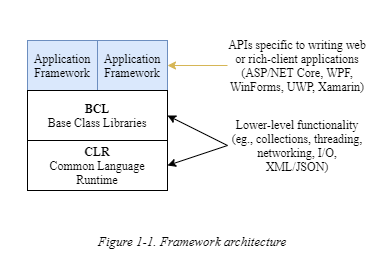
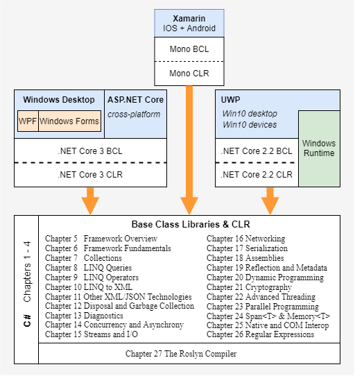

# Introducing C# and .NET Core

C# is a general-purpose, type-safe, object-oriented programming language. The goal of the language is programmer productivity. To this end, C# balances simplicity, expressiveness, and performance. The chief architect of the language since its first version is Anders Hejlsberg (creator of Turbo Pascal and architect of Delphi). The C# language is platform neutral and works with a range of platform-specific frameworks.

## Object Orientation

C# is a rich implementation of the object-orientation paradigm, which
includes *encapsulation*, *inheritance*, and *polymorphism*.
Encapsulation means creating a boundary around an object to
separate its external (public) behavior from its internal (private)
implementation details. Following are the distinctive features of C#
from an object-oriented perspective:

* Unified type system  
    The fundamental building block in C# is an encapsulated unit of data and functions called a *type*. C# has a *unified type system* in which all types ultimately share a common base type. This means that all types, whether they represent business objects or are primitive types such as numbers, share the same basicfunctionality. For example, an instance of any type can be converted to a string by calling its `ToString` method.

* Classes and interfaces  
    In a traditional object-oriented paradigm, the only kind of type is a class. In C#, there are several other kinds of types, one of which is an *interface*. An interface is like a class that cannot hold data. This means that it can define only *behavior* (and not state), which allows for multiple inheritance as well as a separation between specification and implementation.

* Properties, methods, and events  
    In the pure object-oriented paradigm, all functions are methods. In C#, methods are only one kind of *function member*, which also includes *properties* and *events* (there are others, too). Properties are function members that encapsulate a piece of an object’s state, such as a button’s color or a label’s text. Events are function members that simplify acting on object state changes.

Although C# is primarily an obejct-oriented language, it also borrows from the *functional programming* paradigm; secifically:

* Functions can be treated as values
    Using *delegates*, C# allows functions to be passed as values to and from other functions.

* C# supports patterns for purity  
    Core to functional programming is avoiding the use of variables whose values change, in favor of declarative patterns. C# has key features to help with those patterns, including the ability to write unnamed functions on the fly that "capture" variables (*lambda expressions*), and the ability to perform list or reactive programming via *query expressions*. C# also makes it easy to define read-only fields and properties for writing *immutable* (read-only) types.

## Type Safety

C# is primarily a *type-safe* language, meaning that instances of types can interact only through protocols they define, thereby ensuring each type's internal consistency. For instance, C# prevents you from interacting with a *string* type as though it were an *integer* type.

More specifically, C# supports *static typing*, meaning that the language enforces type safety at *compile time*. This is in addition to type safety being enforced at *runtime*.

Static typing eliminates a large class of errors before a program is even run. It shifts the burden away from runtime unit tests onto the compiler to verify that all the types in a program fit together correctly. This makes large programs much easier to manage, more predictable, and more robust. Furthermore, static typing allows tools such as IntelliSense in Visual Studio to help you write a program, because it knows for a given variable. Such tools can also idetify everywhere in your program that a variable, type , or method is used, allowing for reliable refactoring.

> NOTE  
> C# also allows parts of your code to be dynamically typed via the `dynamic` keyword. However, C# remains a predominantly statically typed language.

C# is also called a *strongly typed language* because its type rules are strictly enforced (whether statically or at runtime). For instance, you cannot call a function that's designed to accept an integer with a floating-point number, unless you first *explicitly* convert the floating-point number to an integer. This helps prevent mistakes.

## Memory Management

C# relies on the runtime to perform automatic memory management.
The Common Language Runtime has a garbage collector that
executes as part of your program, reclaiming memory for objects that
are no longer referenced. This frees programmers from explicitly
deallocating the memory for an object, eliminating the problem of
incorrect pointers encountered in languages such as C++.

C# does not eliminate pointers: it merely makes them unnecessary for
most programming tasks. For performance-critical hotspots and
interoperability, pointers and explicit memory allocation are
permitted in blocks that are marked `unsafe`.

## Platform Support

Historically, C# was used almost entirely for writing code to run on
Windows platforms. However, Microsoft and other companies have
since invested in other platforms:

* The *.NET Core* Framework enables web application development in Linux and macOS (as well as Windows).

* *Xamarin* enables mobile app development for iOS and Android.

* *Blazor* compiles C# to web assembly that can run in a browser.

And on the Windows platform:

* *.NET Core* 3 enables rich-client and web application development
on Windows 7 to 10.

* *Universal Windows Platform* (UWP) supports Windows 10
desktop and devices such as Xbox, Surface Hub, and Hololens.

## C# and the Common Language Runtime

C# depends on a *Common Language Runtime* (CLR), which provides
essential runtime services such as automatic memory management
and exception handling. (The word common refers to the fact that the
same runtime can be shared by other managed programming
languages, such as F#, Visual Basic, and Managed C++.)

C# is called a *managed language* because it compiles source code into managed code, which is represented in *Intermediate Language* (IL). The CLR converts the IL into the native code of the machine, such as X86 or X64, usually just prior to execution. This is referred to as Just-In-Time (JIT) compilation. Ahead-of-time compilation is also available to improve startup time with large assemblies or resource-constrained devices (and to satisfy IOS app store rules when developing with Xamarin).

The container for managed code is called an *assembly*. An assembly contains not only IL, but type information (*metadata*). The presence of metadata allows assemblies to reference types in other assemblies without needing additional files.

> NOTE  
> You can examine and disassemble the contents of an assembly with Microsoft's *ildasm* tool. And with tools such as ILSpy or JetBrains dotPeek, you can go further and decompile the IL to C#. Because IL is higher-level than native machine code, the decompiler can do quite a good job of reconstructing the original C#.

A program can query its own metadata (*reflection*) and even generate new IL at runtime (*Reflection.Emit*)

## Frameworks and Base Class Libraries

A CLR does not ship on its own, but as part of a *framework* that includes a standard set of assemblies. When writing an application, you *target* a particular framework, which means that your application uses and depends on the functionality that the framework provides. Your choice of framework also determines which platforms your application will support.

A framework comproses three layers, as illustrated in Figure 1-1. The
Base Class Libraries (BCL) sit atop the CLR, providing features useful to any kind of application (such as collections, XML/JSON, input/output [I/O]), networking, serialization, and parallel programming). Sitting atop the BCL are *application framework* layers, which provide the APIs for a user interface paradigm (such as  ASP.NET Core for a web application, or Windows Presentation Foundation [WPF] for a rich-client application). A command-line program does not require an application layer.

  
*Figure 1-1. Framework architecture*

When C# was first released in 2000, there was just the Microsoft
.NET Framework. Now there are four major framework choices:

* .NET Core  
    Modern open source framework for writing web and console applications that run on  Windows, Linux, and macOS-and rich-client applications that run on Windows 7 through 10 (with .NET Core 3+). You can install multiple versions of .NET Core side by side, and applications can be *self-contained*, so as not to require a .NET Core installation.

* UWP  
    For writing immersive touch-first applications that run on Windows 10 desktop and devices (Xbox, Surface Hub, and Hololens). UWP apps are sandboxed and ship via the Windows Store. UWP is preinstalled with Windows 10.

* Mono + Xamarin
    Open source framework for writing mobile apps that run on IOS and Android.

* .NET Framework (superseded by .NET Core 3)
    For writing web and rich-client applications that target Windows desktop/server. No major new releases are planned, although Microsoft will continue to support and maintain the current 4.8 release due to the wealth of existing applications. .NET Framework is preinstalled in Windows and supports C# 7.3 and earlier.

Although each of these frameworks differ in their platform support and intended uses, they all expose a similar CLR and BCL.

> NOTE
> You can take advantage of this commonality and write class libraries that work across multiple frameworks-see ".NET Standard" in Chapter 5.

This book focuses on C# and the core functionality of the CLR and BCL, as shown in Figure 1-2. Even though the main emphasis is on .NET Core 3, we also cover some of the Windows Runtime types for UWP apoplications that provide functionality in parallel to the BCL.

  
*Figure 1-2. Topics covered in this book-the application frameworks (swhow in gray(green)) are not covered*

## Legacy and Niche Frameworks

The following frameworks are still available to support older platforms:

* Windows Runtime for Windows 8/8.1 (now UWP)

* Microsoft XNA for game development (now UWP)

* .NET Core 1.x and 2.x (for web and command-line applications only)

There are also the following niche frameworks:

* The .NET Micro Frameworks is for running .NET code on highly resource-constrained embedded devices (under one megabyte).

* Mono (upon which Xamarin sits) also has an application layer to develop cross-platform desktop "Windows Forms" applications on Linux, macOS, and Windows. Not all features are supported or work fully. (Another option for cross-platform user interface [UI] development is *Avalonia*, which is a WPF-inspired library that runs atop .NET Core and .NET Framework.)

* Unity is a game development platform that allows game logic to be scripted with C#.

It's also possible to run managed code within SQL Server. With SQL Server CLR integration, you can write custom functions, stored procedures, and aggregations in C# and then call them from SQL. This works in conjunction with .NET Framework and a special "hosted" CLR that enforces a sandbox to protect the integrity of the SQL Server process.

## Windows Runtime

C# also interoperates with *Windows Runtime* (WinRT) technology. WinRT means two things:

* A language-neutral object-oriented execution interface supported in Windows 8 and above

* A set of libraries baked into Windows 8 and above that support this execution interface

> NOTE  
> Somewhat confusingly, the term *WinRT* has historically been used to mean two more things:
> * The predecessor to UWP; that is, the development platform for writing Store apps for Windows 8/8.1, sometimes called "Metro" or "Modern"
> * The defunct mobile operating system for RISC-based tablets (“Windows RT”) that Microsoft released in 2011

By *execution interface*, we mean a protocol for calling code that's (potentially) written in another language. Microsoft Windows has historically provided a primitive execution interface in the form of low-level C-style function calls comprising the Win32 API.

WinRT is much richer, In part, it is an enhanced version of Component Object Model (COM) that supports .NET, C++, and JavaScript. Unlike Win32, it’s object oriented and has a relatively rich type system. This means that referencing a WinRT library from C# feels much like referencing a .NET library—you might not even be aware that you’re using WinRT.

The WinRT libraries in Windows 10 form an essential part of the UWP platform (UWP relies on both WinRT and .NET Core libraries). If you’re targeting the standard .NET Core platform, referencing the Windows 10 WinRT libraries is optional and can be useful if you need to access Windows 10–specific features not otherwise covered in .NET Core.

The WinRT libraries in Windows 10 support the UWP UI for writing immersive touch-first applications. They also support mobile device– specific features such as sensors, text messaging, and so on (the new functionality of Window 8, 8.1, and 10 has been exposed through WinRT rather than Win32). WinRT libraries also provide file I/O tailored to work well within the UWP sandbox.

What distinguishes WinRT from ordinary COM is that WinRT projects its libraries into a multitude of languages, namely C#, Visual Basic, C++, and JavaScript, so that each language sees WinRT types (almost) as though they were written especially for it. For example, WinRT will adapt capitalization rules to suit the standards of the target language and will even remap some functions and interfaces. WinRT assemblies also ship with rich metadata in .winmd files, which have the same format as .NET assembly files, allowing transparent consumption without special ritual; this is why you might be unaware that you’re using WinRT rather than .NET types, aside from namespace differences. Another clue is that WinRT types are subject to COM-style restrictions; for instance, they offer limited support for inheritance and generics.

In C#, you not only can consume WinRT libraries, you can also write your own (and call them from a JavaScript application).

## A Brief History of C\#

The following is a reverse chronology of the new features in each C# version, for the benefit of readers who are already familiar with an older version of the language.

### What's New in C# 8.0

C# 8.0 ships with *Visual Studio 2019*.

#### INDICES AND RANGES

*Indices and ranges* simplify working with elements or portions of an array (or the low-level types `Span<T>` and `ReadOnlySpan<T>`).

Indices let you refer to elements relative to the *end* of an array by using the `^` operator. `^1` refers to the last element, `^2` refers to the second-to-last element, and so on:

```C#
char[] vowels = new char[] {'a','e','i','o','u'}; 
char lastElement  = vowels[^1]; // 'u' 
char secondToLast = vowels[^2];   //'o'
```

Ranges let you “slice” an array by using the `..` operator:

```C#
char[] firstTwo  = vowels[..2];     // 'a', 'e'
char[] lastThree = vowels[2..];     // 'i', 'o', 'u'
char[] middleOne = vowels[2..3];    // 'i'
char[] lastTwo   = vowels[^2..];    //'o','u'
```

C# implements indexes and ranges with the help of the `Index` and `Range` types:

```C#
Index last = ^1;
Range firstTwoRange = 0..2; 
char[]firstTwo = vowels[firstTwoRange]; //'a','e'
```

You can support indices and ranges in your own classes by defining an indexer with a parameter type of `Index` or `Range`:

```C#
class Sentence
{
    string[] words = "The quick brown fox".Split();

    public string this   [Index index] => words[index];
    public string[] this [Range range] => words[range];
}
```

For more information, see "Indices and Ranges (C# 8)" in Chapter 2.

#### NULL-COALESCING ASSIGNMENT

The `??=` operator assigns a variable only if it's null. Instead of this:

```C#
if (s == null) s = "Hello, world";
```

you can now write this:

```C#
s ??= "Hello, world";
```

#### USING DECLARATIONS

If you omit the brackets and statement block following a `using` statement, it becomes a *using declaration*. The resource is then disposed when execution falls outside the *enclosing* statement block:

```C#
if (File.Exists ("file.txt"))
{
    using var reader = File.OpenText ("file.txt");
    Console.WriteLine (reader.ReadLine());
    ...
}
```

In this case, `reader` will be disposed when execution falls outside the `if` statement block.

#### READONLY MEMBERS

C# 8 lets you apply the `readonly` modifier to a struct's *functions*, ensuring that if the function attempts to modify any field, a compile-time error is generated:

```C#
struct Point
{
    public int X, Y;
    public readonly void ResetX() => X = 0;  // Errpr!
}
```

If a `readonly` function calls a non-readonly function, the compiler generates a warning (and defensively copies the struct to avoid the possibility of a mutation).

#### STATIC LOCAL METHODS

Adding the `static` modifier to a local method prevents it from seeing the local variables and parameters of the enclosing method. This helps to reduce coupling as well as enabling the local method to declare variables as it pleases, without risk of colliding with those in the containing method.

#### DEFAULT INTERFACE MEMBERS

C# 8 lets you add a default implementation to an interface member, making t optional to implement:

```C#
interface ILogger
{
    void Log(string text) => Console.WriteLine(text);
}
```

This means that you can add a member to an interface without breaking implementations. Default implementations must be called explicitly through the interface:

```C#
((ILogger)new Logger()).Log ("message");
```

Interfaces can also define static members (including fields), which can be accessed from code inside default implementations:

```C#
interface ILogger
{
    void Log(string text) => Console.WriteLine(Prefix + text);
    static string Prefox = "";
}
```

or from outside the interface:

```C#
Ilogger.Prefix = "File log:";
```

unless restricted via an accessibility modifier on the static interface member (such as `private`, `protected`, or `internal`). Instance fields are prohibited.

For more details, see “Default Interface Members (C# 8)” in Chapter 3.

### SWITCH EXPRESSIONS

From C# 8, you can use `switch` in the context of an *expression*:

```C#
string cardName = cardNumber switch // assuming cardNumber is an 
int 
{
    13 => "King",
    12 => "Queen",
    11 => "Jack",
    _ => "Pip card"     // equivalent to 'default'
};
```

For more examples, see “switch expressions (C# 8)” in Chapter 2.

#### TUPLE, POSITIONAL, AND PROPERTY PATTERNS

C# 8 supports three new patterns, mostly for the benefit of `switch` statements/expressions (see “Patterns” in Chapter 4). *Tuple patterns* let you switch on multiple values:

```C#
int cardNumber = 12; string value = "spades";
string cardNumber = (cardNumber, suite) switch
{
    (13, "spades") => "king of spades", 
    (13, "clubs") => "King of clubs",
    ...
}
```

Positional patterns allow a similar syntax for objects that expose a deconstructor, and *property patterns* let you match on an object’s properties. You can use all of the patterns both in switches and by the `is` operator. The following example uses a property pattern to test whether `obj` is a string with a length of 4:

```C#
if(obj is string { Length:4 }) ...
```

#### NULLABLE REFERENCE TYPES

Whereas *nullable value types* bring nullability to value types, *nullable reference types* do the opposite and bring (a degree of) *non-nullability* to reference types, with the purpose of helping to avoid `NullReferenceExceptions`. Nullable reference types introduce a level of safety that’s enforced purely by the compiler in the form of warnings or errors when it detects code that’s at risk of generating a `NullReferenceException`.

Nullable reference types can be enabled either at the project level (via the *Nullable* element in the *.csproj* project file) or in code (via the `#nullable` directive). After it’s enabled, the compiler makes non-nullability the default: if you want a reference type to accept nulls, you must apply the `?` suffix to indicate a *nullable reference type*:

```C#
#nullable enable  // Enable nullable reference types from this point on 

string s1 = null; // Generates a compiler warning! (s1 is non-nullable)
string? s2 = null; // OK: s2 is nullable reference type
```

Uninitialized fields also generate a warning (if the type is not marked as nullable), as does dereferencing a nullable reference type, if the compiler thinks a `NullReferenceException` might occur:

```C#
void Foo(string? s) => Console.Write(s.Length);     // Warning (.Length)
```

To remove the warning, you can use the *null-forgiving* operator (`!`):

```C#
void Foo (string? s) => Console.Write(s!.Length);
```

For a full discussion, see "Nullable Reference Types(C# 8)" in Chapter 4.

#### ASYNCHRONOUS STREAMS

Prior to C# 8, you could use yield return to write an iterator, or await to write an asynchronous function. But you couldn’t do both and write an iterator that awaits, yielding elements asynchronously. C# 8 fixes this through the introduction of *asynchronous streams*:

```C#
async IAsyncEnumerable<int> RangeAsync(int start, int count, int delay)
{
    for(int i = start; i < start + count; i++)
    {
        await Task.Delay(delay);
        yield return i;
    }
}
```

The `await` `foreach` statement consumes an asynchronous stream:

```C#
await foreach(var number in RangeAsync(0, 10, 100))
    Console.WriteLine(number);
```

For more information, see “Asynchronous Streams (C# 8)” in Chapter 14.

### What's New in C# 7.x

C# 7 shipped with Visual Studio 2017.

#### C# 7.3

C# 7.3 made minor improvements to existing features, such as enabling use of the equality operators with tuples, improved overload resolution, and the ability to apply attributes to the backing fields of automatic properties:

```C#
[field:NonSerialized]
public int MyProperty { get; set; }
```

C# 7.3 also built on C# 7.2’s advanced low-allocation programming features, with the ability to reassign *ref locals*, no requirement to pin when indexing fixed fields, and field initializer support with `stackalloc`:

```C#
int* pointer  = stackalloc int[] {1, 2, 3};
Span<int> arr = staclalloc [] {1, 2, 3}; 
```

Notice that stack-allocated memory can be assigned directly to a `Span<T>`. We describe spans—and why you would use them—in Chapter 24.

#### C# 7.2

C# 7.2 added a new `private` `protected` modifier (the *intersection* of `internal` and `protected`), the ability to follow named arguments with positional ones when calling methods, and `readonly` structs. A `readonly` struct enforces that all fields are `readonly`, to aid in declaring intent and to allow the compiler more optimization freedom:

```C#
readonly struct Point
{
    public readonly int X, Y;       // X and Y must be readonly
}
```

C# 7.2 also added specialized features to help with micro-optimization and low-allocation programming: see “The in modifier”, “Ref Locals”, and “Ref Returns” in Chapter 2, and “Ref Structs” in Chapter 3.

#### C# 7.1

From C# 7.1, you can omit the type when using the `default` keyword, if the type can be inferred:

```C#
decimal number = default;   // number is decimal
```

C# 7.1 also relaxed the rules for `switch` statements (so that you can pattern-match on generic type parameters), allowed a program’s Main method to be asynchronous, and allowed tuple element names to be inferred:

```C#
var now = DateTime.Now;
var tuple = (now.Hour, now.Minute, now.Second);
```

##### NUMERIC LITERAL IMPROVEMENTS

Numeric literals in C# 7 can include underscores to improve readability. These are called *digit separators* and are ignored by the compiler:

```C#
int million = 1_000_000;
```

*Binary literals* can be specified with the `0b` prefix:

```C#
var b = 0b1010_1011_1100_1101_1110_1111;
```

##### OUT VARIABLES AND DISCARDS


### What's New in C# 6.0

### What's New in C# 5.0

### What's New in C# 4.0

### What's New in C# 3.0

### What's New in C# 2.0
