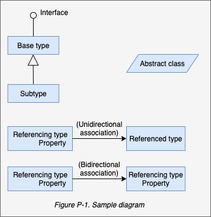

# Preface

C# 8.0 represents the seventh major update to Microsoft's flagship programming language,positioning C# as a language with unusual flexibility and breadth. At one end, it offers high-level abstractions such as query expressions and asynchronous continuations,whereas at the other end, it allows low-level efficiency through constructs such as custom value types and optional pointers.

The price of this growth is that there's more than ever to learn.Although tools such as Microsoft's IntelliSense-and online references-are excellent in helping you on the job,they presume an existing map of conceptual knowledge in a concise and unified style-free if clutter and long introductions.

Like the past five editions, *C# 8.0 in a Nutshell* is organized around concepts and use cases,making it friendly both so sequential reading and to random browsing. It also plumbs significant depths while assuming only basic background knowledge,making it accessible to intermediate as well as advanced readers.

This book covers C#, the Common Language Runtime(CLR), and the essential .NET Core assemblies. We've chosen this focus to allow space for difficult topics such as concurrency, security, and access to operating system functionality-without compromising depth or readability. Features new to C# 8 are flagged so that you can also use this book as a reference for C# 7.

## Intended Audience

This book targets intermediate to advanced audiences. No prior knowledge of C# is required, but some general programming experience is necessary. For the beginner,this book complements, rather than repalces, a tutorial-style introduction to programming.

This book is an ideal companion to any of the vast array of books that focus on an applied technology such as ASP.NET Core,Windows Presentation Foundation(WPF),and Universal Windows Platform(UWP). The areas of the language and .NET Core that such books omit,*C# 8.0 in a Nutshell* covers in detail,and vice versa.

If you're looking for a book that skims every .NET technology,this is not for you. This book is also unsuitable if you want to learn about APIs specific to moblie device development.

## How This Book is Organized

Chapters 2 through 4 concentrate purely on C#, starting with the basics of syntax, types, and variables, and finishing with advanced topics such as unsafe code and preprocessor directives. If you're new to the languague, you should read these chapters sequentially.

The remaining chapters cover essential elements of .NET Core, including such topics as Language-Integrated Query(LINQ), XML,collections, concurrency, I/O and networking, memory management, reflection, dynamic programming, attributes, security, and native interoperability. You can read most of these chapters randomly, except for Chapters 5 and 6, which lay a foundation for subsequent topics. You're also best off reading the three chapters on LINQ in sequence, and some chapters assume some knowledge of concurrency,which we cover in Chapter 14. 

## What You Need to Use This Book

The examples in this book require .NET Core 3. You will also find Microsoft's .NET documentation useful to look up individual types and members(which is available online).

Although it's possible to write source code in Notepad and build your program from the command line, you'll be much more productive with a *code scratchpad* for instantly testing code snippets, plus an *Integrated Development Environment*(IDE) for producing executables and libraries.

For a Windows code scratchpad, download LINQPad 6 from [www.linqpad.net](www.linqpad.net)(free). LINQPad fully supports C# 8.0 and is maintained by one of the authors.

For a Windows IDE, download Visual Studio 2019: any edition is suitable for what's taught in this book. For a cross-platform IDE, download Visual Sutdio Code.

> Note   
> All code listings for all chapters are available as interactive (editable) LINQPad samples. You can download the entire lot in a single click: at the bottom left, click the LINQPad's Samples tab,click "Download more samples", and then choose "C# 8.0 in a Nutshell".  
> .NET Core is avaiable for Windows, Linux, and macOS. Certain cross-platform features were tested on Ubuntu Linux 18.04. That code is available on GitHub.

## Conventions Used in This Book

The book users basic UML notation to illustrate relationships between types, as shown in Figure P-1. A slanted rectangle means an abstract class; a circle means an interface. A line with a hollow triangle denotes inheritance, with the triangle pointing to the base type. A line with an arrow denotes a one-way association; a line without an arrow denotes a two-way association.

The following typographical conventions are used in this book:

*Italic*  
    Indicates new terms, URIs, filenames, and directories

Constant width  
    Indicates C# code, keywords and identifiers, and program output 

**Constant width bold**  
    Shows a highlighted section of code

*Constant with italic*  
    Shows text that should be repalaced with user-supplied values

> Note  
> This element signifies a general note.

## Using Code Examples

This book is here to help you get your job done. In general, you may use the code in this book in your programs and documenttation. You do not need to contact us for permission unless you're reproducung a significant portion of the code. For example, writing a program that uses several chunks of code from this book does not require permission. Selling or distributing examples from O'Reilly books *does* require permission.
6. O'Reilly Online Learning
7. We'd Like To Hear from You
8. Acknowledgments
    1. Joseph Albahari
    2. Eric Johannsen