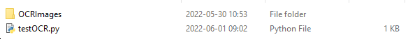
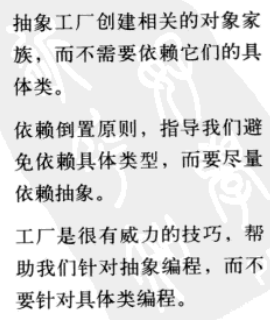

# 简单的截图识别功能

## 背景

有时候我们在看电子书的时候，尤其是不能复制的那种，想做笔记的时候的一个一个的敲，就显得比较麻烦。我在网上找了一下关于一些识别文字的，整理了一份简单的供自己使用的截图识别文字的小程序。

## 准备

1. OCR（optical character recognition）相关
使用google的开源的框架[github tesseract-ocr](https://github.com/tesseract-ocr/tesseract)，都已经弄好了，试了下基本上识别率还行，就先用这个了。
[tesseract-ocr下载地址](https://tesseract-ocr.github.io/tessdoc/Downloads.html)，在下载页面按照自己的系统下载就行了。

安装完可查看，安装的信息

```cmd
    C:\Program Files\Tesseract-OCR>tesseract
    Usage:
    tesseract --help | --help-extra | --version
    tesseract --list-langs
    tesseract imagename outputbase [options...] [configfile...]

    OCR options:
    -l LANG[+LANG]        Specify language(s) used for OCR.
    NOTE: These options must occur before any configfile.

    Single options:
    --help                Show this help message.
    --help-extra          Show extra help for advanced users.
    --version             Show version information.
    --list-langs          List available languages for tesseract engine.

    C:\Program Files\Tesseract-OCR>tesseract --list-langs
    List of available languages in "C:\Program Files\Tesseract-OCR/tessdata/" (4):
    eng
    osd
```

2. OCR 语言包
    OCR中文语言包下载[github语言包](https://github.com/tesseract-ocr/tessdata)

    找到简体中文的两个文件，有想要下载其他语言包的自行下载
    [chi_sim.traineddata](https://raw.githubusercontent.com/tesseract-ocr/tessdata/main/chi_sim.traineddata)
    [chi_sim_vert.traineddata](https://raw.githubusercontent.com/tesseract-ocr/tessdata/main/chi_sim_vert.traineddata)

    将下载好的包放到 `C:\Program Files\Tesseract-OCR\tessdata` 安装 `Tesseract-OCR` 下的 `tessdata` 目录里，在控制台可以再次查看 `tesseract --list-langs`

    ```cmd
    C:\Program Files\Tesseract-OCR>tesseract --list-langs
    List of available languages in "C:\Program Files\Tesseract-OCR/tessdata/" (4):
    chi_sim
    chi_sim_vert
    eng
    osd
    ```

3. python 包

```cmd
    pip install Pillow
    pip install pytesseract
```

> 特别提醒：有报错的话需要调整一个地方
   修改 `pytesseract` （这个是我的包的目录 `F:\Python\Vens\base\Lib\site-packages\pytesseract\pytesseract.py`） 包中 `pytesseract.py` 中 `tesseract_cmd` 的路径到自己安装 `Tesseract-OCR` 的目录，
   `tesseract_cmd = r'C:\Program Files\Tesseract-OCR\tesseract.exe'`

## 代码

```py
from PIL import Image, ImageGrab
import pytesseract

class Languages(object):
    CHS = 'chi_sim'
    ENG = 'eng'

def img_to_str(image_path, lang=Languages.ENG):
    im2 = ImageGrab.grabclipboard()   # 获取截图文件,不要直接使用这个文件，会提示文件格式不正确，先保存成png格式的
    if isinstance(im2, Image.Image):
        im2.save(image_path)

    content = pytesseract.image_to_string(Image.open(image_path), lang) # 获取截图文件
    result = ''
    for x in content:
        result += x.strip(' ')
    return result

print(img_to_str('OCRImages/1.png', lang=Languages.CHS))
```

文件目录：



## 测试

测试图片：



result：

```cmd
(base) F:\Python\code>python testOCR.py
抽象工厂创建相关的对象家
族,而不需要依赖它们的具
体类。

依赖倒置原则,指导我们避
免依赖具体类型,而要尽量
依糊抽象。

工厂是很有姚力的技巧,帮
助我们针对抽象编程,而不
要针对具体类编程。
```

## 后记

如果自己本地用就这样了，要是做是在好一点的可以将这个封装一个API，然后 网页也能调用，客户端也能调用，这样也能用的很广泛。缺点就是这个的识别度还是有些低。
