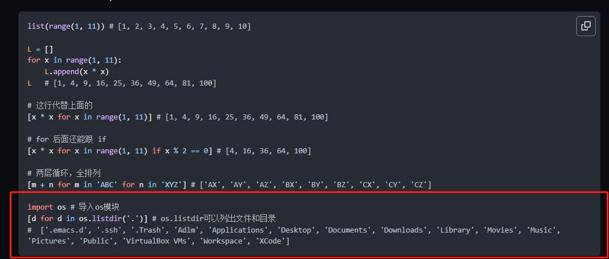

# chrome pre 自动换行

## 问题引出

当我想要使用chrome的打印功能生成一份关于md的pdf版本的时候发现有的代码块没有自动换行，生成的PDF没有自动换行，导致部分信息无法阅读

## 处理方式

* 把有自动换行的部分处理一下，在md文档中换行，(难定位-在md原始文件根本看不出来那个是会产生滚动条，代码块多的话操作难)
* 修改pre的样式，让自动换行

目前采用方式2，看看如何操作

1. 首先定位元素，F12打开开发者工具
看到`pre`的样式如下图，这个很有意思`user agent stylesheet`，我猜是浏览器默认的吧；添加一个置换的样式，点击图中 2 的位置的 `+`

2. 添加换行的样式,两种改法第一种修改如图所示；第二种在通过js修改,控制台输入这行代码`var style1 = document.createElement('style');style1.innerHTML = 'pre{white-space:pre-wrap;}';document.head.appendChild(style1);`

3. 看看效果

## `user agent stylesheet`

[ser agent stylesheet](https://www.w3.org/TR/CSS21/cascade.html#cascade) 官网说明
类似默认样式，用户可以写样式顶掉
