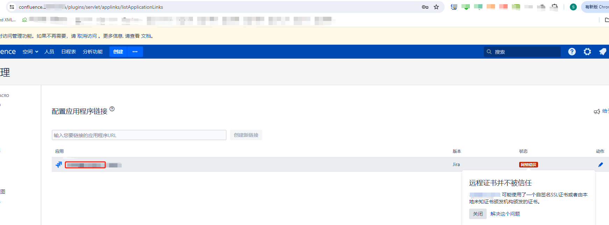

# 服务器更换证书后jira无法访问Confluence处理

## 问题

jira 和 Confluence是用docker搭在一台服务器上的，更换证书后jira无法访问Confluence, 如果所示(jira的忘截图了，这个是Confluence的一样的报错)



原因：因为Java环境（Jira运行在Java上）不信任你的证书，尤其是如果它是自签名的或由不在Java默认信任的CA列表中的CA签发的。

## 解决办法

当你在Docker部署的Jira中配置连接到Confluence的链接时遇到SSL证书问题，即使浏览器认为证书是有效的，仍可能会出现证书错误。这通常是因为Java环境（Jira运行在Java上）不信任你的证书，尤其是如果它是自签名的或由不在Java默认信任的CA列表中的CA签发的。解决这种问题，你可以通过以下步骤来手动将Confluence的证书添加到Jira Docker容器的Java信任存储中：

### 1. 从Confluence服务器导出证书

首先，你需要从Confluence服务器上导出SSL证书。这可以通过使用`openssl`命令从命令行完成：

```bash
openssl s_client -connect your-confluence-domain.com:443 -showcerts </dev/null 2>/dev/null | openssl x509 -outform PEM > confluence_cert.pem
```

将`your-confluence-domain.com`替换为你的Confluence实际的域名。

### 2. 将证书添加到Jira Docker容器的Java信任存储

然后，你需要将导出的证书添加到运行Jira的Docker容器中Java的信任存储库。首先，你需要找到Jira容器的ID或名称：

```bash
docker ps
```

接着，将证书复制到Docker容器中：

```bash
docker cp confluence_cert.pem <container_id>:/tmp
```

使用容器的ID或名称替换`<container_id>`。

接下来，进入容器：

```bash
docker exec -it <container_id> /bin/bash
```

一旦进入容器，使用`keytool`命令将证书导入到Java的信任存储：

```bash
keytool -import -alias confluenceCert -keystore $JAVA_HOME/lib/security/cacerts -file /tmp/confluence_cert.pem -storepass changeit
```

这里`changeit`是默认的密钥库密码，如果你更改了，需要使用你的密码。

### 3. 重启Jira容器

完成后，退出容器并重启Jira容器以使更改生效：

```bash
docker restart <container_id>
```

### 4. 测试连接

重新启动后，再次尝试配置Jira和Confluence的集成，以检查证书问题是否已解决。

这些步骤应该帮助你解决Jira连接到Confluence时遇到的SSL证书错误。如果问题仍然存在，确保你导出的是正确的证书，并且正确地添加到了Java的信任存储库中。
