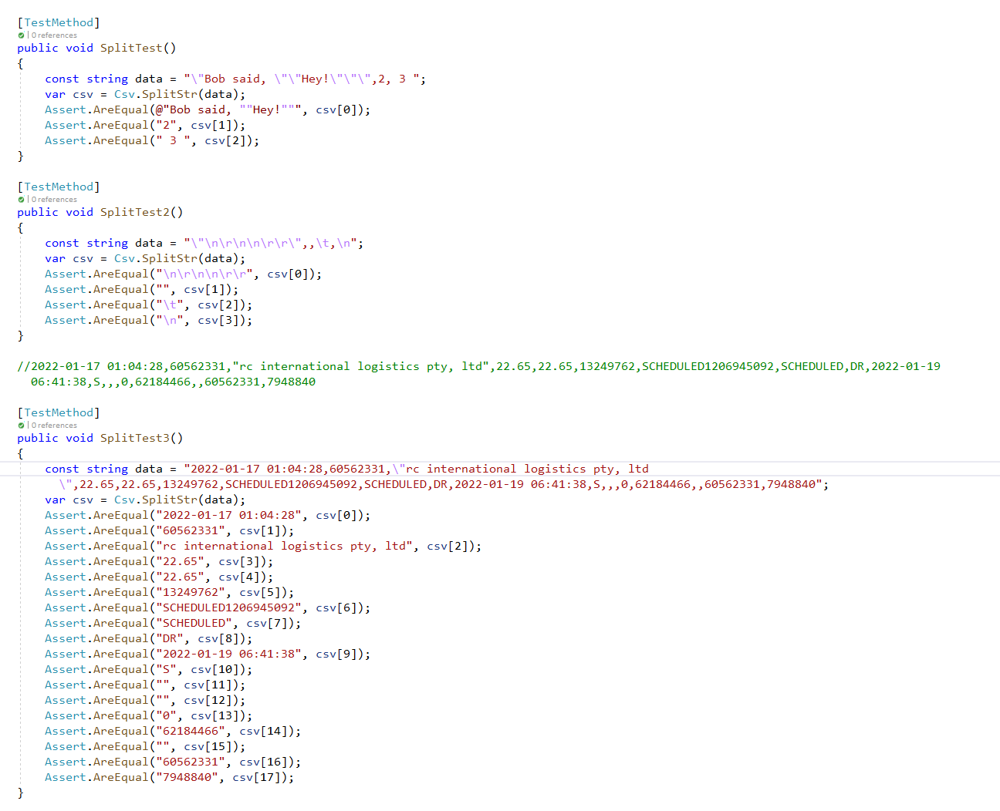

# C# CSV 双引号处理

直接上代码，自己写的，有问题可以随时联系

```C#
// 没有保证所有的都能对上，目前只处理了自己所遇见的格式
public static string[] SplitStr(string strdata)
{
    if (!strdata.Contains("\"")) // 不包含 双引号 直接返回 split数组
        return strdata.Split(',');

    ArrayList cells = new ArrayList();
    string str = "";
    bool flag = false; // 双引号开始标记
    for (int i = 0; i < strdata.Length; i++)
    {
        char ch = strdata[i];
        if (ch == ',')
        {
            if (i + 1 < strdata.Length && strdata[i + 1] == ',') // 处理为空的情况
            {
                cells.Add(str);
                str = "";
            }
            else if (!flag) // 如果没有双引号开始标记，就是一列的结束
            {
                cells.Add(str);
                str = "";
            }
            else
                str += ch;
        }
        else if (ch == '\"')
        {
            if (i + 1 < strdata.Length)
            {
                if (strdata[i + 1] == '"') // 字段内部的双引号
                {
                    // 
                    i++;
                    str += "\"";
                }
                else if (strdata[i + 1] == ',') // 后面是逗号要结尾了
                {
                    flag = !flag;
                }
                else
                {
                    flag = !flag;
                }
            }
        }
        else
        {
            str += ch;
        }
    }
    cells.Add(str); // 最后一个数据
    return (string[])cells.ToArray(typeof(string));
}
```

测试代码：

```C#
[TestMethod]
public void SplitTest()
{
    const string data = "\"Bob said, \"\"Hey!\"\"\",2, 3 ";
    var csv = Csv.SplitStr(data);
    Assert.AreEqual(@"Bob said, ""Hey!""", csv[0]);
    Assert.AreEqual("2", csv[1]);
    Assert.AreEqual(" 3 ", csv[2]);
}

[TestMethod]
public void SplitTest2()
{
    const string data = "\"\n\r\n\n\r\r\",,\t,\n";
    var csv = Csv.SplitStr(data);
    Assert.AreEqual("\n\r\n\n\r\r", csv[0]);
    Assert.AreEqual("", csv[1]);
    Assert.AreEqual("\t", csv[2]);
    Assert.AreEqual("\n", csv[3]);
}

//2022-01-17 01:04:28,60562331,"rc international logistics pty, ltd",22.65,22.65,13249762,SCHEDULED1206945092,SCHEDULED,DR,2022-01-19 06:41:38,S,,,0,62184466,,60562331,7948840

[TestMethod]
public void SplitTest3()
{
    const string data = "2022-01-17 01:04:28,60562331,\"rc international logistics pty, ltd\",22.65,22.65,13249762,SCHEDULED1206945092,SCHEDULED,DR,2022-01-19 06:41:38,S,,,0,62184466,,60562331,7948840";
    var csv = Csv.SplitStr(data);
    Assert.AreEqual("2022-01-17 01:04:28", csv[0]);
    Assert.AreEqual("60562331", csv[1]);
    Assert.AreEqual("rc international logistics pty, ltd", csv[2]);
    Assert.AreEqual("22.65", csv[3]);
    Assert.AreEqual("22.65", csv[4]);
    Assert.AreEqual("13249762", csv[5]);
    Assert.AreEqual("SCHEDULED1206945092", csv[6]);
    Assert.AreEqual("SCHEDULED", csv[7]);
    Assert.AreEqual("DR", csv[8]);
    Assert.AreEqual("2022-01-19 06:41:38", csv[9]);
    Assert.AreEqual("S", csv[10]);
    Assert.AreEqual("", csv[11]);
    Assert.AreEqual("", csv[12]);
    Assert.AreEqual("0", csv[13]);
    Assert.AreEqual("62184466", csv[14]);
    Assert.AreEqual("", csv[15]);
    Assert.AreEqual("60562331", csv[16]);
    Assert.AreEqual("7948840", csv[17]);
}
```

测试结果截图：




其他参考
[https://www.codeproject.com/Articles/9258/A-Fast-CSV-Reader](https://www.codeproject.com/Articles/9258/A-Fast-CSV-Reader)