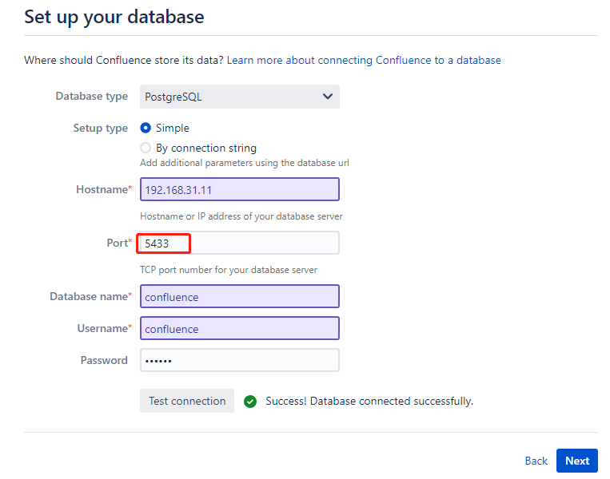
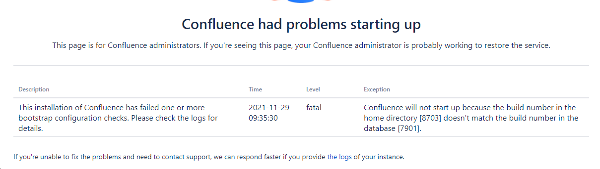

# Confluence 挖矿病毒 升级现有系统

## 背景

   服务器很多服务都很卡，通过检查发现是一起运行的confluence异常，被挖矿病毒挖矿，[华为云](https://www.huaweicloud.com/notice/2021/20210826160403127.html)和[官网](https://confluence.atlassian.com/doc/confluence-security-advisory-2021-08-25-1077906215.html)也有说明。 知道问题之后，处理方式就是将现有的问题版本升级成安全版本(可在官网查看安全版本)，我们选择的是Atlassian Confluence Server/Data Center 7.13.0，由于之前只是使用，这个confluence之前搭建的大神已经离职了，所以让我重新整，中间经历了不少，也学了不少东西，在此记录一下。

   说明：现有的环境都是在Linux的 docker 部署的，我在升级的时候也对docker 有了更深的了解，之前也就是知道一丢丢。

## 场景复现

   由于现在用的数据也还蛮多，蛮重要，又不知道在升级过程会遇到啥情况，所以我处理的第一步是在自己的电脑上还原场景，然后在本地进行升级测试，然后再到现有环境操作的。

### 本地搭建问题版本

   1、获取镜像
      有三个镜像需要获取，通用的数据库 postgres(11.2是因为现有的就用的这个，其实不用这个版本的也没事用最新的)；问题版本confluence：（cptactionhank/atlassian-confluence:6.14.0）；安全版本（atlassian/confluence-server:7.13）

   ```bash
   docker pull postgres:11.2
   docker pull cptactionhank/atlassian-confluence:6.14.0
   docker pull atlassian/confluence-server:7.13
   ```

   2、环境部署安装

   2.1 部署postgres

   ```bash
[root@localhost ~] mkdir /d/dockerData/sqlData # 在系统根目录创建存储数据的目录
[root@localhost ~] docker run --name postgres -e POSTGRES_PASSWORD=123456 --restart always --publish 5432:5432 -v /d/dockerData/sqlData:/var/lib/postgresql/data -d postgres:11.2 # 让 postgres 跑起来，注意-e POSTGRES_PASSWORD=123456 这个是必须的
[root@localhost ~] docker exec -it postgres bash  # 进入 postgres 容器，也就是postgres运行的实体
root@fb7aaeb61067:/ su postgres  # 进入后就这样了，切换到 postgres 用户
postgres@fb7aaeb61067:/ psql       # 进入 postgres 

postgres= create user confluence WITH PASSWORD '123456';  # 创建 confluence 用户
CREATE ROLE
postgres= CREATE DATABASE "confluence" WITH OWNER = "confluence"; # 创建 confluence 要用的数据库，到这儿数据库就准备完成了
CREATE DATABASE
postgres= exit  # 退出数据库
postgres@fb7aaeb61067:/$ exit # 退出当前用户
root@fb7aaeb61067:/ exit      # 退出容器
[root@localhost ~] 
```

   2.2 部署 confluence

   ```bash
[root@localhost ~] mkdir /d/dockerData/confluence/data # 在系统根目录创建存储数据的目录
[root@localhost ~] docker run --name confluence --detach --publish 8090:8090 --publish 8091:8091 --restart always -v /d/dockerData/confluence/data:/var/atlassian/confluence cptactionhankuence:6.14.0 # 让问题版本的confluence跑起来
   ```

   在浏览器访问confluence，`http://{ip}:8090/`替换自己的ip地址
   > note: 如果报错，需要读写权限，执行授权命令即可：`chmod -R 777 /d/dockerData/confluence` 然后重启 confluence `docker restart confluence`

   想要破解，参看这片文章[Confluence破解](https://blog.csdn.net/cojn52/article/details/109094433)，别人写过的不想再写了；需要注意的是告诉你们怎么找到对应的文件，其他就按照上面的那个做吧。需要出一期的话，可以评论一下。

   1、查看confluence的运行目录
      使用命令查看当前confluence的一些基本信息，`docker inspect confluence`,我们要用到的如下图所示，
      这几个目录其中`MergedDir(/var/lib/docker/overlay2/b6001125fefd698e3c370f86f87f7b7f6d055eb740445008f08abd7bab3ad5e1/merged)`这个只有当confluence处于运行状态的时候才会存在，如果你进去没有看到很正常。

   ```json
"GraphDriver": {
            "Data": {
                "LowerDir": "/var/lib/docker/overlay2/b6001125fefd698e3c370f86f87f7b7f6d055eb740445008f08abd7bab3ad5e1-init/diff:/var/lib/docker/overlay2/b9962167cb303ddb46e738e69d4d972c7d0da6b7c2e74c25213571d198114a25/diff:/var/lib/docker/overlay2/e843d64b208f0c4c6ba5ee1a3ddbc5af6c7dad20b9e7b566a6c79299cb740cc0/diff:/var/lib/docker/overlay2/361252f1ae37a2f894074bb49f4ab21651526689fa31bc7cd355261475a12e4c/diff:/var/lib/docker/overlay2/28ecaf8ef11d78bfc006d0f5dacedf5e1e036726cf5b6c6466f55bd6de12dc23/diff:/var/lib/docker/overlay2/9012db03194ab642501ec18df815f070033999f936a76255dc5e317d029daf6f/diff",
                "MergedDir": "/var/lib/docker/overlay2/b6001125fefd698e3c370f86f87f7b7f6d055eb740445008f08abd7bab3ad5e1/merged",
                "UpperDir": "/var/lib/docker/overlay2/b6001125fefd698e3c370f86f87f7b7f6d055eb740445008f08abd7bab3ad5e1/diff",
                "WorkDir": "/var/lib/docker/overlay2/b6001125fefd698e3c370f86f87f7b7f6d055eb740445008f08abd7bab3ad5e1/work"
            },
            "Name": "overlay2"
   ```

   2、 查找对应的目录，主要是为了找到文件，后续需要copy来copy去的
     比如 `/opt/atlassian/confluence/confluence/WEB-INF/lib/atlassian-extras-decoder-v2-3.4.1.jar`对应的是这个目录下的文件`/var/lib/docker/overlay2/b6001125fefd698e3c370f86f87f7b7f6d055eb740445008f08abd7bab3ad5e1/merged/opt/atlassian/confluence/confluence/WEB-INF/lib/atlassian-extras-decoder-v2-3.4.1.jar`

至此，两个环境就复现了，我们去操作一下，弄一点数据，包括上传附件啥的，后面可以进行迁移测试。

## 迁移

刚开始想了好几个方案，都试了一遍，失败了好几次，我这儿直接开始我最后成功的这个方案吧。

方案：新建一个安全版本的 confluence，然后将数据库链接改到老的数据库上面去。下面我们讲一下详细的过程！

1、创建初始化要用的数据库postgres
   因为新建的如果链接老的，它会提示要重写数据库，重写可不就完蛋了，这儿我们临时建一个postgres数据库备用

   ```bash
   [root@localhost ~] docker run --name postgresnew -e POSTGRES_PASSWORD=123 --restart always --publish 5433:5432 -d postgres:11.2 # 运行一个新的 postgres 名字叫 postgresnew
   [root@localhost ~] docker exec -it postgresnew bash  # 进入 postgres 容器，也就是postgres运行的实体
   root@72c46c58b2a8:/ su postgres
   postgres@72c46c58b2a8:/ psql
   postgres= create user confluence WITH PASSWORD '123456';  # 创建 confluence 用户
   CREATE ROLE
   postgres= CREATE DATABASE "confluence" WITH OWNER = "confluence"; # 创建 confluence 要用的数据库，到这儿数据库就准备完成了
   CREATE DATABASE
   postgres= exit                # 退出数据库
   postgres@72c46c58b2a8:/$ exit # 退出当前用户
   root@72c46c58b2a8:/ exit      # 退出容器
   [root@localhost ~] 
   ```

   > 注意这里将新的端口映射到了 `5433`，另外没有指定 `-v` 参数，就是用docker 自己内部的存储数据了(也在你的机器上，查找方法和上面破解的方法一样)

2、 搭建新的安全版本的 Confluence 7.13

```bash
[root@localhost ~] docker stop confluence   # 停掉旧的
[root@localhost ~] mkdir -p /d/dockerData/confluenceNew/data # 创建存储新的
[root@localhost ~] docker run --name confluenceNew --detach --publish 8090:8090 --publish 8091:8091 --restart always -v /d/dockerData/confluenceNew/data:/var/atlassian/application-data/confluence atlassian/confluence-server:7.13 # 跑一个安全版本的confluence，这里要注意前后两个版本运行数据的目录 application-data
[root@localhost ~] docker cp /d/atlassian-agent.jar confluenceNew:/opt/atlassian/confluence/   # 拷贝一个代理的jar包 破解用的，参见 https://gitee.com/pengzhile/atlassian-agent
[root@localhost ~] docker exec -it confluenceNew bash  # 进入 新的confluence 
root@6ad1c13b2ea6:/var/atlassian/application-data/confluence echo -e '\nexport CATALINA_OPTS="-javaagent:/opt/atlassian/confluence/atlassian-agent.jar ${CATALINA_OPTS}"' >> /opt/atlassian/confluence/bin/setenv.sh  # 在confluence配置里面设置从这个代理启动，这个是看了后面链接里的一个破解的文档，我看它自己打包了一个，里面有一句这个，我搜索和琢磨了一下，应该是要修改这个文件，结果发现自己的想法是真确的，然后这个让我对 docker file 也有了一些基本的认知
root@6ad1c13b2ea6:/var/atlassian/application-data/confluence exit  # 退出 confluenceNew
[root@localhost ~] docker restart confluenceNew
[root@localhost ~] java -jar /d/atlassian-agent.jar -d -m test@qq.com -n confluence -p conf -o http://192.168.31.11 -s B4Y8-H71P-VBXN-TBFK # 输入这个可以得到一个密钥，用它开启
```

访问confluence，`http://{ip}:8090/`替换自己的ip地址，
密钥用上面生成的，然后数据库配置需要特别注意，的用那个临时的数据库(我这儿只是端口不一样，其他和那个一模一样就是为了后面改的少)，如图：



点击直到 新的 confluence 完成。

删除atlassian-agent.jar
`rm -rf /d/atlassian-agent.jar`

3、 迁移(数据库+confluence附件)

修改新的数据库连接 `/d/dockerData/confluenceNew/data/confluence.cfg.xml`

```bash
vim /d/dockerData/confluenceNew/data/confluence.cfg.xml

#  <property name="hibernate.connection.url">jdbc:postgresql://192.168.31.11:5433/confluence</property>
# 修改这行的 5433 为 5432 就 OK 了；因为建的临时数据库，高保真呀，所以改的少

[root@localhost ~] docker restart confluenceNew # 重启 confluenceNew
```

我们重新访问新的confluence，`http://{ip}:8090/`替换自己的ip地址，我们会发现报错了

Description|Time|Level|Exception
--|--|--|--
This installation of Confluence has failed one or more bootstrap configuration checks. Please check the logs for details.|2021-11-29 09:35:30|fatal|Confluence will not start up because the build number in the home directory [8703] doesn't match the build number in the database [7901].

如图：



**处理方式**: 千万记得改配置文件里面的 build number 不要更改数据库里面的，要不然会有其他问题。

```bash
vi /d/dockerData/confluenceNew/data/confluence.cfg.xml
#  <buildNumber>8703</buildNumber>
# 修改这个 8703 为 7901 就 OK 了；
[root@localhost ~] docker restart confluenceNew # 重启 confluenceNew

[root@localhost ~] docker stop postgresnew # 停止临时的 postgres，没用了
[root@localhost ~] docker container rm postgresnew  # 删除临时的 postgres
[root@localhost ~] docker volume prune     # 清空刚删除的 卷，省空间

[root@localhost ~] rm -rf /d/dockerData/confluenceNew/data/attachments # 删除新的里面的附件文件夹，没有的话可以不处理
[root@localhost ~] mv /d/dockerData/confluence/data/attachments /d/dockerData/confluenceNew/data/ # 老系统的附件移到新系统
[root@localhost ~] cd /d/dockerData/confluenceNew/data/
[root@localhost data] ls -lh   # 列出文件，就能看出有个猫腻， 有个 daemon 
total 84K
drwxr-x---. 2   2002   2002  214 Nov 29 07:26 analytics-logs
drwxr-x---. 3 daemon daemon   20 Nov 29 00:54 attachments  # 就是这行，我们的处理一下才能让附件正常
drwxr-x---. 2   2002   2002    6 Nov 29 04:22 backups
drwxr-x---. 2   2002   2002    6 Nov 29 04:20 bundled-plugins
-rw-r-----. 1   2002   2002 5.8K Nov 29 07:27 confluence.cfg.xml
-rw-r--r--. 1   2002   2002    1 Nov 29 07:23 docker-app.pid
drwxr-x---. 2   2002   2002    6 Nov 29 04:21 imgEffects
drwxr-x---. 5   2002   2002 4.0K Nov 29 07:27 index
drwxr-x---. 2   2002   2002   62 Nov 29 07:07 journal
-rw-r-----. 1   2002   2002    0 Nov 29 04:20 lock
drwxr-x---. 3   2002   2002   19 Nov 29 04:24 log
drwxr-x---. 2   2002   2002 4.0K Nov 29 04:01 logs
drwxr-x---. 2   2002   2002 4.0K Nov 29 07:24 plugins-cache
drwxr-x---. 5   2002   2002   71 Nov 29 04:20 plugins-osgi-cache
drwxr-x---. 2   2002   2002    6 Nov 29 04:20 plugins-temp
drwxr-x---. 2   2002   2002  107 Nov 29 07:06 recovery
drwxr-x---. 3   2002   2002   46 Nov 29 04:24 shared-home
-rw-r-----. 1   2002   2002  450 Nov 29 04:24 synchrony-args.properties
drwxr-x---. 2   2002   2002    6 Nov 29 04:31 temp
drwxr-x---. 3   2002   2002   18 Nov 29 04:23 viewfile
drwxr-x---. 2   2002   2002  36K Nov 29 07:36 webresource-temp

[root@localhost data]  chown -R 2002:2002 attachments # 这样子就OK了
```

访问 confluence，一切应该都正常了。

## 其他问题

1、 空间目录里面看不到全部的空间
   解决方法： 一般配置->内容索引 （重建索引就OK了）

2、 更改域名配置后重启被修改
   解决办法： 参考[官网的文章server-xml-is-overwritten-by-Dockerfile](https://community.atlassian.com/t5/Jira-Software-questions/server-xml-is-overwritten-by-Dockerfile/qaq-p/1173279)

   我的操作备份一份模板文件，然后在原来的模板文件里面改的

   ```bash
   [root@localhost attachments] docker exec -it confluenceNew bash
   root@6ad1c13b2ea6:/var/atlassian/application-data/confluence cd /opt/atlassian/etc
   root@6ad1c13b2ea6:/opt/atlassian/etc ls -lh
   total 20K
   -rw-rw-rw-. 1 root root 4.8K Nov 13 16:15 confluence.cfg.xml.j2
   -rw-rw-rw-. 1 root root   82 Nov 13 16:15 confluence-init.properties.j2
   -rw-rw-rw-. 1 root root 3.1K Nov 13 16:15 seraph-config.xml.j2
   -rw-rw-rw-. 1 root root 3.4K Nov 13 16:15 server.xml.j2  # 就是这个文件，copy一份修改就行了，找不到文件记得看第一个破解的那儿会有介绍怎么找对应的docker存在本地的文件
   ```

## 总结

一开始的思路还是没有想明白，最后搞定了之后感觉刚开始有点傻了，不过这个过程中也是学到了很多，中途补了linux的一些知识，再加上 docker 的一些东西，真的是收获良多。

## 参考链接

[Confluence破解](https://blog.csdn.net/cojn52/article/details/109094433)
[Docker 部署 Confluence(破解版)](https://www.cnblogs.com/sanduzxcvbnm/p/13809276.html)
[docker confluence挖矿病毒处理及版本升级](https://blog.csdn.net/qq_41411704/article/details/120286617)
