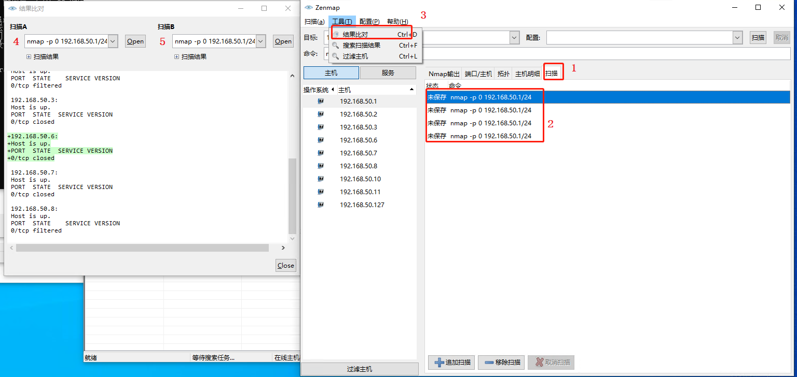

# 一台在手边没有显示器可用的电脑找IP记录

## 问题

老大给我一台服务器(在我前面的工位)让我自己玩，但是不知道IP地址，我本来想用自己的显示器连上，结果两个DHMI口试过都没反应，不知道ip地址就没法连上，怎么玩呀，经过我的一番努力，最终我知道了它的IP地址，记录一下

## 准备工作

* 一台正常的笔记本电脑
* 一款能扫描局域网主机的软件，我这里推荐[Nmap](https://nmap.org/),局域网查看工具(Lansee)
* wifi和网线的局域网能互通 或者 你还有一根能上网网线

## Nmap使用介绍

Nmap是渗透测试中最重要的神器之一。通过nmap扫描可以知道当前主机或者服务器开启了那些端口。通过开启的端口，便可进行下一步的渗透测试。当然，利用nmap可以扫面当前局域网中在线的设备。分析局域网中设备的安全性。

1. [官网下载Click me](https://nmap.org/download.html)

    

2. 安装。简单暴力 下一步下一步

3. 查询主机，如图输入命令 `nmap -p0 192.168.50.1`(这个 无 ping 扫描命令，如果感兴趣可自行学习其他命令)，点击扫描就可以看到结果

    

4. 结果比对功能使用，如图 选中1 之后会看到2最近扫描的操作，在菜单栏找到3的选项，点击之后会有一个结果对比的工具，分别在 4 和 5 选择想要对比的结果，那个下拉的可以选择 2 哪里显示的

    

## 开始

1. 确认网段，先在笔记本电脑上插网线，找到笔记本电脑的网络配置(最重要的是网关地址，这个是命令 nmap 里面的地址信息)，如图

    

2. 笔记本连着WiFi，将网线拔掉，使用安装好的 Nmap 执行一下扫描命令 `nmap -p0 192.168.50.1`

3. 网线插在没有显示器的服务器上，笔记本上再次执行一下扫描命令 `nmap -p0 192.168.50.1`

4. 对比 2 和 3 之间的结果，发现多的那个 IP 就是 那台没有显示器的主机的IP

## 总结

  解决思路：既然都能联网，那肯定能通过某种途径查到所有的主机，上网搜索了一些软件，最后发现这个好用的 Nmap ，再想怎么找到这台服务器，比较联网不联网的查找结果，最后确定了IP地址。
  最后，遇到问题不要怕，想好方法一步一步解决。
