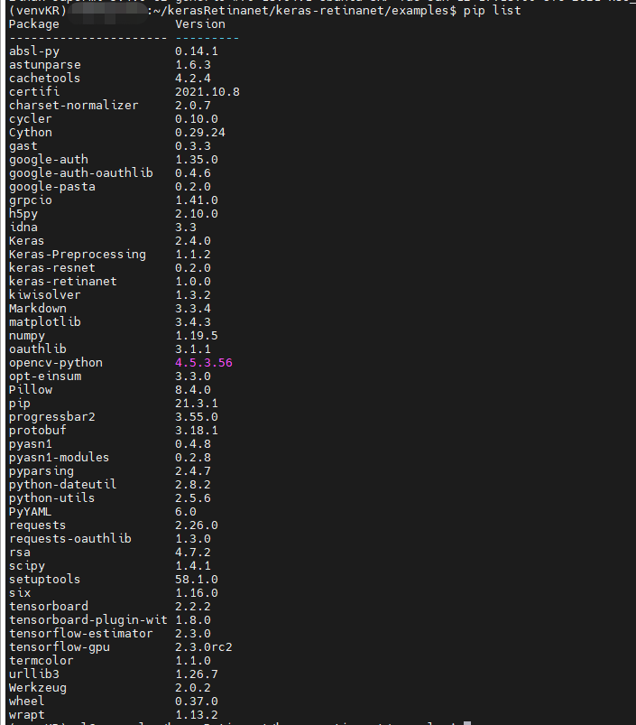
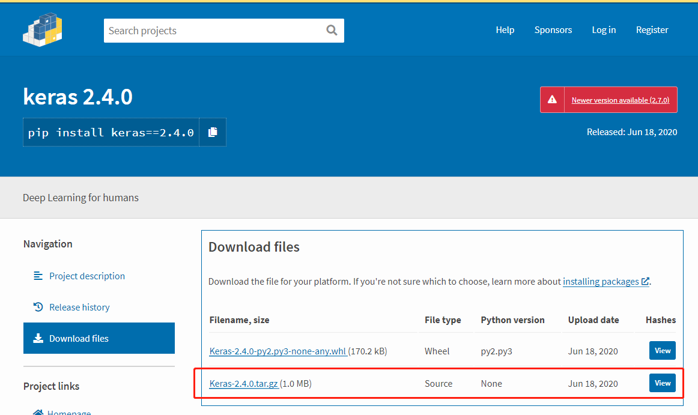
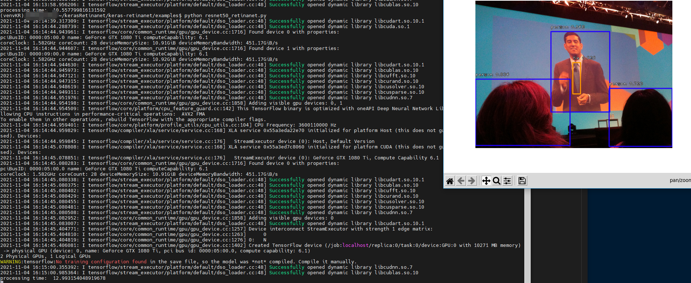

# keras-retinanet 环境搭建 tensorflow2.3

## 前言

搭建好了 [tensorflow-gpu 2.5] 之后，接到一个指示，跑起来这个开源的库[keras-retinanet](https://github.com/fizyr/keras-retinanet)
查看了这个github上的消息，完蛋 tensorflow 版本高了
>This repository is deprecated in favor of the torchvision module. This project should work with keras 2.4 and tensorflow 2.3.0, newer versions might break support. For more information, check here.

## 环境准备

重新 搭建 tensorflow 2.3(特别提醒，不能高于2.3.0;2.3.1 都不行，会报错，已经试过了)，在 Linux 的操作系统。具体安装 可参见[tensorflow-gpu 2.5](https://www.cnblogs.com/fhlsteven/p/15385842.html) 安装，具体的需求都一样，下载固定的包就行了。

* 显卡软件对应版本，看这里[tensorflow-gpu](https://www.tensorflow.org/install/source#linux)，我再列一下吧。

|版本|Python版本|编译器|构建工具|cuDNN|CUDA|
|---|---|---|---|---|---|
|tensorflow-2.6.0|3.6-3.9|GCC 7.3.1|Bazel 3.7.2|8.1|11.2|
|tensorflow-2.5.0|3.6-3.9|GCC 7.3.1|Bazel 3.7.2|8.1|11.2|
|tensorflow-2.4.0|3.6-3.8|GCC 7.3.1|Bazel 3.1.0|8.0|11.0|
|**tensorflow-2.3.0**|**3.5-3.8**|**GCC 7.3.1**|**Bazel 3.1.0**|**7.6**|**10.1**|
|tensorflow-2.2.0|3.5-3.8|GCC 7.3.1|Bazel 2.0.0|7.6|10.1|

* 系统信息：`uname -a # Linux superml 5.4.0-62-generic #70~18.04.1-Ubuntu SMP Tue Jan 12 17:18:00 UTC 2021 x86_64 x86_64 x86_64 GNU/Linux`

* 显卡信息：

```cmd
nvidia-smi
Thu Nov  4 16:15:01 2021
+-----------------------------------------------------------------------------+
| NVIDIA-SMI 450.80.02    Driver Version: 450.80.02    CUDA Version: 11.0     |
|-------------------------------+----------------------+----------------------+
| GPU  Name        Persistence-M| Bus-Id        Disp.A | Volatile Uncorr. ECC |
| Fan  Temp  Perf  Pwr:Usage/Cap|         Memory-Usage | GPU-Util  Compute M. |
|                               |                      |               MIG M. |
|===============================+======================+======================|
|   0  GeForce GTX 108...  Off  | 00000000:05:00.0 Off |                  N/A |
|  0%   48C    P2   154W / 250W |   8631MiB / 11176MiB |     86%      Default |
|                               |                      |                  N/A |
+-------------------------------+----------------------+----------------------+
|   1  GeForce GTX 108...  Off  | 00000000:09:00.0 Off |                  N/A |
|  0%   38C    P5    11W / 250W |      2MiB / 11178MiB |      0%      Default |
|                               |                      |                  N/A |
+-------------------------------+----------------------+----------------------+

+-----------------------------------------------------------------------------+
| Processes:                                                                  |
|  GPU   GI   CI        PID   Type   Process name                  GPU Memory |
|        ID   ID                                                   Usage      |
|=============================================================================|
|    0   N/A  N/A     24350      C   python                           8629MiB |
+-----------------------------------------------------------------------------+
```

## keras-retinanet 环境搭建

1. 创建python的虚拟环境(不用的可以跳过)
   用的 `virtualenv`管理虚拟环境的

   ```cmd
    pip install virtualenv  # 直接 pip 安装包,安装完了才能创建虚拟环境

    virtualenv {name}       # 创建虚拟环境
    source {name}/bin/activate # linux 激活环境,windwos cmd命令下到 {name}/Scripts 文件夹下执行 active [F:\Python\Vens\{name}\Scripts>activate]
   ```

2. 安装相应的包

主要列一下需要安装的包吧，我都是自己下载的，然后 pip 安装的；记得如果使用虚拟环境的激活安装哦
安装的包

**遇到的问题**
安装 keras 2.4 的时候一直提示我tensorflow没有安装，坑的很，然后我去官网上下载的源码安装的，把里面的 tensorflow 的要求取消了。

源码下载如下操作 [Click](https://pypi.org/project/keras/2.4.0/#files)


修改源码文件 `setup.py`，改完效果大概如下

```py
license='MIT',
install_requires=['scipy>=0.14',
                'pyyaml',
                'h5py'],
```

## 最终效果图

记得下载模型哦，github里面有的([链接](https://github.com/fizyr/keras-retinanet/releases)), 放哪儿可以去看这个源码` resnet50_retinanet.py`

`(venvKR) :~/kerasRetinanet/keras-retinanet/examples$ python resnet50_retinanet.py`

最终运行的效果图，环境搭好不容易


大家加油
