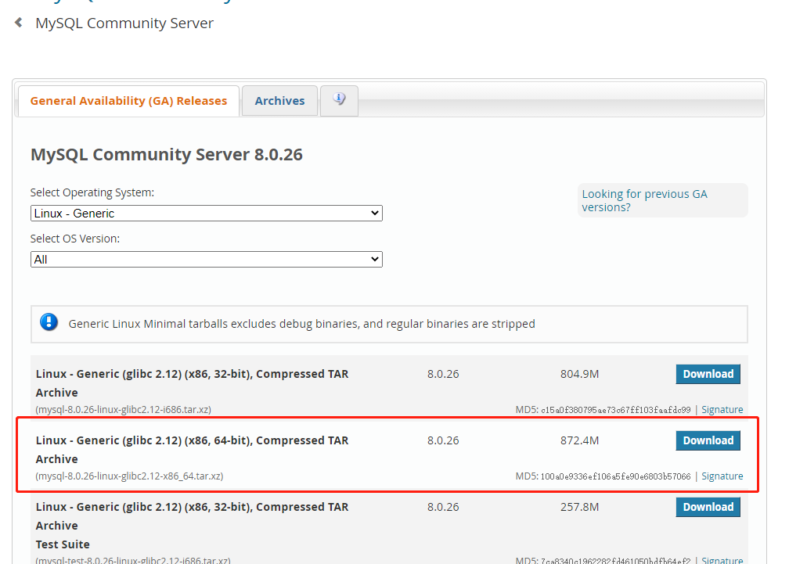

数据库 版本 

Server version: 8.0.26 MySQL Community Server - GPL；[官网下载的](https://dev.mysql.com/downloads/mysql/) 

```shell
wget https://cdn.mysql.com//Downloads/MySQL-8.0/mysql-8.0.26-linux-glibc2.12-x86_64.tar.xz
```



安装 参考的这篇文章 [Click Me](https://cloud.tencent.com/developer/article/1646056)

[官方安装文档](https://dev.mysql.com/doc/mysql-linuxunix-excerpt/8.0/en/binary-installation.html)


遇到的问题临时密码不好使

然后处理方式是 先修改让不用密码登录

1. 在 `/etc/my.cnf 文件`  的 [mysqld]下加入 `skip-grant-tables`

2. 保存 退出 重启mysql

3. 重新登录mysql  `./mysql -u root -p`  不用密码也能进去

4. 操作修改密码

```sql
use mysql;
ALTER USER 'root'@'localhost' IDENTIFIED WITH mysql_native_password BY '123456';
```

执行修改密码报错。

ERROR 1290 (HY000): The MySQL server is running with the --skip-grant-tables option so it cannot execute this statement
 然后先执行

`FLUSH PRIVILEGES;`
 在执行修改密码就行了

5. 修改配置文件 `/etc/mysql.cnf`  的 [mysqld]下加入 `skip-grant-tables` 删除掉

6. 重启mysql 然后就可以用新密码登录了

 

参考链接

[centos8安装mysql8并设置密码](https://blog.csdn.net/jacky128256/article/details/104690614)

[修改mysql密码时遇见ERROR 1064 (42000) You have an error in your SQL syntax； check the manual that correspo](https://blog.csdn.net/hanhanwanghaha/article/details/105611976)