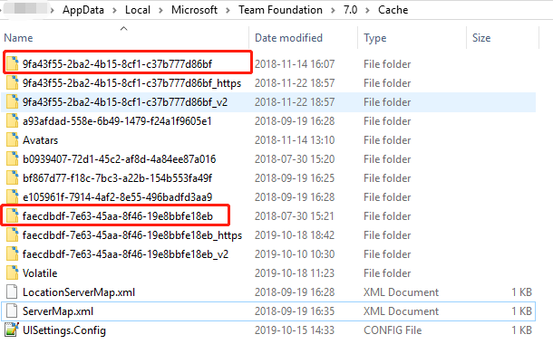
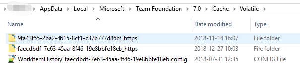

# TFS 更换电脑名称后映射失效

建议不要随便更改电脑名

## 环境

  Visual Studio 2019 ； Win10

## 操作步骤

1. 查找 TFS 的相关配置文件。如果你知道你之前的电脑名字可以跳过这一步；如果想了解 TFS的配置也可以读一下;

   TFS将相关配置信息保存在大概这个位置下，`C:\Users\{computeName}}\AppData\Local\Microsoft\Team Foundation\7.0\Cache`，打开该目录文件下的 `ServerMap.xml` 文件，如下格式:

   ```xml
    <ArrayOfEntry>
        <Entry>
            <Key>https://{address}/Services/v1.0/Registration.asmx</Key>
            <Value>faecdbdf-7e63-45aa-8f46-19e8bbfe18eb</Value>
        </Entry>
        <Entry>
            <Key>https://{address}/Services/v1.0/Registration.asmx</Key>
            <Value>9fa43f55-2ba2-4b15-8cf1-c37b777d86bf</Value>
        </Entry>
    </ArrayOfEntry>
   ```

   解释一下，这个 `Entry` 对应的你的多个 tfs 我这儿有两个，一个自己的，一个公司的；根据`Entry.key` 可以看出具体的是那个；然后 `Entry.value` 对应的他们相关的配置的文件夹，如下图：

   

   关于我们的工作区信息可不在这儿，还有一个文件夹 `Volatile` 打开它，如图：

   

   这里根据前面的 `Entry.key` 能看到对应的关系，后面多了 `_https`，进入对应的文件夹我们能看到一个 `VersionControl.config` 文件，这个里面存储了对应的 版本控制的信息，展示一下：

   ```config
    <VersionControlServer>
    <Servers>
        <ServerInfo uri="https://{address}}" repositoryGuid="faecdbdf-7e63-45aa-8f46-19e8bbfe18eb">
        <WorkspaceInfo name="{NameA}" ownerName="3d275303-260a-4aa5-9fec-232c8964b74f" ownerDisplayName="{NameA}" computer="{NameA}" comment="" isLocalWorkspace="false" LastSavedCheckinTimeStamp="0001-01-01T00:00:00Z" options="0" securityToken="/{NameA};3d275303-260a-4aa5-9fec-232c8964b74f">
            <MappedPaths>
            <MappedPath path="E:\WorkSpace\Code\" />
            <MappedPath path="E:\WorkSpace\Code\" />
            <MappedPath path="E:\WorkSpace\Code\" />
            <MappedPath path="E:\WorkSpace\Code\" />
            </MappedPaths>
            <OwnerAliases>
            <OwnerAlias OwnerAlias="" />
            <OwnerAlias OwnerAlias="" />
            <OwnerAlias OwnerAlias="" />
            </OwnerAliases>
        </WorkspaceInfo>
        </ServerInfo>
    </Servers>
    </VersionControlServer>
   ```

   大概就这个样子，我把自己的一些信息去掉了，感兴趣的可以自己的哦

2. 处理 TFS 不一致问题

* 打开vs下的"开发人员命令提示"；在 “工具-命令行” 找找

* 输入查询现有的TFS工作区绑定计算机的命令：`tf workspaces`，如果成功了，你太棒了，如果没成功，不要气馁继续执行`cd CommonExtensions\Microsoft\TeamFoundation\Team Explor` 因为 `tf.exe` 在这个文件下面，然后再执行命令`tf workspaces`；如果再找不到 你可以用 Everything 这个搜索软件搜索“tf.exe”，需要自己下载哦。

```cmd
Collection: https://{address}
Workspace       Owner  Computer Comment
--------------- ------ -------- ---------------------
{XXX}           {XXX} {XXX}
```

* 输入命令`tf workspaces /collection:http://{address}  /updateComputerName:原先之前计算机的名称`

  注意：其中`/collection`、`/updateComputerName`是关键字，http://{address} 是 TFS 的连接路径

* 输入命令后回车，TFS会自行修改。如果之前电脑凭据没有保存信息的话，命令回车之后TFS会自动弹出重新要输入登录TFS的账号和密码（也就是原先管理员分配你登录TFS的用户名和密码）

* *登录完之后就完成了。重新打开VS就可以使用。你会发现还是原先的工作区。因为以上步骤只是把原先工作区绑定的旧计算机名称改为了你新的计算机名称。TFS原先的工作区是不会变的。

## 总结

执行完更新命令之后，其实也是对 `VersionControl.config` 的修改，你把这个文件打开，就能看到它变了；这个问题大概了解TFS的一些基本的结构，比如多个 TFS 的存储形式，还有他的一些简单的命令等，多看多想，在这里记录一下。

## 参考文章

[https://www.cnblogs.com/wljieping/p/5611760.html](https://www.cnblogs.com/wljieping/p/5611760.html)
[https://stackoverflow.com/questions/33403037/powershell-tf-command-not-recognized-as-the-name-of-a-cmlet](https://stackoverflow.com/questions/33403037/powershell-tf-command-not-recognized-as-the-name-of-a-cmlet)
