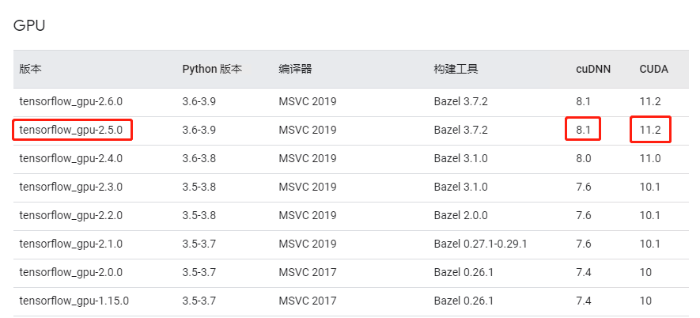
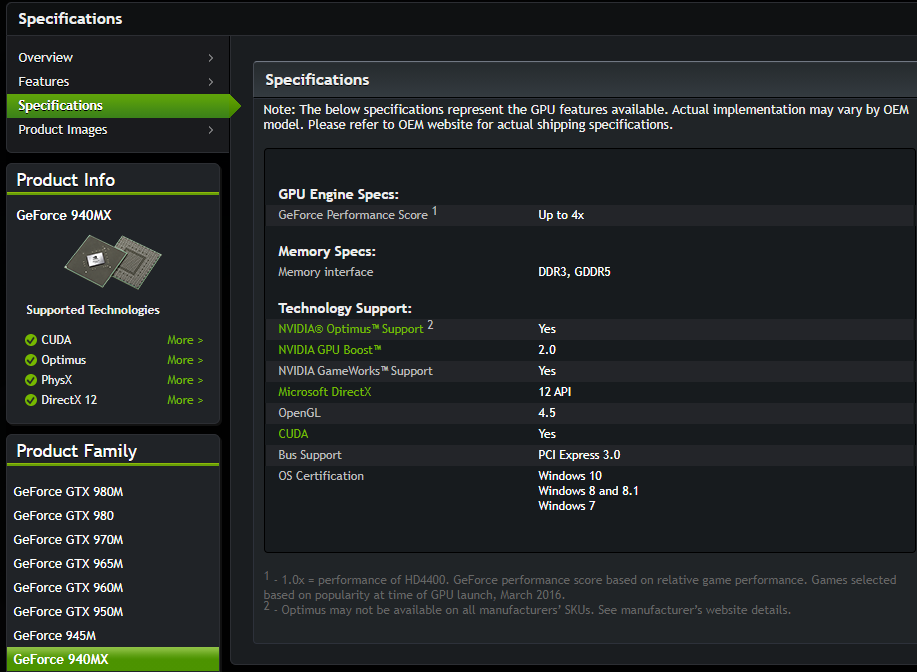
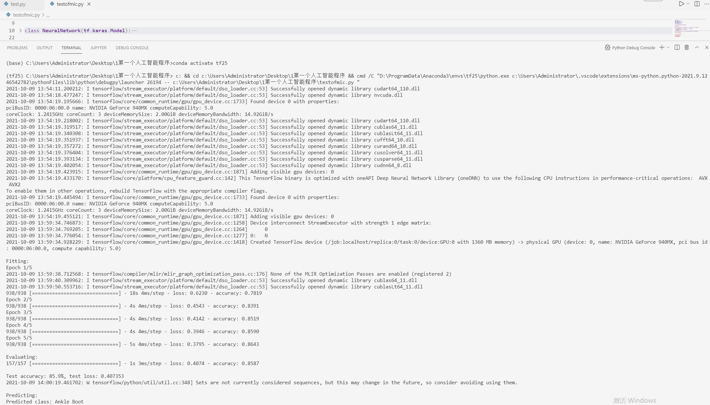

# Win10 下 tensorflow-gpu 2.5 环境搭建

## 简介

机器学习环境搭建，tensorflow_gpu-2.5.0 + CUDA 11.2 + CUDNN 8.1 ；环境必须是这个，具体的可以参考[tensorflow官网](https://tensorflow.google.cn/install/source_windows#gpu)的说明



## 电脑配置

当前显卡：NVIDIA GeForce 940MX

查看是否支持 CUDA ，支持的才能安装, [官网查看](https://developer.nvidia.com/zh-cn/cuda-gpus)

这里是 [NVIDIA GeForce 940MX的信息](https://www.nvidia.com/en-us/geforce/gaming-laptops/geforce-940mx/specifications/)



## 文件下载

* NVIDIA 最新驱动下载[https://www.nvidia.cn/Download/index.aspx?lang=cn](https://www.nvidia.cn/Download/index.aspx?lang=cn)
  > NVIDIA GeForce 940MX [最新驱动](https://www.nvidia.cn/Download/driverResults.aspx/180691/cn)

* CUDA toolkit 下载 [https://developer.nvidia.com/cuda-toolkit-archive](https://developer.nvidia.com/cuda-toolkit-archive)
  > 选择的 11.2 里面的 `CUDA Toolkit 11.2.1`，理论上11.2的任何一个版本都可以

* CUDNN 下载 [https://developer.nvidia.com/zh-cn/cudnn?term=cudnn](https://developer.nvidia.com/zh-cn/cudnn?term=cudnn)
  > 需要 NVIDIA 的账户，登录一下没有的注册一个，同意下协议就行；这里下载的 [8.1.0](https://developer.nvidia.com/rdp/cudnn-archive) [Download cuDNN v8.1.0 (January 26th, 2021), for CUDA 11.0,11.1 and 11.2](https://developer.nvidia.com/compute/machine-learning/cudnn/secure/8.1.0.77/11.2_20210127/cudnn-11.2-windows-x64-v8.1.0.77.zip)

## 安装及配置

* 按照下载顺序安装，nvidia 显卡在 命令行(cmd) 中输入 `nvidia-smi` 可以查看信息；cuda 可以用输入 `nvcc --version` 查看信息。cudnn 无需安装解压后，放到自己想放的位置，然后配置路径即可

* 环境变量配置：
  在环境变量`PATH` 添加下面位置的信息

  ```cmd
    C:\Program Files\NVIDIA GPU Computing Toolkit\CUDA\v11.0\bin;
    C:\Program Files\NVIDIA GPU Computing Toolkit\CUDA\v11.0\extras\CUPTI\lib64;
    C:\Program Files\NVIDIA GPU Computing Toolkit\CUDA\v11.0\include;
    C:\tools\cuda\bin;   # 这个是 cudnn 的位置，按照选的配置
  ```

  > 不配置可能会报错，`Could not load dynamic library 'cudart64_110.dll'; dlerror: cudart64_110.dll not found`

  参考官网[https://www.tensorflow.org/install/gpu#windows_setup](https://www.tensorflow.org/install/gpu#windows_setup)

* `tensorflow_gpu-2.5.0` 配置，我是安装了 conda 然后直接安装的，很方便；下面给一些命令参考

  ```cmd
    conda create -n [替换成环境名称] python=3.8   # 创建一个 python 3.8 的环境
    conda activate [环境名称]                    # 激活对应 环境名称 的环境
    conda install tensorflow-gpu==2.5           # 安装 tensorflow-gpu 2.5   
  ```

一些镜像源：

```txt
https://mirrors.bfsu.edu.cn/anaconda/pkgs/free/win-64
https://mirrors.bfsu.edu.cn/anaconda/pkgs/free/noarch
https://mirrors.bfsu.edu.cn/anaconda/pkgs/main/win-64
https://mirrors.bfsu.edu.cn/anaconda/pkgs/main/noarch
https://mirrors.tuna.tsinghua.edu.cn/anaconda/pkgs/main/win-64
https://mirrors.tuna.tsinghua.edu.cn/anaconda/pkgs/main/noarch
https://mirrors.tuna.tsinghua.edu.cn/anaconda/pkgs/free/win-64
https://mirrors.tuna.tsinghua.edu.cn/anaconda/pkgs/free/noarch
```

## 运行程序

测试的代码来自微软的[学习教程](https://docs.microsoft.com/zh-cn/learn/modules/intro-computer-vision-tensorflow/)

```py
# https://docs.microsoft.com/zh-cn/learn/modules/intro-machine-learning-keras/2-data?source=learn

import gzip
import numpy as np
import tensorflow as tf
from typing import Tuple
import requests
from PIL import Image

class NeuralNetwork(tf.keras.Model):
  def __init__(self):
    super(NeuralNetwork, self).__init__()
    self.sequence = tf.keras.Sequential([
      tf.keras.layers.Flatten(input_shape=(28, 28)),
      tf.keras.layers.Dense(20, activation='relu'),
      tf.keras.layers.Dense(10)
    ])

  def call(self, x: tf.Tensor) -> tf.Tensor:
    y_prime = self.sequence(x)
    return y_prime

labels_map = {
    0: 'T-Shirt',
    1: 'Trouser',
    2: 'Pullover',
    3: 'Dress',
    4: 'Coat',
    5: 'Sandal',
    6: 'Shirt',
    7: 'Sneaker',
    8: 'Bag',
    9: 'Ankle Boot',
  }

def read_images(path: str, image_size: int, num_items: int) -> np.ndarray:
  with gzip.open(path, 'rb') as file:
    data = np.frombuffer(file.read(), np.uint8, offset=16)
    data = data.reshape(num_items, image_size, image_size)
  return data

def read_labels(path: str, num_items: int) -> np.ndarray:
  with gzip.open(path, 'rb') as file:
    data = np.frombuffer(file.read(num_items + 8), np.uint8, offset=8)
    data = data.astype(np.int64)
  return data

def get_data(batch_size: int) -> Tuple[tf.data.Dataset, tf.data.Dataset]:
  image_size = 28
  num_train = 60000
  num_test = 10000

  training_images = read_images('data/FashionMNIST/raw/train-images-idx3-ubyte.gz', image_size, num_train)
  test_images = read_images('data/FashionMNIST/raw/t10k-images-idx3-ubyte.gz', image_size, num_test)
  training_labels = read_labels('data/FashionMNIST/raw/train-labels-idx1-ubyte.gz', num_train)
  test_labels = read_labels('data/FashionMNIST/raw/t10k-labels-idx1-ubyte.gz', num_test)

  # (training_images, training_labels), (test_images, test_labels) = tf.keras.datasets.fashion_mnist.load_data()

  train_dataset = tf.data.Dataset.from_tensor_slices((training_images, training_labels))
  test_dataset = tf.data.Dataset.from_tensor_slices((test_images, test_labels))

  train_dataset = train_dataset.map(lambda image, label: (float(image) / 255.0, label))
  test_dataset = test_dataset.map(lambda image, label: (float(image) / 255.0, label))

  train_dataset = train_dataset.batch(batch_size).shuffle(500)
  test_dataset = test_dataset.batch(batch_size).shuffle(500)

  return (train_dataset, test_dataset)

def training_phase():
  learning_rate = 0.1
  batch_size = 64
  epochs = 5

  (train_dataset, test_dataset) = get_data(batch_size)

  model = NeuralNetwork()

  loss_fn = tf.keras.losses.SparseCategoricalCrossentropy(from_logits=True)
  optimizer = tf.keras.optimizers.SGD(learning_rate)
  metrics = ['accuracy']
  model.compile(optimizer, loss_fn, metrics)

  print('\nFitting:')
  model.fit(train_dataset, epochs=epochs)
    
  print('\nEvaluating:')
  (test_loss, test_accuracy) = model.evaluate(test_dataset)
  print(f'\nTest accuracy: {test_accuracy * 100:>0.1f}%, test loss: {test_loss:>8f}')

  model.save('outputs/model')


def inference_phase():
  print('\nPredicting:')

  model = tf.keras.models.load_model('outputs/model/')

  url = 'https://raw.githubusercontent.com/MicrosoftDocs/tensorflow-learning-path/main/intro-keras/predict-image.png'

  with Image.open(requests.get(url, stream=True).raw) as image:
    X = np.asarray(image, dtype=np.float32).reshape((-1, 28, 28)) / 255.0

  predicted_vector = model.predict(X)
  predicted_index = np.argmax(predicted_vector)
  predicted_name = labels_map[predicted_index]

  print(f'Predicted class: {predicted_name}')

training_phase()
inference_phase()
```

测试结果如图：


