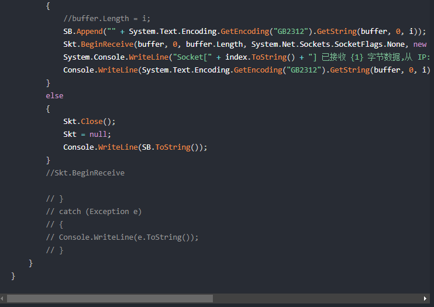
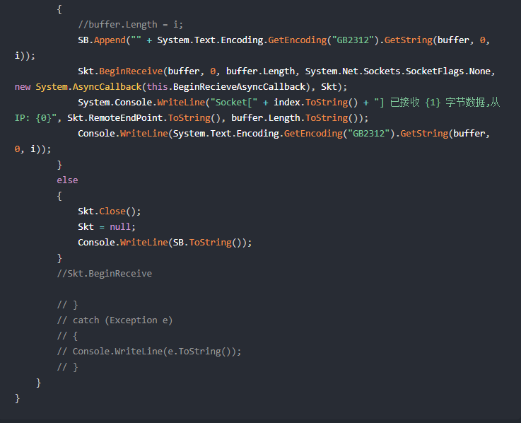

# VuePress 控制文件内的代码自动换行

最近搞Vuepress发现有些代码比较长，而我不想给它敲换行。然后就搞了一个自动换行的样式。就搞定了。下面一起来看看。

## 核心样式`white-space: pre-wrap;`

在新建一个样式文件`index.scss`，目录结构如下：

```txt
> .vuepress
  > styles
    > index.scss 
```

添加样式：

```scss
.page {
    pre{
        white-space: pre-wrap;
    }    
}
```

就这样大功告成！看看效果对比！

### 加样式前



### 加样式后



## 花絮

刚开始试了好多，搜了好多但是没有找到好使的，最后搜到了[一片文章](http://vuepress.wmm66.com/%E5%89%8D%E7%AB%AF%E5%BC%80%E5%8F%91/vue/vuepress%E7%AE%80%E5%8D%95%E6%95%99%E7%A8%8B.html#%E6%A0%B7%E5%BC%8F%E4%BF%AE%E6%94%B9) 参考了怎么调整样式，然后修改成功了。

### 试错

```scss
pre { white-space: pre-wrap; }  // 试错1
:root{ white-space: pre-wrap; } // 试错2
```
