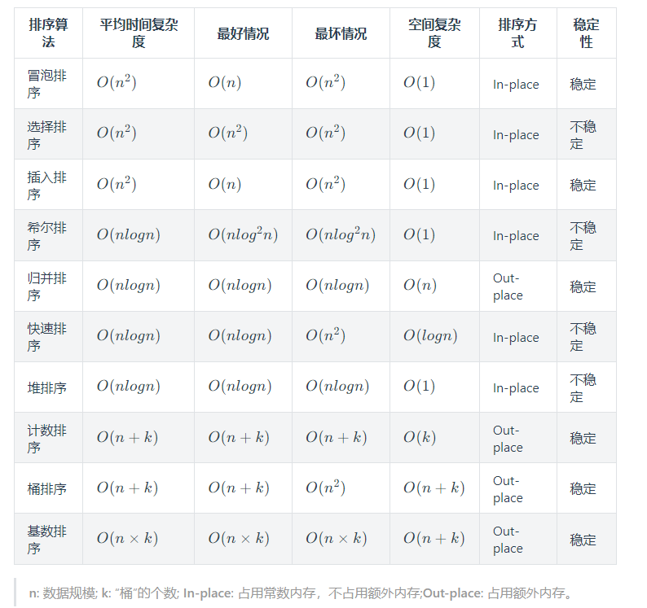
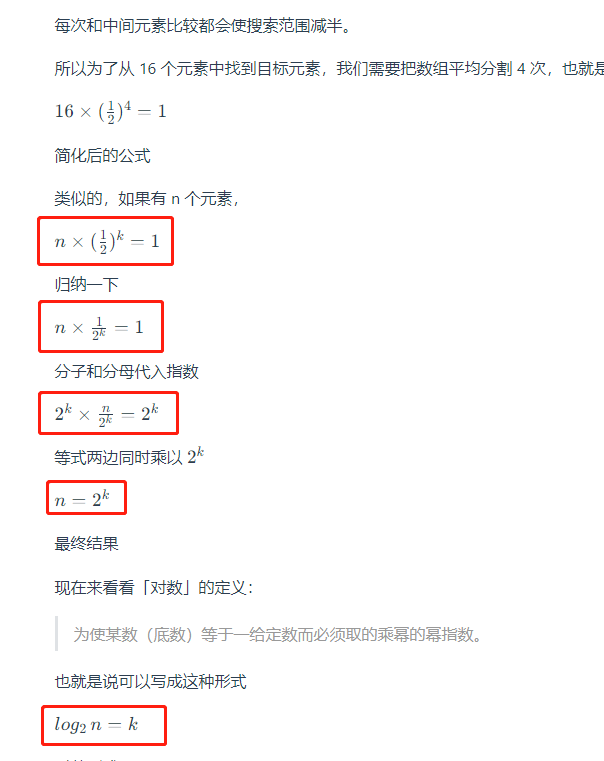

# VuePress@next 使用数学公式插件

搞了一个VuePress1.0的 现在升级了一下，但是使用数学公式的插件老报错啊！经过不懈努力，终于搞定了。现在记录一下。

## VuePress 介绍

[VuePress](https://vuepress.github.io/zh) 是一个以 Markdown 为中心的静态网站生成器。你可以使用 Markdown 来书写内容（如文档、博客等），然后 VuePress 会帮助你生成一个静态网站来展示它们。

## 遇到的问题

使用数学公式的库，根据网上找的 `markdown-it-texmath`,`markdown-it-katex`,`markdown-it-mathjax3`,这些都可以，然而当我使用了之后没有一个有用的，报错信息(`Error: Dynamic require of "markdown-it-mathjax3" is not supported`)详细的参见后面的哦！

此时我的配置：

```js
export default defineUserConfig({
  base: '',
  lang: 'zh-CN',
  title: '',
  description: description,
  head: head,
  theme: defalutThemeOK,
  markdown: {
    code: {
      lineNumbers: false,
    }
  },
  extendsMarkdown: (md) => {
    md.use(require('markdown-it-mathjax3')); // 使用这个解析 数学公式
    md.linkify.set({ fuzzyEmail: false });
  }, 
})
```

### 报错信息

```shell
⠋ Initializing and preparing dataerror error in hook extendsMarkdown from user-config
✖ Initializing and preparing data - failed in 33ms
Error: Dynamic require of "markdown-it-mathjax3" is not supported
    at file:///F:/StevenBlogs/docs/.vuepress/config.ts.166cda46.mjs:7:9
    at Object.extendsMarkdown [as hook] (file:///F:/StevenBlogs/docs/.vuepress/config.ts.166cda46.mjs:161:12)
    at Object.process (file:///F:/StevenBlogs/node_modules/@vuepress/core/dist/index.js:683:37)
    at async resolveAppMarkdown (file:///F:/StevenBlogs/node_modules/@vuepress/core/dist/index.js:160:3)
    at async appInit (file:///F:/StevenBlogs/node_modules/@vuepress/core/dist/index.js:604:18)
    at async file:///F:/StevenBlogs/node_modules/@vuepress/cli/dist/index.js:489:7
    at async file:///F:/StevenBlogs/node_modules/@vuepress/utils/dist/index.js:106:20
    at async CAC.dev (file:///F:/StevenBlogs/node_modules/@vuepress/cli/dist/index.js:488:5)
```

## VuePress 2 成功配置

通过各种尝试，和搜各种资料。最后算是我搞定了。

主要是参考了Maikdown It 插件的文章"@mdit/plugin-katex"[https://mdit-plugins.github.io/zh/katex.html]

1. 卸载之前没有用的包，我用的npm；
2. 安装新的包"@mdit/plugin-katex" `npm install @mdit/plugin-katex`
3. 修改配置；

    ```js
    import { katex } from '@mdit/plugin-katex'

    export default defineUserConfig({
        // …… 省略了没有必要的
        extendsMarkdown: (md) => {
            md.use(katex);
            md.linkify.set({ fuzzyEmail: false });
        }, 
        })
    ```

4. 还需要在head加样式，要不然样式就走样子了。参考[KaTeX](https://katex.org/docs/browser.html)

    ```js
    export const head : HeadConfig[]=
    [
        ['meta', { name: 'theme-color', content: '#3eaf7c' }],
        ['meta', { name: 'apple-mobile-web-app-capable', content: 'yes' }],
        ['meta', { name: 'apple-mobile-web-app-status-bar-style', content: 'black' }],
        ['link', { rel: 'stylesheet', href: 'https://cdn.jsdelivr.net/npm/katex@0.16.8/dist/katex.min.css' }], // 让md支持数学公式
        ['link', { rel: "stylesheet", href: "https://cdn.jsdelivr.net/npm/katex@0.16.8/dist/katex.min.js" }]  // 让md支持数学公式
    ]
    ```

四步骤搞定：看看效果！




## 找了的一些文说明的

[markdown-it-mathjax3 issues all closed](https://github.com/tani/markdown-it-mathjax3/issues?q=is%3Aissue+is%3Aclosed)
[markdown-it-mathjax3 issues 57](https://github.com/tani/markdown-it-mathjax3/issues/57#issuecomment-1299692985)
[渲染数学公式](https://blog.chgtaxihe.top/pages/4f9f4f/#%E6%B8%B2%E6%9F%93%E6%95%B0%E5%AD%A6%E5%85%AC%E5%BC%8F) 顺便说一下这个里面有1.0的配置

## 1.0 VuePress 的配置

以下是我的1.0的配置，在本地运行也是正常的！

```js
module.exports = {
    head: [
        ['meta', { name: 'theme-color', content: '#3eaf7c' }],
        ['meta', { name: 'apple-mobile-web-app-capable', content: 'yes' }],
        ['meta', { name: 'apple-mobile-web-app-status-bar-style', content: 'black' }],
        ['link', { rel: 'stylesheet', href: 'https://cdnjs.cloudflare.com/ajax/libs/KaTeX/0.7.1/katex.min.css' }],      // 让md支持数学公式
        ['link', { rel: "stylesheet", href: "https://cdnjs.cloudflare.com/ajax/libs/github-markdown-css/2.10.0/github-markdown.min.css" }]  // 让md支持数学公式
    ],
    themeConfig: {
        plugins: [
        '@vuepress/plugin-back-to-top',
        '@vuepress/plugin-medium-zoom',
        ],
        extendMarkdown(md){  // 让md支持数学公式 npm install markdown-it-katex
            md.set({html:true});
            md.use(require('markdown-it-katex'));
        }
    }
}
```

## 2.0中一个最简单的配置后来发现的

在这个[Markdown增强](https://plugin-md-enhance.vuejs.press/zh/guide/#%E9%80%89%E9%A1%B9%E5%8D%A1)看到了，里面有很多插件，除了数学公式还有流程图等等一堆。我是在看流程图的时候发现的哦。来看怎么用。

1. 安装插件包 `npm i -D vuepress-plugin-md-enhance`
2. 按照以下代码修改`config.ts`，具体的可以看[文档说明](https://plugin-md-enhance.vuejs.press/zh/guide/tex.html)

```ts
// .vuepress/config.ts
import { mdEnhancePlugin } from "vuepress-plugin-md-enhance";

export default {
  plugins: [
    mdEnhancePlugin({
      // 使用 KaTeX 启用 TeX 支持
      katex: true,
      // 使用 mathjax 启用 TeX 支持
      mathjax: true,
    }),
  ],
};
```

## 总结

通个这个的搞定，那么使用其他Markdown It 插件都可以去这个网站找[https://mdit-plugins.github.io/zh/](https://mdit-plugins.github.io/zh/)，然后自己改改就能轻松融入了！还是的多琢磨！

另外提一下我[搞到github上的网站](https://fhlsteven.github.io/steven-blogs/)! haha
