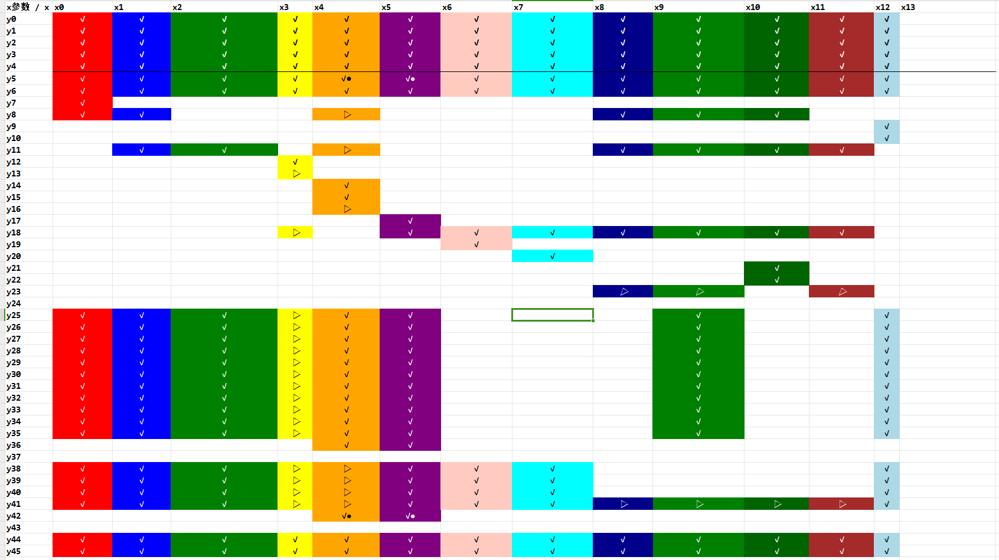

# WPS JS 宏根据单元格内容填充颜色

## 直接上代码

```js
/**
 * Macro1 Macro
 * 宏由 Steven 录制，时间: 2024/01/30
 */
function SetCellColorsBYMacro()
{
	// 获取表格的行数和列数
        var rowCount = 48;
        var colAll = ['A', 'B', 'C', 'D', 'E', 'F', 'G', 'H', 'I', 'J', 'K', 'L', 'M', 'N'];
        
        // 填充颜色数组（BGR 格式）
		var fillColorsBgr = [
			0x0000FF, // 红色 (#FF0000)
			0xFF0000, // 蓝色 (#0000FF)
			0x008000, // 绿色 (#008000)
			0x00FFFF, // 黄色 (#FFFF00)
			0x00A5FF, // 橙色 (#FFA500)
			0x800080, // 紫色 (#800080)
			0xC0CBFF, // 粉红色 (#FFC0CB)
			0xFFFF00, // 青色 (#00FFFF)
			0x8B0000, // 深蓝色 (#00008B)
			0x008000, // 橄榄绿 (#808000)
			0x006400, // 深绿色 (#006400)
			0x2A2AA5, // 棕色 (#A52A2A)
			0xE6D8AD, // 淡蓝色 (#ADD8E6)
			0xEE82EE, // 紫罗兰色 (#EE82EE)
			0x00D7FF  // 金色 (#FFD700)
		];
		
		// 字体颜色数组（BGR 格式）
		var fontColorsBgr = [
		    0xFFFFFF, // 白色文字
		    0xFFFFFF, // 白色文字
		    0xFFFFFF, // 白色文字
		    0x000000,  // 黑色文字
		    0x000000,  // 黑色文字
		    0xFFFFFF,  // 白色文字
		    0x000000,  // 黑色文字
		    0x000000,  // 黑色文字
		    0xFFFFFF, // 白色文字
		    0xFFFFFF, // 白色文字
		    0xFFFFFF, // 白色文字
		    0xFFFFFF, // 白色文字
		    0x000000,  // 黑色文字
		    0x000000,  // 黑色文字
		    0x000000  // 黑色文字
		];

	    // 遍历列
		for (var col = 1; col < colAll.length; col++) {
		    // 遍历行
		    for (var row = 2; row < rowCount; row++) {		    	
		    	Range(colAll[col]+row).Select();
		        // 获取单元格内容
		        var cellValue = Selection.toString();		        
		
		        // 检查单元格是否有内容
		        if (cellValue !== null && cellValue !== "") {
		            // 设置填充颜色（蓝色）		           
		            Selection.Interior.Color = fillColorsBgr[col-1];
				
		            // 设置字体颜色（白色）
		            Selection.Font.Color = fontColorsBgr[col-1];
		        }
		    }
		}
}
```

## 效果图



## 过程

颜色搭配 GPT 搭配

```txt
User
能不能给我十五种颜色 可以在 excel 里面区分每列的参数以及对应16进制的颜色值；给单元格有文字的再给文字配一个颜色
ChatGPT
当然，以下是十五种颜色及其对应的十六进制表示，你可以在 Excel 中使用这些颜色来区分每列的参数。此外，如果单元格中有文字，还包含了文字的颜色。

红色：#FF0000； 文字颜色：#FFFFFF
蓝色：#0000FF； 文字颜色：#FFFFFF
绿色：#008000； 文字颜色：#FFFFFF
黄色：#FFFF00； 文字颜色：#000000
橙色：#FFA500； 文字颜色：#000000
紫色：#800080； 文字颜色：#FFFFFF
粉红色：#FFC0CB； 文字颜色：#000000
青色：#00FFFF； 文字颜色：#000000
深蓝色：#00008B； 文字颜色：#FFFFFF
橄榄绿色：#808000； 文字颜色：#FFFFFF
深绿色：#006400； 文字颜色：#FFFFFF
棕色：#A52A2A； 文字颜色：#FFFFFF
淡蓝色：#ADD8E6； 文字颜色：#000000
紫罗兰色：#EE82EE； 文字颜色：#000000
金色：#FFD700； 文字颜色：#000000
你可以在 Excel 中使用这些颜色来区分每列的参数，并根据需要设置文字的颜色。

生成 WPS JS宏 里面的 填充数组和字体颜色数组
ChatGPT
在 WPS Office JS 宏中，填充颜色和字体颜色通常使用 BGR 格式的数组。以下是十五种颜色对应的 BGR 格式数组，以及字体颜色的 BGR 格式数组：

javascript
Copy code
// 填充颜色数组
var fillColors = [
    [0, 0, 255],   // 红色
    [255, 0, 0],   // 蓝色
    [0, 128, 0],   // 绿色
    [0, 255, 255], // 黄色
    [165, 255, 0], // 橙色
    [128, 0, 128], // 紫色
    [203, 192, 255], // 粉红色
    [255, 255, 0], // 青色
    [139, 0, 0],   // 深蓝色
    [0, 128, 0],   // 橄榄绿色
    [100, 149, 237], // 深绿色
    [42, 42, 165],  // 棕色
    [230, 216, 173], // 淡蓝色
    [238, 130, 238], // 紫罗兰色
    [215, 255, 0]  // 金色
];

// 字体颜色数组
var fontColors = [
    [255, 255, 255], // 红色
    [255, 255, 255], // 蓝色
    [255, 255, 255], // 绿色
    [0, 0, 0],       // 黄色
    [0, 0, 0],       // 橙色
    [255, 255, 255], // 紫色
    [0, 0, 0],       // 粉红色
    [0, 0, 0],       // 青色
    [255, 255, 255], // 深蓝色
    [255, 255, 255], // 橄榄绿色
    [255, 255, 255], // 深绿色
    [255, 255, 255], // 棕色
    [0, 0, 0],       // 淡蓝色
    [0, 0, 0],       // 紫罗兰色
    [0, 0, 0]        // 金色
];

// 输出结果
console.log('填充颜色数组:', fillColors);
console.log('字体颜色数组:', fontColors);
这段代码定义了 fillColors 和 fontColors 两个数组，分别存储了十五种颜色的 BGR 格式数组。你可以根据需要使用这些数组在 WPS Office JS 宏中设置填充颜色和字体颜色。


颜色值格式 为 0x开头的
ChatGPT
理解了，如果你的 WPS Office JS 宏使用 0x 开头的十六进制颜色值，我们可以稍作修改：

javascript
Copy code
// 填充颜色数组
var fillColors = [
    0x0000FF,   // 红色
    0xFF0000,   // 蓝色
    0x008000,   // 绿色
    0xFFFF00,   // 黄色
    0xFFA500,   // 橙色
    0x800080,   // 紫色
    0xFFC0CB,   // 粉红色
    0x00FFFF,   // 青色
    0x00008B,   // 深蓝色
    0x808000,   // 橄榄绿色
    0x006400,   // 深绿色
    0xA52A2A,   // 棕色
    0xADD8E6,   // 淡蓝色
    0xEE82EE,   // 紫罗兰色
    0xFFD700    // 金色
];

// 字体颜色数组
var fontColors = [
    0xFFFFFF,   // 红色
    0xFFFFFF,   // 蓝色
    0xFFFFFF,   // 绿色
    0x000000,   // 黄色
    0x000000,   // 橙色
    0xFFFFFF,   // 紫色
    0x000000,   // 粉红色
    0x000000,   // 青色
    0xFFFFFF,   // 深蓝色
    0xFFFFFF,   // 橄榄绿色
    0xFFFFFF,   // 深绿色
    0xFFFFFF,   // 棕色
    0x000000,   // 淡蓝色
    0x000000,   // 紫罗兰色
    0x000000    // 金色
];

// 转换成 BGR 格式数组
fillColors = fillColors.map(color => {
    var blue = color & 0xFF;
    var green = (color >> 8) & 0xFF;
    var red = (color >> 16) & 0xFF;
    return [blue, green, red];
});

// 输出结果
console.log('填充颜色数组:', fillColors);
console.log('字体颜色数组:', fontColors);
这段代码中，fillColors 和 fontColors 数组使用 0x 开头的十六进制颜色值。在最后将这些值转换成 BGR 格式数组以适应 WPS Office JS 宏。
```
