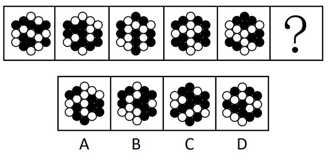

# 2022 年国家公务员考试行测真题（地市级）

## 一、常识判断。第一部分 常识判断。根据题目要求，在四个选项中选出一个最恰当的答案

1.习近平总书记在庆祝中国共产党成立100周年大会上的讲话指出，坚持党指挥枪、建设自己的人民军队，是党在血与火的斗争中得出的颠扑不破的真理。下列关于党对军队绝对领导的根本原则和制度的表述正确的有几项：

①南昌起义，标志着党独立领导革命战争、创建人民军队和武装夺取政权的开端  
②三湾改编，从组织上确立了党对军队的领导  
③古田会议，确立了马克思主义建党建军原则，确立了军队政治工作的方针、原则、制度  
④党的十八大，把坚持党对人民军队绝对领导上升为新时代坚持和发展中国特色社会主义的基本方略  
⑤党的十九大，把“中央军事委员会实行主席负责制”写入党章  

A．2项 &emsp; B．3项 &emsp; C．4项 &emsp; D．5项

答案解析

解析：本题考查政治常识。

①正确，南昌起义指在 1927年8月1日中国共产党领导部分国民革命军在江西省南昌市举行的武装起义，打响了武装反抗国民党反动派的第一枪，揭开了中国共产党独立领导武装斗争和创建革命军队的序幕。习近平总书记在庆祝中国人民解放军建军90周年大会上的讲话中指出：“南昌城头的枪声，像划破夜空的一道闪电，使中国人民在黑暗中看到了革命的希望，在逆境中看到了奋起的力量。南昌起义连同秋收起义、广州起义以及其他许多地区的武装起义，标志着中国共产党独立领导革命战争、创建人民军队的开端，开启了中国革命新纪元。”

②正确，1927年9月29日至10月3日，毛泽东在江西省永新县三湾村领导了“三湾改编”， 初步解决了如何把以农民及旧军人为主要成分的革命军队建设成为一支无产阶级新型人民军队的问题，从政治上、组织上保证了党对军队的绝对领导，奠定了政治建军的基础，是我党建设新型人民军队最早的一次成功探索和实践，标志着毛泽东建设人民军队思想的开始形成。

③正确，古田会议指中国工农红军第四军在 1929年12月28日至29日在福建省上杭县古田村召开的第九次党的代表大会，会上确立了马克思主义建党建军原则，确立了军队政治工作的方针、原则、制度，提出了解决把以农民为主要成分的军队建设成为无产阶级性质的新型人民军队这个根本性问题的原则方向，对军队生存发展起到了决定性作用。

④错误，党的十九大把“坚持党对人民军队的绝对领导”上升为新时代坚持和发展中国特色社会主义的一条基本方略，十九届四中全会进一步明确：“坚持和完善党对人民军队的绝对领导制度，确保人民军队忠实履行新时代使命任务。”

⑤正确，2017年10月，中国共产党第十九次全国代表大会在北京召开，大会明确中央军事委员会实行主席负责制，明确中央军事委员会负责军队中党的工作和政治工作，反映了军队改革后的中央军委履行管党治党责任的现实需要。故①②③⑤正确，共4项。

故正确答案为 C。

2.习近平总书记指出，要根据我国经济发展实际情况，建立起扩大内需的有效制度，释放内需潜力，加快培育完整内需体系，加强需求侧管理，扩大居民消费，提升消费层次，使建设超大规模的国内市场成为一个可持续的历史过程。下列举措不属于需求侧改革的是：

A．构建“智能＋”消费生态体系 
B．完善收入分配制度 
C．严格落实“房住不炒” 
D．剥离企业办社会职能 

答案解析

本题考查政治常识。

需求侧，简而言之就是关于需求那一方面的诸多问题，需求侧改革的首要任务是进行收入分配制度与体系的深化改革，既要考虑初次分配的改革也要考虑再分配的改造，更要进行土地制度、住宅制度、社会保障、医疗保障、教育体系等方面的综合改革，使我国居民目前收入水平下的消费能力得以提高与释放。供给侧改革是用改革的办法推进结构调整，减少无效和低端供给，扩大有效和中高端供给，增强供给结构对需求变化的适应性和灵活性，提高全要素生产率，使供给体系更好适应需求结构变化。

A 项正确，“智能+”消费生态体系融合了智能元素，在高新科技的支持下，“智能+”消费生 态体系将更加贴合人们的消费需求，顺应社会发展的潮流趋势，有助于释放更大的消费潜力。因此， 构建“智能+”消费生态体系属于需求侧改革的举措。 
B 项正确，分配在连接生产和消费中发挥着重要作用，分配方式是否公平、合理，关系到社会成员各自获得物质利益的多少，决定着社会产品能否顺利、有效地进入消费过程，直接影响到整个经济社会的正常运行。收入分配制度与体系的深化改革是需求侧改革的首要任务。 
C 项正确，房价的大幅上涨对居民消费会产生直接抑制。严格落实“房住不炒”有利于确保楼市平稳运行，充分发挥国内需求潜力，形成以国内大循环为主体、国内国际双循环相互促进的新发展格局，属于需求侧改革的举措。 
D 项错误，剥离企业办社会职能，是向社会化经营主体或地方公共机构移交各种社会服务职能，是全面深化国企改革的重要任务、是供给侧结构性改革的重大举措，也是提升公共管理服务水平、实现基本公共服务均等化的重大民生工程。

本题为选非题，故正确答案为 D。

3.2020年11月，习近平总书记在中央全面依法治国工作会议上发表重要讲话，要求坚定不移走中国特色社会主义法治道路，在法治轨道上推进国家治理体系和治理能力现代化，为全面建设社会主义现代化国家、实现中华民族伟大复兴的中国梦提供有力法治保障。以下对全面依法治国理解正确的是:

①党的领导是推进全面依法治国的根本保证 
②依法保障人民权益是推进全面依法治国的根本目的 
③法治社会建设是推进全面依法治国的重点任务和主体工程 
④领导干部具体行使党的执政权和国家立法权、行政权、监察权、司法权，是全面依法治国的关键

A．①②④ &emsp; B．①②③ &emsp; C．①③④ &emsp; D．②③④ &emsp;

答案解析

本题考查政治常识。

①正确，坚持党对全面依法治国的领导。党的领导是推进全面依法治国的根本保证。国际国内环境越是复杂，改革开放和社会主义现代化建设任务越是繁重，越要运用法治思维和法治手段巩固执政地位、改善执政方式、提高执政能力，保证党和国家长治久安。 
②正确，全面依法治国最广泛、最深厚的基础是人民，必须坚持为了人民、依靠人民。要把体现人民利益、反映人民愿望、维护人民权益、增进人民福祉落实到全面依法治国各领域全过程。推进全面依法治国，根本目的是依法保障人民权益。要积极回应人民群众新要求新期待，系统研究谋划和解决法治领域人民群众反映强烈的突出问题，不断增强人民群众获得感、幸福感、安全感，用法治保障人民安居乐业。 
③错误，《法治政府建设实施纲要(2021—2025年)》在第一段指出：“法治政府建设是全面依法治国的重点任务和主体工程，是推进国家治理体系和治理能力现代化的重要支撑。” 
④正确，坚持抓住领导干部这个“关键少数”，是全面推进依法治国的关键问题。领导干部具体行使党的执政权和国家立法权、行政权、监察权、司法权，是全面依法治国的关键。

故正确的是①②④。故正确答案为A。

4.关于中国共产党成立百年的宝贵经验，下列说法不准确的是：

A.勇于自我革命是中国共产党区别于其他政党的显著标志 
B.马克思主义是我们立党立国的根本指导思想 
C.爱国统一战线是实现中华民族伟大复兴的战略支撑 
D.中国特色社会主义是实现中华民族伟大复兴的正确道路

答案解析

本题考查政治常识。

A 项正确，习近平总书记在庆祝中国共产党成立 100 周年大会上的讲话中指出：“以史为鉴、开创未来，必须不断推进党的建设新的伟大工程。勇于自我革命是中国共产党区别于其他政党的显著标志。” 
B 项正确，习近平总书记在庆祝中国共产党成立 100 周年大会上的讲话中指出：“以史为鉴、开创未来，必须继续推进马克思主义中国化。马克思主义是我们立党立国的根本指导思想，是我们党的灵魂和旗帜。” 
C 项错误，习近平总书记在庆祝中国共产党成立 100 周年大会上的讲话中指出：“以史为鉴、开创未来，必须加强中华儿女大团结。在百年奋斗历程中，中国共产党始终把统一战线摆在重要位置，不断巩固和发展最广泛的统一战线，团结一切可以团结的力量、调动一切可以调动的积极因素，最大限度凝聚起共同奋斗的力量。爱国统一战线是中国共产党团结海内外全体中华儿女实现中华民族伟大复兴的重要法宝。” 
D 项正确，习近平总书记在庆祝中国共产党成立 100 周年大会上的讲话中指出：“以史为鉴、开创未来，必须坚持和发展中国特色社会主义。走自己的路，是党的全部理论和实践立足点，更是党百年奋斗得出的历史结论。中国特色社会主义是党和人民历经千辛万苦、付出巨大代价取得的根本成就，是实现中华民族伟大复兴的正确道路。”

本题为选非题，故正确答案为 C。

5.在中国共产党成立一百周年的重要时刻，我国脱贫攻坚战取得了全面胜利。下列与之相关的说法错误的是:

A.现行标准下区域性整体贫困得到解决 
B.“输血式”扶贫方针是中国特色减贫道路的鲜明特征 
C.锻造形成了“上下同心、尽锐出战、精准务实、开拓创新、攻坚克难、不负人民”的脱贫攻坚精神 
D.从集中资源支持脱贫攻坚转向巩固拓展脱贫攻坚成果和全面推进乡村振兴

答案解析

本题考查政治常识。

A 项正确，习近平总书记在全国脱贫攻坚总结表彰大会上的讲话中指出：“在迎来中国共产党成立一百周年的重要时刻，我国脱贫攻坚战取得了全面胜利，现行标准下 9899 万农村贫困人口全部脱贫，832 个贫困县全部摘帽，12.8 万个贫困村全部出列，区域性整体贫困得到解决，完成了消除绝对贫困的艰巨任务，创造了又一个彪炳史册的人间奇迹！” 
B 项错误，习近平总书记在全国脱贫攻坚总结表彰大会上的讲话中指出：“精准扶贫是打赢脱贫攻坚战的制胜法宝，开发式扶贫方针是中国特色减贫道路的鲜明特征。” 
C 项正确，习近平总书记在全国脱贫攻坚总结表彰大会上的讲话中指出：“伟大事业孕育伟大精神，伟大精神引领伟大事业。脱贫攻坚伟大斗争，锻造形成了‘上下同心、尽锐出战、精准务实、开拓创新、攻坚克难、不负人民’的脱贫攻坚精神。脱贫攻坚精神，是中国共产党性质宗旨、中国人民意志品质、中华民族精神的生动写照，是爱国主义、集体主义、社会主义思想的集中体现，是中国精神、中国价值、中国力量的充分彰显，赓续传承了伟大民族精神和时代精神。” 
D 项正确，《中共中央国务院关于实现巩固拓展脱贫攻坚成果同乡村振兴有效衔接的意见》在“二、总体要求”中阐述基本思路和目标任务时指出：“脱贫攻坚目标任务完成后，设立 5 年过渡期。脱贫地区要根据形势变化，理清工作思路，做好过渡期内领导体制、工作体系、发展规划、政策举措、考核机制等有效衔接，从解决建档立卡贫困人口‘两不愁三保障’为重点转向实现乡村产业兴旺、生态宜居、乡风文明、治理有效、生活富裕，从集中资源支持脱贫攻坚转向巩固拓展脱贫攻坚成果和全面推进乡村振兴。”

本题为选非题，故正确答案为 B。

6.下列中国共产党全国代表大会的重大成果成就，按时间先后排序正确的是:

①提出我国社会主要矛盾已经转化为人民日益增长的美好生活需要和不平衡不充分的发展之间的矛盾 
②为夺取全面建设小康社会新胜利作出了战略部署 
③系统、完整地提出了党在社会主义初级阶段的基本纲领 
④明确了夺取中国特色社会主义新胜利必须牢牢把握的基本要求

A.③①④② &emsp; B.②④③① &emsp; C.③②④① &emsp; D.②①③④

答案解析

本题考查人文常识。

①2017 年 10 月 18 日，中国共产党第十九次全国代表大会召开，习近平总书记向大会作了题为《决胜全面建成小康社会夺取新时代中国特色社会主义伟大胜利》的报告中提出：“我国社会主要矛盾已经转化为人民日益增长的美好生活需要和不平衡不充分的发展之间的矛盾。” 
②2007 年 10 月 15 日至 21 日，中国共产党第十七次全国代表大会召开，胡锦涛同志代表第十六届中央委员会向大会作了题为《高举中国特色社会主义伟大旗帜，为夺取全面建设小康社会新胜利而奋斗》的报告，为夺取全面建设小康社会新胜利作出了战略部署。 
③1997 年 9 月 12 日至 18 日，中国共产党第十五次全国代表大会召开，江泽民同志在会上作了题为《高举邓小平理论伟大旗帜，把建设有中国特色社会主义事业全面推向二十一世纪》的报告，系统、完整地提出了党在社会主义初级阶段的基本纲领。 
④2012 年 11 月 8 日至 14 日，中国共产党第十八次全国代表大会召开，党的十八大报告在总结改革开放 30 多年特别是十六大以来实践经验的基础上，提出了在新的历史条件下夺取中国特色社会主义新胜利必须牢牢把握的八项基本要求。

按时间先后排序正确的是③②④①。 
故正确答案为 C。

7.根据《中华人民共和国国民经济和社会发展第十四个五年规划和2035年远景目标纲要》，下列不属于“十四五”规划重要目标的是：

A.保持制造业比重基本稳定，增强制造业竞争优势 
B.优化提升供给结构，促进农业、制造业、服务业、能源资源等产业协调发展 
C.健全农业支持保护制度，完善粮食主产区利益补偿机制 
D.关键核心技术实现重大突破，进入创新型国家前列

答案解析

本题考查政治常识。

A 项正确，《中华人民共和国国民经济和社会发展第十四个五年规划和 2035 年远景目标纲要》在第八章“深入实施制造强国战略”指出：“坚持自主可控、安全高效，推进产业基础高级化、产业链现代化，保持制造业比重基本稳定，增强制造业竞争优势，推动制造业高质量发展。” 
B 项正确，《中华人民共和国国民经济和社会发展第十四个五年规划和 2035 年远景目标纲要》在第十二章第一节“提升供给体系适配性”指出：“深化供给侧结构性改革，提高供给适应引领创造新需求能力。适应个性化、差异化、品质化消费需求，推动生产模式和产业组织方式创新，持续扩大优质消费品、中高端产品供给和教育、医疗、养老等服务供给，提升产品服务质量和客户满意度，推动供需协调匹配。优化提升供给结构，促进农业、制造业、服务业、能源资源等产业协调发展。” 
C 项正确，《中华人民共和国国民经济和社会发展第十四个五年规划和 2035 年远景目标纲要》第二十五章第二节“加强农业农村发展要素保障”指出：“健全农业农村投入保障制度，加大中央财政转移支付、土地出让收入、地方政府债券支持农业农村力度。健全农业支持保护制度，完善粮食主产区利益补偿机制，构建新型农业补贴政策体系，完善粮食最低收购价政策。” 
D 项错误，《中华人民共和国国民经济和社会发展第十四个五年规划和 2035 年远景目标纲要》在第三章第一节“2035 年远景目标”指出：“展望 2035 年，我国将基本实现社会主义现代化。经济实力、科技实力、综合国力将大幅跃升，经济总量和城乡居民人均收入将再迈上新的大台阶，关键核心技术实现重大突破，进入创新型国家前列。”可知，“关键核心技术实现重大突破，进入创新型国家前列”是 2035 年远景目标，不属于“十四五”规划重要目标。

本题为选非题，故正确答案为 D。

8.根据《中华人民共和国公职人员政务处分法》，下列哪一处分不恰当？

A.甲系某行政主管部门公务员，犯故意伤害罪被判处有期徒刑六个月，缓刑一年，被撤职 
B.乙系交通运输部门公务员，交通肇事犯罪情节轻微，检察机关对其作出不起诉决定，乙被撤职 
C.丙系某国有企业管理人员，犯盗窃罪被单处罚金，被撤职 
D.丁系某公办高校事业编管理人员，犯侵占罪但被免予刑事处罚，被撤职

答案解析

本题考查法律常识。

根据《中华人民共和国公职人员政务处分法》第十四条规定：“公职人员犯罪，有下列情形之一的，予以开除：（一）因故意犯罪被判处管制、拘役或者有期徒刑以上刑罚（含宣告缓刑）的；（二）因过失犯罪被判处有期徒刑，刑期超过三年的；（三）因犯罪被单处或者并处剥夺政治权利的。因过失犯罪被判处管制、拘役或者三年以下有期徒刑的，一般应当予以开除；案件情况特殊，予以撤职更为适当的，可以不予开除，但是应当报请上一级机关批准。公职人员因犯罪被单处罚金，或者犯罪情节轻微，人民检察院依法作出不起诉决定或者人民法院依法免予刑事处罚的，予以撤职；造成不良影响的，予以开除。”

A 项错误，甲因故意犯罪被判处有期徒刑以上，应予以开除，而非撤职。 
B 项正确，乙交通肇事犯罪情节轻微情节轻微，检察院对其不起诉，予以撤职符合上述规定。 
C 项正确，丙犯盗窃罪被单处罚金，予以撤职符合上述规定。 
D 项正确，丁虽为故意犯罪，但人民法院依法免予刑事处罚，予以撤职符合上述规定。

本题为选非题，故正确答案为 A。

9.《中华人民共和国数据安全法》自 2021 年 9 月 1 日起施行。依据该法，下列说法错误的是（________）。

A.国家工业和信息化主管部门负责国家数据安全工作的决策和议事协调 
B.省级以上人民政府应当将数字经济发展纳入本级国民经济和社会发展规划 
C.国家建立数据分类分级保护制度，对数据实行分类分级保护 
D.从事数据交易中介服务的机构提供服务，应当要求数据提供方说明数据来源

答案解析

本题考查法律常识。

A 项错误，根据《中华人民共和国数据安全法》第五条规定：“中央国家安全领导机构负责国家数据安全工作的决策和议事协调，研究制定、指导实施国家数据安全战略和有关重大方针政策，统筹协调国家数据安全的重大事项和重要工作，建立国家数据安全工作协调机制。” 
B 项正确，根据《中华人民共和国数据安全法》第十四条规定：“国家实施大数据战略，推进数据基础设施建设，鼓励和支持数据在各行业、各领域的创新应用。省级以上人民政府应当将数字经济发展纳入本级国民经济和社会发展规划，并根据需要制定数字经济发展规划。” 
C 项正确，根据《中华人民共和国数据安全法》第二十一条规定：“国家建立数据分类分级保护制度，根据数据在经济社会发展中的重要程度，以及一旦遭到篡改、破坏、泄露或者非法获取、非法利用，对国家安全、公共利益或者个人、组织合法权益造成的危害程度，对数据实行分类分级保护。国家数据安全工作协调机制统筹协调有关部门制定重要数据目录，加强对重要数据的保护。关系国家安全、国民经济命脉、重要民生、重大公共利益等数据属于国家核心数据，实行更加严格的管理制度。各地区、各部门应当按照数据分类分级保护制度，确定本地区、本部门以及相关行业、领域的重要数据具体目录，对列入目录的数据进行重点保护。” 
D 项正确，根据《中华人民共和国数据安全法》第三十三条规定：“从事数据交易中介服务的机构提供服务，应当要求数据提供方说明数据来源，审核交易双方的身份，并留存审核、交易记录。”

本题为选非题，故正确答案为 A。

10.新修订的《中华人民共和国行政处罚法》自 2021 年 7 月 15 日起施行。依据该法，下列说法正确的是：

A.行政机关拟作出降低资质等级的处罚之前，应当组织听证 
B.法律、行政法规对违法行为未作出行政处罚规定的，地方性法规可补充设定 
C.行政机关可以在其法定权限内书面委托其他组织或个人实施行政处罚 
D.对当事人依法给予一百元以上罚款的，执法人员不得当场收缴

答案解析

本题考查法律常识。

A 项错误，根据《中华人民共和国行政处罚法》第六十三条第一款规定：“行政机关拟作出下列行政处罚决定，应当告知当事人有要求听证的权利，当事人要求听证的，行政机关应当组织听证：（一）较大数额罚款；（二）没收较大数额违法所得、没收较大价值非法财物；（三）降低资质等级、吊销许可证件；（四）责令停产停业、责令关闭、限制从业；（五）其他较重的行政处罚；（六）法律、法规、规章规定的其他情形。” 
B 项正确，根据《中华人民共和国行政处罚法》第十二条第三款规定：“法律、行政法规对违法行为未作出行政处罚规定，地方性法规为实施法律、行政法规，可以补充设定行政处罚。拟补充设定行政处罚的，应当通过听证会、论证会等形式广泛听取意见，并向制定机关作出书面说明。地方性法规报送备案时，应当说明补充设定行政处罚的情况。” 
C 项错误，根据《中华人民共和国行政处罚法》第二十条第一款规定：“行政机关依照法律、法规、规章的规定，可以在其法定权限内书面委托符合本法第二十一条规定条件的组织实施行政处罚。行政机关不得委托其他组织或者个人实施行政处罚。” 
D 项错误，根据《中华人民共和国行政处罚法》第六十八条规定：“依照本法第五十一条的规定当场作出行政处罚决定，有下列情形之一，执法人员可以当场收缴罚款：（一）依法给予一百元以下罚款的；（二）不当场收缴事后难以执行的。”第六十九条规定：“在边远、水上、交通不便地区，行政机关及其执法人员依照本法第五十一条、第五十七条的规定作出罚款决定后，当事人到指定的银行或者通过电子支付系统缴纳罚款确有困难，经当事人提出，行政机关及其执法人员可以当场收缴罚款。”故对当事人依法给予一百元以上罚款，但符合以上情况的，执法人员也可以当场收缴罚款。

故正确答案为B。

11.关于我国近年来取得的重大科技成就，下列说法错误的是：

A.“郭守敬望远镜”开创大规模光谱巡天，其光谱获取率全球最高 
B.“深海一号”在马里亚纳海沟成功坐底，创造了中国载人深潜纪录 
C.中国散裂中子源就像“超级显微镜”，可探测物质微观结构 
D.“天问一号”任务在我国航天发展史上首次实现地外行星软着陆

答案解析

本题考查科技常识。

A 项正确，郭守敬望远镜（LAMOST）是一架由我国科学家自主创新设计、在技术上极具挑战性的大视场兼备大口径的新型光学天文望远镜，即“王-苏反射施密特望远镜”。作为国家重大科技基础设施之一，LAMOST在国际上首先发展了在一块镜面上同时实现几十块薄镜面的拼接和曲面形状的连续变化的主动光学技术，以及新的数千根光纤的快速定位技术，从而成为全球光学天文望远镜的一个里程碑。LAMOST在科学上开创了大规模的光谱巡天，成为目前世界上光谱获取率最高的望远镜，具有“光谱之王”的美誉。 
B 项错误，2020 年 11 月 10 日，我国自主研发的“奋斗者”号载人潜水器，在马里亚纳海沟，成功坐底深度 10909 米，再创我国载人深潜的新纪录。“深海一号”是中国首艘载人潜水器支持母船，2017 年 9 月 16 日在武汉开工建造。 
C 项正确，中国散裂中子源位于中国广东省东莞市境内，是中国国家“十一五”期间重点建设的十二大科学装置之首。中国散裂中子源可以探测微观物质结构，如散裂中子源优异的脉冲时间特性和高通量的超热中子有利于研究有机高分子体系中磁、热、电、光等物性与微观结构的关系等。 
D 项正确，天问一号任务成功是中国航天事业自主创新，跨越发展的标志性成就。在中国航天发展史上，天问一号任务实现了 6 个首次，一是首次实现地火转移轨道探测器发射；二是首次实现行星际飞行；三是首次实现地外行星软着陆；四是首次实现地外行星表面巡视探测；五是首次实现 4 亿公里距离的测控通信；六是首次获取第一手的火星科学数据。

本题为选非题，故正确答案为 B。

12.2020 年 12 月 8 日，国家主席习近平同尼泊尔总统班达里互致信函，共同宣布珠穆朗玛峰高程。关于此次珠峰高程测量，下列说法错误的是：

A.水准测量从日喀则一等水准点起测 
B.使用北斗卫星导航系统进行高精度定位 
C.首次在珠峰北侧开展航空重力测量 
D.探测峰顶雪深的雪深雷达通过超声波探测

答案解析

本题考查地理国情。

A 项正确，为测得珠峰高度，在珠峰及周边地区布设高程控制网，开展水准测量，从位于西藏日喀则地区的国家一等水准点起测，测量队员利用精密水准仪，一站一站地将黄海高程基准值精确传递到珠峰脚下，最终得出准确数值。 
B 项正确，2020 珠峰高程测量在多方面实现突破，其中技术手段更加丰富和全面，实现了对北斗卫星导航系统高精度定位、航空重力测量与遥感、实景三维建模、厘米级似大地水准面精化等测绘高新技术的综合运用。 
C 项正确，珠峰地区平均海拔高度在 5000 米以上，地形地貌极端复杂，大部分区域无法开展地面重力测量，重力数据稀少，存在大量重力资料空白区。本次测量是全世界首次在珠峰北侧地区开展航空重力测量，以解决重力数据空白问题，提升珠峰地区高程起算面的精度。 
D 项错误，雪深雷达主要利用天线发射和接收高频电磁波来探测地面雪深，通过雪深雷达观测获得珠峰峰顶冰雪层厚度，并将其从珠峰峰顶雪面海拔高中扣除，即获得珠峰峰顶岩石面海拔高。

本题为选非题，故正确答案为 D。

13.下列毛泽东诗词与创作背景对应正确的是：

A.金沙水拍云崖暖，大渡桥横铁索寒——1930 年第一次反“围剿” 
B.宜将剩勇追穷寇，不可沽名学霸王——1949 年解放南京 
C.军叫工农革命，旗号镰刀斧头。匡庐一带不停留，要向潇湘直进——1948 年淮海战役 
D.三十八年过去，弹指一挥间。可上九天揽月，可下五洋捉鳖，谈笑凯歌还——1941 年延安整风运动

答案解析

本题考查人文常识。

A 项错误，诗句出自毛泽东同志 1935 年创作的《七律·长征》。1934 年第五次反“围剿”失败，中国共产党被迫进行战略转移，红军开始了二万五千里长征。在 1935 年 10 月长征即将胜利时，毛主席心潮澎湃写下了《七律·长征》一诗，回顾了长征的过程。其中“金沙水拍云崖暖，大渡桥横铁索寒”反映的是长征途中红军巧渡金沙江、强渡大渡河、飞夺泸定桥的历史事件。 
B 项正确，诗句出自毛泽东同志 1949 年创作的《七律·人民解放军占领南京》。1949 年 4 月 20 日，全面内战已进入尾声，国民党军队全线溃败，拒绝在和平协定上签字。4 月 21 日，毛泽东和朱德发出《向全国进军的命令》，号令全军坚决、彻底、干净、全部地歼灭中国境内一切敢于抵抗的国民党反动派，解放全中国。当夜，中国人民解放军百万雄师在东起江苏江阴、西至江西湖口的一千余里的战线上分三路强渡长江。23 日晚，东路陈毅的第三野战军占领南京。毛泽东听到这个消息后欢欣鼓舞，写下了这首诗。 
C 项错误，该句词出自毛泽东同志 1927 年创作的《西江月·秋收起义》。1927 年 9 月，毛主席 以中央特派员的身份，回到湘赣边界领导了秋收起义。起义后几天，当时革命正处在异常艰苦的关头，毛主席激情满怀地写下了《西江月·秋收起义》一词。“军叫工农革命，旗号镰刀斧头。匡庐一带不停留，要向潇湘直进”是词作上阙部分，描写了起义军声势浩大的局面，体现了工农革命军的坚决态度。 
D 项错误，该句词出自毛泽东同志 1965 年创作的《水调歌头·重上井冈山》。1965 年 5 月，毛主席重上井冈山，回顾自 1927 年上井冈山开辟工农武装割据道路起，中国的革命历程，他感慨良多，写下了《水调歌头·重上井冈山》一词。他希望的“可上九天揽月，可下五洋捉鳖”如今都已实现，即奋斗者号潜入马里亚纳海沟探寻深度和生物，嫦娥五号顺利从月球带回样品。

故正确答案为 B。

14.财政是国家治理的基础和重要支柱，科学的财税体制是优化资源配置、维护市场统一、促进社会公平、实现国家长治久安的制度保障。下列关于我国财税制度变迁的表述错误的是：

A.国税地税机构合并后，实行以国家税务总局直接领导的管理体制
B.《中华苏维埃共和国宪法大纲》宣布取消一切反革命统治时代的苛捐杂税
C.《中国人民政治协商会议共同纲领》明确规定“简化税制”
D.营业税改征增值税可减少重复征税，有利于降低企业税负

答案解析

本题考查经济常识。

A 项错误，根据国务院机构改革方案，改革国税地税征管体制，将省级和省级以下国税地税机构合并，具体承担所辖区域内的各项税收、非税收入征管等职责。国税地税机构合并后，实行以国家税务总局为主与省（区、市）人民政府双重领导管理体制。 
B 项正确，根据 1934 年 1 月第二次全国苏维埃代表大会通过的《中华苏维埃共和国宪法大纲》第七条规定：“中华苏维埃政权，以保障工农利益，限制资本主义的发展，更使劳动群众脱离资本主义的剥削，走向社会主义封度去为目的，宣布取消一切反革命统治时代的苛捐杂税，征收统一的累进税，严厉镇压一切中外资本主义的怠工和破坏阴谋，采取有利于工农群众并为工农群众了解的走向社会主义去的经济政策。” 
C 项正确，根据 1949 年 9 月 29 日中国人民政治协商会议第一届全体会议通过的《中国人民政治协商会议共同纲领》第四十条规定：“关于财政：建立国家预算决算制度，划分中央和地方的财政范围，厉行精简节约，逐步平衡财政收支，积累国家生产资金。国家的税收政策，应以保障革命战争的供给、照顾生产的恢复和发展及国家建设的需要为原则，简化税制，实行合理负担。” 
D 项正确，营业税是对在中国境内提供应税劳务、转让无形资产或销售不动产的单位和个人，就其所取得的营业额征收的一种税；增值税是以商品（含应税劳务）在流转过程中产生的增值额作为计税依据而征收的一种流转税。营业税改增值税，简称营改增，是指以前缴纳营业税的应税项目改成缴纳增值税。营改增的最大特点是减少重复征税，可以促使社会形成更好的良性循环，有利于企业降低税负，深化供给侧结构性改革。

本题为选非题，故正确答案为 A。

15.我国很多成语都与植物有关，下列有关说法错误的是：

A.“投桃报李”中的“桃”和“李”属于同一科植物 
B.“藕断丝连”中藕丝的作用是为植物输送水和养分 
C.“望梅止渴”和“折梅寄远”中的“梅”分别是果梅和花梅 
D.“胸有成竹”中“竹”的年龄可以根据竹节的数量判断

答案解析

本题考查科技常识。

A 项正确，“投桃报李”出自《诗经·大雅·抑》，桃是蔷薇科、桃属植物，落叶小乔木；李是蔷薇科、李属植物，落叶乔木。 
B 项正确，“藕断丝连”中的“丝”即藕丝，它是藕的导管壁增厚连续成螺旋状，形成的螺旋形导管，是输导组织，可以运输水分、无机盐和有机物。输导组织是植物体中担负物质长途运输的主要组织，其细胞呈管状并上下连接，形成一个连续的运输通道。 
C 项正确，梅花按应用可分为花梅和果梅，一般所说的梅花即指花梅，以观赏为栽培目的的梅花品种；果梅又名春梅、酸梅、乌梅，植物分类学上属于蔷薇科，李属，原产中国。“望梅止渴”意为眼望梅林，流出口水而解渴，这里的“梅”指果梅。“折梅寄远”意思是折一枝梅花送给远方的朋友，这里的“梅”指花梅，即梅花。 
D 项错误，竹又名竹子，品种繁多，为多年生禾本科竹亚科植物，茎多为木质，也有草本。竹笋（即幼竹）在土中生长阶段，经过顶端分生组织不断进行细胞分裂和分化，形成节、节间、节隔、笋箨、侧芽和居间分生组织，到出土前全笋（也是全株）的节数已定，出土后不再增加新节。一般通过观察竹子的叶片颜色来判断竹龄。

本题为选非题，故正确答案为 D。

16.我国一直致力于改善生态环境，在长期不懈的治理之下，陕西榆林以北的毛乌素沙漠正在消失。关于毛乌素沙漠，下列说法正确的是：

A.治理之前毛乌素沙漠是我国最大的沙漠 
B.毛乌素沙漠地区属于温带大陆性气候 
C.治理毛乌素沙漠适合种植耐酸性植物 
D.毛乌素沙漠在“三北”防护林体系范围之外

答案解析

本题考查地理国情。

A 项错误，塔克拉玛干沙漠位于新疆南疆的塔里木盆地中心，是中国最大的沙漠，面积约为 33 万平方公里。毛乌素沙漠面积约为 4.22 万平方公里。 
B 项正确，如图所示，我国温带季风气候与温带大陆性气候的分界线：大兴安岭——阴山——贺兰山——祁连山——巴颜喀拉山一线。毛乌素沙漠位于陕西省榆林市长城一线以北，属于温带大陆性季风气候。

C 项错误，治理毛乌素沙漠适合种植耐盐性植物，沙漠中的地下水往往都是高浓度的盐水，并且在沙漠土壤当中也含有大量盐分，所以最适合的植物是耐盐性的，避免因干涸而死。 
D 项错误，“三北”防护林工程是指在中国三北地区（西北、华北和东北）建设的大型人工林业生态工程。毛乌素沙漠位于陕西省榆林市长城一线以北，属于西北地区，在“三北”防护林体系范围之内。

故正确答案为 B。

17.下列哪一情形在历史上有可能发生？

A.秦朝时郑某升任西域都护，友人为他摆酒饯行 
B.唐朝富商李某在女儿出嫁时陪送白瓷数十套 
C.西汉时张某担任市舶使，负责采购舶来品 
D.明代官员王某请戏班演出京剧《白蛇传》

答案解析

本题考查人文常识。

A 项错误，西域都护是汉代在西域设立的最高军政长官，西域都护府是汉朝时期在西域（今新疆轮台）设置的管辖机构，其主要职责在于守境安土，协调西域各国间的矛盾和纠纷，制止外来势力的侵扰，维护西域地方的社会秩序，确保丝绸之路的畅通。因此，秦朝的郑某不可能升任西域都护。 
B 项正确，白瓷是传统瓷器分类（青瓷、黑瓷、白瓷、红瓷、蓝瓷、彩瓷等品种）中的一种，它一般是指瓷胎或化妆土为白色、表面施有一层薄而透明釉的瓷器。邢窑是中国最早的白瓷窑址，有中华白瓷鼻祖的美誉。邢窑创烧于北朝晚期，经过隋朝的飞速发展，到唐朝已达到鼎盛阶段。因此，唐朝的富商可能用白瓷做陪嫁品。 
C 项错误，市舶司在宋代出现，是中国在宋、元及明初在各海港设立的管理海上对外贸易的官府，是中国古代管理对外贸易的机关，相当于海关。而市舶司前身是市舶使，唐玄宗开元间（713 年—741 年），广州即设有市舶使，一般由宦官担任。西汉时期没有市舶使这一官职。 
D 项错误，京剧形成于清代乾隆年间。清代乾隆五十五年（1790 年）起，原在南方演出的三庆、四喜、和春、春台四大徽班陆续进入北京，与来自湖北的汉调艺人合作，同时接受了昆曲、秦腔的部分剧目、曲调和表演方法，又吸收了一些地方民间曲调，通过不断交流、融合，最终形成京剧。在明代尚未形成京剧这一剧种。

故正确答案为 B。

18.下列物理学家与名言对应错误的是：

A.费曼——没有人真正了解量子力学 
B.麦克斯韦——电和磁的实验中最明显的现象是，处于彼此距离相当远的物体之间的相互作用 
C.卢瑟福——固执于光的旧有理论的人们，最好是从它自身的原理出发，提出实验的说明 
D.牛顿——万有引力、电的相互作用和磁的相互作用，可以在很远的地方明显地表现出来，因此用肉眼就可以观察到

答案解析

本题考查科技常识。

A 项正确，理查德·菲利普斯·费曼，美籍犹太裔物理学家，加州理工学院物理学教授，1965 年诺贝尔物理学奖得主。他提出了费曼图、费曼规则和重正化的计算方法，这是研究量子电动力学和粒子物理学不可缺少的工具。1964 年的 11 月，费曼在康奈尔大学开展的系列讲座“物理定律的本性”中提到了“没有人真正了解量子力学”的名言。 
B 项正确，詹姆斯·克拉克·麦克斯韦，英国物理学家、数学家，经典电动力学的创始人，统计物理学的奠基人之一。“电和磁的实验中最明显的现象是，处于彼此距离相当远的物体之间的相互作用。因此，把这些现象化为科学的第一步就是，确定物体之间作用力的大小和方向”这句话是由麦克斯韦提出的。 
C 项错误，欧内斯特·卢瑟福是英国著名物理学家，知名的原子核物理学之父。1911 年，卢瑟福根据α粒子散射实验现象提出原子核式结构模型。该实验被评为“物理最美实验”之一。1919 年，卢瑟福做了用α粒子轰击氮核的实验。“固执于光的旧有理论的人们，最好是从它自身的原理出发，提出实验的说明。并且，如果他的这种努力失败的话，他应该承认这些事实”这句话是由托马斯·杨提出的。托马斯·杨是英国医生、物理学家，光的波动说的奠基人之一。 
D 项正确，艾萨克·牛顿，英国皇家学会会长，英国著名的物理学家、数学家，百科全书式的“全才”，著有《自然哲学的数学原理》《光学》。“万有引力、电的相互作用和磁的相互作用，可以在很远的地方明显地表现出来，因此用肉眼就可以观察到；但也许存在另一些相互作用力，他们的距离如此之小，以至无法观察”这句话是由牛顿提出的。

本题为选非题，故正确答案为 C。

19.下列与急救有关的说法正确的是：

A.误服氨水者应该立即进行洗胃或催吐 
B.农药沾染皮肤中毒可立即用热水擦洗 
C.误食强酸可以立即口服氢氧化铝凝胶 
D.烧伤时应立即饮用大量凉水补充体液

答案解析

本题考查科技常识。

A 项错误，氨水是无色透明液体，有强烈的刺激性气味，极易挥发出氨气，浓氨水对呼吸道和皮肤有刺激作用，并能损伤中枢神经系统，具有弱碱性。误服氨水者应立即漱口，口服稀释的醋或柠檬汁，并及时就医。切不可催吐，也不能洗胃，防止发生食道和胃穿孔。 
B 项错误，农药进入人体的主要途径有三条：皮肤、消化道和呼吸道。大部分农药都可以通过完好的皮肤吸收，而且吸收后在皮肤表面不留任何痕迹，生产和使用农药时发生了农药中毒，要尽快将中毒病人脱离污染的现场至阴凉通风的场所，同时立即脱去病人被污染的衣物，用肥皂水或流动清水反复清洗被污染的皮肤、毛发等部位，并及时就医。不可用热水清洗，因为热水会使皮肤温度升高，毛孔扩张，可能会加速农药的溶解和吸收。 
C 项正确，误食强酸可以引起食道灼伤，导致食管粘膜损伤或者坏死、狭窄，甚至危及生命。如果误食强酸，可以口服 3％-4％氢氧化铝凝胶 60ml，或者 0.17％的氢氧化钙 200ml。如果在家找不到上述药物，可服用鸡蛋清或牛奶60ml，或者植物油 100ml，以保护食管及胃黏膜。 
D 项错误，烧伤时应少量多次饮用凉水以补充体液，因为烧伤后的病人身体虚弱，一次性大量喝水可能会导致水肿。如果有条件，一升水中外加半汤匙盐，或者加半勺小苏打效果更好，因为烧伤后病人流失的体液除了水还包括一些电解质（如钠离子、氯离子等无机盐），所以喝一些淡盐水更好。

故正确答案为 C。

20.我国自古十分重视对人的品德的培养。下列有关“德”的表述与出处对应错误的是：

A.大德不逾闲，小德出入可也——《论语》 
B.富有之谓大业，日新之谓盛德——《周易》 
C.所求于己者多，故德行立——《管子》 
D.道生之，德畜之，物形之，势成之——《庄子》 

答案解析

本题考查人文常识。

A 项正确，“大德不逾闲，小德出入可也”出自《论语·子张》，意思是大的道德节操上不能逾越界限，在小节上有些出入是可以的。既体现了儒家思想的人性化，也体现了其原则性与权变性相结合的特点。 
B 项正确，“富有之谓大业，日新之谓盛德”出自《周易·系辞传上》，意思是实现包罗万象、无所不有，就可称之为伟大的事业；而日日更新、不断进步，就可称之为崇高的品德。《周易》是儒家经典之一，被誉为“群经之首，大道之源”。 
C 项正确，“所求于己者多，故德行立”出自《管子·君臣》，意思是严于律己的人，高尚的品德就树立起来了。《管子》是先秦时期各学派的言论汇编。 
D 项错误，“道生之，德畜之，物形之，势成之”出自《道德经》，意思是道生成万事万物，德养育万事万物。万事万物虽现出各种各样的形态，环境使万事万物成长起来。故此，万事万物莫不尊崇道而珍贵德。《道德经》又名《老子》，是春秋时期道家创始人老子的代表作，展现了老子的政治道德和哲学思想。《庄子》又名《南华真经》，是战国时期道家代表人物庄子的代表作，展现了其人生观和政治思想。

本题为选非题，故正确答案为 D。

## 二、言语理解与表达。第二部分 言语理解与表达。 本部分包括表达与理解两方面的内容。请根据题目要求，在四个选项中选出一个最恰当的答案

21.文创产品能否经受检验、笑到最后，关键在于是否蕴含了深厚的文化价值与审美价值，在专注其实用价值的同时，更要看到它们所承载的文化意涵、所具有的文化表达功能。如果对传统文化________，盲目引入商业化流程，反而会贬损传统文化的价值。

填入画横线部分最恰当的一项是：

A.敬而远之 &emsp; B.不求甚解 &emsp; C.不以为然 &emsp; D.浅尝辄止

答案解析

横线处搭配“传统文化”，根据前文“关键在于……文化价值与审美价值，……更要看到……文化意涵、所具有的文化表达功能”及后文“盲目引入商业化流程，反而会贬损传统文化的价值”可知，横线处应表达对传统文化的文化意涵、文化表达功能等不了解之意。B 项“不求甚解”指学习或研究不认真，符合文意，当选。 
A 项“敬而远之”表示尊敬却有所顾虑不愿接近，与文意不符，排除； 
C 项“不以为然”指不认为是对的，表示不同意或否定，与文意无关，排除； 
D 项“浅尝辄止”指略微尝试一下就停下来，一般用于形容做某件事，如研究传统文化、学习传统文化浅尝辄止，“对传统文化浅尝辄止”的用法错误，排除。

故正确答案为 B。

【文段出处】《人民财评：从唐宫夜宴到清宫咖啡，让期待更多了》

22.思政课教师要有正确的党史观和过硬的党史知识，只有自己观点正确、史料丰富，才能准确无误地给学生指引方向、有力有理有据地反驳错误观点、________地选择恰当的教学方式，推动党史教育入脑入心、开花结果。

填入画横线部分最恰当的一项是：

A.信手拈来 &emsp; B.游刃有余 &emsp; C.轻而易举 &emsp; D.随心所欲

答案解析

文段中强调思政课老师具备正确的党史观和过硬的党史知识，对其教学产生非常积极的影响，因此横线处应填入褒义词，且该成语与“选择恰当的教学方式”形成搭配。B 项“游刃有余”比喻做事熟练，解决问题轻松利落，感情色彩偏积极且符合文意，当选。 
A 项“信手拈来”指随手拿来，多形容词汇或材料丰富，不假思索，就能写出文章来，相较于“游刃有余”用来形容选择教学方式不够恰当，排除； 
C 项“轻而易举”形容事情容易做，不费力气，相较于“游刃有余”无法体现出思政课老师的熟练自如，感情色彩上不及 B 项恰当，排除； 
D 项“随心所欲”指一切都由着自己的心意，想干什么就干什么，侧重“随意”，与文意不符，排除。

故正确答案为 B。

【文段出处】《发挥好互联网在党史学习教育中的重要作用》

23.卫星定位系统是通过获得卫星和用户接收机之间的距离来计算用户位置的，而距离等于传播时间乘以光速，因此，精确的距离测量实际上就是精确的时间测量。没有高精度的时频，卫星定位系统就不可能实现高精度的定位。所谓失之毫“秒”谬以千里，这正是原子钟________的地方。

填入画横线部分最恰当的一项是：

A.大显身手 &emsp; B.牛刀小试  &emsp; C.脱颖而出  &emsp;  D.无往不利

答案解析

根据文意可知，原子钟可以实现高精度的时间测量，故横线处所填成语应表达出解决“这”所指代的“失之毫’秒’谬以千里”的问题是原子钟的优势。A 项“大显身手”指充分显露自己的本领，即能够在精确到“毫”“秒”的精确测量方面展现优势，符合文意，当选。 
B 项“牛刀小试”比喻有大本领的人，先在小事情上略展才能，文段并未体现“小事情”，与文意不符，排除； 
C 项“脱颖而出”比喻人的才能全部显示出来，常搭配“有才能的人”，与“原子钟”搭配不当，排除； 
D 项“无往不利”指无论到什么地方或干什么事情，一切顺畅通利，用于此处程度过重，排除。

故正确答案为 A。

【文段出处】《原子钟让计时精度走向极限》

24.近 400 年来，人类在探索宇宙方面取得了长足的进步。我们知道了地球上再壮观的烟火表演与超新星爆发相比，都________；一颗方糖大小的中子星就有数亿吨重；宇宙中充满着________的物质，包括难以捉摸的黑洞、暗物质、引力波等。

依次填入画横线部分最恰当的一项是：

A.相形见绌 林林总总 &emsp; B.不值一提 莫名其妙 &emsp; C.大相径庭 千奇百怪 &emsp; D.黯然失色 不可思议

答案解析

第一空，根据“再壮观的烟火表演与超新星爆发相比”可知，横线处所填成语表示“不如、比不上”的意思。A 项“相形见绌”指两相比较之下显得不如对方，D 项“黯然失色”比喻相比之下有很大差距，远远不如，均符合文意，保留。B 项“不值一提”意思是不值得提起，形容事情很轻微或者不重要，侧重事物不重要，与文意不符，排除；C 项“大相径庭”比喻彼此差别很大，极为不同，体现不出“比不上”之意，排除。

第二空，根据“包括难以捉摸的黑洞、暗物质、引力波等”可知，横线处所填成语与“难以捉摸”形成对应。D 项“不可思议”指无法想象，难以理解，与“难以捉摸”对应恰当，符合文段语境，当选。A 项“林林总总”形容事物繁多，仅强调数量多，与“难以捉摸”无法形成对应，排除。

故正确答案为 D。

【文段出处】《揭开宇宙重要天体活动的秘密》

25.透光摄影、多光谱成像、三维病害模型……这些听起来更像是医疗或化工业的技术，如今在文物修复圈成为________的“神器”。正是这些现代科技手段对文物的“问诊”与“体检”，弥补了用肉眼无法看到、用手无法摸到“病情”的缺陷，从而使修复人员可以“________”。

依次填入画横线部分最恰当的一项是：

A.举足轻重 有的放矢 &emsp; B.必不可少 对症下药 &emsp; C.崭露头角 药到病除 &emsp; D.交口称赞 妙手回春

答案解析

本题可从第二空入手，根据“问诊”“体检”“病情”可知，文段通过形象化表达，将修复文物比作治病，且对应前文“弥补了用肉眼无法看到、用手无法摸到‘病情’的缺陷”可知，横线处应体现找到病因之意，B 项“对症下药”意思是针对病症开方用药，符合文意，保留。A 项“有的放矢”指有靶子才射箭，比喻说话、做事都有明确的目的，相较于“对症下药”不够形象，排除； C 项“药到病除”指药一到，疾病就消除，形容药物灵验，医术高明，D 项“妙手回春”比喻将快死的人救活，指医生医术高明，均侧重强调医术水平高，治病救人效果好，而非有针对性的解决问题，与文意不符，排除。

第一空，代入验证，B 项“必不可少”表示绝对需要的，与“神器”搭配，可以体现其重要程度，当选。

故正确答案为 B。

【文段出处】《科技“神器”摸清文物“病情”？故宫文物修复“对症下药”》

26.太阳能、风能是产生电力的主要可再生新能源，但都具有随机性、________、波动性等特点。太阳能光板在晴天、白天时能发电，阴天、夜晚时就“罢工”了，风能发电也跟风力和天气息息相关。因此，目前迫切需要大规模储能装置，将富余的电能储存起来，在发电不足的时间用，以保证电力的________供给。

依次填入画横线部分最恰当的一项是：

A.地域性 持续 &emsp; B.阶段性 弹性 &emsp; C.间歇性 平稳 &emsp; D.周期性 高效

答案解析

第一空，由顿号引导，横线处与“随机性”“波动性”构成同义并列，且由后文“阴天、夜晚时就‘罢工’”“也跟风力和天气息息相关”可知，横线处应体现太阳能、风能发电的不稳定性。C 项“间歇性”强调动作、变化等隔一定时间就停息一会，符合文意，保留。A 项“地域性”指地方性，B 项“阶段性”指事物发展过程中根据一定的标准划分的段落，如人生可以划分为少年、青年、中年、老年四个阶段，D项“周期性”指物体的周期运动、持续循环的性质，均与不稳定的语义无关，排除。

第二空，代入验证，横线处应体现“将富余的电能储存起来”给电力供给带来良好结果，C 项“平稳”符合文意，当选。

故正确答案为 C。

【文段出处】《物美价廉，钠离子电池或成我国能源超车新赛道》（科技日报）

27.实施传统胸外按压心肺复苏，常会发生肋骨或胸骨骨折，导致肺、胸膜及心脏损伤，影响心肺复苏的成功率，急救专家由此探索出“胸路不通走腹路”的新路径，腹部提压心肺复苏技术及提压心肺复苏技术________。与传统心肺复苏技术相比，该技术________，利用腹部提压心肺复苏仪达到起腹心动、起腹呼吸的目的。

依次填入画横线部分最恰当的一项是：

A.异军突起 推陈出新 &emsp; B.横空出世 一举两得 &emsp; C.应运而生 另辟蹊径 &emsp; D.粉墨登场 扬长避短

答案解析

第一空，根据“由此探索出‘胸路不通走腹路’的新路径”可知，腹部提压心肺复苏技术及提压心肺复苏技术在“传统胸外按压心肺复苏”可能产生问题的情况下出现，且感情色彩积极， C 项“应运而生”指随着某种形势而产生，符合文意，保留。A 项“异军突起”比喻另一支新的力量突然出现，B 项“横空出世”形容人或物高大，横在空中，浮出人世，或比喻卓尔不群，均强调突然出现，不能体现新技术在传统技术产生问题的情况下出现，与文意不符，排除；D 项“粉墨登场”今多借指登上政治舞台（含讥讽意），感情色彩消极，与文段感情色彩不符，排除。

第二空，代入验证，对应前文“新路径”，C 项“另辟蹊径”比喻另创一种新风格或新方法，符合文意，当选。

故正确答案为 C。

【文段出处】《<腹部提压心肺复苏技术>荣获 2020“科创中国”先导技术》

28.商标是产品跨入市场的敲门砖，在行业竞争激烈的市场上，市场主体为了在竞争者中________，往往倾向于选择能够彰显个性、标新立异的标识作为商标。然而，如果一味追求个性、博公众眼球，效果可能________。一旦触碰公共秩序和良善风俗底线，就会遭遇商标注册申请被驳回的尴尬境遇。

依次填入画横线部分最恰当的一项是：

A.一马当先 大打折扣 &emsp; B.一鸣惊人 事与愿违 &emsp; C.拔得头筹 过犹不及 &emsp; D.独树一帜 适得其反

答案解析

第一空，由后文“选择能够彰显个性、标新立异的标识作为商标”可知，横线处需体现市场主体想要突显自己有个性，与一般竞争者不同之意。D 项“独树一帜”比喻创造出独特的风格、主张，自成一家，能够体现独特之意，符合文意，保留。A 项“一马当先”比喻带头，领先，B 项“一鸣惊人”比喻平日默默无闻的人，突然获得优异成绩，从而引起人们的惊异，C 项“拔得头筹”比喻取得了第一个出场比赛资格，均无法体现与其他竞争者不同，与文意不符，排除。

第二空，代入验证，搭配“效果”，且根据后文“就会遭遇商标注册申请被驳回的尴尬境遇”可知，横线处应体现做过头了，就会产生与之前相反的效果，D 项“适得其反”比喻恰恰得到与愿望相反的结果，搭配恰当且与文意相符，当选。

故正确答案为 D。

【文段出处】《商标注册勿踩“不良影响”禁区》

29.建筑工程投入巨大，一旦建成再做拆改可谓________。对此，需要完善设计规范和管理制度，从方案设计一开始就强化监管审核，确保建筑物在形体、色彩、体量、高度和空间环境等方面符合城市设计要求，避免陷入“________”的窘境，最大程度地维护公共利益。

依次填入画横线部分最恰当的一项是：

A.徒劳无功 覆水难收 &emsp; B.劳民伤财 木已成舟 &emsp; C.得不偿失 尾大不掉 &emsp; D.血本无归 闭门造车

答案解析

第一空，根据前文“建筑工程投入巨大”可知，横线处表达投入巨大的工程建成再拆会造成浪费和损失，B 项“劳民伤财”意思是既让百姓劳苦，又耗费了钱财。现多指滥用人力物力，C 项“得不偿失”指得到的抵不上付去的，均符合文意，保留。A 项“徒劳无功”指白白付出劳动而没有成效，侧重工作没有成效，无法体现浪费或损失的含义，排除；D 项“血本无归”指辛苦积聚的资本全部亏损，无法收回，程度过重，排除。

第二空，根据“对此，需要完善设计规范和管理制度，从方案设计一开始就……符合城市设计要求”可知，横线处表达需提前做好规划避免造成难以改变的局面。B 项“木已成舟”指树木已经制造成舟楫。比喻事已定型，不能改变，为形象化表达且符合文意，当选。C 项“尾大不掉”指尾巴太大，掉转不灵。现比喻机构庞大，指挥不灵，文段并未体现“机构庞大”之意，与文意无关，排除。

故正确答案为 B。

【文段出处】《让建筑体现审美“高线”》

30.基层是国家治理体系的末梢，但这末梢并非________的边角毫末，而是治理现代化总体方略的关键词，也是人民群众日常生活获得感的中转站，基层治理要满足群众的殷切期望，因此，需要________重心下移的治理体系，增添治理资源、激发治理活力，如此基层才能“发声呐喊”。

依次填入画横线部分最恰当的一项是：

A.无足轻重 构建 &emsp; B.可有可无 规范 &emsp; C.默默无闻 打造 &emsp; D.微乎其微 补充

答案解析

第一空，根据“并非……而是”可知，横线处与“治理现代化总体方略的关键词”语义相反，体现不关键、不重要之意。A 项“无足轻重”指无关紧要，并不重要，B 项“可有可无”指有没有都无关紧要，均符合文意，保留。C 项“默默无闻”通常形容人或事物没有名气，不为人知，与文意无关，排除；D 项“微乎其微”形容非常小或非常少，侧重“少”，而非“不重要”，与文意不符，排除。

第二空，搭配“治理体系”。A 项“构建”指建立，多用于抽象事物，与“体系”为常用搭配，当选。B 项“规范”意为使合乎规范，一般不与“体系”搭配使用，排除。

故正确答案为 A。

【文段出处】《让基层末梢成治理聚焦点》

31.新闻工作一方面不能抱残守缺，不思改革，对于各种呼声________；另一方面又不能________，不加辨别地跟着各种思潮跑，没有一个界限。不然，就会乱套。对当前的各种社会思潮，我们要冷静地通过自己的头脑去思考，不能受随意性的支配。

依次填入画横线部分最恰当的一项是：

A.敷衍了事 随波逐流 &emsp; B.不以为意 拾人牙慧 &emsp; C.莫衷一是 避重就轻 &emsp; D.置若罔闻 人云亦云

答案解析

第一空，搭配“呼声”，且根据“抱残守缺，不思改革”可知，横线处应体现出新闻工作者思想保守，不求改进，对于呼声不理睬不重视之意。B 项“不以为意”表示不放在心上，不重视，D 项“置若罔闻”指听见了好像没听见一样，形容不重视，不关心，均与“呼声”搭配恰当，保留。A 项“敷衍了事”指对一件事情不认真，只做表面上的应付，不可直接与“呼声”搭配，正确用法应为“处理呼声敷衍了事”，排除；C 项“莫衷一是”指不能得出一致的结论，与文意不符，排除。

第二空，根据后文“不加辨别地跟着各种思潮跑，没有一个界限”可知，横线处应体现没有独立思考，盲目追随他人之意。D 项“人云亦云”指人家说什么自己也跟着说什么，形容没有主见，与文意相符，当选。B 项“拾人牙慧”指拾取别人的一言半语当作自己的话，强调把别人的东西拿来当作自己的，与文段中“新闻工作”这一核心主题搭配不当，排除。

故正确答案为 D。

【文段出处】《习近平：把握好新闻工作的基点》

32.如今，网络文艺评论受到大众欢迎，但在花样繁多的内容背后经常________着商业目的，无论是无端批评，还是一味吹捧，都会对观众造成误导，给影视创作带来伤害，互联网的普及让我们既为网络文艺评论生态的蓬勃生长感到惊喜，也为其________的状况感到忧虑。

依次填入画横线部分最恰当的一项是：

A.夹杂 乌烟瘴气 &emsp; B.潜藏 泥沙俱下 &emsp; C.渗透 鱼龙混杂 &emsp; D.裹挟 杂乱无章

答案解析

第一空，根据前文“花样繁多的内容背后”可知，“商业目的”是藏在背后的，具有一定的隐蔽性。B 项“潜藏”指隐藏在显露的外表之下，可体现出隐蔽性，符合文段语境，保留。A 项“夹杂”指掺杂、混杂，无法体现出隐蔽性，排除；C 项“渗透”指某种事物或势力逐渐进入其他方面，一般不与“背后”连用，排除；D 项“裹挟”指（形势、潮流等）把人卷进去，迫使其采取某种态度，与文意不符，排除。

第二空，代入验证，B 项“泥沙俱下”比喻好坏不同的人或事物混杂在一起，用在此处形容网络文艺评论的状况，符合文段语境，当选。

故正确答案为 B。

【文段出处】《文艺评论既要言之有物也要传之有道》

33.研究基层政府治理体系，有利于从操作层面反观整个政府治理体系，用“________”的方式自下而上逐级剖析政府治理体系建设的逻辑，并通过“以小见大”的方法__________政府治理体系的全貌。

依次填入画横线部分最恰当的一项是：

A.抽丝剥茧 呈现 &emsp; B.管中窥豹 探求 &emsp; C.按图索骥 推知 &emsp; D.顺藤摸瓜 还原

答案解析

第一空，根据后文“自下而上逐级剖析”可知，横线处应表达从基层逐渐往上分析之意，且双引号提示此处应为形象化表达。D 项“顺藤摸瓜”比喻按照某个线索查究事情，此处“藤”指文段中的“下”，即基层政府，“摸瓜”指剖析政府治理体系建设的逻辑，符合文意，保留。A 项“抽丝剥茧”形容分析事物极为细致，而且一步一步很有层次，侧重强调从细微处入手逐层分析，文段并无从细微处入手之意，排除；B 项“管中窥豹”比喻只看到事物的一部分，指所见不全面或略有所得，与文意不符，排除；C 项“按图索骥”比喻按照死规矩机械、呆板地做事，也泛指按照线索寻找目标，文段并非侧重寻找已知的目标，而是剖析尚不清楚的政府治理体系建设的逻辑，与文意不符，排除。

第二空，代入验证，D 项“还原全貌”搭配恰当，当选。

故正确答案为 D。

【文段出处】《构建整体性的基层政府治理体系》

34.系统观念是做好“十四五”时期各项工作必须坚持的重要原则。各级税务机关要加强________思考，立足当前、放眼长远，加强税收领域前沿问题研究，增强做好税收工作的主动性和预见性。要进行________谋划，自觉把税收工作融入到党和国家事业发展大局中去思考和谋划，加强“十四五”税收改革发展的顶层设计。

依次填入画横线部分最恰当的一项是：

A.针对性 战略性 &emsp; B.系统性 长期性 &emsp; C.前瞻性 全局性 &emsp; D.独立性 统一性

答案解析

第一空，根据后文“立足当前、放眼长远”可知，横线处应体现眼光长远之意，C 项“前瞻性”比喻具有未来发展的可能性，符合文意，保留。Ａ项“针对性”指对确定的对象采取具体措施，B 项“系统性”指同类事物按一定的关系联合起来，成为一个有组织的整体，D 项“独立性”指人的意志不易受他人影响，有较强的独立提出和实施行为目的的能力，均无法体现眼光长远之意，排除。

第二空，代入验证，C 项“全局性”与“谋划”搭配恰当，且与后文“发展大局”形成对应，当选。

故正确答案为 C。

【文段出处】《王军：充分发挥税收职能作用 积极服务全面建设社会主义现代化国家》

35.病毒变异每时每刻都在发生，随机性极大，突变率高，变异速度快，这意味着它们更有机会形成适应环境的________。然而，并非每种变异都能让病毒存活并发展下去。同一时期，病毒的变异株可能有很多种，但“_______”,只有那些能更有效________免疫系统侦测且传播能力强的毒株才能最终成为优势株。

依次填入画横线部分最恰当的一项是：

A.特质 优胜劣汰 突破 &emsp; B.机能 胜者为王 迷惑 &emsp; C.性状 适者生存 躲避 &emsp; D.表征 此消彼长 逃脱

答案解析

本题可从第三空入手，搭配“侦测”，且由文意可知横线处需体现毒株隐藏起来，不被免疫系统发现之意。C 项“躲避”、D 项“逃脱”均符合文意，保留。A 项“突破”指打开缺口，打破某种界限，超越，常搭配“难关”“防线”“记录”等，B 项“迷惑”指辨不清是非，摸不着头脑，使人迷乱，均与“侦测”搭配不当，排除。

第一空，根据文意可知，横线处需体现病毒能够形成适应生存环境的特点之意。C 项“性状”指性质和状态，D 项“表征”指显示出来的现象或表现出来的特征，均符合文意，保留。

第二空，由“只有那些能更有效……免疫系统侦测且传播能力强的毒株才能最终成为优势株”可知，横线处意在表达那些具有更多优势且更为适应环境的毒株才有机会存活下去。C 项“适者生存”指能够适应各种环境的人或事物才有可能得到生存发展的机会，符合文意，当选。D 项“此消彼长”指这个下降，那个上升，文段并无此意，排除。

故正确答案为 C。

【文段出处】《新冠病毒为什么会变异》

36.作为对农村生产、生活和生态日常的记录，“三农”视频给人的感觉往往淳朴可亲。这不仅体现在内容上的________，也表现在美学风格上的“原生态”——拍摄是生活实拍，影像生产方式________“零添加”。这种真实的生活场景、粗粝的视频画面让观众仿佛回到童年，从而________了一种独特的美学风格。

依次填入画横线部分最恰当的一项是：

A.喜闻乐见 类似 开创 &emsp; B.返璞归真 趋向 成就 &emsp; C.朴实无华 追求 蕴含 &emsp; D.民淳俗厚 达到 代表

答案解析

第一空，搭配“内容”，根据后文“也”可知，横线处所填词语与“原生态”意思相近，且根据后文“这种真实的生活场景、粗粝的视频画面让观众仿佛回到童年”可知，横线处应表达“回归本真、回归质朴”之意，B 项“返璞归真”意为去掉外在的装饰，恢复原来的质朴状态，符合文意，保留。A 项“喜闻乐见”意为喜欢听，乐意见，使用时主语为人，与“内容”搭配不当，排除；C 项“朴实无华”意为质朴诚实而不浮华，D 项“民淳俗厚”意为民风质朴敦厚，与“回到童年”的对应不及 B 项恰当，均排除。

第二空，代入验证，搭配“零添加”，B 项“趋向”意为朝着某个方向发展，能体现视频对本真的追求过程，搭配恰当，保留。

第三空，代入验证，搭配“美学风格”，B 项“成就”意为完成（多指事业），搭配恰当，当选。

故正确答案为 B。

【文段出处】《“三农”视频日志：当今农村的“新农具”》

37.对武器装备来说，没有永远的“明星”，只有彼此的“克星”。站在对手的角度，选准新装备的“克星”，才能让我们进一步________，抢在对手之前探寻更先进武器装备的制胜机理，打造出________未来战场的坚甲利器。从这个意义上说，一个强劲的对手，既是改进武器的“________”，也是研发武器的“催化剂”。

依次填入画横线部分最恰当的一项是:

A.知己知彼 适应 磨刀石 &emsp; B.攻其不备 颠覆 指向标 &emsp; C.以逸待劳 引领 助推器 &emsp; D.战无不胜 胜任 源动力

答案解析

第一空，根据横线前后“彼此的‘克星’”“站在对手的角度”“抢在对手之前”可知，横线处要体现出站在对手的角度思考问题，了解对手想法，制造出更先进武器的含义，A 项“知己知彼”意为对自己和对方都了解得很透彻，符合文意，保留。B 项“攻其不备”意为趁对方没有防备时进攻，文段体现不出对方是否有防备，且文段无“进攻”之意，与文意不符，排除；C 项“以逸待劳”指作战的时候采取守势，养精蓄锐，等来攻的敌人疲惫后再出击，文段并无养精蓄锐之意，与文意不符，排除；D 项“战无不胜”意为打仗没有不取得胜利的，形容力量十分强大，文段并无打仗全都取得胜利之意，程度过重，排除。

第二空，代入验证，A 项“适应”填入横线处能够体现出我们的先进武器装备符合未来战场要求之意，符合文意，保留。

第三空，代入验证，A 项“磨刀石”填入横线处能够体现出强劲对手对我们改进武器的磨砺作用，符合文意，当选。

故正确答案为 A。

【文段出处】《装备：没有永远的“明星” 只有彼此的“克星”》

38.我国各地情况千差万别，要________推进城市空间布局形态多元化。东部等人口密集地区，要________城市群内部空间结构，合理控制大城市规模，不能盲目“摊大饼”。要推动城市组团式发展，形成多中心、多层级、多节点的网络型城市群结构。城市之间既要加强互联互通，也要有必要的生态和安全________。

依次填入画横线部分最恰当的一项是：

A．因地制宜 优化 屏障 &emsp; B．持之以恒 修正 措施 &emsp; C．不遗余力 重组 壁垒 &emsp; D．循序渐进 改善 系统

答案解析

第一空，根据“我国各地情况千差万别”可知，在推进城市空间布局形态多元化时应当立足各地特征，不能一刀切，A 项“因地制宜”指根据各地的具体情况，制定适宜的办法，符合文意，保留。B 项“持之以恒”指长久地坚持下去，强调坚持，C 项“不遗余力”指把全部力量都使出来，一点也不保留，侧重努力，D 项“循序渐进”指学习工作等按照一定的步骤逐渐深入或提高，侧重稳扎稳打，均无法与“千差万别”对应，不符合文意，排除。

第二空，代入验证，A 项“优化城市群内部空间结构”搭配得当，A 项符合文意，保留。

第三空，代入验证，城市之间在“加强互联互通”的同时，也要在生态和安全方面建立保护的“屏障”，符合文意，A 项当选。

故正确答案为 A。

【文段出处】《习近平：国家中长期经济社会发展战略若干重大问题》

39.长期以来，由于政府同社会智库之间的智库成果报送渠道不畅，从而导致智库成果“体内循环多、成果转化少”等问题。为此，要给社会智库与官方智库________的待遇，建立畅通的智库成果快速报送渠道，_______、广谋良策，充分发挥各级各类智库的“________”作用。

依次填入画横线部分最恰当的一项是:

A．公平 从善如流 军师 &emsp; B．一致 群策群力 向导 &emsp; C．相同 集思广益 顾问 &emsp; D．平等 广开言路 参谋

答案解析

本题从第二空入手，顿号提示横线所填词语与“广谋良策”构成近义并列，应体现广泛吸取意见之意，B 项“群策群力”指大家共同想办法，一起出力，C 项“集思广益”指集中群众的智慧，广泛吸收有益的意见，D 项“广开言路”形容尽量给人们创造发表意见的机会，均能体现广泛吸取意见之意，保留。A 项“从善如流”形容听取正确的意见及接受善意的规劝像流水那样快而自然，不能体现广泛吸取意见之意，排除。

第三空，根据主题词“智库”及“智库成果快速报送”可知，横线所填词语应体现出智库辅助政府执政的作用，C 项“顾问”指解答疑问的人，D 项“参谋”泛指帮忙出主意的人，填入横线处均可形象表达出智库的积极作用，保留。B 项“向导”指领路人，政府不会由一个社会机构领路，此处程度过重，排除。

回到首空，根据文意，可知先前政府与社会智库之间的渠道不畅，因此要给社会智库一个更加“平等”的待遇，D 项“平等”，符合文意，当选。C 项“相同”指完全一样，但“社会智库”与“官方智库”待遇不可能做到完全一样，程度较重，排除。

故正确答案为 D。

【文段出处】《发挥智库作用，助常态化疫情防控更科学精准》

40.发达国家一两百年出现的环境问题，在我国 30 多年来的快速发展中集中显现，呈现明显的结构型、压缩型、复合型特点，老的环境问题尚未解决，新的环境问题________。走老路，去无节制消耗资源，去不计代价污染环境，________！要正确处理经济发展同生态环境保护之间的关系，更加____________地推动绿色发展、循环发展、低碳发展，决不以牺牲环境、浪费资源为代价换取一时的经济增长。

依次填入画横线部分最恰当的一项是：

A.层出不穷 如履薄冰 迅速 &emsp; B.数不胜数 肆无忌惮 努力 &emsp; C.接踵而至 难以为继 自觉 &emsp; D.突如其来 积重难返 积极

答案解析

第一空，根据前文“快速发展中集中显现”可知，横线处要体现出老问题还没有解决，新问题就集中出现之意。A 项“层出不穷”形容事物连续出现，没有穷尽，C 项“接踵而至”指人们前脚跟着后脚，接连不断地来，均符合文意，保留。B 项“数不胜数”形容数量多，D 项“突如其来”形容事情发生的很突然，均与文意不符，排除。

第二空，根据“无节制消耗资源”“不计代价污染环境”等可知，横线处应体现错误处理经济发展与生态环境保护之间的关系导致的后果。C 项“难以为继”形容难以继续下去，可体现出“消耗资源”“污染环境”的不良结果，符合文意，保留。A 项“如履薄冰”比喻行事极为谨慎，存有戒心，与文意无关，排除。

第三空，代入验证，C 项“自觉”可与“要正确处理经济发展同生态环境保护之间的关系”对应，符合文意，当选。

故正确答案为 C。

【文段出处】《习近平读本之保护生态环境就是保护生产力》

41.在传统基层治理中，缺乏社会组织、市场等各主体的共同参与、质询和监督，必然导致政府公共服务能力下降、权力垄断和滥用等问题，容易弱化公众信任程度，引发社会信任危机。区块链技术基于去中介信任机制、共识机制、协调共享机制，适用于多环节、多方协同参与且互不信任的场景。而信任是多元主体进行基层协同治理和互信规则建构的合作基础，区块链的算法信任机制与基层社会治理“公共性+信任”的价值追求相契合。借助区块链技术可以促进治理生态中双边信任向多边信任及社会公信的转变，突破传统国家治理体系所形成的认知固化和思维僵化。

这段文字意在强调：

A.健全信任机制是基层协同治理的条件 
B.区块链技术有助于推进基层治理改革 
C.区块链技术的应用能够提升政府公信力 
D.治理生态离不开多元社会主体间的协作

答案解析

文段开篇介绍传统基层治理中遇到的问题，即引发信任危机，接下来指出区块链适用于多环节、多方协同参与且互不信任的场景，并指出区块链的算法信任机制与基层社会治理“公共性+信任”的价值追求相契合，即可以将区块链技术用于基层治理中，尾句进一步强调区块链技术对于促进治理生态转变及突破传统国家治理体系中认知固化和思维僵化的作用，故文段旨在强调区块链技术对于基层治理的意义，对应 B 项。 
A 项、D 项，均缺少主题词“区块链技术”，排除； 
C 项，缺少主题词“基层治理”，排除。

故正确答案为 B。

【文段出处】《区块链嵌入社会治理路径》

42.依托数字文化资源进行新文旅业态和产品的开发，是文物古迹焕发新活力、增强吸引力的重要手段。但科技应用应有边界，即________________。一旦两者有冲突，理应遵循保护优先原则。打造沉浸式场景，要借助声电光影，将静态的、单一的遗产地场景，转化为多维、立体、丰富的体验场景，其目的无可非议。但沉浸式场景的构建多会涉及器材、设施、设备的导入和搭建，即使只存在小概率风险，也须慎重。鉴于此，文化遗产地的沉浸式游览，可考虑在遗产地保护范围之外，打造不依托文物本体的沉浸式体验项目。

填入画横线部分最恰当的一项是：

A.需坚持适度开发和可持续性发展策略 
B.要把握好真实性和娱乐性之间的尺度 
C.不能过度强调沉浸式体验而忽略文化内涵 
D.不能对资源本身及其价值造成破坏或产生不良影响

答案解析

横线在文段中间，需考虑与前后文的衔接。横线前介绍依托数字文化资源进行开发，是文物古迹焕发新活力、增强吸引力的重要手段，即文化资源的开发应与科技紧密结合，之后通过转折词“但”指出科技应用应有边界，横线后强调两者发生冲突时，应遵循保护优先原则，故这里的两者应是科技与资源，即科技应用于资源时，若发生冲突，应优先保护资源，之后列举“沉浸式场景”的例子，指出就算存在小概率风险，也须慎重，再次说明要保护好“文化资源”，不能产生不良影响，对应 D 项。 
A 项“可持续性发展策略”、B 项“真实性和娱乐性”、C 项“文化内涵”文段均未体现，无中生有，排除。

故正确答案为 D。

【文段出处】《真正高质量、可持续的沉浸式文旅应该是什么样？》

43.长期以来，人民调解员队伍以兼职为主。兼职人民调解员的优势是容易发挥基层社会各行各业的力量，国家投入人力成本和财政成本比较低。但同时，由于兼职调解员在时间精力、专业素质等方面受限，制约了调解工作的有效开展。在现阶段，一方面，矛盾纠纷主体更加多元、类型更加多样，调解难度不断加大；另一方面，人民群众的权利意识、法治意识不断增强，对矛盾纠纷化解质效提出了更高要求。这些都需要人民调解员投入更多的时间和精力，具备较高的政策水平、法律素养和专业知识。

这段文字接下来最可能说的是：

A.兼职人民调解员的局限性 
B.人民调解制度的发展过程 
C.人民调解员应当具备的专业素养 
D.建立人民调解员专职队伍的举措

答案解析

文段开篇介绍背景，指出人民调解员队伍以兼职为主，接着介绍了兼职人民调解员的优势，然后通过转折词“但”指出问题，接着指出现阶段矛盾调解难度大且要求更高，这些需要人民调解员投入更多时间和精力，并具备更高的政策水平、法律素养和专业知识，即兼职人民调解员已不能够解决所有纠纷问题，需要更加专业的团队。故后文应围绕解决兼职人民调解员所存在的问题，建立人民调解员专职队伍展开，对应 D 项。 
A 项，“兼职人民调解员的局限性”前文已经论述，接下来不会继续论述，排除； 
B 项，“人民调解制度”文段并未提及，衔接不当，排除； 
C 项，“专业素养”对应“法律素养”，仅为尾句的其中一部分对策，表述片面，排除。

故正确答案为 D。

【文段出处】《用法理情守护千家万户的安宁祥和》

44.“________________。”要加快完善中国特色社会主义法律体系，使之更加科学完备、统一权威。党的十八大以来，全国人大及其常委会通过宪法修正案，制定法律 48 件，修改法律 203 件次，作出法律解释 9 件，通过有关法律问题和重大问题的决定 79 件次，截至目前，现行有效法律 282 件，行政法规 608 件，地方性法规 12000 余件，民法典为其他领域立法法典化提供了很好的范例，要总结编纂民法典的经验，适时推动条件成熟的立法领域法典编纂工作，要研究丰富立法形式，可以搞一些“大块头”，也要搞一些“小快灵”，增强立法的针对性、适用性、可操作性。

填入画横线部分最恰当的一项是：

A.法者，天下之准绳也 
B.国皆有法，而无使法必行之法 
C.立善防恶谓之礼，禁非立是谓之法 
D.治国无其法则乱，守法而不变则衰

答案解析

横线位于文段开头，是对全文内容的概括。横线后首先指出要加快完善中国特色社会主义法律体系，随后详细介绍了十八大以来我国制定、修改法律的情况以及截至目前的法律法规数量和民法典的相关情况，接着强调要研究丰富立法形式，增强立法的针对性、适用性和可操作性，故 文段重在强调一个国家要有相应的法律法规，并且要随着现实的变化进行适时调整。D 项“治国无其法则乱，守法而不变则衰”指国家若没有法度就会混乱，固守法度若不知变革就会衰落，是对全文内容的概括，当选。 
A 项，“法者，天下之准绳也”指法律，是天下人做事应当遵循的原则、标准，与后文内容衔接不当，排除； 
B 项，“国皆有法，而无使法必行之法”指国家都有法律，但却没有让法律一定得到遵循的办法，后文未提及“遵循法律”的相关内容，衔接不当，排除； 
C 项，“立善防恶谓之礼，禁非立是谓之法”指确立善的防止恶的称之为礼仪，禁止错误的确立正确的称之为法律，后文未提及“礼仪”的相关内容，衔接不当，排除。

故正确答案为 D。

【文段出处】《习近平：坚定不移走中国特色社会主义法治道路，为全面建设社会主义现代化国家提供有力法治保障》

45. 
①除萤科于白垩纪缅甸琥珀及一些新生代地层中有化石记录外，其他类群化石此前尚未被报道过 
②能够生物发光的叩甲总科物种大部分归属于萤类，包括萤科、光萤科、雌光萤科及华光叩甲科 
③日前，科研人员在缅甸琥珀中发现了叩甲总科的新科――白垩光萤科 
④在陆生动物中，能进行生物发光的物种大都属于鞘翅目昆虫，其中叩甲总科最多见 
⑤萤类分支中除华光叩甲科，其他物种身体均较为柔软，部分类群的雌性还具有幼态持续现象，也正因此其物种很难被保存为化石 
⑥这一新类群的发现，对于研究叩甲总科中生物发光的起源与演化具有重要意义

将以上 6 个句子重新排列，语序正确的一项是：

A.③⑥④⑤②① &emsp; B.③⑤④①⑥② &emsp; C.④②⑤①③⑥ &emsp; D.④⑤①②⑥③

答案解析

首先，根据选项判断首句，③句指出日前科研人员发现了叩甲总科的新科；④句介绍了叩甲总科是最多见的生物发光的昆虫物种类群，按照逻辑顺序，应先介绍叩甲总科，再介绍叩甲总科的新科，故④句在③句前，排除 A、B 两项。 
继续观察，发现⑥句出现指代词“这一新类群”，说明前句应该提出了新类群相关的概念，⑥句前有②句、③句，②句在介绍生物发光的叩甲总科物种的种属关系，只有③句介绍了“新类群”，故③⑥两句捆绑，排除 D 项，C 项当选。

故正确答案为 C。

【文段出处】《1 亿年前萤火虫就已学会发光抵御捕食者》

46. 
①海绵是一种最原始的多细胞动物，化石记录最早可追溯到寒武纪时期，至今已发展到一万多种 
②阿糖腺苷成为首个从海洋天然产物衍生并成功上市的抗病毒药物 
③目前，从海绵提取物中分离得到的天然产物往往具有独特的结构骨架或显著的生理功能，可用于开发药物和作为有机合成或半合成化学中间体，具有作为药物先导物的巨大潜力 
④日本化学家从日本黑海绵中提取了软海绵素，将其衍生成抗肿瘤药物，用于治疗转移性乳腺癌等癌症 
⑤作为一种营固着生长的生物体，海绵极易被其它生物猎食，却能在残酷的海洋环境中生存，可能依赖于独特的化学防御策略 
⑥美国化学家从海绵中分离得到抗病毒药阿糖腺苷和抗癌药物阿糖胞苷的先导化合物

将以上 6 个句子重新排列，语序正确的一项是：

A.①⑤③⑥②④ &emsp; B.①③④②⑥⑤ &emsp; C.⑤①④⑥②③ &emsp; D.⑤③①④②⑥

答案解析

对比选项，确定首句。①句是对海绵下定义，⑤句是在介绍海绵能够在残酷的海洋环境中生存，应先引出海绵再介绍其生存，故①句更适合作首句，排除 C、D 两项。 
继续观察，②⑥两句均提及信息“阿糖腺苷”，②句介绍阿糖腺苷成功上市，⑥句指出美国化学家从海绵中分离出阿糖腺苷，按照逻辑顺序应先引出阿糖腺苷，然后再介绍其成功上市，故⑥句应在②句之前，排除 B 项。

故正确答案为 A。

【文段出处】《从海洋放线菌天然宝库中“淘金”》

47. 
①发展是硬道理，而水则是硬约束 
②自古以来，我国基本水情一直是夏汛冬枯、北缺南丰，水资源时空分布极不均衡 
③以黄河为例，黄河水资源总量不到长江的 7%，黄河流域人均水资源占有量仅为全国平均水平 的 27% 
④水资源格局，影响和决定着经济社会发展格局 
⑤党和国家实施南水北调工程建设，就是要对水资源进行科学调剂，促进南北方均衡发展、可持续发展 
⑥在京津所在的海河流域，由于经济社会快速发展和人口不断增加，华北地区地下水长期超采，形成世界上最大、最深的“漏斗区”

将以上 6 个句子重新排列，语序正确的一项是：

A.①⑤⑥③②④ &emsp; B.②③④⑤⑥① &emsp; C.④②③⑥①⑤ &emsp; D.⑤④①②③⑥

答案解析

对比选项，确定首句。①句提出观点，强调水是硬约束，②句提出问题，即自古以来我国水资源分布不均衡，④句论述水资源格局的重要性，三句均适合作首句；⑤句的南水北调工程是解决水资源分布不均衡问题的对策，根据逻辑顺序，应先提出问题再解决问题，故②句应在⑤句之前，排除 A、D 两项。 
对比 B、C 两项，①句提出水是硬约束，⑥句提出华北地区地下水超采，均在论述水制约发展的问题，而⑤句是解决水资源分布不均衡的对策，相比之下⑤句更适合作尾句，而非放在⑥①之前，锁定 C 项。

故正确答案为 C。

【文段出处】《求是网评论员：南水北调事关战略全局、长远发展、人民福祉》

48.改革开放以来，我国人才流动都是由中小城市向中心城市不断聚集，城市的“聚集效应”大于“扩散效应”，包括人才在内的各种资源源源不断地向城市特别是大城市涌入。不过，如今人才向一线城市聚集的趋势正在悄然改变，人才逐渐“下沉”的迹象日益明显。如果说过去人才向一线城市聚集是为追求更高收入、更好发展前景，那么现在二三线城市在这些方面与一线城市的差距正在逐渐缩小，相应的人才流动多元化也开始出现。

这段文字接下来最可能讲的是：

A.人才“下沉”出现的具体原因 
B.城市“扩散效应”引发的连锁反应 
C.一线城市避免人才流出的举措 
D.城市“聚集效应”出现的背景条件

答案解析

文段开篇介绍背景，指出改革开放以来人才向中心城市聚集，接下来通过“不过”强调重点，指出如今人才流动呈下沉趋势。尾句将过去和现在进行对比，“如果……前景”指出过去人才聚集一线城市的原因，“那么……多元化也开始出现”点明人才开始多元化流动，故接下来应论述“人才流动多元化”，即详细说明人才“下沉”的原因，对应 A 项。 
B 项，“城市‘扩散效应’引发的连锁反应”不仅包括人才流动，还包括对其他各种资源的影响，文段主要围绕人才展开论述，“城市‘扩散效应’”范围扩大，排除； 
C 项，“避免人才流出的举措”和后文重点并不符，或文段应该结束人才“下沉”原因分析这一话题后，再展开论述一线城市的举措，排除； 
D 项，“城市‘聚集效应’出现的背景条件”文段已经论述过，后文不会再论述，排除。

故正确答案为 A。

【文段出处】环球网《李长安：“人才下沉”开拓更大发展空间》

49.研究发现，人体存在一种细胞清洁过程，被称为分子伴侣介导的自噬（CMA）。CMA和阿尔兹海默症之间存在动态的相互作用。CMA的效率会随着人类年龄的增长而下降，导致人体内有害蛋白质积累成不溶性团块，形成有毒蛋白质聚集体，从而损害细胞，导致阿尔兹海默症症状的出现。而早期的阿尔兹海默症也会损害 CMA，使 CMA 活性显著降低。为此，研究人员开发出了一种新药，该药物通过提高 CMA 关键成分的受体水平来重振 CMA 效率，从而改善小鼠记忆力，显示出治疗阿尔兹海默症的潜力。

根据这段文字，以下说法正确的是：

A.新药物能够减缓阿尔兹海默症的发展 
B.阿尔兹海默症抑制了 CMA 的发生 
C.抑制有害蛋白质积累能够提高记忆力 
D.新药物的功效是通过提高 CMA 效率来实现的

答案解析

A 项，根据“研究人员开发出了一种新药……显示出治疗阿尔兹海默症的潜力”可知，新药物在将来有可能治疗阿尔兹海默症，并非现在能够减缓阿尔兹海默症的发展，表述过于绝对，排除； 
B 项，根据“而早期的阿尔兹海默症也会损害 CMA，使 CMA 活性显著降低”可知，早期的阿尔兹海默症会对 CMA 造成损害，而非所有阶段的阿尔兹海默症，范围扩大，且“抑制了 CMA 的发生”表述错误，文段强调“CMA 活性显著降低”，排除； 
C 项，文段并未提及“抑制有害蛋白质积累能够提高记忆力”，无中生有，排除； 
D 项，根据“该药物通过提高 CMA 关键成分的受体水平来重振 CMA 效率，从而改善小鼠记忆力，显示出治疗阿尔兹海默症的潜力”可知，新药物是通过提高 CMA 效率显示出治疗功效的，表述正确，当选。

故正确答案为 D。

【文段出处】《实验性药物可逆转阿尔茨海默氏症》

50.从学理的角度来说，知识产权诉前行为保全是指为及时制止正在实施或即将实施的侵害权利人知识产权或有侵害之虞的行为，而在当事人起诉前根据其申请，由法院签发的一种禁止行为人为或不为一定行为的强制性命令。它属于知识产权侵权救济的一种暂时性措施，有着维权“及时雨”的功能。有别于传统财产权侵权，知识产权客体的易复制性与极易扩散性，使得知识产权人改变了过去倚重事后救济来保护权力的习惯。在当前国家加大知识产权保护力度、建立知识产权侵权惩罚性赔偿制度的背景下，及时有效地制止侵权比等到切实的损害结果发生后的救济更加有效。

这段文字主要介绍了知识产权诉前行为保全的：

A.救济原则与法律依据 
B.研究背景与实施过程 
C.法律效力与赔偿策略 
D.法理概念与司法功能

答案解析

文段开篇从学理的角度来介绍“知识产权诉前行为保全”的定义，即“为及时制止正在实施……强制性命令”，随后又指出“知识产权诉前行为保全”有着维权“及时雨”的功能，并通过与“传统财产权侵权”做对比来进一步解释说明，最后阐述“知识产权诉前行为保全”功能的意义，所以文段为并列结构，分别对“知识产权诉前行为保全”的定义和功能做详细的介绍，对应 D 项。 
A 项“法律依据”、B 项“研究背景”、C 项“赔偿策略”文段均未提及，无中生有，排除。

故正确答案为 D。

【文段出处】《知识产权诉前行为保全探析》

51.改革开放 40 多年来，尽管我国农业劳动力绝对数量不断下降，但农产品产量逐年增加，土地适度规模经营不断推进，制度创新成果显著。我国实现土地适度规模经营主要的方式有两种：一是土地经营权流转形成的土地适度规模经营，由农户拥有的承包权派生出租、转包、入股等方式，让第三方分享其经营权；二是土地经营权不流转，农户将田间作业环节托转给新的服务主体，形成服务的适度规模经营。这两种方式都形成了新条件下土地农户承包经营权的共享，为小农与现代农业有机衔接找到了切实可行的路径。

这段文字意在说明：

A.土地经营权的制度创新促进了农业发展 
B.土地经营权的流转要把握好尺度和范围 
C.经营权共享是土地适度规模经营的核心特征 
D.农业专业化发展离不开土地权属的制度创新

答案解析

文段开篇说明虽然我国农业劳动力数量减少，但是农业方面不断进步，土地适度规模经营不断推进。接着具体介绍我国实现土地适度规模经营的两种方式。尾句通过指代词“这”指代前文得出结论，强调土地农户承包经营权的共享实现了土地适度规模经营，从而有利于实现小农与现代农业有机衔接。故文段为分总结构，强调了经营权共享对于土地适度规模经营很重要，且把握住文段主题词“土地适度规模经营”、“经营权的共享”，对应 C 项。 
A 项，缺少主题词“土地适度规模经营”、“经营权的共享”，且“制度创新”表述不明确，“农业发展”表述范围扩大，排除； 
B 项，“土地经营权的流转”非文段重点，且表述片面，排除； 
D 项，缺少主题词“土地适度规模经营”、“经营权的共享”，且“制度创新”表述不明确。

故正确答案为 C。

【文段出处】《人民日报人民要论：抓好农村重点改革任务》

52.紫禁城文华殿区域的北侧，有一座二层楼的皇家书库，名为文渊阁。文渊阁建于清乾隆四十一年，是藏储《四库全书》的场所。乾隆帝对防火极其重视，下令模仿从未遭受火患的宁波范氏天一阁来建造文渊阁，并特地选址在文华殿区域的内金水河北岸。这种建筑布局有利于防火：文渊阁北部为开阔空间，南部与文华殿隔着内金水河。如若文华殿区域发生火患，由于内金水河的阻隔，火势将无法向北蔓延，从而有效保证了文渊阁的安全。不仅如此，内金水河还提供了丰富的水源，一旦文渊阁遭受火患，救火人员可以就近取水。

最适合做这段文字标题的是：

A.皇家书库的防火之道 
B.从天一阁到文渊阁 
C.紫禁城的建筑布局与防火 
D.我国古代建筑选址的智慧

答案解析

文段开篇引出“皇家书库”的话题，并指出皇家书库命名为“文渊阁”，接着通过介绍文渊阁的建筑模板及选址内金水河北岸来强调乾隆对书库防火极其重视，并用冒号围绕如何防火进行解释说明，故文段围绕着文渊阁即“皇家书库”与“防火”两个话题展开论述，介绍了皇家书库是如何防火的，对应 A 项。 
B 项，“天一阁”非文段重点内容，且未提及文段论述的核心话题“防火”，排除； 
C 项，偏离文段核心话题，“紫禁城”范围扩大，文段重点介绍的是“皇家书库”，排除； 
D 项，“古代建筑”范围扩大，且未提及文段论述的核心话题“皇家书库”“防火”，偏离文段重点，排除。

故正确答案为 A。

【文段出处】《皇家书库的防火之道》

53.按照通常的定义，1 天有 86400 秒，但是地球自转一周所用的时间并不等于这个数字。从 20 世纪 70 年代有记录以来，地球的自转都偏慢，导致每一天的时间会略长于 86400 秒。虽然我们在日常生活中觉察不到这种毫秒级的变化，而且地球自转偏慢积累的效应可能需要几百年的时间才会变得明显，但对于现代卫星通信和导航系统而言，其运行的稳定却严格地依赖于与太阳时保持一致。因此，当科学家发现地球自转偏慢带来的影响后，他们就需要每隔一段时间对时钟进行调整，以保持这种协调关系。

这段文字接下来最可能讲的是：

A.地球自转偏慢现象会带来什么影响 
B.科学家选用什么工具进行时间校准 
C.地球自转速度的变化是否存在规律 
D.目前国际上通用的时间标准有哪些

答案解析

根据提问方式可知，本题为接语选择题，应重点关注文段尾句。文段尾句通过“因此”得出结论，强调由于地球自转偏慢产生了影响，科学家们需要间隔一段时间对时钟进行调整，故尾句核心内容为“科学家对时钟进行调整”，故下文应围绕这一话题展开具体论述，即科学家使用何种手段、方式对时钟进行调整，对应 B 项。 
A 项，“地球自转偏慢现象会带来什么影响”前文已经论述过，后文不会再论述，排除； 
C 项“地球自转速度的变化是否存在规律”、D 项“国际上通用的时间标准”均与文段尾句核心话题“科学家”“调整时钟”不一致，排除。

故正确答案为 B。

【文段出处】《地球自转速度加快，负闰秒提上议程》

54.当技术的进步逐渐拨开传统“战争迷雾”之时，网络和电磁等虚拟空间因素也给侦察情报带来了相应的挑战。一方面，网络空间的开放互联、庞大的用户群体、被动的防御特性、未知的安全漏洞，使得网络攻击的隐蔽性不断增强、难以防范。同时，情报的处理、分发离不开安全稳定的网络支撑。另一方面，战场上的无人化侦察装备种类繁多，特别是重点区域和要害目标附近，用频装备数量庞大，导致局部电磁拥挤，容易出现频率自扰现象。而且交战双方极易互相实施电磁干扰和压制，使得无人化侦察装备的稳定运行遭受严峻考验。

这段文字主要介绍了：

A.新形势下驱散传统“战争迷雾”的关键 
B.无人化侦察装备升级引发的连锁反应 
C.虚拟空间因素对侦察情报工作的影响 
D.侦察情报技术信息化进程中遭遇的困境

答案解析

文段开篇指出，虚拟空间因素给侦察情报带来了挑战，接下来从两方面具体介绍，一方面网络空间使得网络攻击的隐蔽性不断增强，而情报工作依托于稳定的网络支撑，即网络空间影响情报侦察，另一方面，战场上无人化侦察装备种类繁多，交战双方极易互相实施电磁干扰和压制，破坏无人化侦察装备的稳定性，即空间因素影响情报侦察，故文段为总分结构，重点强调虚拟空间因素对侦察情报工作的影响，对应 C 项。 
A 项，“战争迷雾”非重点，且没有提到主题词“虚拟空间因素”，偏离文段中心，排除； 
B 项，“无人化侦察装备”仅对应另一方面的内容，表述片面且非重点，排除； 
D 项，没有提到主题词“虚拟空间因素”，偏离文段中心，排除。 

故正确答案为 C。

【文段出处】《无人化装备给侦察情报带来的新变化》

55.都察院是明代设立的重要监察机构，为风宪耳目之官，总负正风肃纪之责。明代对其所属监察御史的选用要求，明显不同于一般的官吏。除了普遍性的清正廉洁这一操守要求外，还十分看重其“介直”“骨鲠”的个性。在任职资格上，明英宗正统年间，开始打破了新仕进士不得除授御史之职的规定。明中叶后，监察御史选用“多不得人”，管理御史的“宪规”“条约”成为空文，御史不断参与到朝廷的政争之中，使明代官僚体系的有效监督、净化能力不断削弱，这是明代政治日趋腐朽、不断走向衰败的重要原因。

这是一篇论文的摘要，论文中最不可能论述哪项内容：

A.监察御史选用资历的演化 
B.明代监察法规在后世的延续及价值分析 
C.监察成效对明代政治走向的影响 
D.都察院的设置及监察御史品秩的演化

答案解析

论文摘要以提供文献内容梗概为目的，故接下来内容应围绕摘要内容进行论述。文段以“明代”为时间线，主要围绕“都察院”及其所属“监察御史”选用标准、职责演变、及其带来的政治影响进行论述，故 A 项“监察御史选用资历的演化”、C 项“监察成效对明代政治走向的影响”、D 项“都察院的设置及监察御史品秩的演化”在文中均有涉及，均为后文可能论述的内容，排除。根据文段“明中叶后，管理御史的‘宪规’‘条约’成为空文……这是明代政治日趋腐朽、不断走向衰败的重要原因”可知，明代后期的监察法规成为空文，导致明代政治日趋腐朽、不断走向衰败，故后文不会阐述其在后世的延续及价值，当选。

本题为选非题，故正确答案为 B。

【文段出处】《耳目之坏：从御史选用制度的演化看明代政治走向》

56.对于山区河流开发保护研究来说，传统采沙方法依靠人力取水，采样时间间隔长，获取数据效率低。坐底仿生水沙观测系统的投放，标志着我国山区河流水沙监测进入了高时间分辨率全过程监测的新阶段。所谓仿生，就是指系统形状像一条鱼，能匍匐在水流很急的水底，这种系统和技术可以搭载水温、浊度及压力传感器等多种观测设备，以此实现对河流水文特征及动力条件的分钟级连续观测。目前，该技术已经应用于对青藏高原河流沉积物来源、组成及从搬运动力过程开展超高时间分辨率定量化研究中。

根据这段文字，坐底仿生水沙观测系统：

A.是我国第一套监测山区河流水沙的系统 
B.探测结果可以为灾害预警提供数据支撑 
C.可以自行漂浮在水中对全流域进行监测 
D.实现了对河流水沙沉积过程的连续监测

答案解析

A 项，“我国第一套监测山区河流水沙的系统”文段未提及，无中生有，排除； 
B 项，“为灾害预警提供数据支撑”文段未提及，无中生有，排除； 
C 项，根据“能匍匐在水流很急的水底”可知，“自行漂浮在水中”表述错误，且“全流域”无中生有，排除； 
D 项，根据“对青藏高原河流沉积物来源、组成及从搬运动力过程开展超高时间分辨率定量化研究中”以及“实现对河流水文特征及动力条件的分钟级连续观测”可知，表述正确，当选。

故正确答案为 D。

【文段出处】《我国自主研发仿生水沙观测系统坐底雅鲁藏布江》

57.在急剧的社会转型中，各种社会问题难免会对民众的社会心态造成负面影响，使得民众在社会态度、社会认知、社会情绪方面出现消极的变化。这也说明了“培育人民自尊自信、理性平和、积极向上的社会心态”对当今社会治理的重要性和迫切性。同时，它也提示了社会心理服务体系建设的具体方向和策略，即社会心态培育主要通过心理疏导和干预、个体心态和群体心态的培育等方式，提升人民的公平感、信任水平，降低人民的焦虑感，同时引导人们的价值观，最终维护社会的和谐与稳定。

这段文字意在说明：

A.推进社会心理服务体系建设有重要意义 
B.社会转型期要注重健康社会心态的培育 
C.民众的社会心态容易受社会问题的影响 
D.社会心态的培育离不开心理疏导和干预

答案解析

文段开篇指出在社会转型的背景下，社会问题使民众心态产生了消极变化，紧接着通过“这”指代前文，指出培育积极社会心态的重要性和迫切性，随后通过“同时”表并列，指出社会心理服务体系建设的策略是社会心态的培育，并进行具体解释，故文段为并列结构，共同强调要培育健康社会心态，对应 B 项。 
A 项，对应“同时”之后的内容，表述片面，且非重点，文段重在强调社会心态的培育，排除； 
C 项，属于问题表述，非重点，排除； 
D 项，“心理疏导和干预”对应解释说明的内容，表述片面且非重点，排除。

故正确答案为 B。

【文段出处】《社会心理服务应树立“大精神卫生观”》

58.锂离子电池已在便携式电子设备和新能源汽车中占据主导地位。然而，锂丰度低，资源分布不均，约70%集中在南美洲，我国80%的锂资源依赖进口。另外，锂离子电池由于安全隐患，难以满足大规模储能的需求，鉴于对原材料储量以及电池安全性、稳定性的担忧，人们努力寻找能够替代锂离子电池、可大规模应用且环境友好的下一代电化学储能技术。钠与锂位于同一主族，具有很多相似的物理化学性质，且钠资源丰富，分布广泛、成本低廉，钠离子电池快速充放电时负极不易析钠，安全性高。因此，________________。

填入画横线部分最恰当的一项是：

A.物美价廉的钠离子电池或将成为中国能源超车新赛道 
B.钠离子电池被认为是极具潜力的下一代电化学储能技术 
C.新能源汽车的电池相关研究有望迈上一个新的台阶 
D.我们要积极应对电化学储能技术领域的巨大挑战与机遇

答案解析

横线出现在文段尾句，且由结论词“因此”引导，故横线处所填内容是对前文的概括总结。文段首先指出锂离子电池在便携式电子设备和新能源汽车中占据主导地位，紧接着通过“然而” 进行转折，转折之后通过并列关联词“另外”强调了锂离子电池目前存在的问题，随后引出寻找锂离子电池替代品的必要性，最后介绍了钠及钠离子电池与锂相比所具有的优点。故前文重在强调钠离子电池是可以替代锂离子电池的电化学储能技术，对应 B 项。 
A 项，“中国能源超车新赛道”侧重强调我国利用钠离子电池实现超越，而文段重点强调钠离子电池是下一代电化学储能技术，偏离文段中心，且“物美价廉”仅能对应钠的部分优势，表述片面，排除； 
C 项，“新能源汽车”并非文段强调的重点，排除； 
D 项，“电化学储能技术领域”相较于文段所强调的“钠离子电池”范围扩大，排除。

故正确答案为 B。

【文段出处】《有望替代锂离子电池 钠离子电池储能技术迈上新台阶》

59.兵法中说“必胜之术，合变之形，妙在于乘”，强调作战中乘敌之隙的重要性，战场上激烈角逐中，战机从来不是无缘无故就有的，敌之嫌隙不可能轻而易举地得到，它是双方指挥员进行谋略博弈的结果，离不开指挥员发挥主观能动性去创造，离不开指挥员运用各种手段去促成。信息化战争中，要充分运用谋略，善用战术技术手段，灵活运用隐真示假、声东击西等方法，诱惑敌人产生错觉，从而产生部署失误、行动失当等“隙”，使有准备之敌变成毫无准备之敌、使集中之敌成为分散之敌、使占地利之敌变成运动之敌、使士气旺盛之敌变成士气低落之敌、使难打之敌变成好打之敌，并伺机击敌，达成作战胜利。

最适合做这段文字标题的是：

A.科学预见，敢于乘敌之隙 
B.沉着冷静，精于辨敌之隙 
C.运用谋略，善于察敌之隙 
D.主动作为，工于造敌之隙

答案解析

文段开篇首先引用兵法中的名言，意在强调作战中乘敌之隙的重要性，也就是要善于把握和运用战机，接着指出战场上战机的获得，离不开指挥员的主观能动性，是指挥员主动创造出来的，然后具体论述在信息化战争中，如何通过发挥主观能动性来制造战机，从而获得最终的胜利，所以文段重在强调指挥员主观能动性的发挥对于获得战机的重要性，对应 D 项。 
A 项，“科学预见”重在强调根据事物的发展规律，对将来进行预料，文段并未提及，无中生有，排除； 
B 项，“沉着冷静”重在强调从容不迫，稳重镇定的态度，文段并未提及，无中生有，排除； 
C 项，“运用谋略”对应后文解释说明的内容，且表述片面，排除。

故正确答案为 D。

【文段出处】《战场指挥要善于乘敌之隙，把握战机方能出奇制胜》

60.客观而言，在脱贫攻坚战中，虽然一些地方探索出了农民入股合作社当股东分红的经营模式，但由于农民是个体分散入股，在合作社中也只是小股东，各类决策经营权都由合作社说了算，农民的主体地位和作用发挥不明显，积极性也不是很高，改变这种状况，需要集体经济组织出面，整合各类资源要素，比如各类“三农”资金、土地资源以及其他闲置资源等，以集体经济组织的名义加入到专业的合作社，从而增加农民的话语权和经营决策权，更有效地维护农民的利益。

这段文字意在说明：

A.农民在合作社中积极性不高的原因 
B.当前巩固脱贫攻坚成果的主要途径 
C.在合作社中引入集体经济组织的意义 
D.专业合作社在整合资源要素中的作用

答案解析

文段开篇介绍农民入股合作社的脱贫经营模式，之后通过转折词“但”指出农民的主体作用不明显且积极性不高的问题，紧接着通过“需要”提出对策，即需要通过集体经济组织整合各类资源要素，之后通过举例子及意义效果进行解释说明。故文段为分总分结构，强调集体经济组织出面加入合作社的重要性，对应 C 项。 
A 项，“农民的积极性不高”为问题表述，非文段重点，排除； 
B 项，“主要途径”对策表述不明确，文段重点强调的对策是“通过集体经济组织整合各类资源要素”，排除； 
D 项，根据“需要集体经济组织出面，整合各类资源要素”可知，文段强调的是“集体经济组织”可以“整合各类资源要素”，而非“专业合作社”，偷换概念，排除。

故正确答案为 C。

【文段出处】《乡村振兴要突出合作社这个支撑点》

## 三、数量关系。第三部分数量关系。在这部分试题中，每道题呈现一段表述数字关系的文字，要求你迅速、准确地计算出答案

61.某单位办事大厅有 3 个相同的办事窗口，2 天最多可以办理 600 笔业务，每个窗口办理单笔业务的用时均相同。现对该办事大厅进行流程优化，增设 2 个与以前相同的办事窗口，且每个办事窗口办理每笔业务的用时缩短到以前的 2/3。问优化后的办事大厅办理 6000 笔业务最少需要多少天？

 A.8 &emsp; B.10 &emsp; C.12 &emsp; D.15

答案解析

解析：根据“每个窗口办理单笔业务的用时均相同”，则1个窗口1天可办理业务 $\frac {600}{3 \times 2}=100$ 笔，根据题意，增设2个窗口，且每个办事窗口办理每笔业务的用时缩短到以前的 $\frac {2}{3}$，同一项业务，办理时间和办理效率成反比，则每笔业务办理的效率是原来的 $\frac {3}{2}$，即优化后1个窗口1天可办理业务 $ 100 \times \frac {3}{2} = 150$ 笔。设优化后6000笔业务最少需要t天办理完成，则有 $6000= 150 \times (3 + 2) \times t$ ，解 得 t=8，即最少需要 8 天。

故正确答案为 A。

62.企业列出 500 万元设备采购预算，如用于购买 x 台进口设备，最后剩余 20 万元。经董事会研究后，决定购买质量更高的同类国产设备，单价仅为进口设备的 75%。当前预算可购买 x+3 台， 最后剩余 5 万元。问国产设备的单价在以下哪个范围内？

A.不到 30 万元/台 &emsp; B.30—40 万元/台之间 &emsp; C.40—50 万元/台之间 &emsp; D.50 万元/台以上

答案解析

解析：根据题意，若购买x台进口设备，最后剩余20万元，则每台进口设备的单价为 $\frac {500-20}{x}=\frac {480}{x}$ 万元。若购买国产设备，单价为进口设备的75%，则每台国产设备的单价为 $\frac {480}{x} \times 75\% = \frac{360}{x}$ 。当前预算可购买国产设备x+3台，最后剩余5万元，可列式： $\frac {360}{x} \times (x + 3)=500-5 $ ，解得 x=8。则共购买国产设备 8+3=11 台，花费 495 万元，其单价为 $\frac {495}{11}=45$ 万元，在 C 项范围内。

故正确答案为 C。

63.某地引进新的杂交水稻品种，今年每亩稻谷产量比上年增加了 20%，且由于口感改善，每斤稻谷的售价从 1.5 元提升到 1.65 元。以此计算，今年每亩稻谷的销售收入比上年高 660 元。问今年的稻谷亩产是多少斤？

A.2200 &emsp; B.1980 &emsp; C.1650 &emsp; D.1375

答案解析

解析：根据题意，假设上年每亩稻谷产量为 x 斤，则今年每亩稻谷产量为 $x \times (1+20\%)=1.2x$ 斤。今年每亩稻谷的销售收入比上年高 660 元，即 $1.65 \times 1.2x-1.5 \times x=660$ ，解得 x=1375，则今年的稻谷亩产为 1.2×1375=1650 斤。

故正确答案为 C。

64.张和李2名社区工作者上门统计某小区内住户的新冠疫苗接种情况，两人各负责1栋住宅楼，每访问1户居民均需要5分钟。李因处理公文比张晚出发一段时间。已知14：00时两人共访问63户，15：00 时张访问的户数是李的 2 倍。问李访问完50户居民是在什么时候？

A.16：30 &emsp; B.16：45&emsp; C.17：00 &emsp; D.17：15

答案解析

解析：设 14：00 时，张访问了 x 户，李访问了 63-x 户，则 15：00 时，张访问了 $x+\frac {60}{5}=x+12$ 户，李访问了 $63-x+\frac {60}{5}=75-x$ 户。根据“15：00 时张访问的户数是李的 2 倍”，可得 $x+12=2(75-x)$ ，解得 x=46。则 14:00 时李访问了 63-46=17 户，还需访问 50-17=33 户，需要时间为 33×5=165 分钟，14:00 再过 165 分钟为 16:45。

故正确答案为 B。

65.某县通过发展旅游业来实现乡村振兴，引进了甲、乙、丙、丁、戊和己 6 名专家。其中甲、乙、丙是环境保护专家，丁、戊、己是旅游行业专家，甲、丁、戊熟悉社交媒体宣传。现要将 6 名 专家平均分成 2 个小组，每个小组都要有环境保护专家、旅游行业专家和熟悉社交媒体宣传的人，问有多少种不同的分组方式？

A.12 &emsp; B.24 &emsp; C.4 &emsp; D.8

答案解析

解析：方法一：由题意可知，环境保护专家与旅游行业专家各不相同，可从环境保护、旅游行业中各选 1 名专家，情况数为 $ C_3^1 \times C_3^1$；再从剩余 4 名专家中选择 1 名组成小组，情况数为 $C_4^1$ ；此时剩余 3 人自动组成 1 组。因分组为平均分组，没有先后之分，且从剩余 4 名专家中进行选择时存在重复，需进行两次去重，则总情况数为 $\frac{C_3^1 \times C_3^1 \times C_4^1}{A_2^2 \times A_2^2} = 9$ 种，其中当甲、丁、戊三人分到同一组时，剩余的乙、丙、己三人分到一组，不满足一组内有三种专家的要求，需进行剔除，即满足要求的情况数为 9-1=8 种。

方法二：根据选项可知，分组方式数量较少，可用枚举法。符合题意要求的分组方式可有（甲乙丁、丙戊己）、（甲乙戊、丙丁己）、（甲乙己、丙丁戊）、（甲丙丁、乙戊己）、（甲丙戊、乙丁己）、（甲丙己、乙丁戊）、（甲丁己、乙丙戊）、（甲戊己、乙丙丁），共计 8 种。

故正确答案为 D。

66.某水果种植特色镇创办水果加工厂，从去年年初开始通过电商平台销售桃汁、橙汁两种产品。从去年2月开始，每个月桃汁的销量都比上个月多5000盒，橙汁的销量都比上个月多2000盒。已知去年第一季度桃汁的总销量比橙汁少4.5万盒，则去年桃汁的销量比橙汁：

A.少不到 5 万盒 &emsp; B.少 5 万盒以上 &emsp; C.多不到 5 万盒 &emsp; D.多 5 万盒以上

答案解析

解析：根据题意，设去年 1 月桃汁销量为 a 万盒，去年 1 月橙汁销量为 b 万盒，根据等差数列通项公式 $a_n= a_1 +(n -1) \times \text{公差} $ ，可将具体情况列表如下：

| |1月|2月|3月|……|12月|
|---|---|---|---|---|---|
|桃汁|a|a+0.5|a+1|……| $a+(12-1) \times 0.5$ |
|橙汁|b|b+0.2|b+1|……| $b+(12-1) \times 0.2$ |

根据“去年第一季度桃汁的总销量比橙汁少 4.5 万盒”可知（b+b+0.2+b+0.4）-（a+a+0.5+a+1）=4.5，解得 b-a=1.8 万盒，根据等差数列求和公式 $S_n=\frac{(a_1 + a_n) \times n}{2}$，即桃汁去年总销量为 $\frac {a+a+(12-1)\times 0.5}{2} \times 12=(12a+33)$ 万盒；橙汁去年总销量为 $\frac {b+b+(12-1)\times 0.2}{2} \times 12 = (12b+13.2)$ 万盒，故所求为 12a+33-(12b+13.2)=12(a-b)+19.8=-1.8 万盒，即少 1.8 万盒。

故正确答案为 A。

67.一个圆柱体零件的高为1，其圆形底面上的内接正方形边长正好也为1。现将圆柱体零件切割4次，得到棱长为1的正方体，则切去部分的总表面积为：

A. $ \sqrt{2} (\pi +2) $ &emsp; B. $2\sqrt{2}(\pi-2)$ &emsp; C. $(\sqrt{2}+1)\pi +2$ &emsp; D. $2\sqrt{2}\pi-2$

答案解析

解析：如下图所示，圆形底面上的内接正方形的对角线即为圆的直径，则该圆柱体的底面直径 $=\sqrt{1^2+1^2}=\sqrt{2}$，半径 $=\frac{\sqrt{2}}{2}$。要想得到棱长为 1 的正方体，则需要分别沿 $A_1B_1B_2A_2$、$B_1C_1C_2B_2$ 、$C_1D_1D_2C_2$ 、$A_1D_1D_2A_2$ 切割4次，且切去的4个部分完全相同。切去部分的表面积包括圆柱体的侧面积、圆柱体的2个底面积扣除内接正方形的部分、正方体的4个侧面。故切去部分的总表面积 $=S_\text{侧}+2 \times S_\text{底} + 4 \times S_\text{正} = 2\pi \times \frac{\sqrt{2}}{2} \times 1 + 2 \times [\pi(\frac{\sqrt{2}}{2})^2 - 1^2] + 4 \times 1^2=(\sqrt{2} + 1)\pi + 2$。

故正确答案为 C。

68.某企业将5台不同的笔记本电脑和5台不同的平板电脑捐赠给甲、乙两所小学，每所学校分配5台电脑。如在所有可能的分配方式中随机选取一种，两所学校分得的平板电脑数量均不超过3台的概率为：

A. $\frac {50}{63}$ &emsp; B. $\frac {125}{126}$ &emsp; C. $\frac {25}{63}$ &emsp; D. $\frac{125}{252}$

答案解析

解析：根据题意，甲、乙两所学校分配 5 台电脑的总情况数 $=C_{10}^5=\frac{10\times9\times8\times7\times6}{5\times4\times3\times2\times1}=252$ 种。满足两所学校分得的平板电脑数量均不超过 3 台的情况分类讨论如下：

①甲学校分得 2 台笔记本电脑、3 台平板电脑，则乙学校分得 3 台笔记本电脑、2 台平板电脑，情况数 $=C_5^2 \times C_5^3=10 \times 10=100$ 种； 
②甲学校分得 3 台笔记本电脑、2 台平板电脑，则乙学校分得 2 台笔记本电脑、3 台平板电脑，情况数 $=C_5^3 \times C_5^2=10 \times 10=100$ 种。

则所求概率 $=\frac{\text{满足条件的情况数}}{\text{总情况数}}=\frac {100+100}{252}=\frac{50}{63}$。

故正确答案为 A。

69.高校某专业70多名毕业生中，有96%在毕业后去西部省区支援国家建设。其中去偏远中小学支教的毕业生占该专业毕业生总数的20%，比任职大学生村官的毕业生少2人，比在西部地区参军入伍的毕业生多1人，其余的毕业生选择去国有企业西部边远岗位工作。问去国有企业西部边远岗位工作的毕业生有多少人？

A.32 &emsp; B.29 &emsp; C.26 &emsp; D.23

答案解析

解析：根据题意可知， $\frac {\text{去西部省区支援毕业生}}{\text{总毕业生}}=96\%=\frac{24}{25}$ ，可知总毕业生人数为 25 的倍数，则总毕业生人数为 75 人，去西部省区支援国家建设的毕业生有 75×96%=72 人，去偏远中小学支教的毕业生有 75×20%=15 人，去任职大学生村官的毕业生有 15+2=17 人，在西部地区参军入伍的毕业生有 15-1=14 人，则去国有企业西部边远岗位工作的毕业生有 72-15-17-14=26 人。

故正确答案为 C。

70.甲、乙等16人参加乒乓球淘汰赛。每轮对所有未被淘汰选手进行抽签分组两两比赛，胜者进入下一轮。已知除甲以外，其余任意两人比赛时双方胜率均为50%。甲对乙的胜率为0%，对其他14人的胜率均为100%。则甲夺冠的概率为：

A. $\frac {3}{4}$ &emsp; B. $\frac {8}{11}$ &emsp; C. $\frac {11}{15}$ &emsp; D. $\frac{225}{256}$

答案解析

解析：根据题意，甲若想夺冠，需进行四轮比赛且比赛中不能与乙同组比赛，正面讨论较为复杂，正难则反，考虑反面情况（甲乙同组比赛），分类讨论如下：

甲在第一轮与乙比赛：甲在第一轮碰到乙的概率为 $\frac{1}{15}$ ，则淘汰概率为 $\frac{1}{15}$； 
甲在第二轮与乙比赛：甲、乙在第一轮均胜出的概率为 $\frac{14}{15} \times \frac {1}{2}$ ，甲在第二轮碰到乙的概率为 $\frac{1}{7}$ ，则淘汰概率为 $\frac {7}{15} \times \frac{1}{7} = \frac{1}{15}$；
甲在第三轮与乙比赛：甲、乙在第一轮均胜出的概率为 $\frac{7}{15}$ ，在第二轮均胜出的概率为 $\frac{6}{7} \times \frac{1}{2} = \frac{3}{7}$ ；甲在第三轮碰到乙的概率为 $\frac{1}{3}$，则淘汰概率为  $\frac{7}{15} \times \frac{3}{7} \times \frac{1}{3}=\frac{1}{15}$； 
甲在第四轮与乙比赛：甲、乙在第一轮均胜出的概率为 $\frac{7}{15}$，在第二轮均胜出的概率为 $\frac{3}{7}$ ，在第三轮均胜出的概率为 $\frac{2}{3} \times \frac{1}{2}=\frac{1}{3}$ ；甲在第四轮碰到乙的概率为 1，则甲在第四轮淘汰的概率为 $\frac{7}{15} \times \frac{3}{7} \times \frac{1}{3} \times 1=\frac{1}{15}$ 。

则题目所求概率 = 1 - 反面情况概率 $=1-(\frac{1}{15} + \frac{1}{15} + \frac{1}{15} + \frac{1}{15})=\frac{11}{15}$。

故正确答案为 C。

## 四、判断推理。第四部分 判断推理。本部分包括图形推理、定义判断、类比推理与逻辑判断四种类型的试题，在四个选项中选出一个最恰当的答案

71.从所给的四个选项中，选择最合适的一个填入问号处，使之呈现一定的规律性：

A. A &emsp; B. B &emsp; C. C &emsp; D. D

答案解析

解析：图形组成不同，且无属性规律，优先考虑数量规律。观察发现图形均由黑球和白球构成，其中黑球的数量分别是 9、10、9、10、9，故？处图形应有 10 个黑球，只有 B 项满足规律。

故正确答案为 B。

72.从所给的四个选项中，选择最合适的一个填入问号处，使之呈现一定的规律性：

A. A &emsp; B. B &emsp; C. C &emsp; D. D

答案解析

解析：图形元素组成不同，优先考虑属性规律。观察发现，图形比较规整，考虑对称性。画出图形对称轴后发现对称轴依次逆时针旋转45&deg;，故“？”处图形的对称轴应为竖直方向，只有 A 项符合。

故正确答案为 A。

73.从所给的四个选项中，选择最合适的一个填入问号处，使之呈现一定的规律性：

A. A &emsp; B. B &emsp; C. C &emsp; D. D

答案解析

解析：元素组成不同，且无明显属性规律，考虑数量规律。题干所给的黑块图形出现多个明显的直角，优先考虑直角数。第一组图形中，黑块图形内部的直角个数依次为1、2、3。第二组图形运用规律，图1、图2黑块图形内部的直角个数分别为1、2，故“？”处应选择黑块图形内部直角个数为3的图形，只有B项符合。

故正确答案为 B。

74.从所给的四个选项中，选择最合适的一个填入问号处，使之呈现一定的规律性：

A. A &emsp; B. B &emsp; C. C &emsp; D. D

答案解析

解析：题干每行图形均由相同的黑白球组成，元素组成相同，优先考虑位置规律。九宫格题目优先看横行。观察发现，在第一行图形中，上半部分的黑球每次逆时针平移一格，在前两行小球中转圈走，下半部分的黑球每次向左平移一格，在每一行小球中走到最左边后，再从最右边从头开始向左走（循环走）。观察可知，第二行图形同样符合此规律，同理第三行也应满足此规律。在第三行图形中，第三幅图应该在第二幅图的基础上，上半部分的黑球逆时针平移一格，下半部分的黑球向左平移一格（循环走），只有A项符合。

故正确答案为 A。

75.左图是给定的空心立体图形，将其从任一面剖开，以下哪项可能是该立体图形的截面？

A. A &emsp; B. B &emsp; C. C &emsp; D. D

答案解析

解析：本题考查截面图，逐一分析选项。

A项：无法切出，排除； 
B项：从图形上半部分横着切，经过中间空心部分即可得到，当选； 
C项：无法切出，排除； 
D项：无法切出，排除。

故正确答案为 B。

76.下列纸盒的外表面展开图中，哪项折叠成的纸盒和其他三个不一样？

A. A &emsp; B. B &emsp; C. C &emsp; D. D

答案解析

解析：将选项展开图标上序号，如下图所示（各选项面都相同，故相同的面用相同字母表示），逐一进行分析。

A项：以面e挨着黑块的点为起点进行顺时针画边（如下图所示），边1对应面f，边2对应面c，边3对应面d； 
B项：以面e挨着黑块的点为起点进行顺时针画边（如下图所示），边1对应面f，边2对应面a，边3对应面d； 
C项：以面e挨着黑块的点为起点进行顺时针画边（如下图所示），边1对应面f，边2对应面a，边3对应面d； 
D项：以面e挨着黑块的点为起点进行顺时针画边（如下图所示），边1对应面f，边2对应面a，边3对应面d。

综上，只有A项与其他三项不同。 
本题为选非题，故正确答案为 A。

77.左图给定的是由相同正方体堆叠而成的多面体。该多面体可以由①、②和③三个多面体组合而成，以下哪项能填入问号处？

A. A &emsp; B. B &emsp; C. C &emsp; D. D

答案解析

解析：本题考查立体拼合。

观察题干给出的多面体可知，图形可分为3层，由上至下第一层有2个小立方体，第二层有7个小立方体，第三层有9个小立方体。观察发现，图②共有3层，由上至下第一层有2个小立方体，第二层有1个小立方体，第三层有3个小立方体，可以拼合在多面体右侧，如下图所示，则题干多面体第二层还剩余6个小立方体，第三层还剩余6个小立方体。图①最下层的5个小立方体排列形状与题干多面体第二层剩余的形状相似，故图①最下层可以拼合在多面体第二层，最上层可以拼合在多面体第三层，如下图所示。根据凹凸一致的原则，剩余的形状只有D项符合。具体组合方式如下图所示：

故正确答案为 D。

78.把下面的六个图形分为两类，使每一类图形都有各自的共同特征或规律，分类正确的一项是：

A.①②④，③⑤⑥ &emsp; B.①③⑤，②④⑥ &emsp; C.①④⑤，②③⑥ &emsp; D.①②⑥，③④⑤

答案解析

解析：本题为分组分类题目。元素组成不同，无明显属性规律，考虑数量规律。观察发现，每幅图形均有曲线与直线，且题干图形相切明显，考虑切点数量。图①④⑤的切点数均为1，图②③⑥的切点数均为0。即图①④⑤为一组，图②③⑥为一组。

故正确答案为 C。

79.把下面的六个图形分为两类，使每一类图形都有各自的共同特征或规律，分类正确的一项是：

A.①②⑤，③④⑥ &emsp; B.①③④，②⑤⑥ &emsp; C.①⑤⑥，②③④ &emsp; D.①②④，③⑤⑥

答案解析

解析：本题为分组分类题目。元素组成不同，优先考虑属性规律。观察可知，题干图形比较规整，考虑对称性。图①②⑤一组，对称轴穿过图中的两个交点；图③④⑥一组，对称轴穿过图中的两条线，并且这两条线和对称轴垂直，对应A项。

故正确答案为 A。

80.把下面的六个图形分为两类，使每一类图形都有各自的共同特征或规律，分类正确的一项是：

A.①②③，④⑤⑥ &emsp; B.①④⑤，②③⑥ &emsp; C.①②④，③⑤⑥ &emsp; D.①③⑥，②④⑤

答案解析

解析：本题为分组分类题目。元素组成不同，且无明显属性规律，考虑数量规律。观察发现，题干图形被分割明显，考虑面数量，但整体数面无法分组，所有图形的面数量均为7。再次观察发现，题干图形存在较多的三角形面，则考虑数三角形面的个数，图①③⑥均有4个三角形面，图②④⑤均有3个三角形面，故图①③⑥为一组，图②④⑤为一组。

故正确答案为 D。

81.刑事科学技术是公安、司法机关依照刑事诉讼法的规定，应用现代科学技术的成果，收集、检验和鉴定与犯罪活动有关的物证，为侦查、起诉、审判工作提供线索和证据的专门技术。 
根据上述定义，下列没有体现刑事科学技术的是：

A.通过核对公司台账、采购合同等文件资料，确定犯罪嫌疑人行贿的具体数额 
B.交通肇事伤亡案件中，根据车辆损毁情况推断车辆的接触点，行驶方向及事故成因 
C.应用声谱仪对手机录音与犯罪嫌疑人的语音进行声学特征分析、作出是否为同一人的判断 
D.对警犬识别出来的可疑物进行成分鉴定，判断嫌疑人所携带的物品是否为违禁品

答案解析

解析：第一步：找出定义关键词。 
“公安、司法机关依照刑事诉讼法的规定”、“应用现代科学技术的成果”、“收集、检验和鉴定与犯罪活动有关的物证”、“为侦查、起诉、审判工作提供线索和证据的专门技术”。

第二步：逐一分析选项。 
A项：核对公司台账、采购合同等文件资料，只是涉及具体的资料核对，不符合“应用现代科学技术的成果”，不符合定义，当选； 
B项：交通肇事伤亡案件中，根据车辆损毁情况推断车辆的接触点，行驶方向及事故成因，需要根据现代科学技术成果检验鉴定，属于痕迹检验学科的内容，符合“应用现代科学技术的成果”、“收集、检验和鉴定与犯罪活动有关的物证”、“为侦查、起诉、审判工作提供线索和证据的专门技术”，符合定义，排除； 
C项：应用声谱仪对手机录音与犯罪嫌疑人的语音进行声学特征分析，涉及对现代科学技术声像技术的应用，符合“应用现代科学技术的成果”、“为侦查、起诉、审判工作提供线索和证据的专门技术”，手机录音是犯罪活动的物证，符合“收集、检验和鉴定与犯罪活动有关的物证”，符合定义，排除； 
D项：对警犬识别出来的可疑物进行成分鉴定，涉及对现代科学技术刑事理化检验技术的应用，符合“应用现代科学技术的成果”、“为侦查、起诉、审判工作提供线索和证据的专门技术”，鉴定后的携带物品可以作为犯罪活动的物证，符合“收集、检验和鉴定与犯罪活动有关的物证”，符合定义，排除。

本题为选非题，故正确答案为 A。

82.归因不变性原则是指人们会寻找某一特定结果与特定原因之间的不变联系，如果某种特定原因在许多情境下总是与某种结果相伴，人们就会把特定结果归结于那一原因。归因折扣原则是指人们不完全相信某一现象的形成确是由于某种原因所导致，即某一特定原因在产生特定结果中的作用，如果存在其他似是而非的原因，应该“打折扣”。 
根据上述定义，两类归因原则均没有体现的是：

A.电视广告中明星推销洗发水时，观众觉得她的一头秀发不完全是因为洗发水才有的 
B.创业失败总会使创业者背负债务，创业者小罗这几年债台高筑，朋友认为他一定是创业失败了 
C.在代理了诸多离婚案件后，律师小林统计发现离婚诉讼中大多数争议与财产纠纷有关 
D.对一系列盗窃案的分析显示，现场都出现过同一个男人，人们容易假定该男人就是犯罪嫌疑人

答案解析

解析：第一步：找出定义关键词。 
归因不变性原则：“某种特定原因在许多情境下总是与某种结果相伴”、“人们就会把特定结果归结于那一原因”； 
归因折扣原则：“人们不完全相信某一现象的形成确是由于某种原因所导致”。

第二步：逐一分析选项。 
A项：该项中观众觉得明星的秀发不完全是因为洗发水才有的，符合“人们不完全相信某一现象的形成确是由于某种原因所导致”，符合归因折扣原则定义，排除； 
B项：该项中创业失败总会导致创业者背负债务，符合“某种特定原因在许多情境下总是与某种结果相伴”，朋友认为小罗这几年债台高筑的原因是创业失败，符合“人们就会把特定结果归结于那一原因”，符合归因不变性原则定义，排除； 
C项：该项中律师小林发现离婚诉讼中大多数争议与财产纠纷有关，只说明了大多数离婚诉讼的原因是财产纠纷，并没有体现人们是否将离婚诉讼这个结果归结于财产纠纷，不符合“某种特定原因在许多情境下总是与某种结果相伴”、“人们就会把特定结果归结于那一原因”，不符合归因不变性原则定义，同时该项也没有体现人们对于财产纠纷这个原因的质疑，不符合“人们不完全相信某一现象的形成确是由于某种原因所导致”，不符合归因折扣原则定义，当选； 
D项：该项中盗窃案的现场都出现了同一个男人，符合“某种特定原因在许多情境下总是与某种结果相伴”，人们容易假定该男人就是盗窃案的犯罪嫌疑人，符合“人们就会把特定结果归结于那一原因”，符合归因不变性原则定义，排除。

本题为选非题，故正确答案为 C。

83.由于人类建设活动的破坏和干扰，生物群体原来连续成片的生活环境被割裂，形成分散的岛状甚至碎片状的生境，生境廊道是指连接破碎化生境并适宜生物生活、移动或扩散的通道，便于实现物种基因、能量、物质的流动。 
根据上述定义，下列不属于生境廊道的是：

A.国家公园内，两棵参天古树跨过公路上方枝叶相连，金丝猴借助古树跨越公路。不同区域的金丝猴群可以保持接触 
B.为了让野生象群在两个自然保护区之间迁移，管理者设计建成了迁移通道，避开村寨，并保证该区域范围内有丰富的水和食物资源 
C.某地将过去严重污染的河道改造为河滨公园，架设了多座拱桥，美化了环境，方便了交通，还吸引了大量鸟类来此栖息 
D.为避免青藏铁路隔断藏羚羊迁徙路线，动物学家设计了桥梁下方、隧道上方及路基缓坡 3 种形式的野生动物通路

答案解析

解析：第一步：找出定义关键词。 
“连接破碎化生境”、“适宜生物生活、移动或扩散的通道”、“便于实现物种基因、能量、物质的流动”。

第二步：逐一分析选项。 
A项：两棵参天古树跨过公路上方枝叶相连，符合“连接破碎化生境”，不同区域的金丝猴群可以通过相连的枝叶来保持接触，实现能量、物质的流动，符合“适宜生物生活、移动或扩散的通道”、“便于实现物种基因、能量、物质的流动”，符合定义，排除； 
B项：管理者在两个自然保护区之间建立迁移通道，符合“连接破碎化生境”，野生象群可以通过迁移通道实现能量、物质的流动，符合“适宜生物生活、移动或扩散的通道”、“便于实现物种基因、能量、物质的流动”，符合定义，排除； 
C项：某地将严重污染的河道改造为河滨公园，但河滨公园只是鸟类的栖息地，没有体现对于破碎化生境的连接，不符合“连接破碎化生境”、“适宜生物生活、移动或扩散的通道”，不符合定义，当选； 
D项：动物学家设计野生动物通路来避免藏羚羊的迁移路线被阻隔，符合“连接破碎化生境”，多种形式的野生动物通路可以让藏羚羊之间实现能量、物质的流动，符合“适宜生物生活、移动或扩散的通道”、“便于实现物种基因、能量、物质的流动”，符合定义，排除。

本题为选非题，故正确答案为 C。

84.对于特定论域中的任意两个对象a、b而言，当对象a与对象b之间具有关系R时，对象b与对象a之间是否也具有关系R？基于此，对称性关系命题可分为正对称关系、反对称关系和半对称关系。（1）正对称关系：若对象 a 与 b 之间具有关系R，则对象 b 与 a 之间也具有关系R；（2）反对称关系：若对象 a 与 b 之间具有关系R，则对象 b 与 a 之间一定不具有关系R；（3）半对称关系：若对象 a 与 b 之间具有关系R，则对象 b 与 a 之间不一定具有关系R。

根据上述定义，下列关系属于半对称关系的是：

A.学生之间的同学关系 
B.两个分数之间的小于关系 
C.人与人之间的帮助关系 
D.城市与城市之间的相邻关系

答案解析

解析：第一步：找出定义关键词。 
正对称关系：“若对象a与b之间具有关系R，则对象b与a之间也具有关系R”； 
反对称关系：“若对象a与b之间具有关系R，则对象b与a之间一定不具有关系R”； 
半对称关系：“若对象a与b之间具有关系R，则对象b与a之间不一定具有关系R”。

第二步：逐一分析选项。 
A项：若学生a与学生b之间具有同学关系R，则学生b与学生a之间也具有同学关系R，符合“若对象a与b之间具有关系R，则对象b与a之间也具有关系R”，符合“正对称关系”定义，不符合“半对称关系”定义，排除； 
B项：若分数a与分数b之间具有小于关系R，则分数b与分数a之间一定不具有小于关系R，而是具有大于关系，符合“若对象a与b之间具有关系R，则对象b与a之间一定不具有关系R”，符合“反对称关系”定义，不符合“半对称关系”定义，排除； 
C项：若一个人a帮助了另一个人b（即a与b之间具有帮助关系R），不能确定b是否也帮助了a（即b与a之间不一定具有帮助关系R，可能有也可能没有），符合“若对象a与b之间具有关系R，则对象b与a之间不一定具有关系R”，符合“半对称关系”定义，当选； 
D项：若城市a与城市b之间具有相邻关系R，则城市b与城市a之间也具有相邻关系R，符合“若对象a与b之间具有关系R，则对象b与a之间也具有关系R”，符合“正对称关系”定义，不符合“半对称关系”定义，排除。

故正确答案为 C。

85.量表法是运用量表形式测定被调查者对问题的态度的方法。根据不同用途，量表可分为直接量表和间接量表。直接量表中，调查者设计问题并询问被调查者，被调查者在有关量表上直接表明其态度；间接量表中，被调查者按其态度或意愿，在备选问题或语句中选择出合适的语句代表其态度。 
根据上述定义，下列属于间接量表的是：

A.请给以下四部电影打分，要求其分数总和为 100 分： 
《电影甲》________《电影乙》________《电影丙》________《电影丁》________

B.请您按照个人喜欢的程度对下列品牌的洗衣粉进行编号，最喜欢者为 1 号，以此类推： 
品牌甲□ 品牌乙□ 品牌丙□ 品牌丁□ 品牌戊□ 品牌己□

C.请阅读下列语句，并在合适的一项上划“√”：

D.请对电视剧《XX》中王小明的人物形象进行评价：

答案解析

解析：第一步：找出定义关键词。 
量表法：“运用量表形式测定被调查者对问题的态度的方法”； 
直接量表：“调查者设计问题并询问被调查者”、“直接表明其态度”； 
间接量表：“被调查者按其态度或意愿”、“在备选问题或语句中选择出合适的语句代表其态度”。

第二步：逐一分析选项。 
A项：给四部电影打分，分数总和为100分，被调查者可以直接分配分数，表明自己的态度，符合“调查者设计问题并询问被调查者”、“直接表明其态度”，符合“直接量表”的定义，不符合“间接量表”的定义，排除； 
B项：按照个人喜好对六个品牌的洗衣粉进行编号，被调查者可以根据自己的喜好程度直接表明自己的态度，符合“调查者设计问题并询问被调查者”、“直接表明其态度”，符合“直接量表”的定义，不符合“间接量表”的定义，排除； 
C项：被调查者可以从备选的五项中任选一个表明自己的态度，符合“被调查者按其态度或意愿”、“在备选问题或语句中选择出合适的语句代表其态度”，符合“间接量表”的定义，当选； 
D项：对某人物形象进行评价，被调查者可以根据自己对人物的认识进行评价，表明态度，符合“调查者设计问题并询问被调查者”、“直接表明其态度”，符合“直接量表”的定义，不符合“间接量表”的定义，排除。

故正确答案为 C。

86.基因污染指原生物种基因库非预期或不受控制的基因流动，即外源基因通过转基因作物、外来入侵物种、家养动物等扩散到其他栽培作物或自然野生物种并成为后者基因的一部分。 
根据上述定义，下列没有体现出基因污染的是：

A.某农场生产的大豆发现了转基因成分Bt基因，这些成分是附近地区种植的基因工程Bt大豆通过交叉授粉传播过来的 
B.黑足猫是一种体型娇小但捕猎能力超强的野生猫，跑到野外的家猫和黑足猫交配后，生出血统不纯正的黑足猫，真正的黑足猫几近灭绝 
C.转基因SL玉米获批做动物饲料，SL玉米只占某国玉米总产量的1%，但一年后该国22%的玉米样本被认定含有SL玉米基因 
D.某国开发出耐除草剂的转基因油菜，油菜出油率提高，但这种油菜种子能在土壤中休眠数年，因此成为其他作物中的“杂草”

答案解析

解析：第一步：找出定义关键词。 
“外源基因通过转基因作物、外来入侵物种、家养动物等扩散到其他栽培作物或自然野生物种”、“成为后者基因的一部分”。

第二步：逐一分析选项。 
A项：Bt基因通过基因工程种植的大豆扩散到了农场生产的大豆中，符合“外源基因通过转基因作物、外来入侵物种、家养动物等扩散到其他栽培作物或自然野生物种”、“成为后者基因的一部分”，符合定义，排除； 
B项：家猫的基因扩散到了新生的黑足猫中，符合“外源基因通过转基因作物、外来入侵物种、家养动物等扩散到其他栽培作物或自然野生物种”、“成为后者基因的一部分”，符合定义，排除； 
C项：SL玉米基因通过转基因SL玉米扩散到了该国的其他玉米中，符合“外源基因通过转基因作物、外来入侵物种、家养动物等扩散到其他栽培作物或自然野生物种”、“成为后者基因的一部分”，符合定义，排除； 
D项：转基因油菜成为了其他作物中的“杂草”，没有体现通过基因扩散到了其他物种中，不符合“外源基因通过转基因作物、外来入侵物种、家养动物等扩散到其他栽培作物或自然野生物种”、“成为后者基因的一部分”，不符合定义，当选。

本题为选非题，故正确答案为 D。

87.回指是在语法描写中用来指一个语言单位（回指语）从先前某个已表达的单位或意义（先行语）得出自身释义的过程或结果，回指可分为直接回指和间接回指，直接回指是指回指语与先行语存在明显共指关系，回指语是对先行语的重复，间接回指是指回指语与先行语之间的关系不明显，必须通过特定语境进行判断才能确立。 
根据上述定义，下列画横线部分所反映的先行语和回指语之间的关系属于直接回指的是：

A.要向<u>前来参会的人</u>表示感谢，<u>人家</u>来参会就是对我们的支持 
B.门口停着好些<u>三轮车</u>，许多<u>车夫</u>在那里闲站着 
C.<u>这房子</u>相当讲究，<u>门</u>是楠木做的 
D.他午饭前来到<u>餐馆</u>点了一杯咖啡，<u>服务员</u>是一位意大利人

答案解析

解析：第一步：找出定义关键词。 
回指：“用来指一个语言单位（回指语）从先前某个已表达的单位或意义（先行语）得出自身释义的过程或结果”； 
直接回指：“回指语与先行语存在明显共指关系”、“回指语是对先行语的重复”； 
间接回指：“回指语与先行语之间的关系不明显”、“必须通过特定语境进行判断才能确立”。

第二步：逐一分析选项。 
A项：选项中先行语是“前来参会的人”，回指语是“人家”，“人家”用来指代前文中提到的“前来参会的人”，符合“回指语与先行语存在明显共指关系”、“回指语是对先行语的重复”，符合“直接回指”定义，当选； 
B项：选项中先行语是“三轮车”，回指语是“车夫”，前者是物，后者是人，二者间无明显的共指关系，“车夫”也不是对“三轮车”的重复，不符合“回指语与先行语存在明显共指关系”、“回指语是对先行语的重复”，不符合“直接回指”定义，排除； 
C项：选项中先行语是“这房子”，回指语是“门”，前者是整体，后者是前者的部分，二者间无明显的共指关系，“门”也不是对“房子”的重复，不符合“回指语与先行语存在明显共指关系”、“回指语是对先行语的重复”，不符合“直接回指”定义，排除； 
D项：选项中先行语是“餐馆”，回指语是“服务员”，前者是场所，后者是人，二者间无明显的共指关系，“服务员”也不是对“餐馆”的重复，不符合“回指语与先行语存在明显共指关系”、“回指语是对先行语的重复”，不符合“直接回指”定义，排除。

故正确答案为 A。

88.在生物学、医学及其子科学的研究中，对从通常的生物学环境中分离出的生物体组织成分进行体外研究的实验称为体外实验；在活体生物机体之中进行研究的实验称为体内实验。 
根据上述定义，下列属于体外实验的是：

A.在培养皿中对卵子授精后观察受精卵的发育情况 
B.在光学显微镜下观察枯草杆菌是否具有鞭毛 
C.研究不同比例氮肥对玉米植株生长的影响 
D.在试管中观察药剂与某溶液的化学反应

答案解析

解析：第一步：找出定义关键词。 
体外实验：“从通常的生物学环境中分离出的生物体组织成分”、“进行体外研究”； 
体内实验：“在活体生物机体之中进行研究”。

第二步：逐一分析选项。 
A项：在培养皿中对卵子授精后观察受精卵的发育情况，“卵子”是从雌性体内分离出的生殖细胞，符合“从通常的生物学环境中分离出的生物体组织成分”，观察受精卵的发育情况，符合“进行体外研究”，符合“体外实验”，当选； 
B项：观察枯草杆菌是否具有鞭毛，不是将鞭毛分离出来进行研究，不符合“从通常的生物学环境中分离出的生物体组织成分”，不符合“体外实验”，排除； 
C项：研究不同比例氮肥对玉米植株生长的影响，是研究不同情况下的活体植株，符合“在活体生物机体之中进行研究”，符合“体内实验”，不符合“体外实验”，排除； 
D项：在试管中观察药剂与某溶液的化学反应，“药剂”和“某溶液”都不是生物体组织成分，不符合“从通常的生物学环境中分离出的生物体组织成分”，不符合“体外实验”，排除。

故正确答案为 A。

89.按调查范围来看，可将调查分为全面调查和非全面调查。全面调查指的是一定范围内的情况普查；非全面调查是指从总体中抽取一部分对象进行情况调查，又可分为：根据随机原则选择样本的抽样调查和有意识选取若干样本进行的典型调查。 
根据上述定义，下列说法正确的是：

A.对某市幼儿园所有儿童进行口腔卫生检查，这属于非全面调查 
B.对省内 1~3 年级的全体学生进行体育活动时间的调查，这属于非全面调查 
C.规模较大的前 30 所医学院校进行学生就业情况调查，这属于典型调查 
D.对某市中考数学成绩最好的几所学校进行调查，总结相关经验，这属于抽样调查

答案解析

解析：第一步：找出定义关键词。 
全面调查：“一定范围内的情况普查”； 
非全面调查：“从总体中抽取一部分对象进行情况调查”； 
抽样调查：“根据随机原则选择样本”； 
典型调查：“有意识选取若干样本”。

第二步：逐一分析选项。 
A项：对某市幼儿园所有儿童进行口腔卫生检查，符合“一定范围内的情况普查”，符合“全面调查”的定义，不符合“非全面调查”的定义，排除； 
B项：对省内1~3年级的全体学生进行的调查，符合“一定范围内的情况普查”，符合“全面调查”的定义，不符合“非全面调查”的定义，排除； 
C项：在医学院校里选取了规模较大的前30所院校进行调查，不是随机选择，是有意识地选取一部分进行调查，符合“有意识选取若干样本”，符合“典型调查”的定义，当选； 
D项：对某市中考数学成绩最好的几所学校进行调查，不是随机选择，是有意识地选取一部分进行调查，符合“有意识选取若干样本”，符合“典型调查”的定义，不符合“抽样调查”的定义，排除。

故正确答案为 C。

90.地球物理勘探是通过研究和观测各种地球物理场的变化来探测地层岩性、地质构造等地质条件的过程。由于组成地壳的不同岩层介质往往在密度、弹性、导电性等方面存在差异，这些差异将引起相应的地球物理场的局部变化，通过测量这些物理场的分布和变化特征，结合已知地质资料进行分析研究，就可以达到推断地质性状的目的。 
根据上述定义，下列不属于地球物理勘探的是：

A.根据岩石和矿石导电性、电磁感应特性等来记录地层界面的深度和形态 
B.利用人工激发的地震波在弹性不同地层内的传播规律，了解水文地质的分布情况 
C.采集岩石样品，分析岩石内的微量元素，通过发现与矿化有关的原生异常来寻找矿床 
D.通过观测不同岩石引起的重力差异，判断地下地层的岩性及状态，确定沉积盆地范围

答案解析

解析：第一步：找出定义关键词。 
“研究和观测各种地球物理场的变化”、“探测地层岩性、地质构造等地质条件”、“密度、弹性、导电性”、“达到推断地质性状的目的”。

第二步：逐一分析选项。 
A项：导电性、电磁感应特性都属于物理场的范畴，符合“研究和观测各种地球物理场的变化”、“密度、弹性、导电性”，记录地层界面的深度和形态，符合“探测地层岩性、地质构造等地质条件”、“达到推断地质性状的目的”，符合定义，排除； 
B项：利用人工激发的地震波在弹性不同地层内的传播规律，符合“研究和观测各种地球物理场的变化”、“密度、弹性、导电性”，了解水文地质的分布情况，符合“探测地层岩性、地质构造等地质条件”、“达到推断地质性状的目的”，符合定义，排除； 
C项：分析岩石内的微量元素，是在分析岩石的化学成分，不属于物理场的范畴，不符合关键词“研究和观测各种地球物理场的变化”，不符合定义，当选； 
D项：重力差异属于物理场的范畴，符合“研究和观测各种地球物理场的变化”，判断地下地层的岩性及状态，确定沉积盆地范围，符合“探测地层岩性、地质构造等地质条件”、“达到推断地质性状的目的”，符合定义，排除。

本题为选非题，故正确答案为 C。

91.贸易摩擦：出口下滑

A.醉酒驾驶：例行检查 &emsp; B.行政处罚：违规生产 &emsp; C.商业垄断：市场失灵 &emsp; D.职务犯罪：谋取私利

答案解析

解析：第一步：判断题干词语间逻辑关系。 
因为贸易摩擦，所以出口下滑，二者为因果对应关系。

第二步：判断选项词语间逻辑关系。 
A项：通过例行检查可以发现是否有人醉酒驾驶，二者并非因果对应关系，与题干逻辑关系不一致，排除； 
B项：因为违规生产，所以遭受行政处罚，二者为因果关系，但词语顺序与题干相反，与题干逻辑关系不一致，排除； 
C项：因为商业垄断，所以市场失灵，二者为因果关系，与题干逻辑关系一致，当选； 
D项：职务犯罪的目的是谋取私利，二者为方式与目的对应关系，与题干逻辑关系不一致，排除。

故正确答案为 C。

92.边防检查：走私

A.科普宣传：迷信 &emsp; B.农药喷洒：除害 &emsp; C.个税申报：偷税 &emsp; D.手术治疗：患病

答案解析

解析：第一步：判断题干词语间逻辑关系。 
边防检查是为了防止走私，二者是对应关系，且“走私”是动词。

第二步：判断选项词语间逻辑关系。 
A项：科普宣传是为了防止迷信，二者是对应关系，且“迷信”是动词，与题干逻辑关系一致，当选； 
B项：农药喷洒是为了除害，而不是为了防止除害，与题干逻辑关系不一致，排除； 
C项：个税申报是为了防止偷税，二者是对应关系，但“偷税”是动宾结构，与题干逻辑关系不一致，排除； 
D项：手术治疗是为了治病，而不是为了防止患病，与题干逻辑关系不一致，排除。

故正确答案为 A。

93.呼吸系统：生殖系统

A.生产计划：年度计划 &emsp; B.观赏花卉：药用花卉 &emsp; C.水面舰艇：巡洋舰艇 &emsp; D.简牍公文：纸质公文

答案解析

解析：第一步：判断题干词语间逻辑关系。 
呼吸系统和生殖系统是两种不同的人体系统，二者是并列关系。

第二步：判断选项词语间逻辑关系。 
A项：年度计划是对一年的工作、活动等所做的规划，不同的人、不同的工作的年度计划不同，生产计划是企业对生产任务作出的规划，有的生产计划是年度计划，有的生产计划不是年度计划，有的年度计划是生产计划，有的年度计划不是生产计划，二者是交叉关系，与题干逻辑关系不一致，排除； 
B项：观赏花卉是具有观赏价值的花卉，药用花卉是能够防病、治病的花卉，有的观赏花卉是药用花卉，有的观赏花卉不是药用花卉，有的药用花卉是观赏花卉，有的药用花卉不是观赏花卉，二者是交叉关系，与题干逻辑关系不一致，排除； 
C项：巡洋舰艇是一种在远洋活动的大型水面舰艇，与水面舰艇是种属关系，与题干逻辑关系不一致，排除； 
D项：简牍公文是在竹简、木简、竹牍或木牍上书写的公文，与纸质公文是并列关系，与题干逻辑关系一致，当选。

故正确答案为 D。

94.微型无人机：旋翼无人机

A.热带植物：香料植物 &emsp; B.集体决策：个人决策 &emsp; C.形象思维：抽象思维 &emsp; D.开环系统：闭环系统

答案解析

解析：第一步：判断题干词语间逻辑关系。 
微型无人机是指尺寸只有手掌大小（约15cm）的飞行器，旋翼无人机是指用旋翼提供升力的无人驾驶飞行器，有的微型无人机是旋翼无人机，有的微型无人机不是旋翼无人机，有的旋翼无人机是微型无人机，有的旋翼无人机不是微型无人机，二者为交叉关系。

第二步：判断选项词语间逻辑关系。 
A项：热带植物是指生活在热带地区的植物，香料植物是指能分泌和积累具有芳香气味物质的一类植物，有的热带植物是香料植物，有的热带植物不是香料植物，有的香料植物是热带植物，有的香料植物不是热带植物，二者为交叉关系，与题干逻辑关系一致，当选； 
B项：集体决策是通过集体做出的决策，个人决策是指由一个人单独做出的决策，二者为并列关系，与题干逻辑关系不一致，排除； 
C项：形象思维是以直观形象和表象为支柱的思维过程，抽象思维是指用词进行判断、推理并得出结论的过程，二者为并列关系，与题干逻辑关系不一致，排除； 
D项：开环系统是指在一个控制系统中系统的输入信号不受输出信号影响的控制系统，闭环系统是指系统的输入影响输出，同时又受输出的直接或间接影响的系统，二者为并列关系，与题干逻辑关系不一致，排除。

故正确答案为 A。

95.独幕剧：歌剧：话剧

A.流行歌曲：通俗歌曲：现代歌曲 &emsp; B.自由体操：竞技体操：艺术体操 &emsp; C.远程面试：单独面试：小组面试 &emsp; D.顺序作业：流水作业：平行作业

答案解析

解析：第一步：判断题干词语间逻辑关系。 
独幕剧是指独成一幕的短剧，歌剧是主要或完全以歌唱和音乐来交代和表达剧情的戏剧，话剧是主要以对话方式为主的戏剧。歌剧和话剧为并列关系，同时二者与独幕剧均构成交叉关系。

第二步：判断选项词语间逻辑关系。
A项：通俗歌曲又叫流行歌曲，二者为全同关系，与题干逻辑关系不一致，排除；
B项：自由体操是竞技体操的一种，二者为种属关系；体操主要包括竞技体操、艺术体操、蹦床等项目，竞技体操和艺术体操构成并列关系，与题干逻辑关系不一致，排除；
C项：远程面试是根据面试的距离远近进行分类的面试类型，单独面试和小组面试是根据面试的主体数量进行分类的面试类型，单独面试和小组面试为并列关系，二者与远程面试均构成交叉关系，与题干逻辑关系一致，当选；
D项：顺序作业、流水作业、平行作业均为施工组织的作业方式，三者为并列关系，与题干逻辑关系不一致，排除。

故正确答案为 C。

96.青铜器物：商朝礼器：文化遗产

A.科幻小说：微型小说：文学作品 &emsp; B.中式建筑：苏州园林：特色建筑 &emsp; C.仰韶文化：半坡遗址：华夏文明 &emsp; D.进口食品：速冻海鲜：冷冻食品

答案解析

解析：第一步：判断题干词语间逻辑关系。 
青铜器物与商朝礼器构成交叉关系，同时二者均是文化遗产的一种，二者均与文化遗产构成种属关系。

第二步：判断选项词语间逻辑关系。 
A项：科幻小说与微型小说构成交叉关系，同时二者均是文学作品的一种，二者均与文学作品构成种属关系，与题干逻辑关系一致，当选； 
B项：苏州园林是一种中式建筑，二者为种属关系，中式建筑和特色建筑构成交叉关系，与题干逻辑关系不一致，排除； 
C项：半坡遗址是新石器时代仰韶文化聚落遗址，二者为对应关系；仰韶文化是华夏文明的组成部分，二者为组成关系，与题干逻辑关系不一致，排除； 
D项：进口食品与速冻海鲜构成交叉关系，但进口食品与冷冻食品也构成交叉关系，与题干逻辑关系不一致，排除。

故正确答案为 A。

97.剪发：烫发剂：烫发

A.催熟：防腐剂：防腐 &emsp; B.伐树：植树节：植树 &emsp; C.风蚀：碳酸钙：溶蚀 &emsp; D.镇痛：止痛药：止痛

答案解析

解析：第一步：判断题干词语间逻辑关系。 
剪发和烫发是两种不同的美发方式，二者为并列关系；烫发剂的功能是烫发，二者为功能对应关系。

第二步：判断选项词语间逻辑关系。 
A项：催熟和防腐是两种不同的技术，二者为并列关系；防腐剂的功能是防腐，二者为功能对应关系，与题干逻辑关系一致，当选； 
B项：伐树和植树是两个不同的行为，二者为并列关系；在植树节植树，二者为节日和活动的对应关系，与题干逻辑关系不一致，排除； 
C项：风蚀和溶蚀是两种不同的侵蚀作用，二者为并列关系；碳酸钙本身不具备溶蚀的功能，是因为碳酸盐岩等可溶岩的构成物是碳酸钙，碳酸钙能够与水中的碳酸发生反应，所以才会发生溶蚀，二者不是功能对应关系，与题干逻辑不关系一致，排除； 
D项：镇痛指对急慢性疼痛等的治疗，有减少疼痛的意思，和止痛是近义关系，与题干逻辑关系不一致，排除。

故正确答案为 A。

98.城市公园：公共设施：休闲娱乐

A.国宾礼炮：电子礼炮：国事庆祝 &emsp; B.医用口罩：卫生用品：过滤空气 &emsp; C.升降舞台：露天剧场：演出空间 &emsp; D.云服务器：虚拟技术：信息备份

答案解析

解析：第一步：判断题干词语间逻辑关系。 
“城市公园”是一种“公共设施”，二者为种属关系；“城市公园”具有“休闲娱乐”的功能，二者为功能对应关系。

第二步：判断选项词语间逻辑关系。 
A项：有的“国宾礼炮”是“电子礼炮”，有的“国宾礼炮”不是“电子礼炮”，有的“电子礼炮”是“国宾礼炮”，有的“电子礼炮”不是“国宾礼炮”，二者为交叉关系；“国宾礼炮”和“电子礼炮”都有用于“国事庆祝”的功能，三者构成功能对应关系，与题干逻辑关系不一致，排除； 
B项：“医用口罩”是一种“卫生用品”，二者为种属关系；“医用口罩”具有“过滤空气”的功能，二者为功能对应关系，与题干逻辑关系一致，当选； 
C项：“升降舞台”是“露天剧场”的组成部分，二者为组成关系；“露天剧场”是一种“演出空间”，二者为种属关系，与题干逻辑关系不一致，排除； 
D项：“云服务器”运用了“虚拟技术”，二者不是种属关系；“云服务器”具有“信息备份”的功能，二者为功能对应关系，与题干逻辑关系不一致，排除。

故正确答案为 B。

99.国色天香 对于 （ ） 相当于 （ ） 对于 玉树临风

A.面如冠玉；螓首蛾眉 &emsp; B.倾国倾城；明眸皓齿 &emsp; C.一表人才；仪表堂堂 &emsp; D.才高八斗；亭亭玉立

答案解析

解析：逐一代入选项。 
A项：国色天香原指色香俱美的牡丹花，后用以形容女性容貌美丽，面如冠玉形容男子面貌俊美，有如镶饰在帽上的美玉，二者是近义关系，且国色天香形容女性，面如冠玉形容男性；螓首蛾眉形容女子美丽的容貌，玉树临风形容人风度潇洒，秀美多姿，二者是近义关系，且螓首蛾眉形容女性，玉树临风形容男性，前后逻辑关系一致，当选； 
B项：国色天香原指色香俱美的牡丹花，后用以形容女性容貌美丽，倾国倾城形容女子容貌极其美丽，二者是近义关系，且二者均用来形容女性；明眸皓齿形容面容美丽，玉树临风形容人风度潇洒，秀美多姿，二者是近义关系，但明眸皓齿形容女性，玉树临风形容男性，前后逻辑关系不一致，排除； 
C项：国色天香原指色香俱美的牡丹花，后用以形容女性容貌美丽，一表人才形容人容貌俊秀端正，二者是近义关系，且国色天香形容女性，一表人才形容男性；仪表堂堂形容人容貌、风度庄严大方，玉树临风形容人风度潇洒，秀美多姿，二者是近义关系，但二者均用来形容男性，前后逻辑关系不一致，排除； 
D项：国色天香原指色香俱美的牡丹花，后用以形容女性容貌美丽，才高八斗比喻人极有才华，二者无明显逻辑关系；亭亭玉立形容女子身材细长，也形容花木等形体挺拔，玉树临风形容人风度潇洒，秀美多姿，二者无明显逻辑关系，前后逻辑关系不一致，排除。

故正确答案为 A。

100.自然声源 对于 （ ） 相当于 （ ） 对于 煤炭

A.人工声源；植物遗骸 &emsp; B.燕语莺声；矿石燃料 &emsp; C.传播介质；社区供暖 &emsp; D.物体振动；地质危害

答案解析

解析：逐一代入选项。 
A项：自然声源与人工声源二者是并列关系，煤炭是古代植物遗骸在地下经历了复杂的生物化学和物理化学变化逐渐形成的固体可燃性矿物，二者为原材料对应关系，前后逻辑关系不一致，排除； 
B项：燕语莺声的意思是燕子的话语，黄鹂的歌声，燕语莺声是自然声源，二者为种属关系，煤炭是矿石燃料，二者为种属关系，前后逻辑关系一致，当选； 
C项：自然声源需要在传播介质的条件下才能传播出声音，二者为必要条件对应关系，社区供暖需要煤炭来提供能量，二者为对应关系，但不是必要条件对应关系，前后逻辑关系不一致，排除； 
D项：物体振动产生自然声源，二者为对应关系，煤炭与地质危害无明显逻辑关系，前后逻辑关系不一致，排除。

故正确答案为 B。

101.最近，主打白噪音的助眠产品引起很多人的兴趣。有人认为，白噪音可以掩盖环境中干扰性的刺激，有助于促进睡眠、改善睡眠质量。但研究者对此持怀疑态度，认为白噪音可改善睡眠的研究证据不足，持续白噪音甚至会对睡眠造成影响。 
以下哪项如果为真，不能支持研究者的观点？

A.持续暴露在白噪音下，听觉系统会不断将声音信号转换成神经信号，上传大脑，大脑会持续保持活跃，无法充分休息 
B.持续的白噪音会引起听力的损害，甚至会导致认知功能障碍，严重者还会导致失眠或嗜睡 
C.白噪音会使健康志愿者睡眠期间脑电波的循环交替模式显著改变，这意味着健康人睡眠结构受到干扰 
D.白噪音掩盖环境中干扰性的刺激，也会掩盖环境中有意义的声音，可能对人的生活甚至对生命造成威胁

答案解析

解析：第一步：找出论点和论据。 
论点：白噪音可改善睡眠的研究证据不足，持续白噪音甚至会对睡眠造成影响。 
论据：无。 
题干只有论点无论据，因是加强选非题，找到说明白噪音不可改善睡眠、持续白噪音会对睡眠造成影响的三个选项排除即可。

第二步：逐一分析选项。 
A项：持续白噪音通过不断的神经信号让大脑持续保持活跃，无法休息，即从原理说明持续白噪音会对睡眠造成影响，解释原因，可以加强，排除； 
B项：持续白噪音可以导致部分人失眠或嗜睡，举例说明持续白噪音不可以改善睡眠，可以加强，排除； 
C项：白噪音可通过改变脑电波使健康人睡眠结构受到干扰，即从原理说明持续白噪音会对睡眠造成影响，解释原因，可以加强，排除； 
D项：白噪音会掩盖住有意义的声音或对生命造成威胁，但论点讨论的是白噪音和睡眠之间的关系，话题不一致，无关选项，无法加强，当选。

本题为选非题，故正确答案为 D。

102.动物实验发现，和处于寒冷环境的同等大小的小鼠相比，温暖环境小鼠的骨密度明显增强，很少出现骨质疏松。与此同时，温暖环境中小鼠的肠道菌群更为活跃，当把这些小鼠的肠道菌群移植到寒冷环境的小鼠肠道后，后者骨密度也增强了。由此可见，只要改善肠道菌群活性就可以增强骨密度。 
以下哪项如果为真，最能削弱上述论证？

A.肠道中不是所有的细菌都会引起成骨细胞的增加，从而增加骨密度 
B.改善肠道菌群活性还须与生活环境和饮食习惯相结合才能增强骨密度 
C.改善肠道菌群活性对于年老小鼠增加骨密度的作用不十分明显 
D.接受菌群移植的小鼠若持续处于寒冷环境，骨密度会很快再次降低至原有水平

答案解析

解析：第一步：找出论点和论据。 
论点：只要改善肠道菌群活性就可以增强骨密度。 
论据：动物实验发现，和处于寒冷环境的同等大小的小鼠相比，温暖环境小鼠的骨密度明显增强，很少出现骨质疏松。与此同时，温暖环境中小鼠的肠道菌群更为活跃，当把这些小鼠的肠道菌群移植到寒冷环境的小鼠肠道后，后者骨密度也增强了。 
本题论点说的是只要改善肠道菌群活性就可以增强骨密度，论据说的是将温暖环境中小鼠的肠道菌群移植到寒冷环境的小鼠肠道后，后者骨密度增强了。论点论据话题一致，削弱优先考虑否定论点。

第二步：逐一分析选项。 
A项：该项说肠道中不是所有的细菌都会增加骨密度，而论点说的是只要改善肠道菌群活性就可以增强骨密度，与是否所有细菌都能增强骨密度无关，话题不一致，无法削弱，排除； 
B项：该项说的是改善肠道菌群活性还须与生活环境和饮食习惯相结合才能增强骨密度，说明不是只要通过改善肠道菌群活性就可以增强骨密度，直接否定论点，可以削弱，保留； 
C项：该项说的是改善肠道菌群活性对于年老小鼠增加骨密度的作用不十分明显，不十分明显不意味着不能增加骨密度，无法削弱，排除； 
D项：该项说的是接受菌群移植的小鼠若持续处于寒冷环境，骨密度会很快再次降低至原有水平，即改变实验中的温度条件会使得骨密度增强的效果消失，削弱论据，可以削弱，保留。 
对比B、D两项，B项削弱论点力度更强，当选。

故正确答案为 B

103.一家全国连锁珠宝店的 H 分店，去年在当地投放大量电梯促销广告。广告投放后，客流量激增，净利润和前一年同期相比增长了 30%。可见电梯促销广告对于提高企业利润十分有效。假设 G、M、R、S 是与 H 分店规模、位置等具有可比性的其他 4 家分店，则下列最能削弱上述论证的是：

A.G 分店，去年没有投放电梯广告，利润比 H 分店更高 
B.M 分店，去年选择投放了报纸广告，销售额同比提升了 30% 
C.R 分店，去年投放大量电梯广告，销售额却比 H 分店低 
D.S 分店，去年投放大量电梯广告，利润同比下降了 10%

答案解析

解析：第一步：找出论点和论据。 
论点：电梯促销广告对于提高企业利润十分有效。 
论据：H分店，去年在当地投放大量电梯促销广告。广告投放后，客流量激增，净利润和前一年同期相比增长了30%。 
本题的论点和论据都在讨论投放电梯促销广告和企业利润之间的关系，论点论据话题一致，优先考虑否定论点。

第二步：逐一分析选项。 
A项：G分店去年没有投放电梯广告，但是利润却比H分店更高，只能说明G分店去年利润高于H分店，但是没有说明投放电梯广告能否进一步提高G分店的利润，而题干论点讨论的是投放电梯广告能否提高利润，话题不一致，无法削弱，排除； 
B项：M分店投放的是报纸广告，题干论点讨论的是电梯广告，话题不一致，无法削弱，排除； 
C项：R分店投放了电梯广告，销售额比H分店低，论点讨论的是利润，该项给出的是销售额，话题不一致，无法削弱，排除； 
D项：S分店投放了电梯广告但是利润同比下降了，说明投放电梯广告反而使得该店利润下降，举反例削弱论点，当选。

故正确答案为 D。

104.熊蜂是一类多食性昆虫，与蜜蜂相比，熊蜂体型更大且多毛，颜色各异，大多有着经典的黄黑条纹，黑身红尾。人们发现，由于密集管理型农业系统的推广，熊蜂在这些地方开始衰落，有的种类已经灭绝，相对而言，普通蜜蜂的数量并没有明显减少。因此，相比普通蜜蜂，农田利用方式的改变对熊蜂的生存威胁更大。 
以下哪项如果为真，最能支持上述结论？

A.蜜蜂采食会派出“侦查员”，回来后通过一种“摆动舞”告知蜂群食源在哪里，而熊蜂不会跳舞，因此大多独自采食 
B.蜜蜂会在蜂巢内储藏大量食物，熊蜂的蜂巢储存食物量较少，一旦出现食物短缺，熊蜂就会处于劣势 
C.蜜蜂属于大型化社群，而熊蜂属于小型化社群，这会导致基因分异度降低，更易受到寄生虫感染而大量死亡 
D.密集型农田往往种植单一植物，如果植物不是处于花期，熊蜂就会因无法如蜜蜂般进行远距离飞行而岌岌可危

答案解析

解析：第一步：找出论点和论据。 
论点：相比普通蜜蜂，农田利用方式的改变对熊蜂的生存威胁更大。 
论据：由于密集管理型农业系统的推广，熊蜂在这些地方开始衰落，有的种类已经灭绝，相对而言，普通蜜蜂的数量并没有明显减少。 
论点和论据都在讨论熊蜂生存情况和农田利用方式的关系，话题一致，加强优先考虑补充论据。

第二步：逐一分析选项。 
A项：该项讨论蜜蜂和熊蜂的采食方式，与题干论点讨论的话题无关，无法加强，排除； 
B项：该项讨论蜜蜂和熊蜂储存食物的习惯不同，出现食物短缺时熊蜂更容易受到影响，但农田利用方式的改变是否会出现食物短缺情况文段并未提及，与题干论点讨论的话题无关，无法加强，排除； 
C项：该项讨论熊蜂因基因分异度降低更易受到寄生虫感染，但农田利用方式的改变是否会有寄生虫感染的风险文段并未提及，与题干论点讨论的话题无关，无法加强，排除； 
D项：该项指出密集型农田对熊蜂影响更大，熊蜂无法远距离飞行而岌岌可危，解释农田利用方式的改变为什么更能威胁熊蜂的生存，解释原因，可以加强，当选。

故正确答案为 D。

105.不同的读者在阅读时，会对文章进行不同的加工编码，一种是浏览，从文章中收集观点和信息，使知识作为独立的单元输入大脑，称为线性策略；一种是做笔记，在阅读时会构建一个层次清晰的架构，就像用信息积木搭建了一个“金字塔”，称为结构策略。做笔记能够对文章的主要内容进行标注，因此与单纯的浏览相比，做笔记能够取得更优的阅读效果。 
要使上述论证成立，还需基于以下哪一前提？

A.阅读效果的好坏取决于能否在阅读时抓住要点 
B.用浏览的方式进行阅读属于知识加工的线性策略 
C.做笔记涉及到了更加复杂的认知加工过程 
D.与线性策略相比，结构策略能够让学习提升速度

答案解析

解析：第一步：找出论点和论据。 
论点：与单纯的浏览相比，做笔记能够取得更优的阅读效果。 
论据：做笔记能够对文章的主要内容进行标注。 
本题提问为“基于以下哪一前提”，优先考虑搭桥和必要条件。论点讨论的是做笔记能够取得更优的阅读效果，而论据讨论的是做笔记是在标注文章的主要内容，二者话题不一致，优先考虑搭桥，即建立“标注文章主要内容”和“阅读效果”的联系。

第二步：逐一分析选项。 
A项：该项说阅读效果的好坏取决于能否在阅读时抓住要点，将“标注文章主要内容（抓住要点）”和“阅读效果”建立了联系，属于搭桥项，可以加强，当选； 
B项：该项说的是浏览阅读属于知识加工的线性策略，而论点讨论的是笔记阅读的效果，话题不一致，无法加强，排除； 
C项：该项说做笔记涉及到了更加复杂的认知加工过程，但通过这个复杂的认知加工过程能否取得更优的阅读效果并不明确，属于不明确项，无法加强，排除； 
D项：该项说结构策略比线性策略更能提升学习速度，强调的是两种阅读方式在提升学习速度方面的差异，而论点讨论的是阅读效果，话题不一致，无法加强，排除。

故正确答案为 A。

## 五、资料分析。第五部分 资料分析。所给出的图、表、文字或综合性资料均有若干个问题要你回答。你应根据资料提供的信息进行分析、比较、计算和判断处理

某超市从前到后整齐排列着 7 排货架，放置着文具、零食、调料、日用品、酒、粮油和饮料 7 类商品，每类商品占据一排。已知： 
（1）酒类排在调料类之前； 
（2）文具类和调料类中间隔着3排； 
（3）粮油类在零食类之后，中间隔着2排； 
（4）日用品类紧挨在文具类前一排或者后一排。

106.下列各项中，哪一类商品不可能排在第一排？

A.文具类 &emsp; B.粮油类 &emsp; C.酒类 &emsp; D.日用品类

答案解析

第一步：分析题干条件。 
（1）酒类排在调料类之前； 
（2）文具类和调料类中间隔着 3 排； 
（3）粮油类在零食类之后，中间隔着 2 排； 
（4）日用品类紧挨在文具类前一排或者后一排。

第二步：根据题干条件进行推理。 
根据条件（3）可知，粮油类排在零食类之后，中间隔着 2 排，故粮油类不可能排在第一排。

本题为选非题，故正确答案为 B。

107.按照从前到后，下列哪项排列是可能的？

A.文具类、零食类、日用品类、酒类、调料类、粮油类、饮料类 
B.零食类、文具类、日用品类、粮油类，饮料类、调料类、酒类 
C.日用品类、文具类、零食类、酒类、粮油类、调料类、饮料类 
D.日用品类、文具类、酒类、零食类、饮料类、调料类、粮油类

答案解析

第一步：分析题干条件。 
（1）酒类排在调料类之前； 
（2）文具类和调料类中间隔着 3 排； 
（3）粮油类在零食类之后，中间隔着 2 排； 
（4）日用品类紧挨在文具类前一排或者后一排。

第二步：根据题干条件进行推理。 
本题题干信息确定，选项信息充分，优先考虑排除法。 
A项：不符合条件（3）粮油类在零食类之后，中间隔着 2 排，也不符合条件（4）日用品类紧挨在文具类前一排或者后一排，排除； 
B项：不符合条件（1）酒类排在调料类之前，排除； 
C项：不符合条件（3）粮油类在零食类之后，中间隔着 2 排，排除； 
D项：符合所有条件，当选。

故正确答案为 D。

108.零食类和文具类中间最多可能隔几排？

A. 2 排 &emsp; B. 3 排 &emsp; C. 4 &emsp; 排 D. 5 排

答案解析

第一步：分析题干条件。 
（1）酒类排在调料类之前； 
（2）文具类和调料类中间隔着 3 排； 
（3）粮油类在零食类之后，中间隔着 2 排； 
（4）日用品类紧挨在文具类前一排或者后一排。

第二步：根据题干分析选项。 
题干设问是“最多可能隔几排”，应以最远的距离摆放零食类和文具类，可以从涉及零食类和文具类的条件开始推理。 
根据条件（3）可知，零食类在粮油类之前，且中间隔着 2 排，即零食类肯定不可能在第 5 排之后，但零食类可能在第 1 排，故此时可以假设二者相隔最远的情况，即文具类在第 7 排，零食类在 第 1 排，验证是否符合题干条件。当文具类在第 7 排，零食类在第 1 排时，根据条件（2）、条件（3）和条件（4）可得调料类在第3 排、粮油类在第 4 排、日用品类在第 6 排，再结合条件（1）可得酒类在第 2 排，此时满足题干所有条件，可能为真，故零食类和文具类最多可能隔 5 排。

|第1排|第2排|第3排|第4排|第5排|第6排|第7排|
|---|---|---|---|---|---|---|
|零食类|酒类|调料类|粮油类|饮料类|日用品类|文具类|

故正确答案为 D。

109.如果零食类排在第 1 排，那么下列哪项中的两类商品不可能是相邻的两排？

A.文具类和粮油类 &emsp; B.零食类和文具类 &emsp; C.日用品类和酒类 &emsp; D.零食类和日用品类

答案解析

第一步：分析题干条件。 
（1）酒类排在调料类之前； 
（2）文具类和调料类中间隔着3排； 
（3）粮油类在零食类之后，中间隔着2排； 
（4）日用品类紧挨在文具类前一排或者后一排。

第二步：根据题干条件进行推理。 
若零食类排在第1排，根据条件（3）可知，粮油类在第4排，如下表：

|第1排|第2排|第3排|第4排|第5排|第6排|第7排|
|---|---|---|---|---|---|---|
|零食类| | |粮油类| | | |

提问为“不可能”，所以考虑代入法。 
代入 A 项，若文具类和粮油类相邻，根据条件（2）可知，文具类在第 3 排，调料类在第 7 排；根据条件（4）可知，日用品类在第 2 排；根据条件（1）可知，酒类在第 5 排或第 6 排，题干条件均满足，可能为真，排除；

|第1排|第2排|第3排|第4排|第5排|第6排|第7排|
|---|---|---|---|---|---|---|
|零食类|日用品类|文具类|粮油类| | |调料类|

代入 B 项，若零食类和文具类相邻，则文具类在第 2 排；根据条件（2）可知，调料类在第 6 排；根据条件（4）可知，日用品类在第 3 排；根据条件（1）可知，酒类在第 5 排；则饮料类在第 7 排，题干条件均满足，可能为真，排除；

|第1排|第2排|第3排|第4排|第5排|第6排|第7排|
|---|---|---|---|---|---|---|
|零食类|文具类|日用品类|粮油类|酒类|调料类|饮料类|

代入 C 项，若日用品类和酒类相邻，根据条件（4）可知，日用品类、酒类和文具类相邻，则酒类只能在第 5 排或第 6 排或第 7 排，而调料类只能在第 2 排或第 3 排，与条件（1）矛盾，不可能为真，当选；

|第1排|第2排|第3排|第4排|第5排|第6排|第7排|
|---|---|---|---|---|---|---|
|零食类| | |粮油类| | | |

代入 D 项，若零食类和日用品类相邻，则日用品类在第 2 排；根据条件（4）可知，文具类在第 3 排；根据条件（2）可知，调料类在第 7 排；根据条件（1）可知，酒类在第 5 排或第 6 排，题干条件均满足，可能为真，排除。

|第1排|第2排|第3排|第4排|第5排|第6排|第7排|
|---|---|---|---|---|---|---|
|零食类|日用品类|文具类|粮油类| | |调料类|

本题为选非题，故正确答案为 C。

110.如果饮料类排在第 1 排，则以下哪项是可能的？

A.零食类排在文具类前一排 &emsp; B.粮油类排在调料类前一排 &emsp; C.日用品类排在文具类前一排 &emsp; D.酒类排在文具类前一排

答案解析

第一步：分析题干条件。 
（1）酒类排在调料类之前； 
（2）文具类和调料类中间隔着 3 排； 
（3）粮油类在零食类之后，中间隔着 2 排； 
（4）日用品类紧挨在文具类前一排或者后一排。

第二步：根据题干条件进行推理。 
若饮料类排在第 1 排，如下表：

|第1排|第2排|第3排|第4排|第5排|第6排|第7排|
|---|---|---|---|---|---|---|
|饮料类| | | | | | |

提问为“可能”，所以考虑代入法。 
代入 A 项，若零食类排在文具前一排，根据条件（4）可知，零食类、文具类和日用品类先后相邻，可以分别放在第2排、第3排和第4排；根据条件（2）可知，调料类在第7排；根据条件（3）可知，粮油类在第5排；此时酒类放在第6排，符合条件（1）；与题干所有条件均不矛盾，可能为真，当选。

|第1排|第2排|第3排|第4排|第5排|第6排|第7排|
|---|---|---|---|---|---|---|
|饮料类|零食类|文具类|日用品类|粮油类|酒类|调料类|

代入B项，若粮油类排在调料类前一排，结合条件（3）可知，零食类和调料类中间隔着3排，这与条件（2）矛盾，排除； 
代入C项，若日用品类排在文具类前一排，根据条件（2），文具类和调料类中间隔着3排，假设文具类在调料类前，一共只有7排，则文具类只能在第3排，调料类在第7排，日用品类在第2排，如图所示，现只剩下第4、5、6排空缺，与条件（3）矛盾，排除；

|第1排|第2排|第3排|第4排|第5排|第6排|第7排|
|---|---|---|---|---|---|---|
|饮料类|日用品类|文具类| | | |调料类|

假设文具类在调料类后，根据条件（1），调料类只能在第3排，文具类在第7排，酒类在第2排，日用品类在第6排，如图所示，现只剩下第4、5排空缺，与条件（3）矛盾，排除；

|第1排|第2排|第3排|第4排|第5排|第6排|第7排|
|---|---|---|---|---|---|---|
|饮料类|酒类|调料类| | |日用品类|文具类|

代入D项，若酒类排在文具类前一排，根据条件（4）可知，酒类、文具类和日用品类先后相邻；根据条件（1）、（2）可知，文具类只能在调料类前面，且为文具类×××调料类，进一步推出文具类在第3排，调料类在第7排，酒类在第2排，日用品类在第4排，如图所示，现只剩下第5、6排空缺，与条件（3）矛盾，排除。

|第1排|第2排|第3排|第4排|第5排|第6排|第7排|
|---|---|---|---|---|---|---|
|饮料类|酒类|文具类|日用品类| | |调料类|

故正确答案为 A。

2020年，H省秋粮玉米和稻谷的市场平均交易价格分别为2.34元/公斤和2.74元/公斤，分别比上年上涨28.6%和8.7%。按此价格测算，2020年全省农户种植玉米、稻谷扣除成本前的产值分别为957.1元/亩、1520.7元/亩，分别比上年增长33.4%、8.9%。

111.2019年，H省秋粮稻谷的平均生产成本约为多少元/亩？

A.439 &emsp; B.450 &emsp; C.533 &emsp; D.548

答案解析

根据题干“2019年……约为多少元/亩”，结合材料时间为2020年，可判定本题为基期计算问题。定位表格材料可得：2020年H省秋粮稻谷平均生产成本为525.7元/亩，同比增速为-4.0%。根据公式：基期量 $=\frac{\text{现期量}}{1+\text{增长率}}$，可知2019年H省秋粮稻谷的平均生产成本 $=\frac{525.7}{1-4.0\%} \approx 525.7 \times (1+4.0\%) \approx525.7+21=546.7$ 元/亩，与D项最接近。

故正确答案为 D。

$\frac{A}{1-b}=\frac{A \times (1+b)}{(1-b) \times (1+b)} = \frac{A \times (1+b)}{1-b^2}$ 当b很小的时候可以忽略不计，所以 $\frac{A \times (1+b)}{1-b^2} \approx \frac{A \times (1+b)}{1-0}=A \times (1+b)$

112.将 2020 年 H 省秋粮机耕、机播、机收、排灌成本按同比增量从高到低的顺序排列，以下正确的是：

A.机收、排灌、机耕、机播 
B.机耕、机播、机收、排灌 
C.机耕、机播、排灌、机收 
D.机收、排灌、机播、机耕

答案解析

根据题干“将2020年……同比增量从高到低的顺序……”，可判定本题为增长量比较问题。定位表格材料可得，2020年H省秋粮机耕成本、增速分别为22.1元/亩，0.3%；机播成本、增速分别为21.7元/亩，-1.1%；机收成本、增速分别为62.3元/亩，-2.0%；排灌成本、增速分别为24.3元/亩，-12.0%。根据机耕成本增长，其余成本均下降，则机耕成本同比增量最高，排除A、D两项。根据公式：增长量 $=\frac{\text{现期量}}{1+\text{增长率}} \times \text{增长率}$，可得机收成本同比增量 $=\frac{62.3}{1-2.0\%} \times (-2.0\%) = \frac{62.3}{1-\frac{1}{50}} \times (-\frac{1}{50}) = -\frac{62.3}{49} \approx -1.3$；排灌成本同比增量 $=\frac{24.3}{1-12\%} \times (-12\%) \approx \frac{24.3}{1-\frac{1}{8}} \times (-\frac{1}{8})=-\frac{24.3}{7} \approx -3.5$ ；排灌成本同比增量（-3.5）<机收成本同比增量（-1.3），排除C项。

故正确答案为 B。

113.2020年，H省秋粮玉米和稻谷的亩产与上年相比：

A.仅稻谷亩产高于上年水平 &emsp; B.仅玉米亩产高于上年水平 &emsp; C.两者亩产均高于上年水平 &emsp; D.两者亩产均低于上年水平

答案解析

根据题干“2020 年……亩产与上年相比”，结合材料给出了每亩产值和平均交易价格，可判定本题为两期平均数比较问题。根据平均交易价格 $=\frac{\text{每亩的产值}}{\text{亩产}}$，则有：亩产 $=\frac{\text{每亩产值}}{\text{平均交易价格}}$。 定位文字材料可知：2020年，H省秋粮玉米和稻谷的市场平均交易价格……·分别比上年上涨 28.6% 和 8.7%（b）。按此价格测算，2020年全省农户种植玉米、稻谷扣除成本前的产值……·分别比上年增长33.4%、8.9%（a）。根据两期平均数比较理论，当 a>b 时，平均数提高，即 2020年H省秋粮玉米和稻谷的亩产均高于上年水平。

故正确答案为 C。

114.如种植收益=产值-生产成本，则 2020 年 H 省秋粮稻谷平均每亩的种植收益约是玉米的多少倍？

A.1.9 &emsp; B.1.6 &emsp; C.0.7 &emsp; D.0.5

答案解析

根据题干“……2020 年……是……的多少倍”，结合材料时间为 2020 年，可判定本题为现期倍数问题。定位统计表可得：2020年H省秋粮玉米和稻谷的平均生产成本分别为 430.5 元/亩和 525.7 元/亩；定位文字材料可得：2020年全省农户种植玉米、稻谷扣除成本前的产值分别为957.1元/亩、1520.7元/亩。根据题干条件“种植收益=产值-生产成本”，所求倍数 $=\frac{\text{稻谷种植收益}}{\text{玉米种植收益}} = \frac{1520.7-525.7}{957.1-430.5} = \frac{995}{526.6} \approx \frac{995}{530} \approx 1.9$ 。

故正确答案为 A

115.2020年，H省农民老王在承包地中种植秋粮玉米，按全省平均生产成本估算，他在种子和农药上需要花费2000元。如亦按全省平均生产成本估算，他需要花费的人工成本在以下哪个范围内？

A.不到 2000 元 &emsp; B.2000—2500 元之间 &emsp; C.2500—3000 元之间 &emsp; D.超过 3000 元

答案解析

根据题干“2020 年……按全省平均生产成本估算……人工成本……”，结合材料与题干给出玉米种子和农药的平均生产成本与总成本的数据，可判定本题为现期平均数问题。定位表格材料可得：2020 年，H 省秋粮玉米种子的平均生产成本为 48.5 元/亩；农药的平均生产成本为 25.6 元 /亩；玉米的人工成本为 104.4 元/亩。由材料可知：平均生产成本 $=\frac{总生产成本}{总亩数}$，则老王承包土地的总亩数 $=\frac{\text{秋粮玉米种子和农药的总生产成本}}{\text{秋粮玉米种子和农药的平均生产成本}}=\frac{2000}{48.5+25.6} \approx \frac{2000}{74.1} \approx 27$ 亩。故按全省平均生产成本估算，老王需要花费的人工成本为 $27 \times 104.4 \approx 2800 $ 元，在 2500—3000 元之间。

故正确答案为 C。

116.2019 年，中国 IC 先进封装市场规模约为多少亿元?

A.235 &emsp; B.252 &emsp; C.279 &emsp; D.296

答案解析

根据题干“2019 年，中国 IC 先进封装市场规模约为多少亿元”，结合材料给出 2019 年中国 IC 封装市场规模以及 IC 先进封装市场规模的占比，可判定本题为现期比重问题。定位统计图可得：2019 年中国 IC 封装市场规模为 2349.7 亿元，IC 先进封装市场规模占比为 12.58%。根据公式：部分量=总体量×比重，则2019年中国IC先进封装市场规模 $=2349.7 \times 12.58\% \approx 2350 \times \frac{1}{8}=293.75$ 亿元，与 D 项最接近。

故正确答案为 D。

117.“十三五”（2016-2020年）期间，中国IC封装市场总规模：

A.不到 1.0 万亿元 &emsp; B.在 1.0~1.1 万亿元之间 &emsp; C.在 1.1~1.2 万亿元之间 &emsp; D.超过 1.2 万亿元

答案解析

定位统计图可得，2016-2020 年中国 IC 封装市场规模分别为1564.3、1889.7、2193.9、2349.7、2478.9亿元。则“十三五”期间IC封装市场总规模为 1564.3+1889.7+2193.9+2349.7+2478.9 $\approx$ 1560+1890+2190+2350+2480=10470 亿元=1.047 万亿元，在 B 项范围之内。

故正确答案为 B。

118.2012~2020 年，中国 IC 封装市场中 IC 先进封装市场规模占比同比提升 1 个百分点以上的年份有几个？

A.2 &emsp; B.3 &emsp; C.4 &emsp; D.5

答案解析

定位统计图，可知 2011-2020 年中国 IC 封装市场中 IC 先进封装市场规模占比，则其占比同比提升 1 个百分点以上的有 2012 年（5.65%-4.12%=1.53%＞1%）、2015 年（9.91%-7.37%=2.54%＞1%），共 2 年。

故正确答案为 A。

119.2012~2020 年，中国 IC 封装市场规模同比增量最大的年份是:

A.2016 年 &emsp; B.2017 年 &emsp; C.2018 年 &emsp; D.2019 年

答案解析

根据题干“……同比增量最大的年份是”，可判定本题为增长量比较问题。定位统计图可得：中国IC封装市场规模 2015 年、2016 年、2017 年、2018 年、2019 年分别是 1384.0 亿元、1564.3 亿元、1889.7 亿元、2193.9 亿元、2349.7 亿元。根据公式：增长量=现期量-基期量，则 2016-2019 年中国 IC 封装市场规模的同比增长量分别为： 
2016 年：1564.3-1384.0＝180.3 亿元； 
2017 年：1889.7-1564.3＝325.4 亿元； 
2018 年：2193.9-1889.7＝304.2 亿元； 
2019 年：2349.7-2193.9＝155.8 亿元。 
比较可知，中国 IC 封装市场规模同比增长量最大的年份是 2017 年。

故正确答案为 B。

120.已知2020年中国IC封装市场规模同比增长x亿元，IC封装市场中IC先进封装市场规模占比同比增长y个百分点，而2020年往后中国IC封装市场规模及IC先进封装市场规模占比每年都分别同比增长x亿元和y个百分点，则到“十四五”最后一年（2025年），中国IC先进封装市场规模将达到多少亿元?

A.433 &emsp; B.469 &emsp; C.521 &emsp; D.575

答案解析

根据题干“……‘十四五’最后一年（2025年）……将达到多少亿元”，可判定本题为 现期计算问题。定位统计图可得：2020 年、2019 年 IC 封装市场规模分别为 2478.9 亿元、2349.7 亿元；IC先进封装市场规模占比分别为 13.26%、12.58%。则 x=2478.9-2349.7=129.2 亿元；y=13.26%-12.58%=0.68%，即 0.68 个百分点。根据公式：现期量=基期量+增长量×n，则2025 年IC封装市场规模 =2478.9+129.2×5=3124.9亿元，IC先进封装市场规模占比 =13.26%+0.68%×5=16.66%。根据公式：部分=总体×比重，则2025年中国IC先进封装市场规模将达到 $3124.9 \times 16.66\% \approx 3125 \times \frac{1}{6} \approx 521$ 亿元。

故正确答案为 C。

121.表中所列食品类别中，2021年第一季度所有抽检样本全部合格的有几类？

A.2 &emsp; B.3 &emsp; C.4 &emsp; D.5

答案解析

解析：定位表格材料可得，抽检量与合格量相等的种类有“可可及焙烤咖啡产品”、“特殊医学用途配方食品”、“食品添加剂”，共 3 类。

故正确答案为 B。

122.2021 年第一季度市场监管部门食品安全监督抽检的总体不合格率在以下哪个范围内？

A.不到 1% & emsp; B.1%～2%之间 &emsp; C.2%～3% &emsp; D.3%以上

答案解析

根据题干“2021 年第一季度……的总体不合格率……”，结合材料给出 2021 年第一季度抽检量和合格量，可判定本题为现期比重问题。定位表格材料可知，2021 年第一季度的总抽检量为 420403 批次，总合格量为 410711 批次。代入公式：不合格率 $=\frac{\text{不合格量}}{\text{抽检量}}$ ，则抽检的总体不合格率 $=\frac{420403-410711}{420403}=\frac{9692}{420403} = 2+\%$，在 C 项范围。

故正确答案为 C。

123.2021 年第一季度市场监管部门食品安全监督抽检量最多的3个食品类别，同期抽检不合格量约是其余所有类别抽检不合格量的多少倍？

A.0.5 &emsp; B.0.8 &emsp; C.1.3 &emsp; D.1.9

答案解析

根据题干“2021 年第一季度……是……的多少倍”，结合材料时间为 2021 年第一季度，可判定本题为现期倍数计算问题。定位表格材料可知，2021 年第一季度市场监管部门食品安全监督抽检量最多的 3 个食品类别分别是食用农产品（169040）、餐饮食品（37795）、粮食加工品（23131），且食用农产品合格量为 164905、餐饮食品合格量为 35986、粮食加工品合格量为 22751，同期抽检的所有食品合计抽检量为 420403，合格量为 410711。则食用农产品、餐饮食品、粮食加工品不合格量之和=（169040-164905）+（37795-35986）+（23131-22751）=6324，同期抽检的所有食品不合格量=420403-410711=9692。所以题干所求 $=\frac{6324}{9692-6324}=\frac{6324}{3368} \approx 1.9$ 倍。

故正确答案为 D。

124.将①肉制品、②乳制品和③蛋制品按 2021 年第一季度市场监管部门食品安全监督抽检合格率从高到低排列，以下正确的是：

A.①②③ &emsp; B.①③② &emsp; C.③②① &emsp; D.②③①

答案解析

根据题干“……2021年第一季度……抽检合格率从高到低……”，结合材料给出抽检量和合格量，可判定本题为现期比重比较问题。定位表格材料可得：2021 年第一季度肉制品抽检量为 18104 批次、合格量为 17779 批次，乳制品抽检量为 8704 批次、合格量为 8690 批次，蛋制品抽检量为 1185 批次、合格量为 1182 批次，则①肉制品抽检合格率 $=\frac{17779}{18104}=1-\frac{325}{18104} \approx 1-1.8\%=98.2\%$，②乳制品抽检合格率 $=\frac{8690}{8704}=1-\frac{14}{8704} \approx 1-0.2\% = 99.8\%$，③蛋制品抽检合格率 $=\frac{1182}{1185}=1-\frac{3}{1185} \approx 0.3\%=99.7\%$，三者按从高到低排列为②③①。

故正确答案为 D。

125.关于 2021 年第一季度市场监管部门食品安全监督情况，以下信息能够从上述资料中推出的 有几项？ 
①蔬菜、水果制品的总体抽检合格率高于 95% 
②样品抽检量超过 1 万批次的食品类别有 12 个 
③糕点类食品的抽检合格量是不合格量的 50 倍以上

A.0 项 &emsp; B.1 项 &emsp; C.2 项 &emsp; D.3 项

答案解析

①：定位统计表可知，蔬菜制品的抽检量为 9241，合格量为 8598；水果制品的抽检量为 5744，合格量为 5611 。根据合格率 $=\frac{\text{合格量}}{\text{抽检量}}$，则蔬菜，水果制品的总体抽检合格率 $=\frac{8598+5611}{9241+5744} = \frac{14209}{14985} = 1- \frac{776}{14985} \approx 1-5.2\%=94.8\%$。故蔬菜，水果制品的总体抽检合格率并非高于95%，错误； 
②：定位统计表可知，样品抽检量超过 1 万批次的食品类别有：粮食加工品，食用油、油脂及其制品，调味品，酒类，炒货食品及坚果制品，糕点，餐饮食品，食用农产品，肉制品，饮料，速冻食品，共 11 个，错误； 
③：定位统计表可知，糕点类食品的抽检量为 14517，合格量为 14214，则抽检不合格量为：14517-14214=303，因为 14214<303×50=15150，因此糕点类食品的抽检合格量不到不合格量的 50 倍，错误。

故正确答案为 A。

2020 年 12 月，C 市天然气用量为 9.67 亿立方米，同比增长 11.66%。从供应结构看：中石油供应 7.22 亿立方米，同比增长 7.44%；中石化供应 2.45 亿立方米，同比增长 26.29%。从用气结构看：民用气为 3.98 亿立方米，同比增长 16.72%；CNG 用气 0.64 亿立方米，同比下降 7.25%；工业用气 5.05 亿立方米，同比增长 10.75%。

2020 年，C 市天然气用量为 107.47 亿立方米，同比增长 3.83%。其中，中石油供应 73.96 亿立方米，同比增长 1.72%；中石化供应 33.51 亿立方米，同比增长 8.8%。从用气结构看：民用气为 33.75 亿立方米，同比増长 5.4%；CNG 用气 6.99 亿立方米，同比下降 13.92%；工业用气 66.73 亿立方米，同比增长 5.3%。

2021 年 2 月，C 市天然气用量为 9.31 亿立方米，同比增长 21.38%。从供应结构看：中石油供应 6.7 亿立方米，同比增长 25.23%；中石化供应 2.61 亿立方米，同比增长 12.5%。从用气结构看：民用气为 3.56 亿立方米，同比增长 16.34%；CNG 用气 0.52 亿立方米，同比增长 205.88%；工业用气 5.23 亿立方米，同比增长 17.79%。

2021 年 1—2 月，C 市天然气用量为 19.21 亿立方米，同比增长 12.8%。其中，中石油供应 14.23 亿立方米，同比增长 18.88%；中石化供应 4.98 亿立方米，同比下降 1.58%。从用气结构看：民用气为 7.78 亿立方米，同比增长 12.75%；CNG 用气 1.14 亿立方米，同比增长 44.3%；工业用气 10.29 亿立方米，同比增长 10.17%。

126.2021 年 1 月，C 市天然气用量比上月：

A.增加了 0.2 亿立方米以上 &emsp; B.减少了不到 0.2 亿立方米 &emsp; C.减少了 0.2 亿立方米以上 &emsp; D.增加了不到 0.2 亿立方米

答案解析

根据题干“2021 年 1 月……比上月”，结合选项带单位，可判定本题为增长量计算问题。定位文字材料第一、三、四段可得：2020 年 12 月，C 市天然气用量为 9.67 亿立方米；2021 年 2 月， C 市天然气用量为 9.31 亿立方米；2021 年 1—2 月，C 市天然气用量为 19.21 亿立方米。则 2021 年 1 月 C 市天然气用量=2021 年 1—2 月 C 市天然气用量-2021 年 2 月 C 市天然气用量=19.21-9.31=9.9 亿立方米。故 2021 年 1 月 C 市天然气用量比上月（2020 年 12 月）增加了 9.9-9.67=0.23 亿立方米 ＞0.2 亿立方米。

故正确答案为 A。

127.2020 年，中石化供气量占 C 市天然气用量的比重比上年：

A.减少了不到 3 个百分点 &emsp; B.增加了不到 3 个百分点 &emsp; C.减少了 3 个百分点以上 &emsp; D.增加了 3 个百分点以上

答案解析

根据题干“2020 年……占……的比重比上年”，结合选项为增加/减少+百分点，可判定本题为两期比重计算问题。定位文字材料第二段可得：2020 年，C 市天然气用量为 107.47 亿立方米 （B），同比增长 3.83%（b）。中石化供应 33.51 亿立方米（A），同比增长 8.8%（a）。根据公式： 两期比重差 $\frac{A}{B} \times \frac{a-b}{1+a}$ ，则2020年与上年的比重差值为 

$$\frac{33.51}{107.47} \times \frac{8.8\%-3.83\%}{1+8.8\%} \approx \frac{34}{110} \times \frac{5\%}{1.1} \approx 0.31 \times 4.5\% < 3\% $$ 

，即增加了不到 3 个百分点。

故正确答案为 B。

128.2019—2020 年，C 市 CNG 用气总量约为多少亿立方米？

A.15 &emsp; B.17 &emsp; C.11 &emsp; D.13

答案解析

根据题干“2019—2020 年……约为多少亿立方米”，结合材料中只给出了 2020 年的数据，可判定本题为基期计算问题。定位文字材料第二段可得：2020 年，C 市天然气用量为 107.47 亿立方米，同比增长 3.83%。其中……CNG 用气 6.99 亿立方米，同比下降 13.92%。根据公式：基期量 $=\frac{\text{现期量}}{1+\gamma}$，则 2019 年 C 市 CNG 用气量为 $\frac{6.99}{1-13.92\%} \approx \frac{6.99}{0.86} \approx 8.13$ 亿立方米，故 2019—2020 年，C 市 CNG 用气总量为 8.13+6.99=15.12 亿立方米，与 A 项最接近。

故正确答案为 A。

129.以下哪个饼图最能准确反映 2021 年 1—2 月 C 市天然气用量中，民用气（白色）、CNG 用 气（黑色）和工业用气（斜线）的占比关系？

A.  &emsp; B.  &emsp; C.  &emsp; D. 

答案解析

根据题干“以下哪个饼图最能准确反映 2021 年 1—2 月……的占比关系”，结合材料时间为 2021 年，可判定本题为现期比重问题。定位文字材料第四段可得“2021 年 1—2 月，C 市天然气用量为 19.21 亿立方米……从用气结构看：民用气为 7.78 亿立方米；CNG 用气 1.14 亿立方米；工业用气 10.29 亿立方米”。因此，民用气占比为 $\frac{7.78}{19.21}\approx \frac{8}{19}\approx 42\%$，观察图形，A、B 两项民用 气占比大于 50%，C 项民用气占比小于 25%，均不满足，排除 A、B、C 三项，D 项当选。

故正确答案为 D。

130.以下柱状图反映了 C 市天然气 2020 年 12 月—2021 年 2 月间哪一数值的变化趋势？

A.中石油供气量 &emsp; B.中石化供气量 &emsp; C.民用气用量 &emsp; D.工业用气用量

答案解析

定位文字材料第一段可知，2020 年 12 月，中石油供应 7.22 亿立方米，中石化供应 2.45 亿立方米，民用气为 3.98 亿立方米，工业用气 5.05 亿立方米。定位文字材料第三段可知，2021 年 2 月，中石油供应 6.7 亿立方米，中石化供应 2.61 亿立方米，民用气为 3.56 亿立方米，工业用气 5.23 亿立方米。定位文字材料第四段可知，2021 年 1—2 月，中石油供应 14.23 亿立方米，中石化供应 4.98 亿立方米，民用气为 7.78 亿立方米，工业用气 10.29 亿立方米。所以 2021 年 1 月，中石油供应=14.23-6.7=7.53 亿立方米，中石化供应=4.98-2.61=2.37 亿立方米，民用气=7.78-3.56=4.22 亿立方米，工业用气=10.29-5.23=5.06 亿立方米。观察发现，图中数据的变化趋势是先下降，再上升，满足变化趋势的只有中石化供气量。

故正确答案为 B。

