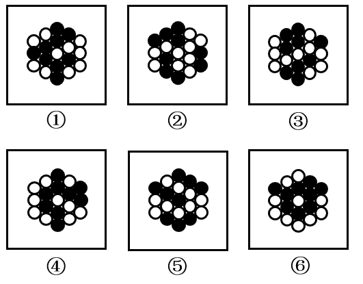

# 2023年国家公务员录用考试《行测》题（地市级网友回忆版）

## 一、常识判断。第一部分 常识判断。 根据题目要求，在四个选项中选出一个最恰当的答案

1.党的二十大报告指出，全面建成社会主义现代化强国，总的战略安排是分两步走。关于到二〇三五年 我国发展的总体目标，下列表述正确的有几项？

① 经济实力、科技实力、综合国力大幅跃升，人均国内生产总值迈上新的大台阶，达到中等发达国家水平 
② 实现高水平科技自立自强，力争进入创新型国家行列 
③ 建成现代化经济体系，形成新发展格局，基本实现新型工业化、信息化、城镇化、农业现代化 
④ 广泛形成绿色生产生活方式，基本实现“碳中和”目标，生态环境根本好转，美丽中国目标全面实现 
⑤ 把我国建设成为综合国力和国际影响力领先的社会主义现代化强国

A、2项 &emsp; B、3项 &emsp; C、4项 &emsp; D、5项

答案及解析

本题考查政治常识。

①正确，二十大报告中“三、新时代新征程中国共产党的使命任务”部分指出：“到二〇三五年，我国发展的总体目标是：经济实力、科技实力、综合国力大幅跃升，人均国内生产总值迈上新的大台阶，达到中等发达国家水平······” 
②错误，二十大报告中“三、新时代新征程中国共产党的使命任务”部分指出：“到二〇三五年，我国发展的总体目标是：经济实力、科技实力、综合国力大幅跃升······实现高水平科技自立自强，进入创新型国家前列······”故应进入创新型国家“前列”。 
③正确，二十大报告中“三、新时代新征程中国共产党的使命任务”部分指出：“到二〇三五年，我国发展的总体目标是：经济实力、科技实力、综合国力大幅跃升······建成现代化经济体系，形成新发展格局，基本实现新型工业化、信息化、城镇化、农业现代化······” 
④错误，二十大报告中“三、新时代新征程中国共产党的使命任务”部分指出：“到二〇三五年，我国发展的总体目标是：经济实力、科技实力、综合国力大幅跃升······广泛形成绿色生产生活方式，碳排放达峰后稳中有降，生态环境根本好转，美丽中国目标基本实现······”其中“碳排放达峰后稳中有降”为“碳达峰”目标；“排出的二氧化碳或温室气体被植树造林、节能减排等形式抵消”为“碳中和”目标。 
⑤错误，二十大报告中“三、新时代新征程中国共产党的使命任务”部分指出：“在基本实现现代化的基础上，我们要继续奋斗，到本世纪中叶，把我国建设成为综合国力和国际影响力领先的社会主义现代化强国。”

综上所述，正确的有①③，共2项。 
故正确答案为A

2.党的二十大报告指出，要发展全过程人民民主，保障人民当家作主。关于人民民主，下列表述正确的是：

①人民民主是社会主义的生命，是全面建设社会主义现代化国家的应有之义 
②全过程人民民主是社会主义民主政治的本质属性，是最广泛、最真实、最管用的民主 
③协商民主是实践全过程人民民主的重要形式 
④党内民主是全过程人民民主的重要体现

A、①③④ &emsp; B、①②④ &emsp; C、①②③ &emsp; D、②③④

答案及解析

本题考查政治常识。

①②正确，二十大报告中“六、发展全过程人民民主，保障人民当家作主”部分指出：“我国是工人阶级领导的、以工农联盟为基础的人民民主专政的社会主义国家，国家一切权力属于人民。人民民主是社会主义的生命，是全面建设社会主义现代化国家的应有之义。全过程人民民主是社会主义民主政治的本质属性，是最广泛、最真实、最管用的民主。” 
③正确，二十大报告中“六、发展全过程人民民主，保障人民当家作主”部分指出：“（二）全面发展协商民主。协商民主是实践全过程人民民主的重要形式。完善协商民主体系，统筹推进政党协商、人大协商、政府协商、政协协商、人民团体协商、基层协商以及社会组织协商，健全各种制度化协商平台，推进协商民主广泛多层制度化发展。” 
④错误，二十大报告中“六、发展全过程人民民主，保障人民当家作主”部分指出：“（三）积极发展基层民主。基层民主是全过程人民民主的重要体现。健全基层党组织领导的基层群众自治机制，加强基层组织建设，完善基层直接民主制度体系和工作体系，增强城乡社区群众自我管理、自我服务、自我教育、自我监督的实效。” 

综上所述，①②③正确。 
故正确答案为C

3.党的二十大报告指出，新时代十年来“党和国家事业取得历史性成就、发生历史性变革”。关于新时代十年来取得的历史性成就，下列表述错误的是：

A、谷物总产量稳居世界首位 
B、制造业规模、外汇储备稳居世界第一 
C、全社会研发经费支出跃居世界第一 
D、建成世界最大的高速铁路网

答案及解析

本题考查政治常识。

C项错误，A、B、D三项正确，二十大报告中“一、过去五年的工作和新时代十年的伟大变革”部分指出：“我们提出并贯彻新发展理念，着力推进高质量发展，推动构建新发展格局，实施供给侧结构性改革，制定一系列具有全局性意义的区域重大战略，我国经济实力实现历史性跃升······谷物总产量稳居世界首位，十四亿多人的粮食安全、能源安全得到有效保障。城镇化率提高十一点六个百分点，达到百分之六十四点七。制造业规模、外汇储备稳居世界第一。建成世界最大的高速铁路网、高速公路网，机场港口、水利、能源、信息等基础设施建设取得重大成就。我们加快推进科技自立自强，全社会研发经费支出从一万亿元增加到二万八千亿元，居世界第二位，研发人员总量居世界首位······”

本题为选非题，故正确答案为C。

4.习近平经济思想是习近平新时代中国特色社会主义思想的重要组成部分。关于习近平经济思想，下列表述正确的有几项？

①进入新发展阶段是我国经济发展的历史方位 
②推动高质量发展是我国经济发展的鲜明主题 
③坚持新发展理念是我国经济发展的指导原则 
④坚持对外开放是我国经济发展的第一动力 
⑤大力发展制造业和实体经济是我国经济发展的主要着力点

A、2项 &emsp; B、3项 &emsp; C、4项 &emsp; D、5项

答案及解析

本题考查政治常识。

①②③⑤正确，④错误。由中共中央宣传部、国家发展和改革委员会组织编写的《习近平经济思想学习纲要》，将习近平经济思想基本内容梳理归纳为十三个方面：（1）加强党对经济工作的全面领导是我国经济发展的根本保证；（2）坚持以人民为中心的发展思想是我国经济发展的根本立场；（3）进入新发展阶段是我国经济发展的历史方位；（4）坚持新发展理念是我国经济发展的指导原则；（5）构建新发展格局是我国经济发展的路径选择；（6）推动高质量发展是我国经济发展的鲜明主题；（7）坚持和完善社会主义基本经济制度是我国经济发展的制度基础；（8）坚持问题导向部署实施国家重大发展战略是我国经济发展的战略举措；（9）坚持创新驱动发展是我国经济发展的第一动力；（10）大力发展制造业和实体经济是我国经济发展的主要着力点；（11）坚定不移全面扩大开放是我国经济发展的重要法宝；（12）统筹发展和安全是我国经济发展的重要保障；（13）坚持正确工作策略和方法是做好经济工作的方法论。

综上所述，正确的有①②③⑤，共4项。 
故正确答案为C。

5.习近平总书记指出，共同富裕是社会主义的本质要求，是中国式现代化的重要特征。下列对共同富裕的理解，正确的有几项？

①共同富裕是全体人民共同富裕，是人民群众物质生活和精神生活都富裕 
②鼓励各地因地制宜探索有效路径，按照城市、农村以及东部、中部、西部，确定各自指标，分阶段促进共同富裕 
③要处理好效率和公平的关系，构建初次分配、再分配、三次分配协调配套的基础性制度安排 
④实现共同富裕的目标，首先要通过全国人民共同奋斗把“蛋糕”做大做好，然后通过合理的制度安排正确处理增长和分配关系，把“蛋糕”切好分好

A、1项 &emsp; B、2项 &emsp; C、3项 &emsp; D、4项

答案及解析

本题考查政治常识。

①正确，在2021年第20期《求是》杂志刊发的《扎实推动共同富裕》一文中，习近平总书记强调，共同富裕是社会主义的本质要求，是中国式现代化的重要特征。我们说的共同富裕是全体人民共同富裕，是人民群众物质生活和精神生活都富裕，不是少数人的富裕，也不是整齐划一的平均主义。 
②错误，2021年8月17日，中央财经委第十次会议召开，议题之一是研究扎实促进共同富裕问题。会议强调，要坚持循序渐进，对共同富裕的长期性、艰巨性、复杂性有充分估计，鼓励各地因地制宜探索有效路径，总结经验，逐步推开。在2021年第20期《求是》杂志刊发的《扎实推动共同富裕》一文中，习近平总书记提出，我总的认为，像全面建成小康社会一样，全体人民共同富裕是一个总体概念，是对全社会而言的，不要分成城市一块、农村一块，或者东部、中部、西部地区各一块，各提各的指标，要从全局上来看。 
③正确，2021年8月17日，中央财经委员会召开第十次会议强调，要坚持以人民为中心的发展思想，在高质量发展中促进共同富裕，正确处理效率和公平的关系，构建初次分配、再分配、三次分配协调配套的基础性制度安排。 
④正确，2021年中央经济工作报告指出，实现共同富裕目标，首先要通过全国人民共同奋斗把“蛋糕”做大做好，然后通过合理的制度安排把“蛋糕”切好分好。这是一个长期的历史过程。

故正确的有①③④，共3项。 
故正确答案为

6.《“十四五”全国农业绿色发展规划》是我国首部农业绿色发展专项规划，对“十四五”农业绿色发展工作作出了系统部署和具体安排。下列与之相关的说法错误的是：

A、到2035年，农村生态环境根本好转，绿色生产生活方式广泛形成 
B、以果菜茶优势区为重点推动粪肥还田利用，减少化肥用量 
C、在西北地区支持一批用膜大县整县推进农膜回收 
D、在长江中下游、西南地区等南方粮食主产区集中示范耕作压盐技术模式

答案及解析

本题考查政治常识。

《“十四五”全国农业绿色发展规划》以下简称《规划》。 
A项正确，《规划》第二章第三节“发展目标”部分指出：“到2035年，农业绿色发展取得显著成效，农村生态环境根本好转，绿色生产生活方式广泛形成，农业生产与资源环境承载力基本匹配，生产生活生态相协调的农业发展格局基本建立，美丽宜人、业兴人和的社会主义新乡村基本建成。” 
B项正确，《规划》第四章第一节“推进化肥农药减量增效”部分指出：“推进化肥减量增效。技术集成驱动，以化肥减量增效为重点，集成推广科学施肥技术。在粮食主产区、园艺作物优势产区和设施蔬菜集中产区，推广机械施肥、种肥同播等措施，示范推广缓释肥、水溶肥等新型肥料，改进施肥方式。有机肥替代推动，以果菜茶优势区为重点推动粪肥还田利用，减少化肥用量，增加优质绿色产品供给。引导地方加大投入，在更大范围推进有机肥替代化肥。新型经营主体带动，培育扶持一批专业化服务组织，开展肥料统配统施社会化服务。鼓励农企合作推进测土配方施肥。” 
C项正确，《规划》第四章第三节“加强白色污染治理”部分指出：“推进农膜回收利用。落实严格的农膜管理制度，加强农膜生产、销售、使用、回收、再利用等环节管理。推广普及标准地膜，开展地膜覆盖技术适宜性评估，因地制宜调减作物覆膜面积。强化市场监管，禁止企业生产、采购、销售不符合国家强制性标准的地膜。积极探索推广环境友好生物可降解地膜。促进废旧地膜加工再利用，培育专业化农膜回收主体，发展废旧地膜机械化捡拾，建设农膜储存加工场点。建立健全农膜回收利用机制，在西北地区支持一批用膜大县整县推进农膜回收，加强长江经济带农膜回收利用，健全回收网络体系。开展区域农膜回收补贴制度试点，探索建立地膜生产者责任延伸制度。建立健全农田地膜残留监测点，开展常态化、制度化监测评估。【资源公众号：biguo25】 
D项错误，《规划》第三章第一节“加强耕地保护与质量建设”部分指出：“加强退化耕地治理。坚持分类分区治理，集成推广土壤改良、地力培肥、治理修复等技术，有序推进退化耕地治理。在长江中下游、西南地区、华南地区等南方粮食主产区集成推广施用土壤调理剂、绿肥还田等技术模式，逐步实现酸化耕地降酸改良。在西北灌溉区、滨海灌溉区和松嫩平原西部等盐碱集中地区集成示范施用土壤调理剂、耕作压盐等技术模式，逐步实现盐碱耕地压盐改良。‘十四五’期间累计治理酸化、盐碱化耕地1400万亩。”

本题为选非题，故正确答案为D。

7 下列与金融活动相关的说法错误的是：

A、有价证券的债务人可以请求债权人支付相应对价 
B、开展储蓄业务有助于实现货币购买力和商品供应量的平衡 
C、分红型商业保险的收益与保险公司的经营状况有关 
D、办理国家助学贷款的学生不需要办理贷款担保或抵押

答案及解析

本题考查经济常识。

A项错误，有价证券，是指标有票面金额，用于证明持有人或该证券指定的特定主体对特定财产拥有所有权或债权的凭证。有价证券的法律特征有： 
（一）有价证券与证券上所记载的财产权利不能分离。 
（二）有价证券的债务人是特定的，即证券的权利人只能向证券上记载的债务人请求实现债权。 
（三）有价证券的债务人的支付是单方义务，债务人不得请求权利人支付相应对价。 
B项正确，储蓄是指每个人或家庭，把节约的钱存到银行的经济活动。居民储蓄被银行积累起来，相应地增加社会可用的资金总量，支援社会生产发展，促进了社会积累的形成或增长。国家通过开展储蓄业务，可以有效地减少需求压力，实现货币购买力和商品供应量的平衡，调节货币流通。 
C项正确，分红型商业保险指保险公司将其实际经营成果优于定价假设的盈余，按一定比例向保单持有人进行分配的人寿保险产品。保单持有人可以分享保险公司经营成果的保险种类，保单持有人每年都有权获得建立在保险公司经营成果基础上的红利分配。 
D项正确，国家助学贷款是由政府主导，金融机构向高校家庭经济困难学生提供的信用助学贷款，帮助解决在校期间的学费和住宿费。国家助学贷款是信用贷款，学生不需要办理贷款担保或抵押，但需要承诺按期还款，并承担相关法律责任。

本题为选非题，故正确答案为A。

8 根据《中华人民共和国退役军人保障法》，下列说法正确的是：

A、参战退役军人的随迁子女入学可以得到优先保障 
B、退役的军士和义务兵可以逐月领取退役金 
C、已被大学录取的现役军人可以在退伍后四年内入学 
D、退役军人创办企业可以享受免税、贷款免息等优惠政策

答案及解析

本题考查法律常识。

A项正确，根据《中华人民共和国退役军人保障法》第二十九条第四款第一项规定：“随迁子女需要转学、入学的，安置地人民政府教育行政部门应当予以及时办理。对下列退役军人的随迁子女，优先保障：（一）参战退役军人。” 
B项错误，根据《中华人民共和国退役军人保障法》第二十一条第一款规定：“对退役的军官，国家采取退休、转业、逐月领取退役金、复员等方式妥善安置。”第二十二条第一款规定：“对退役的军士，国家采取逐月领取退役金、自主就业、安排工作、退休、供养等方式妥善安置。”第二十三条第一款规定：“对退役的义务兵，国家采取自主就业、安排工作、供养等方式妥善安置。”因此，退役的军官与军士可适用逐月领取退役金的安置方式，对于退役的义务兵并未规定可适用逐月领取退役金的安置方式。 
C项错误，根据《中华人民共和国退役军人保障法》第三十五条规定：“现役军人入伍前已被普通高等学校录取或者是正在普通高等学校就学的学生，服现役期间保留入学资格或者学籍，退役后两年内允许入学或者复学，可以按照国家有关规定转入本校其他专业学习。达到报考研究生条件的，按照国家有关规定享受优惠政策。”因此，已被大学录取的现役军人可以在退伍后两年内入学，而非四年。 
D项错误，根据《中华人民共和国退役军人保障法》第四十六条规定：“退役军人创办小微企业，可以按照国家有关规定申请创业担保贷款，并享受贷款贴息等融资优惠政策。退役军人从事个体经营，依法享受税收优惠政策。”因此，退役军人创办企业可以享受税收优惠、贷款贴息等优惠政策，而非享受免税、贷款免息等优惠政策。

故正确答案为A。

9 根据《中华人民共和国生物安全法》，下列说法错误的是：

A、境外组织不得在我国从事中、高风险的生物技术研究、开发活动 
B、任何单位和个人未经批准，不得擅自引进、释放或者丢弃外来物种 
C、对高致病性的病原微生物，一律不得从事相关实验活动 
D、国家对我国人类遗传资源和生物资源享有主权

答案及解析

本题考查法律常识。

A项正确，根据《中华人民共和国生物安全法》第三十八条第一款规定：“从事高风险、中风险生物技术研究、开发活动，应当由在我国境内依法成立的法人组织进行，并依法取得批准或者进行备案。” 
B项正确，根据《中华人民共和国生物安全法》第六十条第三款规定：“任何单位和个人未经批准，不得擅自引进、释放或者丢弃外来物种。” 
C项错误，根据《中华人民共和国生物安全法》第四十六条第一款规定：“高等级病原微生物实验室从事高致病性或者疑似高致病性病原微生物实验活动，应当经省级以上人民政府卫生健康或者农业农村主管部门批准，并将实验活动情况向批准部门报告。” 
D项正确，根据《中华人民共和国生物安全法》第五十三条第二款规定：“国家对我国人类遗传资源和生物资源享有主权。”

本题为选非题，故正确答案为C。

10 下列与交通安全有关的说法错误的是：

A、机动车载运放射性危险物品应当经公安机关批准后按指定的时间、路线、速度行驶 
B、在允许拖拉机通行的道路上，拖拉机可以从事货运，但是不得用于载人 
C、行人故意碰撞机动车造成交通事故的，机动车一方承担次要责任 
D、前车为执行紧急任务的救护车、工程救险车的，后车不得超车

答案及解析

本题考查法律常识。

A项正确，根据《中华人民共和国道路交通安全法》第四十八条第三款规定：“机动车载运爆炸物品、易燃易爆化学物品以及剧毒、放射性等危险物品，应当经公安机关批准后，按指定的时间、路线、速度行驶，悬挂警示标志并采取必要的安全措施。” 
B项正确，根据《中华人民共和国道路交通安全法》第五十五条第二款规定：“在允许拖拉机通行的道路上，拖拉机可以从事货运，但是不得用于载人。” 
C项错误，根据《中华人民共和国道路交通安全法》第七十六条第二款规定：“交通事故的损失是由非机动车驾驶人、行人故意碰撞机动车造成的，机动车一方不承担赔偿责任。”由此说明机动车一方无需承担次要责任。 
D项正确，根据《中华人民共和国道路交通安全法》第四十三条第三项规定：“同车道行驶的机动车，后车应当与前车保持足以采取紧急制动措施的安全距离。有下列情形之一的，不得超车：（三）前车为执行紧急任务的警车、消防车、救护车、工程救险车的。”

本题为选非题，故正确答案为C。

11 关于电信诈骗，下列说法错误的是：

A、非法使用“伪基站”实施电信诈骗的以非法侵入计算机信息系统罪追究刑事责任 
B、实施电信诈骗最高可被判处无期徒刑 
C、电信诈骗受害人可以通过诉讼程序要求服务存在缺陷的电信运营商承担相应责任 
D、负责招募他人实施电信网络诈骗犯罪活动的，以共同犯罪论处

答案及解析

本题考查法律常识。

A项错误，根据《关于办理电信网络诈骗等刑事案件适用法律若干问题的意见》第三节第一点规定：“（一）在实施电信网络诈骗活动中，非法使用‘伪基站’‘黑广播’，干扰无线电通讯秩序，符合刑法第二百八十八条规定的，以扰乱无线电通讯管理秩序罪追究刑事责任。同时构成诈骗罪的，依照处罚较重的规定定罪处罚。”因此，非法使用“伪基站”实施电信网络诈骗活动，可能构成扰乱无线电通讯管理秩序罪或诈骗罪，不构成非法侵入计算机信息系统罪。 
B项正确，根据《中华人民共和国刑法》第二百六十六条规定：“诈骗公私财物，数额较大的，处三年以下有期徒刑、拘役或者管制，并处或者单处罚金；数额巨大或者有其他严重情节的，处三年以上十年以下有期徒刑，并处罚金；数额特别巨大或者有其他特别严重情节的，处十年以上有期徒刑或者无期徒刑，并处罚金或者没收财产。本法另有规定的，依照规定。”若是诈骗数额特别巨大或者有其他特别严重情节的可被判处无期徒刑。 
C项正确，根据《中华人民共和国反电信网络诈骗法》第四十六条第二款规定：“电信业务经营者、银行业金融机构、非银行支付机构、互联网服务提供者等违反本法规定，造成他人损害的，依照《中华人民共和国民法典》等法律的规定承担民事责任。”第六条第五款规定：“电信业务经营者、银行业金融机构、非银行支付机构、互联网服务提供者承担风险防控责任，建立反电信网络诈骗内部控制机制和安全责任制度，加强新业务涉诈风险安全评估。”因此，电信运营商服务存在缺陷违反了《中华人民共和国反电信网络诈骗法》规定，受害人可以通过诉讼程序要求其承担相应责任。 
D项正确，根据《关于办理电信网络诈骗等刑事案件适用法律若干问题的意见》第四节第四点规定：“负责招募他人实施电信网络诈骗犯罪活动，或者制作、提供诈骗方案、术语清单、语音包、信息等的，以诈骗共同犯罪论处。”

本题为选非题，故正确答案为A。

12 根据《中华人民共和国职业教育法》，关于企业开展职业教育，下列说法错误的是：

A、企业设立产教融合实训基地的，在公共事业费用上享受高于职业学校的优惠政策 
B、企业应当按照职工工资总额一定比例提取使用职工教育经费 
C、用于一线职工职业教育的经费应当达到国家规定的比例 
D、企业安排职工到职业学校接受职业教育的，应支付职业教育期间工资

答案及解析

本题考查法律常识。

A项错误，根据《中华人民共和国职业教育法》第五十八条第二款规定：“企业设立具备生产与教学功能的产教融合实习实训基地所发生的费用，可以参照职业学校享受相应的用地、公用事业费等优惠。”题中，应是参照职业学校享受相应的公用事业费优惠，而非享受高于职业学校的优惠政策。 
B、C、D三项正确，根据《中华人民共和国职业教育法》第五十八条第一款规定：“企业应当根据国务院规定的标准，按照职工工资总额一定比例提取和使用职工教育经费。职工教育经费可以用于举办职业教育机构、对本单位的职工和准备招用人员进行职业教育等合理用途，其中用于企业一线职工职业教育的经费应当达到国家规定的比例。用人单位安排职工到职业学校或者职业培训机构接受职业教育的，应当在其接受职业教育期间依法支付工资，保障相关待遇。”

本题为选非题，故正确答案为A。

13 习近平主席在二〇二二年新年贺词中提到了“祝融”探火、“羲和”逐日、“天和”遨游星辰。下列与之相关的说法正确的是：

A、“祝融号”火星车使用的是核动力电池 
B、“羲和号”是我国首颗太阳探测科学技术试验卫星 
C、“祝融”“羲和”“天和”都是古代神话中的人物 
D、聂海胜等三名航天员搭乘神舟十四号前往天和核心舱

答案及解析

本题考查政治常识。

A项错误，中国的“祝融号”火星车并没有配备核电池，在火星上的一切行动依靠太阳能帆板来提供动力。“祝融号”火星车采用了4块超大型太阳能帆板，而且会随着太阳光的照射进行旋转，确保能吸收充足的太阳能。 
B项正确，2021年10月14日18时51分，我国在太原卫星发射中心采用长征二号丁运载火箭，成功发射首颗太阳探测科学技术试验卫星“羲和号”，实现我国太阳探测零的突破，这标志着我国正式步入“探日”时代。 
C项错误，祝融，号赤帝，中国古代神话中的火神、南方神、南岳神、南海神、夏神、灶神，五行神之一。羲和，中国上古神话中的太阳女神与制定时历的女神。羲和的原始形态来源于远古神话，在时代的更迭中她由最初的“日母”演变成“日御”，在后来的不断演化发展中，羲和又作为太阳神话、天文史官的代表人物。“天和”一词，最早出自《庄子·知北游》：若正汝形，一汝视，天和将至。天和指人的元气，也指天地祥和之气，自然和顺之理，天地之和气，并非古代神话中的人物。 
D项错误，2022年6月5日，搭载神舟十四号载人飞船的长征二号F遥十四运载火箭点火发射并取得圆满成功。当天，在神舟十四号载人飞船与空间站组合体成功实现自主快速交会对接后，航天员陈冬、刘洋、蔡旭哲依次进入中国空间站天和核心舱，正式开启为期6个月的在轨驻留。

故正确答案为B。

14 “亲人送水来解渴，军民鱼水一家人。横断山，路难行。······乌江天险重飞渡，兵临贵阳逼昆明。敌人弃甲丢烟枪，我军乘胜赶路程。调虎离山袭金沙······”这是歌曲《四渡赤水出奇兵》中的一段歌词，下列与之相关的说法正确的是：

A、“调虎离山袭金沙”是由毛泽东指挥的 
B、李白《蜀道难》描写的正是此地“路难行”的状况 
C、“军民鱼水”之情表现了沿途人民群众对新四军的支持 
D、“乌江天险”正是楚汉战争时项羽兵败自刎的地方

答案及解析

本题考查人文常识。

A项正确，“调虎离山袭金沙”是指四渡赤水，南渡乌江后，中央红军就把敌人的追兵甩在了后面。此时，毛泽东指出：要实现从云南北渡金沙江入川的战略目标，就在于能否调出滇军，调出滇军就是胜利。毛泽东采取声东击西的战术，命一部分兵力向瓮安、黄平方向佯攻，做出东进湖南与二、六军团会合的姿态，主力则直逼贵阳。在贵阳督战的蒋介石，急调滇军三个旅驰援贵阳，中央红军突然调头西进云南，做出攻打昆明的态势。龙云惊恐万状，火速从金沙江边调回民团以解昆明之急，金沙江一线江防顿时空虚，红军主力则迅速兵分三路，从寻甸、嵩明之间穿过，以每日120里的急行军速度直插金沙江边的皎平、龙街和洪门渡口。 
B项错误，李白《蜀道难》描绘了秦蜀道路上奇丽惊险的山川，“蜀道”指的是今四川广元市境内剑门一带。而歌曲描述的四渡赤水的地点在贵州省、四川省、云南省交界地区，不是同一地方。 
C项错误，新四军即国民革命军陆军新编第四军，隶属于国民党军队战斗序列，是第二次国共合作期间由第五次反围剿失败后留在南方八省进行游击战争的中国工农红军和游击队改编的队伍。“军民鱼水”之情表现的是长征途中沿途人民群众对中央红军的支持。 
D项错误，“乌江天险”中的乌江，又名黔江，是贵州的第一道大江，自古有天险之称。而项羽的自刎之地是现在的安徽省和县乌江镇。

故正确答案为A

15 近年来，我国不断推进水生态修复保护工作。生态塘是包含水生动植物和微生物的一种水生态修复方式。下列与之相关的说法，错误的是：

A、狐尾藻可用于富营养化水体的生态修复是因其可吸收氮磷 
B、可以用生石灰对生态塘沿岸土壤进行消毒处理 
C、池塘中的水体出现黑臭时可通过种植芦苇等植物进行改善 
D、生态塘中的青鱼等肉食性鱼类主要在池塘上层水体活动

答案及解析

本题考查科技常识。

A项正确，狐尾藻是小二仙草科狐尾藻属植物，多年生粗壮沉水草本。根状茎发达，在水底泥中蔓延，节部生根，对富营养化水中的氮磷均有较好的净化作用。 
B项正确，蛋白质在遇到高温、强碱、强酸、重金属离子时会变性，蛋白质就失去了生物活性。生石灰遇水会发生反应放出大量的热，并且生成强碱，可以使细菌的蛋白质失去活性从而起到杀菌消毒的作用。 
C项正确，芦苇的根状茎十分发达，其叶、叶鞘、茎、根状茎和不定根都具有通气组织。当黑臭污水通过芦苇湿地系统时，芦苇能从污水中吸收营养物质加以利用，并能吸附和富集重金属及一些有毒有害物质，使水质得到净化。 
D项错误，青鱼是鲤科、青鱼属鱼类，体长可达145厘米，通常栖息在水的中下层，生性不活泼。其主要的食物来源为螺蛳、蚌、蚬、蛤等，偶尔也捕食虾和昆虫幼虫。

本题为选非题，故正确答案为D。

16 关于人体的生理现象，下列说法正确的是：

A、人体在流汗时汗腺内的盐分浓度会降低 
B、蚊虫叮咬造成的皮肤发痒属于过敏反应 
C、打嗝声是由胃部痉挛和声带闭合造成的 
D、皮肤受伤流血处的血管会先扩张后收缩

答案及解析

本题考查科技常识。

A项错误，汗液的形成一般是由于外界气温升高或者体内产热导致热刺激，激活汗腺功能，分泌大量液体，通过汗孔排到体表。由于汗腺还具备从产生出的汗液中再次将盐分吸收回体内的功能，所以通过再次吸收盐分，可以将盐分的流失抑制到最小程度。因此人体在流汗时汗腺内的盐分浓度会升高。 
B项正确，蚊虫叮咬引起的过敏症状有皮肤出现红肿、瘙痒，这是比较常见的过敏症状，也是比较轻微的过敏症状。出现这些症状是因为蚊虫叮咬所释放的唾液在皮肤组织产生刺激性的反应。 
C项错误，打嗝指气从胃中上逆，喉间频频作声，声音急而短促。这是一个生理上常见的现象，是由横膈膜痉挛收缩引起的。健康人打嗝多与饮食有关，特别是饮食过快、过饱，摄入很热或冷的食物饮料、饮酒等，外界温度变化和过度吸烟亦可引起。 
D项错误，当皮肤受伤流血后，血管会立即收缩，而不是先扩张后收缩。其收缩的目的是减少流向受伤部位的血液。过一段时间受伤部分的血液就会自动凝结变成血块，不让血液继续流出。

故正确答案为B

17 关于自然节律变化，下列说法错误的是：

A、惊蛰后华北地区可能会出现“万里雪飘”的现象 
B、2月北回归线附近会出现“儿童急走追黄蝶，飞入菜花无处寻”的现象 
C、冬至时，在广东汕头竖直立杆会出现“立竿无影”的现象 
D、谷雨前后江浙地区可能会出现“一把青秧趁手青，轻烟漠漠雨冥冥”的现象

答案及解析

本题考查地理国情。

A项正确，惊蛰，又名“启蛰”，是二十四节气中的第三个节气，于每年公历3月5-6日交节。有谚语“雪打惊蛰节，四十五天阴”，意思是惊蛰节气出现下雪天气，后期天气持续阴冷。即惊蛰后华北地区可能出现“万里雪飘”的景象。 
B项正确，选项中诗句出自宋代杨万里的《宿新市徐公店》，意思是小孩子奔跑着追赶黄蝴蝶，可是蝴蝶飞入菜花丛中就再也找不到了。北回归线自西向东穿过中国云南、广西、广东、福建（海域）、台湾五省区。2月我国北回归线附近的地区平均气温在 12~20&deg;C，金黄色的油菜花会开放，所以可以出现诗句中的景象。 
C项错误，立竿无影是一种自然景象，即直立在地上的物体没有阴影显现。在夏至正午时分，太阳直射北回归线呈绝对（接近）直射状，北回归线地区就会出现短暂的“立竿无影”现象。冬至时，太阳直射南回归线，在广东汕头竖直立杆，日影应朝北而不是无影。 
D项正确，选项中诗句出自宋代虞似良的《横溪堂春晓》，意思是将一把青色的秧苗，插入水中，那秧苗瞬间变得青葱，就好似农夫的手，将它染绿，天空中，飘洒着朦胧如烟的细雨。谷雨，是二十四节气中的第六个节气，春季的最后一个节气，于每年公历4月19日-21日交节。谷雨取自“雨生百谷”之意，此时降水明显增加，田中的秧苗初插、作物新种，最需要雨水的滋润。故谷雨前后江浙地区可能会出现诗句中的景象。

本题为选非题，故正确答案为C。

18 下列关于化石的说法正确的是：

A、三叶虫化石是侏罗纪地层中的典型化石 
B、硅化木是树木埋入地下后形成的化石 
C、琥珀的硬度比和田玉大 
D、大多数化石是在侵入岩中被发现的

答案及解析

本题考查科技常识。

A项错误，三叶虫化石，古时称作燕子石，也叫蝙蝠石。三叶虫属古生节肢动物，属三叶虫纲，生于海底，其种类繁多，生于古生代的寒武纪，至奥陶纪最盛，消亡于二叠纪末期的二叠纪大灭绝事件。侏罗纪界于三叠纪和白垩纪之间，是恐龙的鼎盛时期。 
B项正确，硅化木是真正的木化石，是几百万年或更早以前的树木被迅速埋入地下后，被地下水中的二氧化硅替换而成的树木化石，它保留了树木的木质结构和纹理。 
C项错误，琥珀，一种透明的生物化石，是松柏科、云实科、南洋杉科等植物的树脂化石。树脂滴落，掩埋在地下千万年，在压力和热力的作用下石化形成琥珀。其硬度比较低，一般莫氏硬度为2-3。和田玉属镁质大理岩与中酸性岩浆岩接触交代而形成的变质岩，内含透闪石、角闪石、阳起石等多矿物集合体，化学成分是含水的钙镁硅酸盐，莫氏硬度在6-6.5之间。 
D项错误，沉积岩，又称为水成岩，是三种组成地球岩石圈的主要岩石之一（另外两种是岩浆岩和变质岩）。沉积岩保留了许多地球的历史信息，包括大多数古代动植物化石，沉积岩的层理也有地球气候环境变化的信息。侵入岩是指当上覆岩层压力减轻时，软流层中的岩浆就钻出，在地壳深处冷凝而形成的岩石。

故正确答案为B。

19 关于我国著名的资源调配工程，下列说法正确的是：

A、南水北调中线工程的起点是小浪底水库 
B、西电东送中部通道的电力主要来源于火力发电 
C、北煤南运的主要通道包括兰新线和陇海线 
D、西气东输工程贯穿了新疆、甘肃、安徽等省区

答案及解析

本题考查地理国情。

A项错误，“南水北调工程”是中华人民共和国的战略性工程，分东、中、西三条线路，东线工程起点位于**江苏扬州江都水利枢纽**。中线工程起点位于**汉江中上游丹江口水库**，供水区域为河南、河北、北京和天津。 
B项错误，“西电东送”就是把煤炭、水能资源丰富的西部省区的能源转化成电力资源，输送到电力紧缺的东部沿海地区。西电东送主要形成了三大电力输送通道：北线由陕西、山西、内蒙古等省区向华北输送电力，以黄河中上游的水电和山西、内蒙古火电为主。中线主要有四川等省区向华东和华中输送电力，以三峡和金沙江的水电为主。南线主要是云南、贵州、广西等省区向华南输送电力，以水电为主。 
C项错误，北煤南运宏观上指中国北方地区煤炭向南方地区大量运输。北煤南运的主要通道是大同-秦皇岛，太原-青岛，侯马-石臼所，长治-连云港，长治-枝城，长治-武汉等铁路。陇海兰新线是贯穿我国东西的一条铁路大动脉，由陇海线与兰新线组成。 
D项正确，西气东输工程是我国距离最长、口径最大的输气管道，西起塔里木盆地的轮南，东至上海。该工程自西向东依次经过新疆、甘肃、宁夏、陕西、山西、河南、安徽、江苏、上海9个省市区。

故正确答案为D

20 关于生活常识，下列说法错误的是：

A、腹部核磁共振时憋气可让脏器显影更充分 
B、食用蜡可以用于防止微生物对果实的侵害 
C、马铃薯切开后浸泡于清水中可以防止氧化 
D、可以通过虫子取食痕迹判断蘑菇是否有毒

答案及解析

本题考查科技常识。

A项正确，患者进行磁共振扫描检查需要憋气，是因为呼吸期间腹部可出现起伏运动，因为腹部脂肪、水分随着起伏运动出现伪影，影响检查的清晰度，甚至可出现异常的检查结果，导致疾病误诊、漏诊等。患者检查时憋气可让脏器显影更充分，得到较准确的检查结果。 
B项正确，在水果表皮打上食用蜡，不仅可以保鲜，还能防止微生物对果实进行侵害。食用蜡对健康无明显影响，但如果是工业蜡则对身体有害。 
C项正确，马铃薯切开之后浸泡到清水里能防止马铃薯氧化，避免马铃薯变黑，但是将马铃薯切好之后浸泡时间最好不要过长，因为虽然泡水可以去除马铃薯中过多的淀粉，但浸泡时间过长就会出现变质的情况，且也会造成营养流失，吃起来口感下降。 
D项错误，很多对人有毒的蘑菇是其他动物的美食，比如豹斑鹅膏经常被蛞蝓取食，白毒伞也有被虫啮食的记录。

本题为选非题，故正确答案为D。

## 二、言语理解与表达。第二部分 言语理解与表达。 本部分包括表达与理解两方面的内容。请根据题目要求，在四个选项中选出一个最恰当的答案

21 构建新发展格局的关键在于经济循环的______，就像人们讲的要调理好统摄全身阴阳气血的任督二脉。经济活动需要各种生产要素的组合在生产、分配、流通、消费各环节有机衔接，从而实现循环流转。 
填入画横线部分最恰当的一项是：

A、行之有效 &emsp; B、环环相扣 &emsp; C、畅通无阻 &emsp; D、井然有序

答案及解析

根据“就像人们讲的要调理好统摄全身阴阳气血的任督二脉”“实现循环流转”可知，横线处应体现经济循环畅通之意。C项“畅通无阻”指毫无阻碍地通行或通过，符合文意，当选。A项“行之有效”指实行起来有成效，B项“环环相扣”指每一个相互关连的关键或事物紧密配合，D项“井然有序”指整整齐齐，次序分明，条理清楚，三者均无法体现“畅通”之意，排除。

故正确答案为C。

【文段出处】习近平：把握新发展阶段，贯彻新发展理念，构建新发展格局

22 “报得准”是气象监测预报预警的生命力。天气预报准确率高，防灾减灾才能_____，为有关部门正确决策提供科学客观的支撑，应急处置才能有力有效。 
填入画横线部分最恰当的一项是：

A、有条不紊 &emsp; B、有的放矢 &emsp; C、全力以赴 &emsp; D、万无一失

答案及解析

根据“‘报得准’是气象监测预报预警的生命力”可知，强调天气预报准确率高很重要，后文论证，天气预报的准确性高，让防灾减灾更精准，所以横线处需要体现精准、有针对性，B项“有的放矢”指对准靶子射箭，比喻言论、行动目标明确，符合文意，当选。A项“有条不紊”指有条理，有次序，一点儿不乱，文段并非强调防灾减灾的条理性，C项“全力以赴”指把全部力量投入进去，文段并非强调投入全部力量，均与文意不符，排除；D项“万无一失”形容有绝对把握，绝不会出差错，表述过于绝对，排除。

故正确答案为B。

【文段出处】人民日报《庄国泰：早预警早行动 筑牢气象防灾减灾第一道防线》

23 红树林的地下部分长期处于厌氧环境，减缓了根系和凋落物的分解速率，加速了碳埋藏速率。此外，红树林大多分布于沉积型海岸河口，由上游河流和海洋潮汐共同作用带来的大量外源性碳，被它们固定并快速沉积下来。这“_____”的组合拳使得红树林成为海岸带蓝碳碳汇的主要贡献者。 
填入画横线部分最恰当的一项是：

A、取长补短 &emsp; B、标本兼治 &emsp; C、开源节流 &emsp; D、一举两得

答案及解析

根据“减缓了根系和凋落物的分解速率，加速了碳埋藏速率”及“此外······由上游河流和海洋潮汐共同作用带来的大量外源性碳，被它们固定并快速沉积下来”可知，横线处体现红树林两方面的作用和好处，且双引号引导形象化表达。C项“开源节流”比喻在财政经济上增加收入，节省开支，置于此处，“开源”可以对应红树林固定并沉积外源性碳，“节流”对应“减缓了根系和凋落物的分解速率”，符合文意，当选。

A项“取长补短”表示在同类事物中吸取这个的长处来弥补那个的短处，文段并未涉及两者的“长处”与“短处”，与文意不符，排除；B项“标本兼治”指对事物的枝节和根本都加以治理，文段并未涉及“枝节”和“根本”，与文意不符，排除；D项“一举两得”意为做一件事得到两方面的好处，文段的结论仅提及“成为海岸带蓝碳碳汇的主要贡献者”这一个结果，并未体现出两方面的好处，与文意不符，排除。

故正确答案为C。

【文段出处】《会打“组合拳”的“武林高手”——红树林》

24 我国十四亿多人口整体迈向现代化社会，规模超过现有发达国家人口的总和，艰巨性和复杂性_____，发展途径和推进方式也必然具有自己的特点。我们始终从国情出发想问题、作决策、办事情，既不好高骛远，也不因循守旧，保持历史_____，坚持稳中求进、循序渐进、持续推进。 
依次填入画横线部分最恰当的一项是：

A、无与伦比 清醒 &emsp; B、前所未有 耐心 &emsp; C、无以复加 自信 &emsp; D、异乎寻常 主动

答案及解析

本题从第二空入手，根据横线后内容“坚持稳中求进、循序渐进、持续推进”可知，横线处表达不急于求成，B项“耐心”指不急躁，不厌烦，与文意相符，保留。A项“清醒”指清楚、明白，侧重不糊涂，C项“自信”指自己相信自己，侧重不自馁，D项“主动”指不待外力推动而行动，侧重不被动，三者均与文意不符，排除。

第一空，代入验证，B项“前所未有”指以前从来没有过，可以体现“艰巨性和复杂性”在以往的历史上不曾出现，与前文“规模超过现有发达国家人口的总和”对应恰当，当选。

故正确答案为B。

【文段出处】瞭望《以中国式现代化全面推进中华民族伟大复兴》

25 相比于其他全球卫星导航系统采取单一轨道星座构型，北斗系统____，坚定选择了混合星座的特色发展之路，并首创短文通报模式，开创了通信导航一体化的独特服务模式，信息发送能力从一次120个汉字提升到一次1200个汉字，遇到突发情况时无需____，足以将情节一次性说清楚。 
依次填入画横线部分最恰当的一项是：

A、与众不同 言简意赅 &emsp; B、独树一帜 字斟句酌 &emsp;  
C、遥遥领先 删繁就简 &emsp; D、迎难而上 惜墨如金 &emsp;

答案及解析

第一空，搭配“北斗系统”，且根据后文“特色发展之路”“首创短文通报模式，开创了······独特服务模式”可知，“北斗系统”与其他卫星导航系统不同，具有独特性。B项“独树一帜”指单独树立起一面旗帜，指自成一家，A项“与众不同”指与大家不一样，二者均能够体现出独特性，符合文意，保留；C项“遥遥领先”指远远地走在最前面，D项“迎难而上”形容不怕困难挫折，勇敢地挑战，二者均与文意无关，排除。

第二空，对应前文“信息发送能力从一次120个汉字提升到一次1200个汉字”，后文“一次性说清楚”，可知，北斗系统信息发送能力得到提升，遇到突发情况不必过分推敲，删减字数。B项“字斟句酌”指写文章或说话慎重细致，一字一句地推敲琢磨，与文意相符，当选；A项“言简意赅”指语言简明而意思完备，“无需言简意赅”指的是表述啰嗦、繁复冗长，北斗系统的信息发送能力提升，并不意味着表述啰嗦、冗长，与文意不符，排除。

故正确答案为B。

【文段出处】光明网《圆梦！中国北斗正式登上世界舞台》；中国经济网《“北斗三号”收官，正式服务全球》

26 地方政府要以民众利益、公共利益、国家利益为重，不能只追求短期利益，只追求政绩，而做出____的事情来。对官员的政绩考核、对政府的绩效评估，更要注重民生，注重社会的长远发展。这样才能从根本上避免破坏可持续发展大局、损害民众利益等“____”现象的继续发生。 
依次填入画横线部分最恰当的一项是：

A、本末倒置 抱薪救火 &emsp; B、饮鸩止渴 掩耳盗铃 &emsp; 
C、扬汤止沸 移花接木 &emsp; D、竭泽而渔 杀鸡取卵 &emsp;

答案及解析

第一空，根据横线前“不能只追求短期利益，只追求政绩”可知，横线处所填成语应表达只图眼前利益，不作长远打算之意。A项“本末倒置”比喻把主要事物和次要事物或事物的主要方面和次要方面弄颠倒了，置于此处可表达地方政府不以民众、公共、国家利益为重，而只追求政绩的短视行为，符合文意，保留；D项“竭泽而渔”比喻取之不留余地，只顾眼前利益，不作长远打算，符合文意，保留。B项“饮鸩止渴”比喻用错误的方法解决眼前的困难而不顾严重后果，文段并无“解决眼前的困难”之意，与文意不符，排除；C项“扬汤止沸”比喻办法不对头，不能从根本上解决问题，文段强调的是只图眼前利益，不作长远打算，与文意不符，排除。

第二空，根据横线前“避免破坏可持续发展大局”及“损害民众利益”可知，横线处所填成语应表达不顾可持续发展大局，损害民众利益，只顾眼前利益之意。D项“杀鸡取卵”比喻只图眼前的好处而损害长远的利益，符合文意，当选。A项“抱薪救火”比喻因为方法不对，虽然有心消灭祸患，结果反而使祸患扩大，文段并无要“消灭祸患”之意，与文意不符，排除。

故正确答案为D。

【文段出处】《世界地质公园遭破坏 保护环境就要肃清错误政绩观》

27 翻开古代农书，几千年间古人对于土地的保养，几乎与当代耕作学关注的措施____，其中历代农书涉及最多的是施肥。在中国古人的摸索中，施肥成为一种讲究，何时、何地施肥，施何种肥，怎样施肥，形成了一个____的体系，在每个年度的农业生产进程中，精心安排在各个时节。 
依次填入画横线部分最恰当的一项是：

A、一脉相承 科学 &emsp; B、如出一辙 固定 &emsp; C、别无二致 完整 &emsp; D、不谋而合 复杂

答案及解析

第一空，形容古人对土地的保养方法与当代耕作措施的关系。B项“如出一辙”比喻两件事情非常相似，C项“别无二致”指区分不出两者的差别，D项“不谋而合”指事先没有商量过，意见或行动却完全一致，均有相似之意，符合文段语境，保留。A项“一脉相承”比喻某种思想、行为或学说之间有继承关系，一般用法为“现在的情况”和“之前的情况”一脉相承，不能说“古人的做法”与“当代的措施”一脉相承，用法不当，排除。

第二空，根据“何时、何地施肥，施何种肥”“精心安排在各个时节”可以看出，古人经过摸索，施肥的措施已经十分完善和周到。C项“完整”指具有或保持着应有的部分，没有损坏或残缺，符合文意，当选。B项“固定”指不变动或不移动的，文段并没有体现出“不变”，排除；D项“复杂”指（事物的种类、头绪等）多而杂，文段没有体现出“复杂”，且感情色彩较为消极，排除。

故正确答案为C。

【文段出处】《古代农业中的人地关系》

28 要加强国际传播的理论研究，掌握国际传播的规律，构建对外话语体系，提高传播艺术。要采用____不同区域、不同国家、不同群体受众的精准传播方式，推进中国故事和中国声音的全球化表达、区域化表达、分众化表达，增强国际传播的____和实效性。 
依次填入画横线部分最恰当的一项是：

A、满足 影响力 &emsp; B、贴近 亲和力 &emsp; C、融合 感染力 &emsp; D、细分 说服力

答案及解析

第一空，根据文意可知，要针对不同区域、不同国家、不同群体受众采用精准的传播方式。B项“贴近”指靠近，D项“细分”指详细区分，置于文段均符合文意，保留。A项“满足”指使满足，填入此处应为“满足不同区域、不同国家、不同群体需求的精准传播方式”，故用法错误，排除；C项“融合”指几种不同的事物合为一体，置于文段意为采用一种传播方式，与后文“精准传播方式”矛盾，与文意不符，排除。

第二空，根据文意可知，横线处所填词语应体现出“精准传播方式”对“国际传播”的意义。B项“亲和力”比喻使人亲近、愿意接触的力量，D项“说服力”指说话者运用各种可能的技巧去说服受众的能力，采用精准的方式进行“国际传播”可使传播内容更易被接受，而非说服别人，且B项“亲和力”与“贴近”能形成前后呼应，故B项更契合文意，当选，排除D项。

故正确答案为B。

【文段出处】《习近平在中共中央政治局第三十次集体学习时强调 加强和改进国际传播工作 展示真实立体全面的中国》

29 对于新业态新模式冲击本地的传统产业，是包容审慎，还是____？对于非本地人才就业创业、非本地企业项目立项推广，能否____，甚至千方百计降门槛、清路障以留人留项目？纵观先进制造业集群所在地，无一不是当地政府部门怀着“开放之心”，营造出良好的创新生态。 
依次填入画横线部分最恰当的一项是：

A、如芒在背 一视同仁 &emsp; B、退避三舍 不偏不倚 &emsp; 
C、拒之门外 开诚布公 &emsp; D、推三阻四 海纳百川 &emsp;

答案及解析

第一空，根据“是······还是”可知，横线处与“包容审慎”构成反义并列，体现出与“包容”相对的态度，即不接受新业态、新模式。A项“如芒在背”意为像芒和刺扎在背上一样，形容坐立不安，C项“拒之门外”意为把人挡在门外，形容拒绝协商或共事，D项“推三阻四”意为以各种借口推托，三者均符合文意，保留。B项“退避三舍”泛指对人让步，不与相争，与文意不符，排除。

第二空，依据“甚至千方百计降门槛、清路障以留人留项目”可知，横线处所填内容与后文相似，但是程度比后文轻，且横线处修饰“当地部门”与“非本地人才、非本地企业项目”关系。A项“一视同仁”意为同样看待，不分亲疏厚薄，能够表达当地部门对待本地创业的人和项目与非本地创业的人和项目同等看待、公平公正的态度，“同等看待”到“对非本地人才、非本地企业项目有政策倾斜”，能够形成很好的语义加重，当选。C项“开诚布公”意为诚意待人，坦白无私，强调真诚、坦诚、坦白，和后文的“政策倾斜”无法构成递进关系，排除。D项“海纳百川”比喻接纳和包容的东西非常广泛，而且数量很大，用于此处程度过重，且与后文的递进关系不及A项准确，排除。

故正确答案为A。

【文段出处】《开放是创新的最佳滋养（观象台）》

30 法律惩罚的正当性一定程度上源于公众朴素的道德期待。在具体执法时，不能仅仅____地依赖客观后果，进行简单归责和惩戒，而应全面考察当事人的主观认知、动机目的等情节，并综合____其社会危害性，由此来审慎决定是否启动惩罚机制。 
依次填入画横线部分最恰当的一项是：

A、机械 评估 &emsp; B、单纯 辨别 &emsp; C、盲目 分析 &emsp; D、草率 判断

答案及解析

第一空，形容对客观后果的依赖，根据“不能······而应······”可知，横线处与“全面考察”语意相反，应体现出对客观后果的绝对依赖，而不考虑其他方面之意，A项“机械”意为方式拘泥死板，B项“单纯”意为简单、不复杂、单一，填入此处均能体现对客观后果的绝对依赖，保留。C项“盲目”意为认识不清，D项“草率”意为不认真、敷衍了事，均与文意不符，排除。

第二空，搭配“社会危害性”，A项“评估”意为评价估量，填入此处，“评估社会危害性”为常见搭配，当选。B项“辨别”意为对不同的事物在认识上加以区别，通常搭配“真伪”“好坏”等，与“社会危害性”搭配不当，排除。

故正确答案为A。

【文段出处】《“以罚代征”案中的法律认识错误》

31 在过去百年中，地球升温约1摄氏度，考虑到人类在大气中排放的温室气体的积累，这种变暖实际上与基础物理学的预期是____的。那么，问题其实并不在于是否在变暖，而在于变暖速度有多快，但科学家在利用现有模型预测未来变暖时仍然存在____，尤其是，类似极端降水这样的关键变量将如何变化，仍有很大的不确定性。 
依次填入画横线部分最恰当的一项是：

A、一致 分歧  &emsp; B、同步 短板  &emsp; C、吻合 瑕疵  &emsp; D、相符 漏洞

答案及解析

本题可从第二空入手，根据“尤其是，类似极端降水这样的关键变量将如何变化，仍有很大的不确定性”可知，科学家在预测未来变暖时，对一些关键变量如何变化仍有不确定性，故横线处应体现科学家对于预测未来变暖的看法不一致，A项“分歧”指不一致、有差异，符合文意，保留。B项“短板”指人的短处、不擅长的地方，C项“瑕疵”指微小的缺点，D项“漏洞”指容易让东西透过或滴下的不该有的孔隙或裂缝，也指因说话、做事等不周密而留下的破绽，均体现不出不一致之意，与文意不符，排除。

第一空，代入验证。A项“一致”意思是没有分歧，代入文段可体现出地球升温约1摄氏度与基础物理学的预期是一样的，符合文意，当选。

故正确答案为A。

【文段出处】原理公众号《10年、100年，甚至更久之后，地球会怎样？》

32 长期以来，城管执法部门对职责内的执法事项通常是____“用力”，对所有的执法对象“一碗水端平”，以体现执法的公平性、公正性。但对于超大城市而言，由于城管执法事项繁多，涉及市场主体庞杂，而城管执法力量是有限的，实践中很难做到____，进而可能会影响执法效果和执行力。 
依次填入画横线部分最恰当的一项是：

A、精准 滴水不漏 &emsp; B、均衡 百无一失 &emsp; C、精确 精益求精 &emsp; D、平均 面面俱全

答案及解析

第一空，根据后文“对所有的执法对象‘一碗水端平’，以体现执法的公平性、公正性”可知，横线处要体现出城管执法部门对职责内的执法事项不偏不倚，B项“均衡”指平衡，D项“平均”指没有轻重或多少的分别，均符合文意，保留。A项“精准”指非常准确，精确，C项“精确”指非常准确，文段并非要表达执法的准确性，均与文意不符，排除。

第二空，根据“由于城管执法事项繁多，涉及市场主体庞杂，而城管执法力量是有限的”，且横线前有“很难做到”的表述可知，横线处要体现执法全面没有遗漏之意，D项“面面俱全”指各方面都能照顾到，没有遗漏疏忽，符合文意，当选。B项“百无一失”形容极有把握，不会出差错，文段并未体现把握大，不出差错之意，与文意不符，排除。

故正确答案为D。

【文段出处】中工网-工人日报《期待分类分级执法推动城市治理效能提升》

33 设立国家公园有助于权责统一，改变过去“九龙治水”的情况，大幅度____国土资源的管理效能。尤其是国家公园内有相当多的偏远、人居密度较低的区域，被划入国家公园后也可明确产权归属，将其机制化地管理起来，避免出现生态环境恶化却____的情况。 
依次填入画横线部分最恰当的一项是：

A、增强 听之任之 &emsp; B、发挥 鞭长莫及 &emsp; C、改善 爱莫能助 &emsp; D、提升 无人问津

答案及解析

第一空，搭配“管理效能”，且根据“有助于权责统一，改变过去‘九龙治水’的情况”可知，横线处应体现出能够让国土资源的管理效能有所改变之意，A项“增强”指增进、加强，B项“发挥”指把内在的性质或能力表现出来，D项“提升”指提高，均与“管理效能”搭配恰当且符合文意，保留。C项“改善”指改变原有情况使好一些，常搭配“生活”“环境”等，与“管理效能”搭配不当，排除。

第二空，“将其机制化地管理起来”中的“其”指代前文“偏远、人居密度较低的区域”，且横线前的“却”引导转折关系，根据前文“出现生态环境恶化”可知，当国家公园中偏远、人居密度较低的区域出现生态环境恶化的情况时，需要对这个情况进行管理，而不能出现没人管理的现象，故横线处搭配“区域”且应体现出没人管理之意，D项“无人问津”指没有人来探问、尝试或购买，与“区域”搭配恰当且符合文意，当选。A项“听之任之”指听任事情自然发展变化，不管不问，B项“鞭长莫及”指相隔太远，力量达不到，均与“区域”搭配不当，排除。

故正确答案为D。

【文段出处】光明网《第一批国家公园设立，意义重大》

34 在普通人看来，法律都是____的，自己一辈子都不会和法律打交道。但在瞬息万变的社会里，人们随时可能触及法律的红线。很多人平时法律观念和意识不强，柔性执法不仅可以起到____作用，而且有利于提高群众的学法懂法意识。 
依次填入画横线部分最恰当的一项是：

A、高高在上 教育 &emsp; B、高深莫测 预防 &emsp; C、遥不可及 警戒 &emsp; D、事不关己 提醒

答案及解析

第一空，横线后出现关联词“但”表示转折，前后语义相反。根据后文“自己一辈子都不会和法律打交道”、“人们随时可能触及法律的红线”可知，横线处所填成语应体现普通人认为与“法律”存在距离感，法律离生活很遥远。C项“遥不可及”指非常遥远而不可到达，D项“事不关己”指事情同自己没有关系，均符合文意，保留。A项“高高在上”形容领导者脱离群众，不深入实际，与“法律”搭配不当，排除；B项“高深莫测”指高深的程度无法揣测，形容使人难以理解，与“距离遥远”无关，与后文无法构成转折，排除。

第二空，所填词语表示“柔性执法”的作用，C项“警戒”表示警示告诫，使人注意，D项“提醒”表示从旁指点，引起注意，“执法”对于可能触及法律红线的行为不是通过语言提醒，而是起到警示的作用，“警戒”填入文段更加恰当，排除D项。

故正确答案为C。

【文段出处】《柔性执法兼容法理与人情》

35 注册制改革越包容，市场主体越要____。随着注册制全面推进，新股上市数量势必增多，上市公司“____”的时代一去不返。将自身相关信息说完整、说清楚，既是上市公司的法定责任，也是逐浪资本市场的立身之本。因此，企业应提升____和竞争意识，高度负责、抱诚守真地“自我介绍”。 
依次填入画横线部分最恰当的一项是：

A、自律 待价而沽 紧迫感 &emsp; B、自重 滥竽充数 使命感 &emsp; 
C、自觉 奇货可居 危机感 &emsp; D、自强 一枝独秀 责任感 &emsp;

答案及解析

本题可从第二空入手。根据“新股上市数量势必增多”“······的时代一去不返”可知，横线处所填成语应与“数量势必增多”语义相反，体现随着新股上市数量不断增多，上市公司变得不再少有、稀缺，C项“奇货可居”指把少有的货物囤积起来，等待高价出售，也比喻拿某种专长或独占的东西作为资本，等待时机，以捞取名利地位，D项“一枝独秀”指其他花都没有开放，只有这一枝在开着，比喻技高一筹，优势明显，均符合文意，保留。A项“待价而沽”原比喻等待时机出来做官，后多比喻等待有好的待遇、条件才肯答应任职或做事，侧重强调等待，无法体现上市公司变得不再稀有之意，与文意不符，排除；B项“滥竽充数”比喻无本领的冒充有本领，次货冒充好货，与文意无关，排除。

第一空，根据“将自身相关信息说完整、说清楚······也是逐浪资本市场的立身之本”“企业应······高度负责、抱诚守真地‘自我介绍’”可知，市场主体将相关信息说完整、说清楚是其能够安身立命的资本，横线处所填词语应体现注册制改革越包容，市场主体越要主动、负责、诚实地介绍相关信息，C项“自觉”指自己有所认识而主动去做，符合文意，保留。D项“自强”指自己努力图强，与文意无关，排除。

第三空，代入验证。横线处所填词语与“竞争意识”构成并列关系，应体现企业要认识到竞争增加，保有忧患意识，C项“危机感”指认识到已经发生或着预见到将要发生的问题或困难，并感到紧迫担心的一种忧患意识，符合文意，当选。

故正确答案为C。

【文段出处】经济日报《金观平：给投资者一个真实的上市公司》

36 随着技术发展，以数字手段为支撑的“沉浸式”“交互式”网上博物馆日益增多，提高了展览的____。但随着智能终端的普及，人们难免会对数字博物馆产生____。博物馆在利用数字技术的基础上，也不能忽视实物展览内涵的提升，使之兼备文化和教育功能，突出____的特点。 
依次填入画横线部分最恰当的一项是：

A、科技性 排斥 润物无声 &emsp; B、便捷性 厌倦 触手可及 &emsp; 
C、趣味性 疲劳 寓教于乐 &emsp; D、交融性 失望 与时俱进 &emsp;

答案及解析

本题可从第三空入手，根据横线前“博物馆在利用数字技术的基础上······兼备文化和教育功能”可知，横线处应表达数字博物馆能够通过“沉浸式”“交互式”的方式使人们在娱乐中受到教育之意。C项“寓教于乐”指把教育跟娱乐融合为一体，使人在娱乐中受到教育，符合文意，保留。A项“润物无声”指有大胸怀者，做了贡献而不张扬，默默奉献，文段并未体现出“默默奉献”之意，与文意不符，排除；B项“触手可及”指一伸手便可接触到，形容距离很近，文段此处强调的是数字博物馆在“文化和教育”上的特点，并非强调“距离很近”，与文意不符，排除；D项“与时俱进”指随着时代的发展而不断发展、前进，与文意无关，排除。

第一空，代入验证。C项“趣味性”强调能够使人感到愉快，引起兴趣的特性，与横线前“‘沉浸式’‘交互式’网上博物馆”对应恰当，符合文意，保留。

第二空，代入验证。C项“疲劳”指因体力或脑力消耗过多而需要休息，置于此处强调智能终端普及之后，人们会对数字博物馆失去新鲜感之意，符合文意，当选。

故正确答案为C。

【文段出处】光明日报《发挥好博物馆的教育功能》

37 环境整治关键要不留死角、不存盲点，光靠人为监管恐怕会____。目前，“互联网＋”数字技术已成为环境监测的利器，为生态环境监测布下“天罗地网”。这张网使任何“____”，都能充分暴露在数据“阳光”之下，让环境监测和污染防治变得更加____、更加具象。 
依次填入画横线部分最恰当的一项是：

A、捉襟见肘 一举一动 有效 &emsp; B、力不从心 风吹草动 精细 &emsp; 
C、顾此失彼 小打小闹 动态 &emsp; D、收效甚微 蛛丝马迹 直观 &emsp;

答案及解析

第一空，根据“环境整治关键要不留死角、不存盲点”可知，横线处应体现出光靠人为监管恐怕不够之意，A项“捉襟见肘”指顾此失彼，应付不过来，B项“力不从心”指心里想做，可是能力或力量够不上，C项“顾此失彼”指顾了这个，顾不了那个，均符合文意，保留。D项“收效甚微”指付出的努力基本没什么效果，文段强调的是只靠人为监管可能会不够，而不是人为的监管基本没有效果，置于此处程度过重，排除。

第二空，横线处应体现出“为生态环境监测布下‘天罗地网’”的结果，即这张网能够让任何小的变动暴露在数据下之意，A项“一举一动”指人的每一个动作，B项“风吹草动”比喻轻微的动荡或变故，均符合文意，保留。C项“小打小闹”指小规模、零零碎碎地做事，文段并无做事规模大小之意，排除。

第三空，横线处对应前文“充分暴露在数据‘阳光’之下”，且与“具象”构成并列关系，应体现出环境监测和污染防治能够更加具体之意，B项“精细”指精密细致，符合文意，当选。A项“有效”指能实现预期目的，有效果，无法与“具象”构成并列关系，排除。

故正确答案为B。

【文段出处】《用好环境监测的“智慧大脑”》

38 培育强大的创新实力，中小企业要有“十年磨一剑”的____和志气。要克服融资难、原料贵、订单少等重重困难，持续投入，迎难而上，才能在____中迈上发展新台阶。当前，一家家优质中小企业在自主创新的道路上____，勇毅前行，成长为能打硬仗的科技尖兵、稳链强链的有生力量。 
依次填入画横线部分最恰当的一项是：

A、定力 厚积薄发 自强不息 &emsp; B、决心 卧薪尝胆 稳扎稳打 &emsp; 
C、耐性 筚路蓝缕 兢兢业业 &emsp; D、智慧 山重水复 步步为营 &emsp;

答案及解析

第一空，通过“和”可知，横线处所填词语应与“志气”语义相近，又根据横线前“十年磨一剑”可知，横线处应体现出中小企业的坚定意志，A项“定力”借指处变和把握自己的意志力，B项“决心”指坚定不移的意志，C项“耐性”指能忍耐、不急躁的性格，均符合文意，保留。D项“智慧”指辨析判断、发明创造的能力，与文意不符，排除。

第二空，根据横线前“要克服······重重困难，持续投入，迎难而上”可知，横线处所填成语应体现出中小企业只有持续克服困难才能成功迈上发展新台阶之意，A项“厚积薄发”形容积累丰富的学问而不轻易表现出来，也形容准备充分才能办好事情，B项“卧薪尝胆”比喻刻苦自励，发愤图强，均符合文意，保留。C项“筚路蓝缕”多形容创业的艰辛，文段与创业无关，与文意不符，排除。

第三空，与“勇毅前行”语义相近，又根据前后文“持续投入，迎难而上”“成长为能打硬仗的科技尖兵”可知，横线处所填成语应体现出中小企业在自主创新的道路上不畏困难，积极拼搏之意，A项“自强不息”指努力上进，永不懈怠，符合文意，当选。B项“稳扎稳打”比喻有步骤、有把握地做事，无法体现不畏艰难困苦和积极拼搏之意，与文意不符，排除。

故正确答案为A。

【文段出处】人民网《让更多“小巨人”撑起“大创新”（人民时评）》

39 开展未成年人网络环境整治，势在必行且____。网络上可能存在的色情、暴力、过度娱乐等有害信息，会对普遍拥有智能设备、全面触网的未成年人产生潜移默化的不良影响。只有____清朗洁净的网络空间，才能让青少年健康成长。实现这一愿景，需要发挥多主体多领域联动优势，____合力，撑起清朗网络蓝天。 
依次填入画横线部分最恰当的一项是：

A、蓄势待发 创设 形成 &emsp; B、刻不容缓 营造 凝聚 &emsp; 
C、迫在眉睫 构筑 集成 &emsp; D、任重道远 共建 汇聚 &emsp;

答案及解析

第一空，根据“势在必行”“网络上可能存在的色情······不良影响”可知，文段表达“开展未成年人网络环境整治”的必要性及紧迫性，故横线处应体现亟需采取行动之意，B项“刻不容缓”形容形势非常紧迫，片刻也不能拖延，C项“迫在眉睫”比喻事情已到眼前，急迫得就像逼近了眉毛和睫毛一样，二者均与文意相符，保留。A项“蓄势待发”指贮备随时可以展现的实力，待机而发，D项“任重道远”比喻肩负的责任重大，并需要长期的艰苦努力，二者均无法体现事情的紧迫性，排除。

第二空，搭配“网络空间”，B项“营造”指经营建筑，C项“构筑”指建造、修筑，二者均搭配恰当，保留。

第三空，搭配“合力”，根据前文“需要发挥多主体多领域联动优势”这一对策可知，横线处需体现将多方力量集中在一起共同发力的过程，B项“凝聚”指聚集，与文意相符且搭配恰当，当选。C项“集成”指总体，强调结果，与文意不符，排除。

故正确答案为B。

【文段出处】《多方发力，为未成年人撑起清朗网络蓝天》

40 竞争与创新总是____。平台反垄断最终要在抑制垄断与鼓励创新之间达到平衡。一方面，要加快健全市场准入制度、公平竞争审查机制，预防和____滥用行政权力限制竞争，充分____市场竞争机制的强大动能；另一方面，要引导和激励平台企业把更多精力用在创新上。唯有如此，平台经济方能为全社会注入持久的创新活力。 
依次填入画横线部分最恰当的一项是：

A、如影随形 约束 调控 &emsp; B、互为表里 杜绝 挖掘 &emsp; 
C、相辅相成 打击 激发 &emsp; D、息息相关 制止 释放 &emsp;

答案及解析

第一空，根据“平台反垄断最终要在抑制垄断与鼓励创新之间达到平衡”可知，竞争与创新二者关系是密切的，横线处所填成语应体现两者之间的关系非常密切，A项“如影随形”比喻两个事物关系密切或两个人关系密切不能分离，D项“息息相关”指彼此呼吸都相互关联，形容关系非常密切，均符合文意，保留。B项“互为表里”指甲为乙的外表，乙为甲的内里，比喻互相依存，互相接受，文段并非强调二者是互相依存的关系，与文意不符，排除；C项“相辅相成”指两件事物互相配合，互相补充，缺一不可，文段侧重强调的是竞争与创新之间有密切的关系，而非强调二者互相配合，互相补充，与文意不符，排除。 
第二空，根据“要加快健全市场准入制度、公平竞争审查机制”可知，横线处所填词语应体现要营造公平竞争的环境，使滥用行政权力限制竞争这类行为不再发生，D项“制止”指强迫使停止，不允许继续，符合文意，保留。A项“约束”指限制管束使不越出范围，置于此处程度过轻，文段强调的是“使之不再发生”，排除。

第三空，代入验证，横线处所填词语搭配“动能”，根据文意可知，需体现发挥市场竞争机制的强大动能的含义，D项“释放”符合文意，且与“动能”为常见搭配，当选。

故正确答案为D。

【文段出处】广州日报《平台反垄断要用好“两手”》

41 构建人类命运共同体是世界各国人民前途所在。______。只有各国行天下之大道，和睦相处、合作共赢，繁荣才能持久，安全才有保障。中国提出了全球发展倡议、全球安全倡议，愿同国际社会一道努力落实。中国坚持对话协商，推动建设一个持久和平的世界；坚持共建共享，推动建设一个普遍安全的世界；坚持合作共赢，推动建设一个共同繁荣的世界；坚持交流互鉴，推动建设一个开放包容的世界；坚持绿色低碳，推动建设一个清洁美丽的世界。 
填入画横线部分最恰当的一项是：

A、河海不择细流，故能就其深 
B、大道之行也，天下为公 
C、万物并育而不相害，道并行而不相悖 
D、芳林新叶催陈叶，流水前波让后波

答案及解析

本题为语句填空题，横线在中间，故需结合前后文进行分析。横线前强调构建人类命运共同体事关世界各国人民的前途，横线后先是通过“只有······才”强调各国应该团结合作，然后介绍了中国提出的全球发展和全球安全倡议，希望同国际社会一起落实，并在尾句通过五个分句具体介绍了中国提出的倡议，再次强调各国应通过开放包容、合作共享来落实倡议的观点。故横线处应表达世界各国团结合作，和平共处之意。C项“万物并育而不相害，道并行而不相悖”意思是万物一起生长而互不妨害，遵循各自的规律运行而互不冲突，常用来比喻要以开放包容的心态对待他人，和谐共处，符合文意，当选。

A项，“河海不择细流，故能就其深”意思是江河湖海不拒绝细小溪流的汇入，所以能成就它的深广，意在表达只有不排斥、不拒绝细小的力量，才能够成就真正的伟大，与文意不符，排除； 
B项，“大道之行也，天下为公”意思是在大道施行的时候，天下是人们所共有的，与“团结合作，和平共处”之意不符，排除； 
D项，“芳林新叶催陈叶，流水前波让后波”比喻新事物代替旧事物，后人接替前人的自然规律，与文意无关，排除。

故正确答案为C。

【文段出处】《高举中国特色社会主义伟大旗帜 为全面建设社会主义现代化国家而团结奋斗》

42 当前，社会治理形势复杂，仅靠职能部门、专业力量远远不够，迫切需要人民群众和社会各界的积极支持与参与，共同创造公共价值。众包是公众和外包的组合词，意指发包方依托互联网或其衍生工具，在数字平台上设计规则与任务并向广泛、非确定的公众发包，公众根据自身能力自愿接包并完成特定事务。众包强调大众参与的开放式合作，促使组织边界向更广泛的大众群体开放，旨在挖掘隐藏在公众中的巨大潜力。因此，相较于政府购买等专业性较强的政府合同外包服务，政府众包展现出更开放的社会治理格局。 
最适合做这段文字标题的是：

A、众包：共享经济下的新型用工模式 
B、政府众包：公众参与社会治理新方式 
C、公众参与：开放式合作的新形式 
D、“互联网+”：公共管理新范式

答案及解析

文段开篇交代背景，指出社会治理形势存在的问题，并论述其需要人民群众和社会各界共同创造公共价值。接着引出“众包”的话题并给出定义，即公众可根据自身能力自愿接包并完成特定事务。接下来指出众包强调大众参与，旨在挖掘公众潜力。最后尾句通过“因此”总结前文，得出结论，并通过程度词“更”强调政府众包可以让社会治理格局更加开放。故文段重点围绕“政府众包”进行论述，强调其可解决当下社会治理存在的问题，对应B项。

A项，“共享经济”为文段未提及内容，无中生有，且“众包”将文段核心话题“政府众包”范围扩大，排除； 
C项，缺少文段核心话题“政府众包”，排除； 
D项，“互联网+”为文段未提及内容，无中生有，且缺少文段核心话题“政府众包”，排除。

故正确答案为B。

【文段出处】中国社会科学网《政府众包：公众参与社会治理的新趋势》

43 农业是个生态产业，农村是生态系统的重要一环。要健全草原森林河流湖泊休养生息制度，巩固退牧还草、退耕还林成果，开展大规模国土绿化行动，加强生物多样性保护。这方面要有个科学规划，荒山、沙漠、滩涂、森林、草原等治理要因地制宜、符合实际，不能都是一种套路。长江、黄河流域是生态文明建设的主战场，农业农村任务十分艰巨。长江流域要抓好十年禁渔，加强执法监督和市场监管，妥善解决好渔民转产转业和社会保障问题。黄河流域要抓好农业深度节水控水，因水施种，发展节水农业、旱作农业，把农业用水效率提上去、总量省出来。 
这段文字意在说明：

A、农业与农村生态文明建设任重道远 &emsp; B、农业发展与生态治理需做好统筹 &emsp; 
C、农业生态建设要做好科学规划 &emsp;&emsp;&emsp; D、生态文明建设要找准着力点 &emsp;

答案及解析

文段开篇指出农村是生态系统的重要一环，随后指出应该从哪几个方面入手做好农村生态建设，紧接着通过“这方面”指代前文并通过“要”给出对策，强调做好农业生态文明建设要有科学规划，后文通过论述长江、黄河流域的具体做法进行解释说明。故文段为分总分结构，强调做好农业生态文明建设要有科学规划，核心话题为“科学规划”，对应C项。

A项，偏离文段核心话题“科学规划”，且“任重道远”为问题表述，非重点，排除； 
B项，对应文段解释说明部分，非重点，且偏离文段核心话题“科学规划”，排除； 
D项，“找准着力点”表述不明确，文段强调要进行“科学规划”，不如C项明确，排除。

故正确答案为C。

【文段出处】人民网《坚持把解决好“三农”问题作为全党工作重中之重 举全党全社会之力推动乡村振兴》

44 银河系是星系考古学研究的“重点实验室”，恒星则是银河系考古的天然“化石”：恒星表面的化学元素，完整记录着其诞生时银河系星际环境的化学组成；恒星运动的相似性，也为天文学家研究恒星起源问题提供了重要线索。因此，实现对银河系形成和演化全面认识的关键，在于获取银河系中数量足够多、分布足够广、足够有代表性的恒星的位置、运动、年龄及化学组成等信息。 
这段文字接下来最可能讨论的是：

A、获取恒星信息的方法和途径 &emsp; B、星系考古学的前沿研究领域 &emsp; 
C、恒星对宇宙起源研究的意义 &emsp; D、关于银河系诞生原因的假说 &emsp;

答案及解析

根据提问方式可知，本题为接语选择题，应在通读全文的基础上，重点关注文段最后论述的核心话题。文段开篇指出恒星对于银河系考古具有重要价值并具体展开介绍，尾句通过结论词“因此”得出结论，强调实现对银河系全面认识的关键，在于获取银河系中恒星的相关信息。故文段最后论述的核心内容为“获取恒星信息”，下文应围绕这一话题展开具体论述，即如何获取恒星的相关信息，对应A项。

B项“星系考古学的前沿研究领域”、D项“关于银河系诞生原因的假说”均与文段最后论述的核心话题“获取恒星信息”不一致，排除； 
C项，“恒星对宇宙起源研究的意义”前文已经论述过，后文不会再论述，排除。

故正确答案为A。

【文段出处】《银河系史册：揭开银河系早期形成之谜 | 赛先生天文》

45 火山灰是指火山爆炸性喷发形成的，直径小于2毫米的喷发碎屑。在爆炸性火山活动中，围岩和岩浆被炸碎成细小的颗粒，形成火山灰。火山灰从火山口喷发到大气中，经过大气搬运再沉降到各类环境中，整个过程通常只有数年，从地质时间尺度来看，几乎只是瞬间。所以在各种地质记录中，火山灰是一种高精度的绝对时间标志层。火山灰年代学正是利用地质记录中的火山灰层来确定地质年代的科学，该学科可以解决一些重要的科学问题，比如大型火山喷发事件与气候变化、人类演化之间的关系，以及气候快速变化的区域差异等。 
这段文字主要介绍了：

A、火山灰的形成过程与主要特点 &emsp;&emsp; B、火山灰年代学的研究思路和价值 &emsp; 
C、火山灰在自然环境中的分布状态 &emsp; D、火山喷发对环境和人类的影响 &emsp;

答案及解析

文段开篇引出火山灰的话题，并指出其形成与爆炸性火山活动有关，紧接着又指出火山灰形成的过程非常的短暂，随后通过结论词“所以”进行总结，指出在各种地质记录中，火山灰是一种高精度的绝对时间标志层，接着通过程度词“正是”强调，火山灰年代学是利用地质记录中的火山灰层来确定地质年代的科学，并且其可以解决一些重要的科学问题，最后通过“比如”进行举例说明。故文段为分总结构，重点强调了火山灰年代学是一门利用火山灰层来确定地质年代的科学，并且还可以解决一些重要的科学问题，对应B项。

A项，“火山灰的形成过程”对应文段开篇，属于分述句部分内容，非重点，排除； 
C项，偏离文段核心话题“火山灰年代学”，且“分布状态”文段并未提及，无中生有，排除； 
D项，偏离文段核心话题“火山灰年代学”，且“火山喷发对环境和人类的影响”文段并未提及，无中生有，排除。

故正确答案为B。

【文段出处】《我科学家用贝叶斯统计方法厘清了准确的火山喷发年龄》

46 我国在改革开放后逐渐认识到保护民间文学艺术作品的重要性，并在1990年著作权法规定保护办法另行规定。但时隔三十余年，保护办法仍未出台。尽管如此，在著作权法颁布后，学界就民间文学艺术作品法律保护展开研究讨论，提出多种保护方案，涉及权利客体、权利主体、权利内容、保护期限、权利限制等方面的问题。当然，也有个别学者反对用著作权法保护民间文学艺术作品，主张通过公法加以保护。与此同时，国家版权局也加快推进相关立法，但因质疑声音过大而夭折。 
作者可能赞同下列哪一观点？

A、通过公法保护民间文学艺术作品是最可行的路径 
B、围绕民间文学艺术作品法律保护的争议流于表面 
C、国家版权局应就民间文学保护倾听多方面意见 
D、民间文学艺术作品法律保护缺位状态亟需改变

答案及解析

文段开篇指出我国认识到保护民间文学艺术作品的重要性，并在著作权法中规定对保护办法另行规定。随后通过“但”表转折，指出当前民间文学艺术作品的保护办法仍然没有出台。接着介绍著作权法颁布后，学界针对民间文学艺术作品法律保护曾提出多种保护方案，涉及多方面问题，并指出个别学者主张通过公法加以保护。最后通过“与此同时”表示并列，介绍国家版权局也加快推进相关立法，但因受到强烈质疑而夭折。整个文段都是围绕民间文学艺术作品法律保护缺失这一问题展开论述，意在强调当前亟需出台民间文学艺术作品的保护法，对应D项。

A项，“通过公法保护民间文学艺术作品”仅为个别学者的观点，“最可行”表述过于绝对，排除； 
B项，文段指出学界就民间文学艺术作品法律保护展开的研究讨论涉及多方面问题，“流于表面”与文意相悖，排除； 
C项，仅对应“与此同时“之后的内容，表述片面，且文段指出国家版权局的立法工作因受到质疑而夭折，并非没有“倾听多方面意见”，排除。

故正确答案为D。

【文段出处】《中国特色民间文学艺术作品著作权保护理论的构建》

47 生物质炭由生物质在缺氧条件下经过高温转化而成，是一种富含碳素的多孔固体颗粒物质，大量有机废弃物都可用作制备原料。这一“古老”的新生事物能将生物质中不稳定的有机碳转化固定，具有多重潜在价值。在农业领域，土壤中添加生物质炭可以改善持水能力和养分供应，增加微生物活性，利于作物增产；在工业领域，生物质炭可以用作电池电极或催化剂，比如用作石墨的替代品；在环境领域，生物质炭作为优良的吸附材料，可以去除环境中的污染物，还可以吸附游离碳和氮化合物，减少生物质在转化过程中排放的温室气体。 
下列哪一说法无法从原文中得到支持？

A、工业中使用生物质炭作为原料由来已久 
B、自然界中生物质炭一般以固体形式存在 
C、生物质炭可以由有机废弃物产生 
D、利用生物质炭可以有效改良土壤

答案及解析

A项，根据“这一’古老’的新生事物”及“在工业领域，生物质炭可以用作电池电极或催化剂，比如用作石墨的替代品”可知，文段仅论述生物质炭为“‘古老’的新生事物”，可用于工业领域，但并非代表生物质炭用于工业原料由来已久，无中生有，当选；

B项，根据“生物质炭由生物质在缺氧条件下经过高温转化而成，是一种富含碳素的多孔固体颗粒物质”可知，“生物质炭一般以固体形式存在”可以从原文中得到支持，排除； 
C项，根据“大量有机废弃物都可用作制备原料”可知，“生物质炭可以由有机废弃物产生”可以从原文中得到支持，排除； 
D项，根据“在农业领域，土壤中添加生物质炭可以改善持水能力和养分供应，增加微生物活性，利于作物增产”可知，“生物质炭可以有效改良土壤”可以从原文中得到支持，排除。

本题为选非题，故正确答案为A。

【文段出处】《生物质炭——转化固废“碳足迹”》

48 步兵融入联合作战，是指在联合作战体系架构下，以指挥信息系统为平台，根据作战需求，及时对接指挥关系，合理区分作战行动和保障路径，以实现步兵作战与联合作战的无缝对接。在联合作战中，可以采取火力打、远程击、空中炸、地面围等手段，歼灭敌方有生力量。步兵持有轻武器，善于近战歼敌，且机动灵活，适应性强，是直达战场、一线冲锋的优选力量。因此，近战歼灭敌方是步兵在联合作战体系内的首要任务。这意味着步兵将在其他军兵种力量的支援配合下，发挥夜战、近战和灵活机动的特长，实现歼灭据守之敌、驱逐进犯之敌、围捕空降之敌等目标。 
这段文字主要分析联合作战中：

A、步兵的独特优势 &emsp;&emsp;&emsp; B、步兵的主要任务 &emsp; 
C、歼灭敌方的重要手段 &emsp; D、步兵武器装备的特点 &emsp;

答案及解析

文段开篇介绍步兵融入联合作战的定义，接着指出在联合作战中歼灭敌方有生力量的手段，后文介绍了步兵作战的优势。随后通过“因此”总结前文得出结论，强调步兵在联合作战体系内的首要任务是近战歼灭敌方，尾句通过指代词“这”指代前文的首要任务，后文对步兵如何完成近战歼灭敌方的任务进行进一步阐述。故文段重点围绕步兵在联合作战中的首要任务进行论述，对应B项。

A项，“独特优势”对应结论前的内容，非重点，排除； 
C项，“重要手段”表述不明确，且缺少文段主题词“步兵”，偏离文段核心话题，排除； 
D项，“武器装备”对应结论前的内容，非重点，排除。

故正确答案为B。

【文段出处】《把准步兵融入联合作战的任务定位》

49 肺鱼是一类可用“肺”呼吸的肉鳍鱼，它们的“肺”是特化的鱼鳔，能吸收空气。这一特殊技能使其可以摆脱水的束缚，在河水干涸时潜入洞穴，躲在分泌物形成的茧中，等待雨季到来。此外，肺鱼还是能“啃硬骨头”的鱼，它们咬合力强大，一些带壳的无脊椎动物也是其捕食对象，这种能吃带壳动物的能力，被称为食壳性或甲食性，泥盆纪早期的奇异鱼被认为是最原始的肺鱼，已经具有典型的肺鱼食壳性特征，比如有发达的齿板与短而粗壮的下颌。而杨氏鱼的系统发育位置较奇异鱼更为原始，是研究肺鱼类食壳性起源的关键。 
这段文字接下来最可能介绍：

A、关于杨氏鱼的最新研究成果 &emsp;&emsp;&emsp; B、动物食壳性特征的产生原因 &emsp; 
C、肺鱼在生物演化史上的重要意义 &emsp; D、杨氏鱼与其他泥盆纪物种的区别 &emsp;

答案及解析

根据提问方式可知，本题为接语选择题。文段开篇介绍肺鱼是可用“肺”呼吸的肉鳍鱼，接着介绍肺鱼这一特殊技能在河水干涸时的作用，后文介绍肺鱼的咬合力强大，具有吃带壳动物的能力，并介绍此种能力被称为食壳性或甲食性，接着指出奇异鱼被认为是最原始的肺鱼，其已经具有食壳性特征，尾句强调杨氏鱼较奇异鱼更为原始，是研究肺鱼类食壳性起源的关键。故后文应继续围绕“杨氏鱼”这一话题展开论述，介绍“杨氏鱼”的相关研究，对应A项。

B项，“动物食壳性特征”范围扩大，与文段最后讨论的核心话题不一致，无法与文段衔接，排除； 
C项，“生物演化史”与文段最后讨论的核心话题不一致，无法与文段衔接，排除； 
D项，“其他泥盆纪物种”属于无中生有的内容，无法与文段衔接，排除。

故正确答案为A。

【文段出处】《这种用“肺”呼吸的鱼，吃肉不吐壳》

50 《新青年》创刊时名为《青年杂志》，因与《上海青年》杂志的名称部分雷同，从第二卷第一号开始，正式改名为《新青年》。这次更名本是被迫与无奈之举，但在陈独秀的巧妙处理下，却成为促进刊物发展的绝佳机遇。在更名后第一期杂志的篇首，刊登了陈独秀的文章，重新定义了“新青年”这一概念，提出要以“生理心理”的标准，而非“年龄”来区分新旧青年。这一期杂志还刊登了一则通告，告知读者杂志更名事宜。变被动为主动，赋予“新青年”三个字鲜明的时代意义与先锋的思想价值，也让《新青年》有了更加精准的办刊定位。 
这段文字中的“巧妙处理”指的是：

A、精准定位受众，激发情感共鸣 &emsp; B、采取差异策略，力求独树一帜 &emsp; 
C、明晰用户心理，精准投放内容 &emsp; D、借助事件传播，创造全新概念 &emsp;

答案及解析

首先定位“巧妙处理”位于文段的中间，结合上下文语境，上文介绍《新青年》因名称与其他杂志部分雷同而被迫更名，本是无奈之举，随后，通过关联词“但”转折，指出陈独秀“巧妙处理”，随后后文对“巧妙处理”进行详细的解释说明，即在更名后的第一期杂志中刊登了陈独秀的文章，文章重新定义了“新青年”这一概念，同时，这期杂志还刊登了一则通告，告知读者杂志更名事宜，赋予“新青年”新的意义与价值。故“巧妙处理”指借助杂志更名事件传播全新的“新青年”概念，对应D项

A项，文段并未提及“精准定位受众”和“情感共鸣”，无中生有，排除； 
B项，文段并未论述《新青年》与其他刊物的策略区别，无中生有，排除； 
C项，文段并未提及“明晰用户心理”和“精准投放”，无中生有，排除。 

故正确答案为D。

【文段出处】《<新青年>杂志的传播策略》

51 
①这会使病情恶化，并最终导致相关的关节功能障碍 
②大量临床及基础研究显示，软骨病理性钙化是导致骨关节病软骨退变的关键致病机制之一 
③软骨病理性钙化通过诱导软骨细胞表型改变，最终呈现出一种病理状态 
④关节软骨渐进性退变是骨关节病最主要的病理改变 
⑤这些病态的软骨细胞通过有丝分裂增加自身数量，并通过分泌炎症因子、降解软骨基质引发组织炎症，最终发生凋亡 
⑥凋亡小体在吸收钙离子后，又会成为新的病理性矿化结晶，循环往复，致使软骨退变加重、剥脱

将以上6个句子重新排列，语序正确的是：

A、④②③⑤⑥① &emsp; B、④③⑤①②⑥ &emsp; C、②③⑤⑥④① &emsp; D、②⑤④③①⑥

答案及解析

对比选项，确定首句。②句指出骨关节病软骨退变的致病机制，④句通过“最主要”引出关节软骨渐进性退变这一话题，按照逻辑顺序，应先引出话题，再具体论述其致病机制，故④句更适合作为首句，排除C、D两项。

继续对比选项，A、B两项的区别在于④句之后接②句还是③句，②句是对④句的具体论述，符合逻辑。③句围绕话题“软骨病理性钙化”展开论述，与④句话题不一致，无法衔接，排除B项。

故正确答案为A。

【文段出处】科技日报《导致关节软骨病理性钙化的元凶找到了》

52 
①例如位于我国四川的深地核天体物理实验室，其上覆盖的垂直岩石厚达2400米 
②因此，旨在直接探测暗物质的实验室通常会建于极深的地下或山里，尽最大可能屏蔽掉这些干扰 
③直接探测暗物质的方式类似于守株待兔 
④当然，这种能量波动极其微弱，而且宇宙中的各种射线同样也有机会与这个原子核来一场亲密的邂逅，从而对实验结果产生干扰 
⑤专家解释说，我们生活在一团暗物质云中，每秒钟可能有几百万甚至上千万的暗物质粒子穿过我们的身体 
⑥直接探测暗物质的方法之一，就是利用精密的仪器密切观察大量的原子核，如果足够幸运，某一时刻暗物质碰撞到某个原子核，会在原子核上留下残余能量

将以上6个句子重新排列，语序正确的是：

A、⑥②①⑤③④ &emsp; B、⑥④⑤②③① &emsp; C、③⑤⑥④②① &emsp; D、③⑥②⑤①④

答案及解析

对比选项，确定首句，首句分别为③句和⑥句，③句引出“直接探测暗物质的方式”的话题，⑥句则具体解释了“直接探测暗物质的方法之一”，故⑥句是对③句的详细解释，根据观点+解释说明的逻辑顺序，③句更适合作首句，排除A、B两项。

继续观察选项，①句出现“例如”为举例论述，之前应提出对应的观点。结合选项需判断①句之前是②句还是⑤句，②句提出直接探测暗物质的实验室通常会建于极深的地下或山里，与①句“四川的深地核天体物理实验室”衔接恰当，故②句应在①句之前，C项当选。⑤句提到暗物质粒子穿过我们的身体，与①句话题不一致，无法衔接，D项排除。

故正确答案为C。

【文段出处】《为何暗物质越来越少？能量低就会被宇宙“冰封”淘汰》

53 事实推定是指法官在确证基础事实之上，借助经验法则推定待证事实的一种司法认知方法，这实际上是法官价值判断的过程，受个人经验、情感、家庭背景等因素的影响，法官进行价值判断时可能具有个体特征，价值判断联通了基础事实与推定事实，对各类事实所作的价值判断不同，得出的判决结论也将不同。因此，______。 
填入画横线部分最恰当的一项是：

A、对事实推定价值判断的说理可提升判决的可接受性 
B、需要对事实推定中的价值判断进行规范 
C、程序正义有助于减少法官个体差异对判决的影响 
D、价值判断不仅要符合形式合理性也要及时回应社会关切

答案及解析

横线在文段结尾，由“因此”可知，横线处内容应总结前文。文段开篇引出“事实推定”这一话题，指出事实推定实际上是法官价值判断的过程，会受到多种因素的影响。接着指出法官进行价值判断时可能具有个体特征，对各类事实的价值判断不同，使得最终得出的判决结论也不同，故文段重在强调，法官在事实推定的过程中，对于价值判断的不同可能会影响判决结论这一问题，故尾句可针对这一问题提出对策，对应B项。

A项，“对事实推定价值判断的说理”文段未提及，无法衔接上文，排除； 
C项，缺少核心话题“事实推定”，文段重在讨论事实的重要性，“程序正义”文段未提及，无中生有，排除； 
D项，缺少核心话题“事实推定”，且“要符合形式合理性也要及时回应社会关切”文段未提及，无法衔接上文，排除。

故正确答案为B。

【文段出处】《规范裁判文书对事实推定的价值判断说理》

54 要推动老旧小区的适老化改造和无障碍环境建设，关键是提升整个社会对适老化改造的思想认识，实现适老化改造特别是居家适老化改造“心理无障碍”。要多渠道、全方位宣传引导居家适老化改造的政策与价值，转变老人、子女和社会对居家适老化改造的认知；同时，要通过养老服务中心、居家养老服务中心等载体，打造居家适老化改造样板房，强化直观感受，转变老人的传统观念，让老人逐步形成“为养老服务买单”、让子女形成更加关注父母居家养老环境的社会意识，提升适老化改造的家庭主观能动性。 
这段文字强调要：

A、平衡主体利益，因地制宜推动适老化改造 
B、统筹各方资源，激活适老化改造的多元力量 
C、补位标准规范，提升适老化改造的品质与效率 
D、加强宣传引导，做到适老化改造“心理无障碍”

答案及解析

文段开篇通过“要······关键是”提出对策，强调提升整个社会对适老化改造的思想认识，对实现适老化改造特别是居家适老化改造“心理无障碍”的重要性，接着围绕这一对策论述其具体措施，首先要通过多渠道、全方位宣传引导转变老人、子女和社会对居家适老化改造的认知，然后通过并列关联词“同时”引出另一方面提升适老化改造思想认识的具体措施，即通过多种载体打造居家适老化改造样板房，转变老人的传统观念，提升适老化改造的家庭主观能动性，故整个文段的行文脉络为提出观点—并列分述，重在强调通过宣传和引导的方式实现适老化改造“心理无障碍”，对应D项。

A项，“因地制宜推动适老化改造”文段并未提及，无中生有，排除； 
B项，文段强调要实现适老化改造“心理无障碍”，选项“激活适老化改造的多元力量”偏离文段讨论的核心重点，排除； 
C项，“补位标准规范”文段并未提及，无中生有，排除。

故正确答案为D。

【文段出处】《改造只是起步 更多适老化堵点有待打通》

55 科学家早就知道月球有两面：面向地球的一面较为平坦，背向地球的一面凹凸不平，遍布撞击坑，月球为何具有截然不同的两副面孔，是其众多谜团之一。近日，科学家提出一种全新解释：数十亿年前，形成月球背面盆地的巨大撞击，产生了足以传遍月球的巨大热量，促成月幔物质的熔化，其中的稀土和放射性生热元素钍以及钾、磷等被携带到与撞击区域对称的月面，形成克里普岩，分布在月球正面风暴洋及其周围，放射性生热元素的集中，产生了月球表面的熔岩流，最终形成月球正面的火山平原。 
最适合做这段文字标题的是：

A、盆地与平原：两副面孔，两种材质 &emsp; B、月球上的熔岩流：亟待开发的宝藏 &emsp; 
C、双面月球：一次撞击，两种结局 &emsp;&emsp; D、放射性生热元素：月球的化妆师 &emsp;

答案及解析

文段开头提出问题，即月球为何有两副面孔，接下来给出解释说明，详细分析了撞击过后月球背面盆地与正面火山平原是如何形成的。故文段为总分结构，通过后文对撞击的分析解释月球正反两面截然不同的原因，对应C项。

A项，未提及“月球”，且根据文意可知，月球正反面并非“两种材质”，排除； 
B项，熔岩流属于后文解释部分的内容，且文段未论述其价值，无中生有，排除； 
D项，“放射性生热元素”属于后文解释部分的内容，且文段主要回答“月球为何有两幅面孔”这一问题，非重点，排除。

故正确答案为C。

【文段出处】《双面月球：一次巨大撞击的两种结局》

56 在生命科学领域，观测和解析蛋白质结构一直是令科学家着迷的话题，但也面临着难度大、成本高、进展有限的局面。传统观测蛋白质结构的方法主要有三种：核磁共振、X射线、冷冻电镜。这些方法依赖大量试错和昂贵设备，每种结构的研究长达数年。现有的实验手段还不足以揭示一些重要的蛋白质结构，需借助更多计算生物学手段。用计算机来计算蛋白质结构，运算量惊人，连超级计算机也难以承受。为此，蛋白质结构预测成为结构生物学的重要分支。未来将通过人工智能算法，根据氨基酸序列预测其空间结构。 
这段文字没有解释：

A、传统蛋白质结构观测方法存在哪些弊端 
B、人工智能算法预测蛋白质结构有何优势 
C、现有技术为何无法满足对蛋白质结构的探索 
D、蛋白质结构预测为何成为结构生物学的分支

答案及解析

A项，根据“这些方法依赖大量试错和昂贵设备，每种结构的研究长达数年”可知，解释了“传统蛋白质结构观测方法存在哪些弊端”，排除；

B项，文段并未解释“人工智能算法预测蛋白质结构有何优势”，当选； 
C项，根据“现有的实验手段还不足以揭示一些重要的蛋白质结构，需借助更多计算生物学手段。用计算机来计算蛋白质结构，运算量惊人，连超级计算机也难以承受”可知，解释了“现有技术为何无法满足对蛋白质结构的探索”，排除； 
D项，根据“现有的实验手段还不足以揭示一些重要的蛋白质结构，需借助更多计算生物学手段。用计算机来计算蛋白质结构，运算量惊人，连超级计算机也难以承受。为此，蛋白质结构预测成为结构生物学的重要分支”可知，解释了“蛋白质结构预测为何成为结构生物学的分支”，排除。

本题为选非题，故正确答案为B。

【文段出处】人民网《弥补传统观测方法不足 加速生命科学领域研究 人工智能预测蛋白质结构（新知）》

57 生态修复请求分为生态修复的行为请求和费用请求，前者是为了防止生态环境权益损害的发生或扩大，请求责任人停止污染破坏行为；当被破坏的生态环境无法恢复时，请求责任人进行人工修复。如果责任人不具有修复能力或意愿，可请求责任人承担修复费用。因此，修复行为请求应作为首要诉求，在责任人不能或不愿进行修复时，才能提出修复费用请求。在司法实践中，很多公益诉讼人却往往将修复费用请求作为首要诉求，但由于诉求和判决的修复费用数额不易确定，责任主体短期内难以承担修复费用，生态修复工作很难有效开展。 
这段文字意在说明：

A、应该制定生态修复费用的分级标准 
B、修复费用请求往往很难得到有效落实 
C、应根据责任人的能力确定生态修复诉求 
D、生态修复诉讼应当首先提出修复行为请求

答案及解析

文段开篇指出生态修复请求分为“行为请求”与“费用请求”两种，然后围绕“行为请求”进行介绍，并说明“如果责任人不具有修复能力或意愿，可请求责任人承担修复费用”。接着通过结论标志词“因此”对前文进行总结，提出观点，即修复行为请求应排在修复费用请求之前，来作为生态修复的首要诉求。尾句通过阐述将修复费用请求作为首要诉求时很难有效开展工作这一现状，站在反面的角度论证前文观点。故文段为分总分结构，重在强调生态修复的“修复行为请求应作为首要诉求”，对应D项。

A项，“制定生态修复费用的分级标准”文段未提及，无中生有，排除； 
B项，“修复费用请求往往很难得到有效落实”对应文段尾句，为反面论证内容，非文段重点，排除； 
C项，文段重在强调“生态修复行为请求”，“责任人的能力”偏离文段重点，排除。

故正确答案为D。

【文段出处】《生态修复责任在环境公益诉讼中的实现路径》

58 早在1938年，毛泽东同志就说过：“我们这个民族有数千年的历史，有它的特点，有它的许多珍贵品。对于这些，我们还是小学生。今天的中国是历史的中国的一个发展；我们是马克思主义的历史主义者，我们不应当割断历史。从孔夫子到孙中山，我们应当给以总结，承继这一份珍贵的遗产。这对于指导当前的伟大的运动，是有重要的帮助的。” 
这段文字最适合做下列哪一观点的例证？

A、拥有马克思主义科学理论指导是我们党坚定信仰信念、把握历史主动的根本所在 
B、我们党历来用历史唯物主义的立场观点方法看待中华民族历史，继承和弘扬中华优秀传统文化 
C、中华文明源远流长、博大精深，是中华民族独特的精神标识，是当代中国文化的根基 
D、我们党的每一段革命历史，都是一部理想信念的生动教材

答案及解析

文段开篇通过毛泽东同志的话指出中华民族的历史是有特点，有许多珍贵品的。接着提出对策，我们不应当割断历史，应当继承中华民族历史的珍贵遗产，并指出这一对策的重要意义。故文段重在强调我们应当继承中华民族历史的珍贵遗产，即中华优秀传统文化，对应B项。

A项，“马克思主义”并非文段重点，文段重在强调要继承中华民族历史的珍贵遗产这一对策，与文意不符，排除； 
C项，文段并非强调中华文明的重要性，而是强调要继承中华民族历史的珍贵遗产这一对策，与文意不符，排除； 
D项，“理想信念”文段未提及，无中生有，排除。

故正确答案为B。

【文段出处】《王伟光：坚定文化自信 传承和弘扬中华优秀传统文化-新华网》

59 我国在经济快速发展的同时，培育和形成了全球少有的超大规模内需市场。与小规模经济体相比，超大规模经济体在全球经济运行中通常发挥着“锚”的作用。改革开放以来，我国之所以能够成功应对亚洲金融危机、国际金融危机等的冲击，一定程度上就得益于此。另外，超大规模市场的多样性意味着更强的内部稳定性。产业发展、区域发展的差异性可以减少冲击的影响，局部的内部冲击不易在全国形成共振效应；部分行业、部分区域发展面临困境，并不会对宏观经济总体稳定产生巨大冲击。 
这段文字意在说明：

A、我国既是经济全球化的受益者也是贡献者 
B、多措并举对保障内需市场稳定有重大意义 
C、超大规模市场有助于我国经济保持稳定 
D、超大规模经济体助力全球经济平稳运行

答案及解析

文段开篇指出我国形成了超大规模内需市场，随后论述超大规模经济体的优势，即可以在全球经济运行中发挥如“锚”一般的稳定作用，让我国得以成功应对亚洲金融危机、国际金融危机等的冲击，接着通过关联词“另外”引导并列关系，指出超大规模市场的多样性意味着更强的内部稳定性，后文围绕这一观点进行具体的解释说明，故整个文段为并列结构，需对文段进行全面概括，文段通过两个方面的论述重在强调超大规模市场对于我国经济保持稳定的重要作用，对应C项。

A项，未提及文段核心话题“超大规模市场”，偏离文段核心，排除； 
B项，“内需市场”对应并列的第一个方面，表述片面，且“多措并举”强调同时采取多个措施，文段并未提及，无中生有，排除； 
D项，文段重在强调超大规模市场在我国经济中发挥的作用，“全球经济”范围扩大，排除。

故正确答案为C。

【文段出处】《充分发挥超大规模市场优势》

60 ______。我们要结合我国发展需要和可能，做好我国数字经济发展顶层设计和体制机制建设。要加强形势研判，抓住机遇，赢得主动。各级领导干部要提高数字经济思维能力和专业素质，增强发展数字经济本领，强化安全意识，推动数字经济更好服务和融入新发展格局。要提高全民全社会数字素养和技能，夯实我国数字经济发展社会基础。 
填入画横线部分最恰当的一项是：

A、数字经济事关国家发展大局 
B、要把发展数字经济自主权牢牢掌握在自己手中 
C、数字经济影响程度之深前所未有 
D、数字经济有利于推动各级资源要素快速流动

答案及解析

横线出现在文段开头，需概括后文的核心话题。文段首先指出我们要结合我国发展做好数字经济建设，随后提出各级领导干部要推动数字经济更好服务和融入新发展格局，尾句论述要提高全民全社会数字素养和技能，夯实我国数字经济发展社会基础。故文段通过三个“要”引导对策，从三个方面论述如何做好数字经济建设以推动我国发展，故横线处可以引出数字经济对我国发展的重要性，对应A项。

B项，“发展数字经济自主权牢牢掌握在自己手中”强调要把握主动性，文段未提及，无中生有，排除； 
C项，强调了数字经济的重要性，但未提及“国家发展”，“影响程度之深”表述不明确，排除； 
D项，“各级资源要素快速流动”文段未提及，无中生有，排除。

故正确答案为A。

【文段出处】求是《（讲话）习近平：不断做强做优做大我国数字经济》

## 三、数量关系。第三部分 数量关系。 在这部分试题中，每道题呈现一段表述数字关系的文字，要求你迅速、准确地计算出答案

61 商店销售某种商品，打八折销售时卖2件的利润与按定价销售时卖1件的利润相同，相当于降价120元/件销售时卖3件的利润。问该商品的定价为多少元/件？

A、360 &emsp; B、450 &emsp; C、540 &emsp; D、720

答案及解析

设该商品每件定价为x元，成本为y元，根据题意可得：x-y=（80%x-y）×2······①，x-y=（x-120-y）×3······②，联立①②，解得x=450，即该商品的定价为450元/件。

故正确答案为B。

62 农科院在某村287名淡水鱼养殖人员中开展防病培训和育种培训。已知参加防病培训的养殖人员中，参加育种培训的人数比未参加的多21%；参加育种培训的养殖人员中，参加防病培训的人数比未参加的多76人。问共有多少人未参加任何一项培训？

A、21 &emsp; B、23 &emsp; C、25 &emsp; D、27

答案及解析

根据“参加防病培训的养殖人员中，参加育种培训的人数比未参加的多21%”，可知只参加防病培训的人数是100的倍数。由于总人数为287人，当只参加防病培训的人数是200人时，参加防病培训的共有200×（1+21%）+200＞287人，排除。则只参加防病培训的人数为100人，此时既参加防病培训又参加育种培训的有100×（1+21%）=121人，只参加育种培训的有121-76=45人。未参加培训的人数=总数-只参加防病培训的人数-只参加育种培训的人数-两者都参加的人数=287-100-45-121=21人，即共有21人未参加任何一项培训。

故正确答案为A。

63 社区计划采购10份年货礼包发放给10户独居老人，每户发放1份。年货礼包有100元/份和150元/份的两种供选择，总预算不能超过1250元。如采购了150元/份的年货礼包，则需要优先在3户孤寡老人中选择发放对象。问共有多少种不同的发放方式？

A、21 &emsp; B、28 &emsp; C、36 &emsp; D、55

答案及解析

设购买150元/份的年货礼包x份，则购买100元/份的年货礼包（10-x）份，故可列式：$150x+100(10-x) \leq 1250$，解得：$x \leq 5$ 。因此年货礼包采购数量情况可分为以下6类：

（1）150元的0份，100元的10份，有 $C_{10}^{10}=1$ 种发放方式； 
（2）150元的1份，100元的9份，有 $C_3^1C_9^9=3$ 种不同的发放方式； 
（3）150元的2份，100元的8份，有 $C_3^2C_8^8=3$ 种不同的发放方式； 
（4）150元的3份，100元的7份，有 $C_3^3C_7^7=1$ 种发放方式； 
（5）150元的4份，100元的6份，有 $C_3^3C_7^1C_6^6=7$ 种不同的发放方式； 
（6）150元的5份，100元的5份，有 $C_3^3C_7^2C_5^5=21$ 种不同的发放方式。

分类用加法，共有1+3+3+1+7+21=36种不同的发放方式。

故正确答案为C。

补充： $C_n^m = \frac{n!}{m!(n-m)!}$
例： $C_7^2=\frac{7!}{2!(7-2)!}=\frac{7!}{2!5!}=\frac{7 \times 6 \times 5 \times 4 \times 3 \times 2 \times 1 }{2 \times 1 \times 5 \times 4 \times 3 \times 2 \times 1 }=21 $

64 甲和乙两个工程队共同承担某项工程的施工任务。两队合作时各自的效率均比单独施工时高20%。已知两队合作施工需要25天完工；如甲先施工15天后乙加入，两队合作15天后剩余工作乙单独施工还需要10天完成。问甲队的效率是乙队的多少倍？

A、$\frac{3}{2}$ &emsp; B、$\frac{4}{3}$ &emsp; C、$ \frac{1}{2}$ &emsp; D、$\frac{2}{3}$ &emsp;

答案及解析

设甲队和乙队单独施工时的效率分别为x、y，根据题意可知：甲队和乙队合作施工时的效率分别为1.2x、1.2y。根据工程总量相等，则 (1.2x+1.2y)×25=15x+(1.2x+1.2y)×15+10y，解得 $ \frac {x}{y} = \frac {2}{3}$，即甲队的效率是乙队的 $\frac{2}{3}$。

故正确答案为D。

65 公园里有一片四边形草坪，沿对角线修建的小道相交于O点，O到四个顶点A、B、C、D的距离之比正好为1：2：3：4，一名工人花费1天正好完成AOB区域的修剪，问第二天至少需要额外增加多少名效率相同的工人一起工作，才能在当天内完成剩余草坪的修剪？

A、8 &emsp; B、10 &emsp; C、11 &emsp; D、12

答案及解析

根据题意，设 $\Delta AOB$ 的面积为S。因为 $\Delta AOB$ 与 $\Delta AOD$ 的高相同，底边BO:DO=2:4=1:2，根据结论“两个三角形的高相同，面积之比等于底之比”可得： $S_{AOD}=2 \times S_{AOB}=2S$ ；同理，  $ \Delta AOD$ 与 $\Delta COD$ 的高相同，底边AO:CO=1:3，则 $S_{COD}=3 \times S_{AOD}=3 \times 2S=6S$  ； $\Delta AOB $ 与 $ \Delta BOC$ 的高相同，底边AO:CO=1:3，则 $S_{BOC}=3 \times S_{AOB} =3S$ 。故四边形ABCD的面积=S+2S+6S+3S=12S。根据题意可知，一名工人花费1天正好完成AOB区域的修剪，即一名工人花费1天修剪的面积为S，剩余面积为12S-S=11S，则要在第二天完成修剪至少需要11S÷S=11名效率相同的工人，故至少需要额外增加11-1=10名效率相同的工人一起工作。

故正确答案为B。

66 甲和乙两人8：00同时从A地出发前往B地，其中乙全程匀速，甲出发时的速度是乙的一半，但全程均匀加速。已知10：00甲追上乙，11：00甲到达B地。问乙什么时间到达B地？

A、11：30 &emsp; B、11：45 &emsp; C、12：00 &emsp; D、12：15

答案及解析

赋值出发时甲的速度为1，乙的速度为2。从8：00至10：00，甲和乙的路程相同，即该时段甲的平均速度=乙的速度=2。根据匀加速运动的平均速度= $\frac{\text{初速度}+\text{末速度}}{2}$ ，则10：00时甲的速度为2×2-1=3。因此，甲的速度每小时增加 $\frac{3-1}{2}=1$ ，故甲11：00时的速度为3+1=4。根据甲可计算，从A地到B地的路程为 $3\times \frac{1+4}{2}=\frac{15}{2}$，则乙全程所需时间为 $\frac{15}{2} \div 2=\frac{15}{4} $ 小时 $=3 \frac{3}{4}$ 小时=3小时45分钟，即乙在11：45到达B地。

故正确答案为B。

67 工厂从某周第一天开始生产某种零件，每周生产7天，从第二天开始每一天都比前一天多生产200件。已知工厂第三周的产量是第一周的2倍，问第几天其日产量第一次达到1万件？

A、37 &emsp; B、38 &emsp; C、39 &emsp; D、40

答案及解析

根据题意可知，每天的零件产量构成等差数列。设第一天的零件产量为x件，根据等差数列通项公式 $ a_n= a_1 + (n -1) \times d $ ，可得第一周第四天的零件产量 $ a_4 = x + (4-1) \times 200 =(x + 600) $ 件。结合等差数列求和公式 $ S_n = \text{中位数} \times \text{项数} $ ，则第一周的零件产量 $= a_4 \times 7=(7x+4200)$ 件。同理，第三周第四天的产量（即第18天）的产量 $a_18=x+(18-1)x200=(x+3400)$ 件，则第三周的产量 $=a_18 \times 7=(7x+23800)$ 件。根据“第三周的产量是第一周的2倍”可列式：7x+23800=2（7x+4200），解得x=2200。设该工厂第n天的日产量第一次达到1万件，则可列式：2200+（n-1）×200=10000，解得n=40，即第40天其日产量第一次达到1万件。

故正确答案为D。

68 甲、乙二人合伙成立公司，约定每年利润的60%留作公司发展用途，40%按二人投资比例分配。已知公司成立第三年的利润比第二年高300万元，是第一年利润的3倍；甲第二年分配的金额是第三年的一半，且比第一年多20万元。问乙的投资额占比为多少？

A、40% &emsp; B、50% &emsp; C、60% &emsp; D、75%

答案及解析

设该公司第一年的利润为x万元，根据题意可得，第三年的利润为3x万元，第二年的利润为（3x-300）万元。已知每年二人将利润的40%按投资比例分配，且甲第二年分配的金额是第三年的一半，设甲的投资额占比为y，可列方程：$ (3x - 300) \times 40\% \times y = \frac{1}{2} \times 3x \times 40\% \times y$ ，解得x=200。则第一年的利润为200万元，第二年的利润为3×200-300=300万元。又因甲第二年分配的金额比第一年多20万元，可列方程：300×40%×y=200×40%×y+20，解得y=50%，故甲的投资额占比为50%，则乙的投资额占比为1-50%=50%。

故正确答案为B。

69 从A地前往B地的道路前40%的路程为上坡路，其余为下坡路。张某驾驶满载的汽车从A地去B地卸货，然后空车返回A地。已知他满载时上坡的速度是下坡速度的一半，空车时上、下坡的速度分别是满载时的1.5倍和1.2倍。问他返程的用时是去程的多少倍？

A、$ \frac {5}{6} $ &emsp; B、$ \frac {5}{7} $ &emsp; C、$ \frac {17}{21}$  &emsp; D、 $ \frac {19}{24} $

答案及解析

赋值去程上坡路段长度为40，则去程下坡路段长度为60；赋值满载时上坡的速度为1，则满载时下坡速度为2。根据题意可知，空车时上坡速度=满载时上坡速度×1.5=1×1.5=1.5，空车时下坡速度=满载时下坡速度×1.2=2×1.2=2.4。去程时间为 $ \frac {40}{1} + \frac {60}{2} = 70 $，返程时间为 $ \frac {60}{1.5} + \frac {40}{2.4} = \frac {170}{3} $，则所求倍数 $= \frac {170}{3} \div 70 = \frac {17}{21}$。

故正确答案为C。

70 甲、乙两名职工负责国庆7天长假的值班工作，每天安排1人值班。已知乙至少值了2天班，且在国庆期间任一天结束后，甲的累计值班天数都比乙的多。问两人的值班日期安排有多少种不同的可能？

A、6 &emsp; B、9 &emsp; C、10 &emsp; D、14

答案及解析

因乙至少值了2天班，且在国庆期间任一天结束后，甲的累计值班天数都比乙的多，则乙值班2天或者3天，且乙最早从第三天开始值班。分情况讨论如下：

①乙值班2天：当乙从第三天开始值班时，则剩下的1天可以从第五天、第六天和第七天中选1天，有3种情况；当乙从第四天开始值班时，则剩下的1天可以从第五天、第六天和第七天中选1天，有3种情况；当乙从第五天开始值班时，则剩下的1天可以从第六天和第七天中选1天，有2种情况；当乙从第六天开始值班时，则剩下的1天为第七天，有1种情况，共有3+3+2+1=9种情况；

②乙值班3天：当乙从第三天开始值班时，则剩下的2天可以为第五天和第七天、第六天和第七天，有2种情况；当乙从第四天开始值班时，则剩下的2天可以为第五天和第七天、第六天和第七天，有2种情况；当乙从第五天开始值班时，则剩下的2天为第六天和第七天，有1种情况，共有2+2+1=5种情况。

因此，两人的值班日期安排有9+5=14种不同的可能。

故正确答案为D。

## 四、判断推理。第四部分 判断推理。 本部分包括图形推理、定义判断、类比推理与逻辑判断四种类型的试题，在四个选项中选出一个最恰当的答案

71 从所给的四个选项中，选择最合适的一个填入问号处，使之呈现一定的规律性：

A、A &emsp; B、B &emsp; C、C &emsp; D、D

答案及解析

元素组成不同，优先考虑属性规律。观察发现，整体无规律，题干所有图形均由黑球和白球构成，考虑黑白分开看，继续观察发现，每幅图形的白色区域均为轴对称图形，且对称轴每次顺时针旋转45&deg; ，因此？处图形的白色区域应为轴对称图形，且对称轴应为竖直方向。B项图形的白色区域为轴对称图形，但对称轴为水平方向，C、D两项图形的白色区域为非对称图形，均排除。只有A项符合。

故正确答案为A。

72 从所给的四个选项中，选择最合适的一个填入问号处，使之呈现一定的规律性：

A、A &emsp; B、B &emsp; C、C &emsp; D、D

答案及解析

图形元素组成不同，无明显属性规律，考虑数量规律。题干图形明显被分割，优先考虑面数量，发现题干图形均为4个面，据此排除A项；继续观察发现题干图形均由几个图形拼接而成，还可以考虑图形间关系。题干图形均有一个黑块，观察发现题干图形中黑块均与3个白块存在公共边，选项中只有C项符合。

故正确答案为C。

73 从所给的四个选项中，选择最合适的一个填入问号处，使之呈现一定的规律性：

A、A &emsp; B、B &emsp; C、C &emsp; D、D

答案及解析

题干图形均由5个黑色三角形和被分成5行的正方形框架组成，元素组成相同，优先考虑位置规律。观察发现，每幅图形分行明显，优先按行看。观察发现，黑色三角形每次向右平移一格，且平移到最右侧时方向不变继续向右平移，回到起点从头再来，即循环走，排除C、D两项。继续观察发现，黑色三角形在平移的过程中依次顺时针旋转 90&deg;，排除B项，只有A项符合。

故正确答案为A。

74 从所给的四个选项中，选择最合适的一个填入问号处，使之呈现一定的规律性：

A、A &emsp; B、B &emsp; C、C &emsp; D、D

答案及解析

题干图形组成相似，优先考虑样式规律。九宫格中优先横向看，第一行中，图一和图二求异得到图三；经验证，第二行也满足此规律；第三行应用此规律，图一和图二求异，只有C项符合。

故正确答案为C。

75 下图是给定的立体图形（大圆柱内的虚线部分为挖空部分），将其从任一面剖开，下面哪一项不可能是该立体图形的截面？

A、A &emsp; B、B &emsp; C、C &emsp; D、D

答案及解析

本题考查截面图。逐一分析选项。

A项：无法截出，当选； 
B项：如下图所示，从上方圆柱向下经过空心圆柱竖切，可以截出，排除；

C项：如下图所示，从上方圆柱向下经过空心圆柱斜切，可以截出，排除；

D项：如下图所示，斜切下方圆柱，可以截出，排除。

本题为选非题，故正确答案为A。

76 将一张直角三角形形状的纸片进行两次折叠，展开后的折痕将该三角形分成如图所示的a、b、c、d四个部分，则两次折叠后的纸片投影面积为：

A、b+d+c-a &emsp; B、b+d-c &emsp; C、b+c-a &emsp; D、b+d-a

答案及解析

第一步，将直角三角形先沿水平折痕进行折叠，即将面c和面d向下折叠，覆盖面b和面a，得到如下图形，此时折叠后面积为：b+d；

第二步，将直角三角形沿着竖直折痕进行折叠，即将面b和面c向右折叠，覆盖面d和面a，得到如下图形，此时折叠后面积为：d+b-a。

故正确答案为D。

77 左图为等大的3个灰色正方体和15个白色正方体组合成的多面体，其可以切割为①、②和③三个小多面体，问③代表的多面体可能是：

A、A &emsp; B、B &emsp; C、C &emsp; D、D

答案及解析

本题考查立体拼合。如下图所示，将图①、图②进行旋转，结合A项，即可拼合成为左图的多面体。

故正确答案为A。

78 把下面的六个图形分为两类，使每一类图形都有各自的共同特征或规律，分类正确的一项是：

A、①③⑤，②④⑥ &emsp; B、①④⑥，②③⑤ &emsp; C、①③④，②⑤⑥ &emsp; D、①②④，③⑤⑥

答案及解析

本题为分组分类题目。元素组成不同，且无明显属性规律，考虑数量规律。观察发现，图2为“日”字变形图，图3为多端点图形，优先考虑笔画数。图①②④为一笔画图形，图③⑤⑥为两笔画图形，即图①②④为一组，图③⑤⑥为一组。

故正确答案为D。

79 把下面的六个图形分为两类，使每一类图形都有各自的共同特征或规律，分类正确的一项是：

A、①⑤⑥，②③④ &emsp; B、①④⑥，②③⑤ &emsp; C、①②⑥，③④⑤ &emsp; D、①③④，②⑤⑥

答案及解析

本题为分组分类题目。元素组成相同，但无位置规律。观察发现，题干每个图形均存在黑球或白球被分隔开的情况，考虑部分数。图①④⑥中，黑球的部分数均为1，白球的部分数均为3；图②③⑤中，黑球的部分数均为3，白球的部分数均为1。即图①④⑥为一组，图②③⑤为一组。

故正确答案为B。

80 把下面六个图形分为两类，使每一类图形都有各自的共同特征或规律，分类正确的一项是：

A、①②⑤，③④⑥ &emsp; B、①②④，③⑤⑥ &emsp; C、①④⑤，②③⑥ &emsp; D、①③⑤，②④⑥

答案及解析

本题为分组分类题目。元素组成不同，且无明显属性规律，考虑数量规律。观察发现，题干图形基本都由圆和正方形构成，其中，圆的数量依次为5、0、1、3、4、2，正方形的数量依次为4、1、2、2、3、3，单独看数量无规律，但图①④⑤中，圆的数量-正方形的数量=1；图②③⑥中，正方形的数量-圆的数量=1。故图①④⑤为一组，图②③⑥为一组。

故正确答案为C。

81 微量鉴定是指运用物理学、化学和仪器分析等方法，通过对案件现场有关物质材料（材料特点多为体小量微、不易注意）的成分及其结构进行定性、定量分析，对检材的种类、检材和嫌疑样本的同类性和同一性进行鉴定。 
根据以上定义，下列涉及交通事故的鉴定属于微量鉴定的是：

A、对车辆驾驶人采血，分析血液中的酒精含量，判断驾驶人是否存在酒后驾车嫌疑 
B、现场提取、检验受害人毛发、衣物纤维，认定受害人是否与嫌疑人车辆存在接触 
C、拆解车辆特定部位，查明车辆故障原因，用以鉴定其属于人为责任还是机械故障 
D、通过人体损伤程度检验，确定伤害损伤部位与交通事故伤害后果的关联程度

答案及解析

第一步：找出定义关键词。

“对案件现场体小量微、不易注意的物质材料成分及其结构进行分析”、“对检材的种类、检材和嫌疑样本的同类性和同一性进行鉴定”。

第二步：逐一分析选项。

A项：对车辆驾驶人采血，分析血液中的酒精含量，“血液”不符合“体小量微、不易注意的物质材料”，并且也不涉及与嫌疑样本的比对，不符合定义，排除； 
B项：现场提取、检验受害人毛发、衣物纤维，“毛发，衣物纤维”符合“体小量微、不易注意的物质材料”，认定受害人是否与嫌疑人车辆存在接触，符合“对检材的种类、检材和嫌疑样本的同类性和同一性进行鉴定”，符合定义，当选； 
C项：拆解车辆特定部位，查明车辆故障原因，“车辆特定部位”不符合“体小量微、不易注意的物质材料”，并且也不涉及与嫌疑样本的比对，不符合定义，排除； 
D项：通过人体损伤程度检验，确定伤害损伤部位与交通事故伤害后果的关联程度，“人体”不符合“体小量微、不易注意的物质材料”，并且也不涉及与嫌疑样本的比对，不符合定义，排除。

故正确答案为B。

82 政策工具是指实现政策目标所要运用的手段与方法。政策工具可分为以下三种：

（1）供给型政策工具，对政策目标起直接促进作用，通常体现政府的重要政策导向，包含资金、人才、设施、技术、信息等方面的有效支持；（2）需求型政策工具，对政策目标起到拉动作用，释放对政策目标的需求，减少外部干扰，包括服务外包、直接采购、国际交流与贸易管制等；（3）环境型政策工具，对政策目标起到间接促进作用，通常体现为通过目标、计划、法规、金融与税收等方式提供有利的政策环境，包括目标规划、金融服务、税收优惠、法规管制以及策略性措施等。

根据上述定义，下列属于促进养老服务的需求型政策工具的是：

A、政府向养老机构购买居家养老服务，为低保家庭60周岁以上失能老人提供服务 
B、政府提供资金建设社区食堂，解决失能、独居、空巢等老年人“舌尖养老”难题 
C、政府鼓励技工院校开设老年服务与管理、健康服务与管理、护理等养老服务相关专业 
D、商务部发布《关于推动养老服务产业发展的指导意见》，提出打造养老服务品牌

答案及解析

第一步：找出定义关键词。

供给型政策工具：“对政策目标起直接促进作用”、“通常体现政府的重要政策导向”、“包含资金、人才、设施、技术、信息等方面的有效支持”； 
需求型政策工具：“对政策目标起到拉动作用，释放对政策目标的需求，减少外部干扰”、“包括服务外包、直接采购、国际交流与贸易管制等”； 
环境型政策工具：“对政策目标起到间接促进作用”、“通常体现为通过目标、计划、法规、金融与税收等方式提供有利的政策环境”、“包括目标规划、金融服务、税收优惠、法规管制以及策略性措施等”。

第二步：逐一分析选项。 
A项：政府向养老机构购买居家养老服务，体现了将服务外包给养老机构，符合“对政策目标起到拉动作用，释放对政策目标的需求，减少外部干扰”、“包括服务外包、直接采购、国际交流与贸易管制等”，符合“需求型政策工具”定义，当选； 
B项：政府提供资金建设社区食堂，说明政府直接提供资金支持，不符合“包括服务外包、直接采购、国际交流与贸易管制等”，不符合“需求型政策工具”定义，符合“供给型政策工具”定义，排除； 
C项：政府鼓励技工院校开设养老服务相关专业，说明进行人才培养，提供人才支持，不符合“包括服务外包、直接采购、国际交流与贸易管制等”，不符合“需求型政策工具”定义，符合“供给型政策工具”定义，排除； 
D项：国务院发布《关于推动养老服务产业发展的指导意见》，说明提供有利的政策环境，提出目标规划，不符合“包括服务外包、直接采购、国际交流与贸易管制等”，不符合“需求型政策工具”定义，符合“环境型政策工具”定义，排除。

故正确答案为A。

83 民宿是指利用当地民居等相关闲置资源，经营用客房不超过4层、建筑面积不超过800平方米，主人参与接待，为游客提供体验当地自然、文化与生产生活方式的小型住宿设施。 
根据上述定义，下列属于民宿的是：

A、王某在市中心有一套两居室的房子，过了马路就是知名的景区公园。王某将闲置房间租给那些节假日来旅游的家庭，并提供导游服务 
B、某家庭农场开发亲子休闲旅游业务，建设了农业科普、亲子游玩场所，为孩子和家长营造一处寓教于乐的乡村乐园 
C、李某通过某网上平台找到心仪城市的会员“交换”旅行，即双方各自为对方提供住宿，住在对方家中深入体验当地的风土人情 
D、张某在古镇上有一所老宅。他和某平台签订合同，将老宅租给该平台运营。该平台将老宅装修，并提供完善的酒店式服务机制

答案及解析

第一步：找出定义关键词。

“利用当地民居等相关闲置资源”、“经营用客房不超过4层、建筑面积不超过800平方米”、“主人参与接待，为游客提供体验当地自然、文化与生产生活方式”。

第二步：逐一分析选项。

A项：王某有一套两居室的房子，将闲置房间租给旅游家庭，符合“利用当地民居等相关闲置资源”、“经营用客房不超过4层、建筑面积不超过800平方米”，并提供导游服务，符合“主人参与接待，为游客提供体验当地自然、文化与生产生活方式”，符合定义，当选； 
B项：某家庭农场开发亲子休闲旅游业务，未提及该农场是否为闲置资源，不符合“利用当地民居等相关闲置资源”，也未提及该农场是否有经营用客房，不符合“经营用客房不超过4层、建筑面积不超过800平方米”，建设了农业科普、亲子游玩场所，不符合“主人参与接待，为游客提供体验当地自然、文化与生产生活方式”，不符合定义，排除； 
C项：李某与心仪城市的会员“交换”旅行，双方各自为对方提供住宿，说明双方是互相为对方提供住宿，而非用于经营，不符合“经营用客房”，不符合定义，排除； 
D项：张某将古镇的老宅租给某平台，符合“利用当地民居等相关闲置资源”，将老宅租给该平台运营，由该平台提供完善的酒店式服务机制，说明该老宅的主人张某并不提供接待服务，不符合“主人参与接待，为游客提供体验当地自然、文化与生产生活方式”，不符合定义，排除。

故正确答案为A。

84 背信规避是指当风险来源为另一个体而不是自然条件时，人们普遍更不愿意冒险，即在同等条件下，人们对于人为风险的规避程度高于对客观风险的规避程度，体现在人们面对人为风险时比面对客观风险时表现得更保守。 
根据上述定义，下列没有体现背信规避的是：

A、在对客观题阅卷方式意愿的调查中，学生更愿意选择机器阅卷而非人工阅卷 
B、决定谁先开球时，双方球员都倾向于由裁判抛硬币决定而非裁判随机指定 
C、在老师打算指派一个人多承担一项任务时，同学们纷纷表示要抽签决定 
D、与老司机相比，坐新手司机开的车时，后排座上的乘客主动系安全带的更多

答案及解析

第一步：找出定义关键词。

定义中比较易懂的关键词在于：“风险来源为另一个体而不是自然条件时”、“人为风险的规避程度高于对客观风险的规避程度”。

第二步：逐一分析选项。

A项：在客观题阅卷方式中，学生更愿意选择机器阅卷而非人工阅卷，机器阅卷对应客观风险，人工阅卷对应人为风险，“学生更愿意选择机器阅卷而非人工阅卷”，符合“人为风险的规避程度高于对客观风险的规避程度”，符合定义，排除； 
B项：在决定谁先开球时，双方球员都倾向于由裁判抛硬币决定而非裁判随机指定，抛硬币对应客观风险，裁判指定对应人为风险，“双方球员都倾向于由裁判抛硬币决定而不是裁判指定”，符合“人为风险的规避程度高于对客观风险的规避程度”，符合定义，排除； 
C项：在老师打算指派一个人多承担一项任务时，同学们纷纷表示要抽签决定，抽签对应客观风险，老师指派对应人为风险，“同学们纷纷表示要抽签决定”，符合“人为风险的规避程度高于对客观风险的规避程度”，符合定义，排除； 
D项：与老司机相比，坐新手司机开的车时，后排座上的乘客主动系安全带的更多，老司机开车与新手司机开车都对应人为风险，没有体现客观风险，“坐新手司机开的车时后排座上的乘客主动系安全带的更多”，只是人为风险规避程度的比较，不符合“人为风险的规避程度高于对客观风险的规避程度”，不符合定义，当选。

本题为选非题，故正确答案为D。

85 小中取大法是指在决策时，首先计算各方案在不同自然状态下的收益，并找出各方案在最差自然状态下的收益，然后进行比较，选择在最差自然状态下收益最大或损失最小的方案作为最终方案的一种决策方法。大中取大法是指在决策时，首先计算各方案在不同自然状态下的收益，并找出各方案在最好自然状态下的收益，然后进行比较，选择在最好自然状态下收益最大的方案作为最终方案的一种决策方法。

根据上述定义，分别使用小中取大法和大中取大法对上述方案进行决策，所选择的方案依次是：

A、方案二和方案二 &emsp; B、方案二和方案一 &emsp; C、方案三和方案一 &emsp; D、方案三和方案二

答案及解析

第一步：找出定义关键词。

小中取大法：“找出各方案在最差自然状态下的收益”、“选择在最差自然状态下收益最大或损失最小的方案”； 
大中取大法：“找出各方案在最好自然状态下的收益”、“选择在最好自然状态下收益最大的方案作为最终方案”。

第二步：逐一分析选项。

依据设问使用“小中取大法”，需要符合“找出各方案在最差自然状态下的收益”、“选择在最差自然状态下收益最大或损失最小的方案”，表格中销路差此列对应的数据就是最差自然状态下的收益，方案三是销路差中收益最大的方案，因此根据“小中取大法”应选择方案三；

依据设问使用“大中取大法”，需要符合“找出各方案在最好自然状态下的收益”、“选择在最好自然状态下收益最大的方案作为最终方案”，表格中销路好此列对应的数据就是最好自然状态下的收益，方案二是销路好中收益最大的方案，因此根据“大中取大法”应选择方案二，只有D项符合。

故正确答案为D。

86 异业合作是指两个或两个以上不同行业的企业，通过分享市场营销中的资源，以达到降低成本、提高效率、增强市场竞争力等目的的一种营销策略。 
根据上述定义，下列体现了异业合作的是：

A、某集团下属的两家餐饮公司通过公众号互推产品信息，提升了各自的品牌影响力 
B、某互联网公司和商业银行共同发行联名信用卡，办卡成员将享受更大购物优惠 
C、某日用品企业将不同尺寸的收纳盒组成套装促销，销量剧增，其他企业也纷纷效仿 
D、某运动品牌在奥运会期间推出绘有奥运标志的限量款球鞋，搭配赠送新奥运吉祥物

答案及解析

第一步：找出定义关键词。

“两个或两个以上不同行业的企业”、“分享市场营销中的资源”、“降低成本、提高效率、增强市场竞争力”。

第二步：逐一分析选项。

A项：某集团下属的两家餐饮公司，都是餐饮行业，不符合“两个或两个以上不同行业的企业”，不符合定义，排除； 
B项：某互联网公司和商业银行，分属两个不同的行业，符合“两个或两个以上不同行业的企业”，共同发行联名信用卡，符合“分享市场营销中的资源”，办卡成员将享受更大购物优惠，说明可以通过更大的购物优惠来吸引客户办卡，增强市场竞争力，符合“降低成本、提高效率、增强市场竞争力”，符合定义，当选； 
C项：某日用品企业将不同尺寸的收纳盒组成套装促销的行为被其他企业效仿，说明其他企业也卖收纳盒，没有体现出是不同的行业，不符合“两个或两个以上不同行业的企业”，且其他企业只是效仿该企业的做法，并没有涉及到“分享市场营销中的资源”，不符合定义，排除； 
D项：某运动品牌在奥运会期间推出绘有奥运标志的限量款球鞋，搭配赠送新奥运吉祥物，只涉及某运动品牌一个企业，不符合“两个或两个以上不同行业的企业”，不符合定义，排除。

故正确答案为B。

87 植物病害分为侵染性病害和非侵染性病害。侵染性病害是由病原物引起的，可以在植物个体间互相传染的病害；非侵染性病害是由于环境不良、营养元素不足等非生物因素造成的病害，由于没有病原物的侵袭，所以不会在植物间相互传染。 
根据上述定义，下列属于非侵染性病害的是：

①需要微酸性生长环境的杜鹃花，种植在偏碱性土壤中，叶片会黄化 
②植株浇水过多，盆土积水后，由于植株根系缺氧，会导致植株萎蔫 
③除草剂使用不当会引起西瓜苗嫩叶黄化，叶片枯焦，植株萎缩 
④灰葡萄孢真菌会引起番茄灰霉病，发病后造成番茄大量烂果

A、仅①④ &emsp; B、仅①② &emsp; C、仅①②③ &emsp; D、仅②③④

答案及解析

第一步：找出定义关键词。

侵染性病害：“由病原物引起”、“可以在植物个体间互相传染”； 
非侵染性病害：“由于环境不良、营养元素不足等非生物因素造成”、“不会在植物间相互传染”。

第二步：逐一进行分析。

①：杜鹃花由于生长在偏碱性土壤环境中而导致其叶片黄化，其中偏碱性土壤属于环境因素，符合“由于环境不良、营养元素不足等非生物因素造成”、“不会在植物间相互传染”，符合“非侵染性病害”的定义； 
②：植株由于盆土积水后，根系缺氧导致其萎蔫，其中盆土积水属于环境因素，符合“由于环境不良、营养元素不足等非生物因素造成”、“不会在植物间相互传染”，符合“非侵染性病害”的定义； 
③：西瓜苗由于除草剂使用不当而导致其嫩叶黄化等后果，其中除草剂使用不当属于非生物因素，符合“由于环境不良、营养元素不足等非生物因素造成”、“不会在植物间相互传染”，符合“非侵染性病害”的定义； 
④：番茄大量烂果是由灰葡萄孢真菌引起的，其中灰葡萄孢真菌属于病原物，而不是非生物因素，并且番茄因感染灰霉病而大量烂果，符合“由病原物引起”、“可以在植物个体间互相传染”，符合“侵染性病害”定义，不符合“非侵染性病害”的定义。

综上，仅①②③符合“非侵染性病害”的定义。

故正确答案为C。

88 联合式构词法是由两个意义相同、相反或相对的词根联合起来构成新词的方法，在词内两个词根是平等的，没有主从、正副之分。 
根据上述定义，下列使用了联合式构词法的是：

A、“叮当”，因摹拟动作的声音而构成的词 
B、“椅子”，在单字“椅”后面附加“子”而构成的词 
C、“蹉跎”，由韵母相同的两个单字组合构成意义与单字无关的词 
D、“开关”，由“开”和“关”两个单字组合而构成的词

答案及解析

第一步：找出定义关键词。

“由两个意义相同、相反或相对的词根联合起来构成新词”、“两个词根是平等的，没有主从、正副之分”。

第二步：逐一分析选项。

A项：“叮”和“当”代表两个不同的声音，二者不符合“由两个意义相同、相反或相对的词根联合起来构成新词”，不符合定义，排除； 
B项：“椅子”中侧重于“椅”，即“椅”为主，“子”为从，不符合“两个词根是平等的，没有主从、正副之分”，不符合定义，排除； 
C项：“蹉”的意思有失足、差错等，而“跎”的意思有背负、驼背等，二者不符合“由两个意义相同、相反或相对的词根联合起来构成新词”，不符合定义，排除； 
D项：“开关”是指电器装置上接通和截断电路的设备，“开”有打开的意思，“关”有关闭的意思，二者意思相反且无主从之分，符合“由两个意义相同、相反或相对的词根联合起来构成新词”、“两个词根是平等的，没有主从、正副之分”，符合定义，当选。

故正确答案为D。

89 细胞学检查是指对患者病变部位脱落、刮取或穿刺抽取的细胞，进行病理形态学的观察并做出定性诊断的检查方式。细胞学检查主要应用于肿瘤的诊断，也可用于某些疾病的检查和诊断，如内部器官炎症性疾病的诊断和激素水平的判定等。 
根据上述定义，下列属于细胞学检查的是：

A、采集患者血液样本，分析血细胞比例变化，判断患者是否出现感染 
B、针对外伤患者皮肤纤维细胞的过度增生，实行激光打磨法，抑制炎性细胞浸润，修复再生皮肤组织 
C、通过拉网法收集食道癌患者的食道脱落细胞，鉴定细胞形态，明确癌变性质 
D、对脑疝患者脑室穿刺，放出脑室液以降低脑压，后再次穿刺注入造影剂，诊断其颅内占位病变的情况

答案及解析

第一步：找出定义关键词。

“患者病变部位脱落、刮取或穿刺抽取的细胞”、“进行病理形态学的观察”、“做出定性诊断的检查方式”。

第二步：逐一分析选项。

A项：采集患者血液样本，分析血细胞比例变化，不涉及病变部位的细胞，不符合“患者病变部位脱落、刮取或穿刺抽取的细胞”，不符合定义，排除； 
B项：激光打磨抑制炎性细胞浸润，修复再生皮肤组织，属于一种治疗方法，而不是定性诊断的检查方式，不符合“做出定性诊断的检查方式”，不符合定义，排除； 
C项：食道癌患者的食道脱落细胞，符合“患者病变部位脱落的细胞”，鉴定细胞形态，符合“进行病理形态学的观察”，明确癌变性质，符合“做出定性诊断的检查方式”，符合定义，当选； 
D项：放出脑室液以降低脑压，后再次穿刺注入造影剂，诊断其颅内占位病变的情况，是通过注入造影剂进行观察诊断，而不是对细胞进行观察诊断，不符合“患者病变部位脱落、刮取或穿刺抽取的细胞”，不符合定义，排除。

故正确答案为C。

90 预判设计是一种能够引导用户、缩短用户行为路径的有效设计手段。它可以根据用户的行为或用户所在的场景，让功能“主动找到”用户，并让用户与之产生自然的交互，为用户提供更好的使用体验，本质就是为用户多想一步，让用户使用起来尽量简单。 
根据上述定义，下列不属于预判设计的是：

A、某购物软件，根据用户输入的搜索关键词，将商品按与关键词的相关性排列 
B、某翻译软件，用户第一次点击播放，语音速度正常；再次点击，语音速度变慢 
C、某外卖软件，当用户对店家给出差评，系统自动勾选“将评价设为匿名评价” 
D、某购物软件，所选商品缺货时，出现“找相似”按钮，点击可看到同款、相似商品

答案及解析

第一步：找出定义关键词。

“引导用户、缩短用户行为路径”、“让功能‘主动找到’用户”、“为用户多想一步，让用户使用起来尽量简单”。

第二步：逐一分析选项。

A项：用户在购物软件输入搜索关键词以后，购物软件列出与用户搜索关键词相关的商品，此时仅仅是该软件配合了用户的搜索行为，并没有对其下一步行为进行预判，更没有引导用户，不符合“引导用户、缩短用户行为路径”、“让功能‘主动找到’用户”、“为用户多想一步，让用户使用起来尽量简单”，不符合定义，当选； 
B项：某翻译软件第一次点击播放，语速正常，再次点击，语速变慢，体现了产品会预判用户可能是刚刚没听清楚、或者想听清某个词的念法等，从而不用等用户自行操作，而主动将语音播放速度变慢，符合“引导用户、缩短用户行为路径”、“让功能‘主动找到’用户”、“为用户多想一步，让用户使用起来尽量简单”，符合定义，排除； 
C项：某外卖软件，当用户给差评时，系统自动勾选“匿名评价”，因为绝大多数用户给商家差评时都不希望商家看到自己的身份，所以该软件不等用户自行勾选匿名评价，而自动帮用户勾选，缩短了用户行为路径，为用户多想一步，符合“引导用户、缩短用户行为路径”、“让功能‘主动找到’用户”、“为用户多想一步，让用户使用起来尽量简单”，符合定义，排除； 
D项：大多数用户在购物软件上遇到想要的商品缺货时，接下来最可能的就是去找一些相似的商品，所以某购物软件为用户多想了一步，不用等用户自行搜索相似商品，而是当所选商品缺货时，自动出现“找相似”按钮，点击可看到同款、相似商品，符合“引导用户、缩短用户行为路径”、“让功能‘主动找到’用户”、“为用户多想一步，让用户使用起来尽量简单”，符合定义，排除。

本题为选非题，故正确答案为A。

91 小计：总计

A、平均值：总值 &emsp; B、被乘数：总数 &emsp; C、单科分：总分 &emsp; D、分目录：总目

答案及解析

第一步：判断题干词语间逻辑关系。

“小计”是数字列表中一部分数字的总和，“总计”是数字列表中所有数字的总和，因此，所有“小计”相加可以得到“总计”，二者是对应关系。

第二步：判断选项词语间逻辑关系。

A项：“平均值”乘以群体总个数等于“总值”，与题干逻辑关系不一致，排除； 
B项：“被乘数”指乘法中被乘的数字，一般放在算式的前面，“总数”是所有数的总和，二者无明显逻辑关系，与题干逻辑关系不一致，排除； 
C项：所有“单科分”相加可以得到“总分”，二者是对应关系，与题干逻辑关系一致，当选； 
D项：“分目录”指在各部分之前的目录，“总目”指在整个文档之前的目录，“总目”是对“分目录”的汇总，不存在相加的计算关系，与题干逻辑关系不一致，排除。

故正确答案为C。

92 猛药去疴：重典治乱

A、民生在勤：勤则不匮 &emsp; B、从善如登：从恶如崩 &emsp; 
C、静以修身：俭以养德 &emsp; D、名非天造：必从其实 &emsp;

答案及解析

第一步：判断题干词语间逻辑关系。

“猛药去疴”意思是通过威力大的药达到去除疾病的目的，“重典治乱”意思是通过严酷的刑罚达到惩治坏人的目的，二者都可指问题很严重，必须采取有力的措施来处理，二者是近义关系，但选项没有近义关系，考虑拆词看结构，“猛药去疴”和“重典治乱”拆词后都能构成方式目的对应关系。

第二步：判断选项词语间逻辑关系。

A项：“民生在勤”的意思是人民的生计在于勤劳，“勤则不匮”意思是勤劳就不会缺乏财物，二者拆词之后不存在方式目的对应关系，与题干逻辑关系不一致，排除； 
B项：“从善如登”意思是顺随良善像登山一样难，比喻学好向善很难，“从恶如崩”意思是顺随恶行像山崩一样容易，比喻学坏很容易，二者拆词之后不存在方式目的对应关系，与题干逻辑关系不一致，排除； 
C项：“静以修身”意思是通过内心安静精力集中来修养身心，“俭以养德”意思是通过俭朴的作风来培养品德，二者拆词后都能构成方式目的对应关系，与题干逻辑关系一致，当选； 
D项：“名非天造”的意思是名声不是天生就有的，“必从其实”的意思是必须依据事实，二者拆词之后不存在方式目的对应关系，与题干逻辑关系不一致，排除。

故正确答案为C。

93 强光照射：视力损伤

A、台风过境：渔业停产 &emsp; B、网络招聘：业务扩张 &emsp; 
C、原油进口：能源紧缺 &emsp; D、风险防范：消防演练 &emsp;

答案及解析

第一步：判断题干词语间逻辑关系。

“强光照射”会导致“视力损伤”，二者为因果对应关系。

第二步：判断选项词语间逻辑关系。

A项：“台风过境”会导致“渔业停产”，二者为因果对应关系，与题干逻辑关系一致，当选； 
B项：“业务扩张”会导致“网络招聘”，二者为因果对应关系，但词语顺序与题干相反，与题干逻辑关系不一致，排除； 
C项：“能源紧缺”会导致“原油进口”，二者为因果对应关系，但词语顺序与题干相反，与题干逻辑关系不一致，排除； 
D项：“风险防范”是“消防演练”的目的，二者为方式与目的对应关系，与题干逻辑关系不一致，排除。

故正确答案为A。

94 铜镜：化妆镜

A、门帘：纱帘 &emsp; B、木碗：汤碗 &emsp; C、金簪：发簪 &emsp; D、瓷瓶：古瓶

答案及解析

第一步：判断题干词语间逻辑关系。

铜镜一般是指由含锡量较高的青铜铸造的镜子，化妆镜一般指专门用于化妆的镜子。有的铜镜是化妆镜，有的铜镜不是化妆镜，有的化妆镜是铜镜，有的化妆镜不是铜镜，二者为交叉关系，且前者是根据材质命名，后者是根据功能命名。

第二步：判断选项词语间逻辑关系。

A项：有的门帘是纱帘，有的门帘不是纱帘，有的纱帘是门帘，有的纱帘不是门帘，二者为交叉关系，但前者是根据悬挂的位置命名，与题干逻辑关系不一致，排除； 
B项：有的木碗是汤碗，有的木碗不是汤碗，有的汤碗是木碗，有的汤碗不是木碗，二者为交叉关系，且前者是根据材质命名，后者是根据功能命名，与题干逻辑关系一致，当选； 
C项：金簪是发簪的一种，二者为种属关系，与题干逻辑关系不一致，排除； 
D项：古瓶可指古董瓶子或古代的瓶子，有的瓷瓶是古瓶，有的瓷瓶不是古瓶，有的古瓶是瓷瓶，有的古瓶不是瓷瓶，二者为交叉关系，但后者是根据历史时代命名，与题干逻辑关系不一致，排除。

故正确答案为B。

95 片剂：散剂：气雾剂

A、边塞诗：山水诗：抒情诗 &emsp; B、口头契约∶君子协定：书面协议 &emsp; 
C、泉水：湖水：天然水 &emsp;&emsp;&emsp; D、头部理疗：腰部理疗∶腿部理疗 &emsp;

答案及解析

第一步：判断题干词语间逻辑关系

片剂是药物与辅料均匀混合后压制而成的片状或异形片状的固体制剂，散剂是指药物或与适宜的辅料经粉碎、均匀混合制成的干燥粉末状制剂，气雾剂是指药物和抛射剂共同封装于带有阀门的耐压容器中，使用时借抛射剂气化所产生的压力，定量或非定量地将药物以雾状喷出的制剂。三者是根据药物的剂型划分的，为并列关系中的反对关系。

第二步：判断选项词语间逻辑关系。

A项：边塞诗是以边疆地区军民生活和自然风光为题材的诗，山水诗是描写山水风景的诗，抒情诗是抒发诗人思想感情的诗，三者互为交叉关系，与题干逻辑关系不一致，排除； 
B项：口头契约是通过口头达成的契约，君子协定是双方不经过书面签字，只以口头承诺或交换函件而订立的协定，有的口头契约是君子协定，有的口头契约不是君子协定，有的君子协定是口头契约，有的君子协定不是口头契约，二者为交叉关系，与题干逻辑关系不一致，排除； 
C项：泉水是天然水，二者为种属关系；湖水是天然水，二者为种属关系，与题干逻辑关系不一致，排除； 
D项：头部理疗、腰部理疗和腿部理疗是根据理疗的身体部位划分的，三者为并列关系中的反对关系，与题干逻辑关系一致，当选。

故正确答案为D。

96 春季过敏：花粉：喷嚏

A、肺炎：咳嗽：支原体 &emsp; B、乙型脑炎：病毒：发热 &emsp; 
C、失眠：恐惧：噩梦 &emsp;&emsp; D、秋季腹泻：饮食：脱水 &emsp;

答案及解析

第一步：判断题干词语间逻辑关系。

花粉可能会导致春季过敏，前两词为因果关系；打喷嚏是春季过敏的症状，第一词和第三词为对应关系。

第二步：判断选项词语间逻辑关系。

A项：咳嗽是肺炎的症状，前两词为对应关系；支原体感染可能会导致肺炎，第一词和第三词为因果关系，与题干逻辑关系不一致，排除； 
B项：病毒感染可能会导致乙型脑炎，前两词为因果关系；发热是乙型脑炎的症状，第一词和第三词为对应关系，与题干逻辑关系一致，当选； 
C项：恐惧可能会导致失眠，前两词为因果关系；噩梦不是失眠的症状，与题干逻辑关系不一致，排除； 
D项：饮食不洁可能会导致秋季腹泻，饮食不洁和秋季腹泻为因果关系，而饮食和秋季腹泻没有因果关系，故前两词不是因果关系，与题干逻辑关系不一致，排除。

故正确答案为B。

97 标清：高清：超清

A、亚音速：音速：超音速 &emsp; B、厅级：市级：省级 &emsp; 
C、迁怒：愤怒：暴怒 &emsp;&emsp;&emsp; D、幽静：寂静：安静 &emsp;

答案及解析

第一步：判断题干词语间逻辑关系。

三者均对清晰度进行分类，构成并列关系，且清晰度依次递增。

第二步：判断选项词语间逻辑关系。

A项：三者均对速度进行分类，构成并列关系，且速度依次递增，与题干逻辑关系一致，当选； 
B项：厅级是我国的一个行政级别，而市级和省级属于我国的行政区划，三者不构成并列关系，与题干逻辑关系不一致，排除； 
C项：迁怒为动词，指把怒气发泄到别人身上，愤怒为形容词，指因极度不满而情绪激动，暴怒指极端愤怒，三者不构成并列关系，与题干逻辑关系不一致，排除； 
D项：幽静指清幽寂静，寂静指没有声音、很静，安静指安稳平静、没有声音，三者均是对静的描述，构成并列关系，但不是静的程度从低到高的依次递增，与题干逻辑关系不一致，排除。

故正确答案为A。

98 资产评估：审核通过：股票发售

A、预定新车：加装内饰：购买车险 &emsp; B、修剪草坪：设备检修：园林养护 &emsp; 
C、选购家电：上门安装：维修保养 &emsp; D、收看节目：视频连线：观众互动 &emsp;

答案及解析

第一步：判断题干词语间逻辑关系。

先资产评估，再审核通过，最后股票发售，三者为时间先后顺序的对应关系。

第二步：判断选项词语间逻辑关系。

A项：先预定新车，再购买车险，最后加装内饰，第二词与第三词的顺序与题干相反，与题干逻辑关系不一致，排除； 
B项：修剪草坪是园林养护的一部分，与题干逻辑关系不一致，排除； 
C项：先选购家电，再上门安装，最后维修保养，三者为时间先后顺序的对应关系，与题干逻辑关系一致，当选； 
D项：视频连线是观众互动的一种方式，与题干逻辑关系不一致，排除。

故正确答案为C。

99 深空探测 对于 （ ） 相当于 （ ） 对于 公益组织

A、无人采样；慈善捐款 &emsp; B、遥感技术；红十字会 &emsp; 
C、宇宙空间；公益事业 &emsp; D、火星探测；社会组织 &emsp;

答案及解析

逐一代入选项。

A项：深空探测是指脱离地球引力场，进入太阳系空间和宇宙空间的探测。探测方式上，一般包括飞越、硬着陆（撞击）、环绕、软着陆（+巡视）、无人采样返回、载人探测等形式，无人采样是一种深空探测的方式，二者为种属关系；公益组织一般为组织慈善捐款的主体，二者为对应关系，前后逻辑关系不一致，排除； 
B项：遥感技术是从人造卫星、飞机或其他飞行器上收集地物目标的电磁辐射信息，判认地球环境和资源的技术，在深空探测中会应用到遥感技术，二者为对应关系；红十字会是公益组织，二者为种属关系，前后逻辑关系不一致，排除； 
C项：深空探测的对象之一是宇宙空间，二者为工作对象的对应关系；公益组织是致力于社会公益事业和解决各种社会性问题的民间志愿性的社会中介组织，公益组织的工作对象之一是公益事业，二者为工作对象的对应关系，但前后顺序相反，前后逻辑关系不一致，排除； 
D项：火星探测是一种深空探测，二者为种属关系；公益组织是一种社会组织，二者为种属关系，前后逻辑关系一致，当选。

故正确答案为D。

100 缄口不言 对于 （ ） 相当于 （ ） 对于 虚怀若谷

A、三缄其口；大智若愚 &emsp; B、畅所欲言；放荡不羁 &emsp; 
C、守口如瓶；礼贤下士 &emsp; D、口若悬河；矜功伐善 &emsp;

答案及解析

逐一代入选项。

A项：缄口不言意思是封住嘴巴，不开口说话，形容畏惧权势，言语谨慎，怕招惹是非，应当说的而不敢说或不愿意说。三缄其口形容说话极其谨慎、不轻易开口，二者为近义关系；大智若愚指有智慧有才能的人，看起来好像很愚笨，也比喻有智慧的人极有涵养，不露锋芒。虚怀若谷指胸怀像山谷一样深广，形容十分谦虚，能容纳别人的意见，二者不是近义关系，前后逻辑关系不一致，排除； 
B项：缄口不言意思是封住嘴巴，不开口说话，形容畏惧权势，言语谨慎，怕招惹是非，应当说的而不敢说或不愿意说。畅所欲言指尽情地说出想说的话，没有约束地把心里话吐露出来，二者为反义关系；放荡不羁意思是放纵任性，不加检点，不受约束。虚怀若谷指胸怀像山谷一样深广，形容十分谦虚，能容纳别人的意见，二者不是反义关系，前后逻辑关系不一致，排除； 
C项：缄口不言意思是封住嘴巴，不开口说话，形容畏惧权势，言语谨慎，怕招惹是非，应当说的而不敢说或不愿意说。守口如瓶意思是闭口不谈，像瓶口塞紧了一般，形容说话谨慎，严守秘密，二者为近义关系；礼贤下士形容重视人才。虚怀若谷指胸怀像山谷一样深广，形容十分谦虚，能容纳别人的意见，二者不是近义关系，前后逻辑关系不一致，排除； 
D项：缄口不言意思是封住嘴巴，不开口说话，形容畏惧权势，言语谨慎，怕招惹是非，应当说的而不敢说或不愿意说。口若悬河意为说话滔滔不绝，像河水倾泄一样，形容能说善辩，话语不断，二者为反义关系；矜功伐善意思是夸耀自己的功劳和才能，形容极不虚心。虚怀若谷指胸怀像山谷一样深广，形容十分谦虚，能容纳别人的意见，二者为反义关系，前后逻辑关系一致，当选。

故正确答案为D

101 深度学习是一系列复杂的算法，使计算机能够识别数据中的模式并作出预测。研究人员利用深度学习技术训练AI系统自动读取视网膜扫描数据，并识别那些在接下来的一年中患心脏病风险较高的人。研究人员认为该项技术有可能彻底改变传统的心脏病筛查方式。 
上述论证的成立须补充以下哪项作为前提？

A、视网膜扫描数据反映的微小血管变化是预测心脏疾病较为灵敏的指标 
B、心脏病筛查需要进行复杂且昂贵的超声心动图或心脏磁共振成像检查 
C、视网膜扫描相对便宜，并且在许多配镜服务中被使用 
D、AI系统是解开自然界中存在的复杂模式的绝佳工具

答案及解析

第一步：找出论点和论据。

论点：深度学习技术有可能彻底改变传统的心脏病筛查方式。 
论据：研究人员利用深度学习技术训练AI系统自动读取视网膜扫描数据，并识别那些在接下来的一年中患心脏病风险较高的人。

本题提问为“须补充以下哪项作为前提”，优先考虑搭桥和必要条件。论点讨论的是深度学习技术有可能彻底改变传统的心脏病筛查方式，而论据讨论的是利用深度学习技术可以训练AI系统自动读取视网膜扫描数据，二者话题不一致，优先考虑搭桥，即建立“视网膜扫描数据”和“心脏病筛查”的联系。

第二步：逐一分析选项。

A项：该项说的是视网膜扫描数据反映的微小血管变化可以用来预测心脏疾病，将“视网膜扫描数据”和“心脏病筛查”建立了联系，属于搭桥项，可以加强，当选； 
B项：该项说的是心脏病筛查需要进行复杂且昂贵的超声心动图或心脏磁共振成像检查，而论点讨论的是深度学习技术有可能彻底改变传统的心脏病筛查方式，话题不一致，无法加强，排除； 
C项：该项说的是视网膜扫描相对便宜且在配镜中使用很多，而论点讨论的是深度学习技术有可能彻底改变传统的心脏病筛查方式，话题不一致，无法加强，排除； 
D项：该项说的是AI系统是解开自然界中存在的复杂模式的绝佳工具，而论点讨论的是深度学习技术有可能彻底改变传统的心脏病筛查方式，话题不一致，无法加强，排除。

故正确答案为A。

102 调查显示，某地区第二产业从业人员与五年前相比减少了10.4%，对于第二产业从业人员减少的原因，一种观点认为，产业优化升级是第二产业从业人员减少的原因，第二产业在实现产业规模快速扩大的同时，不断加快技术改造，实现“机器换工”，客观上降低了工业企业的用工需求。另一种观点则认为，这与第二产业的优化升级无关，第三产业的蓬勃发展发挥了就业“蓄水池”的功能，吸纳了大量第二产业从业人员。 
以下哪项如果为真，最能削弱第二种观点？

A、第二产业优化升级拉动了第三产业蓬勃发展 
B、该地区第三产业的整体规模比第二产业要小 
C、第三产业的发展得益于持续优化的营商环境 
D、第二产业和第三产业都对吸纳就业作出贡献

答案及解析

第一步：找出论点和论据。

论点：第二产业从业人员减少的原因，与第二产业的优化升级无关，第三产业的蓬勃发展发挥了就业“蓄水池”的功能，吸纳了大量第二产业从业人员。
论据：无。

本题只有论点没有论据，削弱优先考虑直接否定论点。

第二步：逐一分析选项。

A项：该项说的是第二产业优化升级拉动了第三产业蓬勃发展，进而导致第二产业从业人员减少，也就是说，导致第二产业从业人员减少的根本原因还是第二产业优化升级，直接削弱了论点，可以削弱，当选； 
B项：该项说的是该地区第三产业的整体规模比第二产业要小，与题干讨论的第二产业从业人员减少的原因无关，话题不一致，无法削弱，排除； 
C项：该项说的是第三产业发展的原因，与题干讨论的第二产业从业人员减少的原因无关，话题不一致，无法削弱，排除； 
D项：该项说的是第二产业和第三产业都对吸纳就业作出贡献，与题干讨论的第二产业从业人员减少的原因无关，话题不一致，无法削弱，排除。

故正确答案为A

103 太平洋中部的海底，散落着大量的矿石，这些矿石名为“多金属结核”，是镍、钴、锰等稀有金属的混合物。支持深海开采的人认为，多金属结核可以提供开发清洁能源所需的矿物，同时海洋每年吸收约四分之一的全球碳排放量，开采结核的过程本身对海洋的碳吸收能力影响不大，反对者则认为海洋本就已经受到过度捕捞、工业污染和塑料垃圾等人类活动的威胁，在这种情况下，深海开采将加剧人类活动对海洋产生不利的影响。 
以下哪项如果为真，最能支持反对者的观点？

A、目前人类对深海生物及环境的研究还不够深入，还不足以支持对深海进行大规模开采矿物的活动 
B、即使海洋开采活动能够为日益增加的能源需求提供更多的金属，人类对金属的需求仍然得不到满足，只会与日俱增 
C、地球上的海洋彼此相连，并共享一个环绕地球的洋流系统，开采活动的评估应该进行全局考虑 
D、深海开采过程中释放的泥浆会威胁矿区之上深海中层水域的生态环境，还会产生很大的噪音向上层水域扩散

答案及解析

第一步：找出论点和论据。

论点：海洋本就已经受到过度捕捞、工业污染和塑料垃圾等人类活动的威胁，在这种情况下，深海开采将加剧人类活动对海洋产生不利的影响。 
论据：无。

本题只有论点，没有论据，加强优先考虑补充论据，即解释原因或举例。

第二步：逐一分析选项。

A项：该项讨论的是已有研究还不够深入，无法支持在深海大规模开采矿物，但不清楚深海开采后会不会对海洋环境产生不利影响，为不明确项，不能加强，排除； 
B项：该项讨论的是深海开采的金属能否满足人类的需要，和论点讨论的深海开采对海洋环境的影响无关，话题不一致，不能加强，排除； 
C项：该项讨论的是地球上的海洋彼此相连并相互影响，开采活动的评估应该进行全局考虑，但是没有明确说明是否开采深海，以及深海开采后会不会对海洋环境产生不利影响，为不明确项，不能加强，排除； 
D项：该项指出深海开采中释放的泥浆影响中层水域，噪音污染向上层水域扩散，补充说明深海开采会影响海洋水域、造成噪音污染等不利影响，解释原因，可以加强，当选。

故正确答案为D。

104 传统污水处理，或通过重力沉降、混凝澄清、浮力浮上、离心力分离、磁力分离等物理方法对不溶态污染物进行分离，或通过酸碱中和法、化学沉淀法、氧化还原法等化学方法让污染物发生转化，而新兴的微生物治理技术则是通过水体微生物来净化污水。有专家认为，与传统手段相比，微生物治理技术是一种处理污水的更佳手段。 
以下哪项如果为真，不能支持上述观点？

A、近年来，微生物技术的科研投入持续扩大，相关技术成果在土壤改良等领域已经得到了有效转化 
B、物理方法进行污水治理的处理厂，通常占地面积大，基建费、运行费高，能耗大，易出现污泥膨胀现象 
C、化学方法进行污水治理运行成本高，需消耗大量的化学试剂，易产生二次污染 
D、微生物技术污水治理的能耗低，效率高，剩余污泥量少，操作管理方便

答案及解析

第一步：找出论点和论据。

论点：与传统手段相比，微生物治理技术是一种处理污水的更佳手段。 
论据：传统污水处理，或通过重力沉降、混凝澄清、浮力浮上、离心力分离、磁力分离等物理方法对不溶态污染物进行分离，或通过酸碱中和法、化学沉淀法、氧化还原法等化学方法让污染物发生转化，而新兴的微生物治理技术则是通过水体微生物来净化污水。

本题论点和论据话题一致，都是在对传统手段和微生物治理技术进行比较，加强优先考虑补充论据，本题为选非题，将可以加强的选项排除即可。

第二步：逐一分析选项。

A项：该项指出近年来微生物技术的科研投入持续扩大，相关技术成果在土壤改良等领域已经得到了有效转化，仅说明微生物技术对土壤改良的作用，没有提及对污水处理的作用，为无关项，无法加强，当选； 
B项：该项指出物理方法进行污水治理的处理厂，通常占地面积大，基建费、运行费高，能耗大，易出现污泥膨胀现象，补充说明传统手段具有成本高、能耗高、污染环境等缺点，补充论据，可以加强，排除； 
C项：该项指出化学方法进行污水治理运行成本高，需消耗大量的化学试剂，易产生二次污染，补充说明传统手段存在成本高、污染环境等缺点，补充论据，可以加强，排除； 
D项：该项指出微生物技术污水治理的能耗低，效率高，剩余污泥量少，操作管理方便，补充说明微生物技术治理污水有优势，补充论据，可以加强，排除。

本题为选非题，故正确答案为A。

105 近来，国际大宗商品市场中，原油和天然气价格达到近十年以来的高位，锌矿价格也上涨了7%左右，有分析人士认为，大宗商品市场将进入“超级周期”（大宗商品价格高于长期平均价格的时期）。从宏观层面看，大宗商品进入“超级周期”是全球经济出现新的增长动力的结果。历史上大宗商品进入“超级周期”往往会带动全球经济复苏，这也预示着当下全球经济正在复苏。 
以下哪项如果为真，最能削弱上述论证？

A、地缘政治的风险加剧了大宗商品供应的紧张局势，引发本轮大宗商品价格上涨 
B、飙升的天然气价格推高了化肥的主要成分——氨的价格，进而推高全球粮食价格 
C、全球经济将更注重环保，碳中和与碳达峰将改变能源产业格局，进而影响金属和原油产业的发展远景 
D、全球主要经济体正在加紧出台强有力的救市计划，以寻求本国新的经济增长动力

答案及解析

第一步：找出论点和论据。

论点：大宗商品市场进入超级周期，预示着当下全球经济正在复苏。 
论据：大宗商品进入超级周期是全球经济出现新的增长动力的结果，历史上大宗商品进入超级周期，往往会带动全球经济复苏。

本题的论点讨论的是大宗商品进入“超级周期”，当下全球经济正在复苏，而论据讨论的是“超级周期”是全球经济出现新的增长动力的结果，论点和论据都在讨论“超级周期”，话题一致，削弱可以考虑否定论点或否定论据。

第二步：逐一分析选项。

A项：该项说的是本轮大宗商品价格上涨的原因在于地缘政治的风险加剧了大宗商品供应的紧张局势，说明本轮大宗商品进入“超级周期”并不是全球经济出现新的增长动力的结果，属于削弱论据，可以削弱，当选； 
B项：该项说的是天然气价格推高了氨的价格，进而推高全球粮食价格，而论点讨论的是当下全球经济正在复苏，话题不一致，无法削弱，排除； 
C项：该项说的是全球经济将更注重环保，碳中和与碳达峰将改变能源产业格局，而论点讨论的是现在的全球经济是否复苏，话题不一致，无法削弱，排除； 
D项：该项说的是全球主要经济体为寻求本国新的经济增长动力而正在加紧出台强有力的救市计划，而论点讨论的是现在的全球经济是否复苏，话题不一致，无法削弱，排除。

故正确答案为A。

## 五、资料分析。第五部分 资料分析。 所给出的图、表、文字或综合性资料均有若干个问题要你回答。你应根据资料提供的信息进行分析、比较、计算和判断处理

（一）

6天休假期间，单位需要每天安排一人值班。财务、研发、人事、后勤、法务和销售6个部门各推荐了2人，值班人员从这12人中选择，每人至多值班一天。安排要求：

（1）第二天和第四天不安排法务部门的人值班； 
（2）若安排后勤部门的人值班，则只能安排在法务部门的人值班的前一天； 
（3）若安排研发部门的人值班，则只能安排在后勤部门的人值班的前一天。

106 关于6天中的人选，以下哪项安排符合上述条件？

A、财务、人事、后勤、法务、财务、人事 
B、销售、财务、法务、人事、财务、销售 
C、人事、财务、法务、研发、法务、后勤 
D、法务、销售、人事、后勤、财务、销售

答案及解析

第一步：分析题干条件。

6天假期每天需安排一人值班，6个部门各推荐2人，从12人中选择6人，每人值班一天。安排要求如下：

（1）法务部 第二、四天； 
（2）后勤值班 后勤安排在法务前一天； 
（3）研发值班 研发安排在后勤前一天。

第二步：根据题干条件进行推理。

本题题干信息确定，选项信息充分，优先考虑排除法。 
根据条件（1）“法务部 第二、四天”，排除A项。 
根据条件（2）“后勤值班 后勤安排在法务前一天”，排除C、D两项。 
经验证，B项满足题干所有条件，当选。

故正确答案为B。

107 后勤部门的人可以安排在哪几天值班？

A、只有第二天、第四天、第五天 &emsp; B、只有第一天、第三天、第五天 &emsp; 
C、只有第二天、第六天 &emsp;&emsp;&emsp;&emsp;&emsp; D、只有第一天、第三天 &emsp;

答案及解析

第一步：分析题干条件。

6天假期每天需安排一人值班，6个部门各推荐2人，从12人中选择6人，每人值班一天。安排要求如下： 
（1）法务部 第二、四天； 
（2）后勤值班 后勤安排在法务前一天； 
（3）研发值班 研发安排在后勤前一天。

第二步：根据题干条件进行推理。

提问为“可以”，优先考虑代入选项。因为选项表述均为“只有”，说明是要列举后勤部门值班的所有可能情况，此时可以从选项中只出现一次的情况入手，即A项中的“后勤部门的人是否可以安排在第四天”，如果可以，即A项当选，如果不可以，即排除A项。

如果后勤部门安排在第四天，根据条件（2）可知，法务部门安排在第五天，题干所有条件均可满足，即后勤部门可以安排在第四天，排除B、C、D三项。

故正确答案为A。

108 如果安排后勤部门的两人值班，则以下哪项一定是错误的？

A、第一天安排研发部门的人值班 &emsp; B、第六天安排人事部门的人值班 &emsp; 
C、第三天安排财务部门的人值班 &emsp; D、第五天安排法务部门的人值班 &emsp;

答案及解析

第一步：分析题干条件。

6天假期每天需安排一人值班，6个部门各推荐2人，从12人中选择6人，每人值班一天。安排要求如下： 
（1）法务部 第二、四天； 
（2）后勤值班 后勤安排在法务前一天； 
（3）研发值班 研发安排在后勤前一天； 
（4）后勤有两人值班。

第二步：根据题干条件进行推理。

条件（4）表明后勤有两人值班，结合条件（2）可知，法务也应有两人值班，且后勤紧挨在法务值班的前一天，据此可知，法务不能安排在第一天。 
再结合条件（1）可知，法务的两人只能安排在第三天、第五天、第六天这三天中的两天。由于法务两人值班的前一天均应是后勤的人在值班，所以法务的两人不能同时安排在第五天和第六天，因此法务一定有一人是安排在第三天的，则C项第三天安排财务部门的人值班是错误的。

本题为选非题，故正确答案为C。

109 如果在第三天、第五天分别安排两个财务部门的人值班，则第一天、第六天可安排的值班人员可能分别来自：

A、后勤部门和法务部门 &emsp; B、法务部门和销售部门 &emsp; 
C、财务部门和销售部门 &emsp; D、研发部门和人事部门 &emsp;

答案及解析

第一步：分析题干条件。

6天假期每天需安排一人值班，6个部门各推荐2人，从12人中选择6人，每人值班一天。安排要求如下： 
（1）法务部 第二、四天； 
（2）后勤值班 后勤安排在法务前一天； 
（3）研发值班 研发安排在后勤前一天； 
（4）在第三天、第五天分别安排两个财务部门的人值班。

第二步：根据题干条件进行推理。

提问方式为“可能”，优先使用代入法。

代入A项：如果第一天、第六天安排的值班人员分别来自后勤部门和法务部门，根据条件（2）后勤值班 后勤安排在法务前一天，可知第二天为法务，不满足条件（1），排除； 
代入B项：如果第一天、第六天安排的值班人员分别来自法务部门和销售部门，根据条件（4）在第三天、第五天分别安排财务，根据条件（2）后勤值班 后勤安排在法务前一天，可知第二天和第四天不能安排后勤，根据条件（1），可知第二天和第四天不能安排法务，根据条件（3）研发值班研发安排在后勤前一天，可知第二天和第四天不能安排研发，所以第二天和第四天可以安排人事或者销售，可进行如下安排，满足题干条件，当选；

代入C项：如果第一天、第六天安排的值班人员分别来自财务部门和销售部门，此时第一天、第三天和第五天安排的值班人员均来自财务部门，不符合题干条件“6个部门各推荐2人”，不满足题干条件，排除； 
代入D项：如果第一天、第六天安排的值班人员分别来自研发部门和人事部门，根据条件（3）研发值班 研发安排在后勤前一天，可知第二天的值班人员来自后勤部门，根据条件（2）后勤值班 后勤安排在法务前一天，可知第三天的值班人员来自法务部门，此时不符合条件（4）“第三天安排财务部门的人值班”，不满足题干条件，排除。

故正确答案为B。

110 如果没有安排财务和后勤部门的人值班，则以下哪项一定是正确的？

A、第四天安排销售部门的人值班 
B、第五天安排法务部门的人值班 
C、第二天安排销售部门或者人事部门的人值班 
D、第三天安排法务部门或者人事部门的人值班

答案及解析

第一步：分析题干条件。

6天假期每天需安排一人值班，6个部门各推荐2人，从12人中选择6人，每人值班一天。安排要求如下： 
（1）法务部 第二、四天； 
（2）后勤值班 后勤安排在法务前一天； 
（3）研发值班 研发安排在后勤前一天； 
（4）没有安排财务和后勤部门的人值班。

第二步：根据题干条件进行推理。

根据条件（4）没有安排后勤部门的人值班，可知研发部门不可能安排在后勤部门的前一天，结合条件（3）可知，没有安排研发部门的人值班。此时已知没有安排研发、财务和后勤这3个部门的人值班，结合题干开头给出的信息可知，值班人员只能从剩下的人事、法务、销售这3个部门中选择。再结合条件（1）可知，第二天不能安排法务部门的人值班，所以第二天只能安排销售部门或者人事部门的人值班。

故正确答案为C。

（二）

111 2021年四季度，Z省有几个市的中心城市道路机动车依法礼让率高于上季度水平？

A、5 &emsp; B、6 &emsp; C、7 &emsp; D、8

答案及解析

定位表格材料可得：2021年四季度Z省各市中心城市道路机动车依法礼让率高于上季度水平的有A市（98.8%＞98.0%）、B市（98.8%＞96.0%）、D市（99.6%＞97.3%）、E市（98.3%＞96.5%）、F市（98.2%＞96.0%）、G市（100.0%＞94.8%）、H市（99.3%＞98.2%），共7个。

故正确答案为C。

112 2021年三季度Z省中心城市道路非机动车遵守交通信号灯率最低的城市，其四季度中心城市道路非机动车遵守交通信号灯率比上季度增长了：

A、4\~6个百分点之间 &emsp;&emsp; B、超过6个百分点 &emsp; 
C、不到2个百分点 &emsp;&emsp;&emsp;&nbsp; D、2\~4个百分点之间 &emsp;

答案及解析

定位表格材料可得：2021年三季度Z省中心城市道路非机动车遵守交通信号灯率最低的城市是G市（90.9%）。2021年四季度以及三季度G市中心城市道路非机动车遵守交通信号灯率分别为98.2%、90.9%。则2021年四季度G市中心城市道路非机动车遵守交通信号灯率比上季度增长了98.2%-90.9%=7.3%，即增长了7.3个百分点，在B项范围内。

故正确答案为B。

113 如用求各市算术平均值的方式计算全省数值，则2021年四季度Z省中心城市道路汽车前排驾乘人员安全带使用率比上季度：

A、下降了不到2个百分点 &emsp; B、下降了2个百分点以上 &emsp; 
C、提升了不到2个百分点 &emsp; D、提升了2个百分点以上 &emsp;

答案及解析

根据题干“如用求各市算术平均值的方式计算全省数值，则2021年四季度······比上季度”，结合选项为下降/提升+百分点，可判定本题为平均数的增长量问题。定位表格材料可得：2021年四季度Z省各市中心城市道路汽车前排驾乘人员安全带使用率分别为99.2%、98.8%、98.0%、98.6%、99.8%、99.1%、98.2%、99.4%，2021年三季度分别为99.6%、96.5%、96.0%、97.4%、92.5%、96.1%、91.9%、98.8%。则所求 $=\frac {99.2\%+98.8\%+98.0\%+98.6\%+99.8\%+99.1\%+98.2\%+99.4\%}{8} - \frac {99.6\%+96.5\%+96.0\%+97.4\%+92.5\%+96.1\%+91.9\%+98.8\%}{8}= \frac{22.3\%}{8} \approx 2.8\% $，即约比上季度提升了2.8个百分点，在D项范围内。

故正确答案为D。

114 如单纯从统计数据判断，则2021年四季度B市在提升中心城市道路交通守法率方面，工作相比三季度最有成效的是：

A、机动车依法礼让 &emsp;&emsp;&emsp;&emsp;&emsp;&emsp;&emsp; B、行人、非机动车遵守交通信号灯 &emsp; 
C、摩托车驾乘人员佩戴安全头盔 &emsp; D、汽车前排驾乘人员使用安全带 &emsp;

答案及解析

定位表格材料可得2021年三季度、四季度B市在选项四个方面的城市道路交通守法率，具体情况为：

对比可得，B市2021年三季度的机动车依法礼让率最低（96.0%），而四季度最高（98.8%），差值最大，即工作相比三季度最有成效。

故正确答案为A

115 以下条形图反映了2021年四季度Z省哪个城市中心城市道路交通守法率五项指标之间的大小关系？

A、E市 &emsp; B、F市 &emsp; C、G市 &emsp; D、H市

答案及解析

定位表格材料可得2021年四季度E市、F市、G市、H市中心城市道路交通五项指标的守法率。逐一分析选项：

A项：2021年四季度E市中心城市道路交通机动车依法礼让率、行人遵守交通信号灯率、非机动车遵守交通信号灯率、摩托车安全头盔佩戴率、汽车前排驾乘人员安全带使用率五项指标的守法率依次为98.3%、99.2%、99.3%、98.9%、99.8%。即排名第2的指标为非机动车遵守交通信号灯率（99.3%），不符合条形图五项指标之间的大小关系，排除；

B项：2021年四季度F市中心城市道路交通机动车依法礼让率、行人遵守交通信号灯率、非机动车遵守交通信号灯率、摩托车安全头盔佩戴率、汽车前排驾乘人员安全带使用率五项指标的守法率依次为98.2%、99.0%、98.8%、98.8%、99.1%。即符合条形图五项指标之间的大小关系，正确；

C项：2021年四季度G市中心城市道路交通机动车依法礼让率、行人遵守交通信号灯率、非机动车遵守交通信号灯率、摩托车安全头盔佩戴率、汽车前排驾乘人员安全带使用率五项指标的守法率依次为100.0%、98.2%、98.2%、95.6%、98.2%。即排名第1的指标为机动车依法礼让率（100.0%），不符合条形图五项指标之间的大小关系，排除；

D项：2021年四季度H市中心城市道路交通机动车依法礼让率、行人遵守交通信号灯率、非机动车遵守交通信号灯率、摩托车安全头盔佩戴率、汽车前排驾乘人员安全带使用率五项指标的守法率依次为99.3%、99.3%、99.4%、99.0%、99.4%。即并列排名第1的指标为非机动车遵守交通信号灯率和汽车前排驾乘人员安全带使用率（99.4%），不符合条形图五项指标之间的大小关系，排除。

故正确答案为B。

（三）

超级计算，也被称为高性能计算。从算力资源的需求看，高性能计算可以分为尖端超算、通用超算、业务超算和人工智能超算四大类

116 2020～2021年，中国超算服务市场累计规模约为多少亿元？

A、328 &emsp; B、354 &emsp; C、371 &emsp; D、396 &emsp;

答案及解析

定位统计表可得2020年中国尖端超算、通用超算、业务超算和人工智能超算服务市场规模分别为28.3亿元、37.8亿元、64.4亿元、27.7亿元；2021年这四类超算服务市场规模分别为31.4亿元、40.3亿元、85.6亿元、38.3亿元。则2020～2021年，中国超算服务市场累计规模 $=28.3+37.8+64.4+27.7+31.4+40.3+85.6+38.3 \approx 354$ 亿元。

故正确答案为B。

117 2019年，中国第三方超算服务市场规模约占同年超算服务总体市场规模的：

A、15% &emsp; B、18% &emsp; C、21% &emsp; D、24% &emsp;

答案及解析

根据题干“2019年······占同年······”，结合材料时间为2019年，可判定本题为现期比重问题。定位统计表可得2019年中国尖端超算、通用超算、业务超算和人工智能超算的市场规模；定位统计图可得2019年中国第三方独立超算服务商和互联网超算服务商的市场规模。则所求比重 $=\frac {\text{第三方超算服务市场规模}}{\text{超算服务总体市场规模}} = \frac {11.7+6.6}{26.4+32.2+48.1+18.8} = \frac {18.3}{125.5} \approx \frac {18.3}{130} \approx 14\% $ ，与A项最接近。

故正确答案为A。

118 2018年，中国超算服务4类细分市场中，同比增速最快和最慢的市场当年市场规模同比增速相差约多少个百分点？

A、41 &emsp; B、47 &emsp; C、53 &emsp; D、59

答案及解析

根据题干“2018年······同比增速······百分点”，可判定本题为一般增长率问题。定位统计表可得2017、2018年中国超算服务4类细分市场的市场规模。根据公式：增长率 $ =\frac{\text{现基量}-\text{基期量}}{\text{基期量}}$，可知2018年，中国超算服务4类细分市场的市场规模同比增速分别为：

尖端超算： $ \frac {24.2-23.1}{23.1} = \frac {1.1}{23.1} \approx 5\%$； 
通用超算： $ \frac {29.7-26.9}{26.9} = \frac {2.8}{26.9} \approx 10\%$； 
业务超算： $ \frac {34.8-23.1}{24.1} = \frac {10.7}{24.1} \approx 44\%$； 
人工智能超算： $ \frac {12.5-7.9}{7.9} = \frac {1.1}{7.9} \approx 58\%$。

则增速最快的市场为人工智能超算，最慢的市场为尖端超算，所求=58%-5%=53%，即相差约53个百分点。

故正确答案为C。

119 如保持2021年同比增量不变，则到哪一年第三方互联网超算服务商提供的服务市场规模将第一次超过第三方独立超算服务商？

A、2025年 &emsp; B、2026年 &emsp; C、2027年 &emsp; D、2028年

答案及解析

根据题干“如保持2021年同比增量不变，则到哪一年······将第一次超过······”，可判定本题为现期追赶问题。定位统计图可知2020年、2021年中国第三方独立超算和互联网超算服务商市场规模。根据公式：增长量=现期量-基期量，则2021年第三方互联网超算服务商市场规模同比增量=13.8-9.5=4.3亿元，2021年第三方独立超算服务商市场规模同比增量=18.3-15.0=3.3亿元。根据公式：现期量=基期量+n×增长量，可列式：13.8+n×4.3＞18.3+n×3.3，解得n＞4.5，则n至少为5，即到2026年第三方互联网超算服务商提供的服务市场规模将第一次超过第三方独立超算服务商。

故正确答案为B。

120 能够从上述资料中推出的是：

A、2016～2020年，通用超算服务市场累计规模超过160亿元 
B、2016～2017年，业务超算服务市场累计规模比人工智能超算服务高30多亿元 
C、2018～2021年，第三方独立超算服务市场规模同比增量逐年递增 
D、2017～2020年，第三方互联网超算服务市场规模同比增速逐年递减

答案及解析

A项：定位统计表可得2016～2020年通用超算服务市场规模分别为23.9亿元、26.9亿元、29.7亿元、32.2亿元、37.8亿元。则所求=23.9+26.9+29.7+32.2+37.8 $ \approx 24+27+30+32+38 = 151$ 亿元＜160亿元，错误； 
B项：定位统计表可得2016～2017年业务超算服务市场规模分别为15.6亿元、24.1亿元，人工智能超算服务市场规模分别为4.7亿元、7.9亿元。则所求=（15.6+24.1）-（4.7+7.9）=39.7-12.6=27.1亿元＜30亿元，错误； 
C项：定位统计图可得2017～2021年中国第三方独立超算服务市场规模。根据公式：增长量=现期量-基期量，则2018年同比增量=8.7-7.1=1.6亿元；2019年同比增量=11.7-8.7=3.0亿元；2020年同比增量=15.0-11.7=3.3亿元；2021年同比增量=18.3-15.0=3.3亿元。因2021年同比增量与2020年相等，则非逐年递增，错误； 
D项：定位统计图可得2016～2020年中国第三方互联网超算服务市场规模。根据公式：增长率 $= \frac {\text{现期量}-\text{基期量}}{\text{基期量}}$ ，则2017年同比增速 $= \frac {2.3-1.2}{1.2} = \frac {1.1}{1.2} \approx 92\%$ ；2018年同比增速 $= \frac {4.2-2.3}{2.3} = \frac {1.9}{2.3} \approx 83\% $ ；2019年同比增速 $= \frac {6.6-4.2}{4.2} =\frac {2.4}{4.2} \approx 57\%$；2020年同比增速 $=\frac {9.5-6.6}{6.6} =\frac {2.9}{6.6} \approx 44\%$。则2017～2020年中国第三方互联网超算服务市场规模同比增速逐年递减，正确。

故正确答案为D。

（四）

121 2017-2021年，我国总计进口了约多少亿吨木材？

A、1.4 &emsp; B、1.3 &emsp; C、1.2 &emsp; D、1.1

答案及解析

定位图1可知2017-2021年我国每年木材进口量。故2017-2021年，我国总计进口木材量 $=2389+2367+2351+2107+1892 \approx 2400+2400+2400+2100+1900=11200$ 万吨 =1.12亿吨，与D项最接近。

故正确答案为D。

122 2017-2021年，我国木材进口平均单价高于400美元/吨的年份有几个？

A、4 &emsp; B、3 &emsp; C、2 &emsp; D、1

答案及解析

根据题干“2017-2021年······平均单价高于400美元/吨的年份有几个”，可判定本题为现期平均数问题。定位图1可知2017-2021年我国每年木材进口量及进口额。根据公式：进口平均单价 $=\frac {\text{进口额}}{\text{进口量}}$ ，则2017-2021年我国木材进口平均单价分别为：2017年，$\frac {96.9\text{亿美元}}{2389\text{万吨}} \approx 406$ 美元/吨；2018年，$\frac {97.8\text{亿美元}}{2367\text{万吨}} \approx 413$ 美元/吨；2019年，$\frac {83.1\text{亿美元}}{2351\text{万吨}} \approx 353$ 美元/吨；2020年，$\frac {74.4\text{亿美元}}{2107\text{万吨}} \approx 353$ 美元/吨；2021年，$\frac {78.6\text{亿美元}}{1892\text{万吨}} \approx 415$ 美元/吨。因此，平均单价高于400美元/吨的年份有2017年、2018年、2021年，共3个。

故正确答案为B。

123 2021年，松木、冷杉和针叶木材进口量之和占当年我国木材进口总量的：

A、不到60% &emsp;&emsp;&emsp;&emsp; B、60%~65%之间 &emsp;  
C、65%~70%之间 &emsp;&nbsp; D、70%以上 &emsp;

答案及解析

根据题干“2021年······占当年······的”，结合材料给出2021年相关数据，可判定本题为现期比重问题。定位图1可得：2021年，我国木材进口量为1892万吨。定位图2可得：2021年，我国松木、冷杉、针叶木材进口量分别为575万吨、432万吨、209万吨。根据公式：比重 $=\frac {\text{部分}}{\text{整体}}$ ，则松木、冷杉和针叶木材进口量之和占当年我国木材进口总量的比重 $= \frac {575+432+209}{1892} \approx \frac {1216}{1890} \approx 64.3\%$ ，在B项范围内。

故正确答案为B。

124 2021年，自俄罗斯进口的木材占当年木材进口总量的比重约比美国高多少个百分点？

A、44 &emsp; B、50 &emsp; C、32 &emsp; D、38

答案及解析

根据题干“2021年······的比重约比······高多少个百分点”，可判定本题为现期比重问题。定位图1可得：2021年我国木材进口量为1892万吨；定位图3可得：2021年我国自俄罗斯和美国进口木材量分别为929万吨和90万吨。根据公式：比重 $= \frac {\text{部分}}{\text{整体}}$，故所求为 $ \frac {929}{1892} - \frac {90}{1892} = \frac {839}{1892} \approx \frac {839}{1900} = 44\%$。

故正确答案为A。

125 以下折线图中，最能准确反映2018-2021年我国木材进口额同比增量变化趋势的是：

A、  &emsp; B、  &emsp; C、  &emsp; D、

答案及解析

根据题干“······2018-2021年······同比增量变化趋势”，可判定本题为增长量比较问题。定位图1可得，2017-2021年，我国木材进口额分别为96.9亿美元、97.8亿美元、83.1亿美元、74.4亿美元、78.6亿美元。根据公式：增长量=现期量-基期量，则2018-2021年我国木材进口额同比增量分别为：

2018年，97.8-96.9=0.9亿美元； 
2019年，83.1-97.8=-14.7亿美元； 
2020年，74.4-83.1=-8.7亿美元； 
2021年，78.6-74.4=4.2亿美元。

综上可知，同比增量呈先下降后上升的趋势，且2019年同比增量最低，2021年同比增量最高，与C项变化趋势一致。

故正确答案为C。

（五）

2021年H省商品、服务类电子商务交易额为11526.13亿元，比上年同期增长21.8%，高于全国增速2.3个百分点。H省跨境电商进出口交易额为2018.3亿元，其中，出口1475.5亿元，同比增长15.7%；进口542.8亿元，同比增长16.0%。H省网上零售额为2948.2亿元，同比增长12.5%，其中，实物商品网上零售额为2426.4亿元，同比增长10.1%。

从交易对象看，2021年H省商品类电子商务交易额为8896.60亿元，同比增长16.6%；服务类电子商务交易额为2629.53亿元，同比增长43.5%。从交易主体看，2021年H省对单位电子商务交易额为7254.75亿元，同比增长19.8%，占商品、服务类电子商务交易额比重为62.9%；对个人电子商务交易额为4271.38亿元，同比增长25.4%。

2021年H省共有电子商务平台87个，在本省电商平台上实现交易金额为5354.93亿元，同比增长41.0%，收取的平台交易服务费为3.17亿元，同比增长49.5%。从地区分布来看，2021年本地电子商务平台拥有量最多的为Z市，有44个平台，实现交易金额4239.04亿元。

126 2021年，全国商品、服务类电子商务交易额同比增长了：

A、17.2% &emsp; B、19.5% &emsp; C、21.8% &emsp; D、24.1%

答案及解析

根据题干“2021年······同比增长了”，结合选项为百分数，可判定本题为一般增长率问题。定位文字材料第一段可得：2021年H省商品、服务类电子商务交易额为11526.13亿元，比上年同期增长21.8%，高于全国增速2.3个百分点。则2021年，全国商品、服务类电子商务交易额同比增长了21.8%-2.3%=19.5%。

故正确答案为B。

127 2021年，H省实物商品网上零售额占网上零售额的比重比上年同期：

A、下降了不到3个百分点 &emsp; B、下降了3个百分点以上 &emsp; C、上升了不到3个百分点 &emsp; D、上升了3个百分点以上

答案及解析

根据题干“2021年······占······比重比上年同期”，结合选项为“下降/上升+百分点”，可判定本题为两期比重问题。定位文字材料第一段可得：2021年，H省网上零售额为2948.2亿元（B），同比增长12.5%（b），其中，实物商品网上零售额为2426.4亿元（A），同比增长10.1%（a）。根据公式：两期比重 $=\frac {A}{B} \times \frac {a-b}{1+a}$，可得所求 $=\frac {2426.4}{2948.2} \times \frac {10.1\% - 12.5\%}{1+10.1\%} \approx \frac {2400}{2900} \times \frac {-2.4\%}{1.1} \approx -1.8\%$，即比重比上年同期下降了不到3个百分点。

故正确答案为A。

128 以下饼图中，最能准确反映2021年H省商品类（白色）和服务类（黑色）电子商务交易额占商品、服务类电子商务交易额比重关系的是：

A、 &emsp; B、 &emsp; C、 &emsp; D、 

答案及解析

根据题干“以下饼图中，最能准确反映2021年H省······占······比重关系的是”，可判定本题为现期比重问题。定位文字材料第一、二段可得：2021年H省商品、服务类电子商务交易额为11526.13亿元······商品类电子商务交易额为8896.60亿元，服务类电子商务交易额为2629.53亿元。服务类电子商务交易额占比为 $ \frac {2629.53}{11526.13} \approx \frac {2629.53}{11500} \approx 23\%$ ，占比略小于25%，即黑色部分在饼图中应略小于圆的 ，排除A、 C、D三项，B项当选。

故正确答案为B。

129 2021年，H省除Z市外其他地区的电子商务平台平均每个平台实现的交易金额约为多少亿元？

A、5 &emsp; B、12 &emsp; C、26 &emsp; D、62

答案及解析

根据题干“2021年······平均每个······交易金额约为多少亿元”，可判定本题为现期平均数问题。定位文字材料第三段可得，2021年H省共有电子商务平台87个，在本省电商平台上实现交易金额为5354.93亿元······2021年本地电子商务平台拥有量最多的为Z市，有44个平台，实现交易金额4239.04亿元。故2021年H省除Z市外其他地区的电子商务平台平均每个平台实现的交易金额 $=\frac {5354.93-4239.04}{87-44} \approx \frac {1116}{43} \approx 26$ 亿元。

故正确答案为C。

130 关于H省电子商务交易，能够从上述资料中推出的是：

A、2021年，跨境电商进出口交易额同比增长16%以上 
B、2021年，网上零售额占商品、服务类电子商务交易额的比重高于上年水平 
C、2020年，对个人电子商务交易额占商品、服务类电子商务交易额的38%以上 
D、2020年，省内电子商务平台收取的平台交易服务费超过2亿元

答案及解析

A项：定位材料第一段可得：（2021年）H省跨境电商进出口交易额为2018.3亿元，其中，出口1475.5亿元，同比增长15.7%；进口542.8亿元，同比增长16.0%。进出口交易额=出口额+进口额，根据混合增长率口诀“混合后居中”可知，2021年跨境电商进出口交易额的同比增速在15.7%~16.0%之间，错误；

B项：定位材料第一段可得：2021年H省商品、服务类电子商务交易额为11526.13亿元，比上年同期增长21.8%（b）······H省网上零售额为2948.2亿元，同比增长12.5%（a）。根据两期比重比较结论：当部分增长率（a）＜整体增长率（b）时，比重下降。12.5%＜21.8%，即2021年网上零售额占商品、服务类电子商务交易额的比重低于上年水平，错误；

C项：定位材料第一段可得：2021年H省商品、服务类电子商务交易额为11526.13亿元（B），比上年同期增长21.8%（b）；定位材料第二段可得：（2021年H省）对个人电子商务交易额为4271.38亿元（A），同比增长25.4%（a）。根据公式：基期比重 $= \frac {A}{B} \times \frac {1+b}{1+a}$，则2020年占比为 $\frac {4271.38}{11526.13} \times \frac {1+21.8\%}{1+25.4\%} \approx 37\% \times 1^{-}$，2020年对个人电子商务交易额占商品、服务类电子商务交易额的比重不足38%，错误；

D项：定位材料第三段可得：（2021年H省）在本省电商平台上······收取的平台交易服务费为3.17亿 元，同比增长49.5%。根据公式：基期量 $= \frac {\text{现期量}}{1+\text{增长率}}$，则2020年省内电子商务平台收取的平台交易服务费为 $\frac {3.17}{1+49.5\%}>2$亿元，正确。 故正确答案为D。

