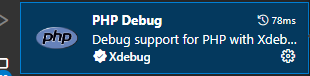

# 搭建环境

## 基于现有的代码搭建

### 1.工具安装

* 代码编辑器选用的 VSCode
* 安装 php一体环境  UPUPW_NP7.rar

    >注：解压后的文件夹目录不能有空格或者中文符号

* 安装MySQL数据库 [Mysql](https://cdn.mysql.com//Downloads/MySQLInstaller/mysql-installer-community-8.0.35.0.msi)

### 2. 获取源代码

获取代码

### 3. NGINX 配置

找到一体化工具UPUPW_NP7.2_64\Nginx\vhosts.conf

确认里面的相关路径是否和自己放置文件的位置路径一致。

除此之外需要修改：root E:/xxxxx/xxx/xxxx; 该值是自己下载的代码位置，搜索替换即可

修改完后在UPUPW中输入s2 启动 nginx，浏览器访问：https://local.hhh.com

注：这个里面的域名 local.hhh.com 访问不到，配一下自己电脑的host。


4. 搞Debug工具

* VSCode 安装扩展 ： xdebug



* VSCode新增配置（注意修改到自己的版本）：

```json
"php.validate.executablePath": "D:/Soft/UPUPW_NP7/UPUPW_NP7.2_64/PHP7/php.exe",
"php.executablePath": "D:/Soft/UPUPW_NP7/UPUPW_NP7.2_64/PHP7/php.exe",
"php.debug.executablePath": "D:/Soft/UPUPW_NP7/UPUPW_NP7.2_64/PHP7/php.exe", 
```

* Chrome安装扩展 Xdebug


使用的时候就在选择Debug就，（甲壳虫会变绿色）

* VSCode增加 launch.json

```json
{
    // 使用 IntelliSense 了解相关属性。
    // 悬停以查看现有属性的描述。
    // 欲了解更多信息，请访问: https://go.microsoft.com/fwlink/?linkid=830387
    "version": "0.2.0",
    "configurations": [
        {
            "name": "Listen for Xdebug",
            "type": "php",
            "request": "launch",
            "port": 9000
        },
        {
            "name": "Launch currently open script",
            "type": "php",
            "request": "launch",
            "program": "${file}",
            "cwd": "${fileDirname}",
            "port": 0,
            "runtimeArgs": [
                "-dxdebug.start_with_request=yes"
            ],
            "env": {
                "XDEBUG_MODE": "debug,develop",
                "XDEBUG_CONFIG": "client_port=${port}"
            }
        },
        {
            "name": "Launch Built-in web server",
            "type": "php",
            "request": "launch",
            "runtimeArgs": [
                "-dxdebug.mode=debug",
                "-dxdebug.start_with_request=yes",
                "-S",
                "localhost:0"
            ],
            "program": "",
            "cwd": "${workspaceRoot}",
            "port": 9003,
            "serverReadyAction": {
                "pattern": "Development Server \\(http://localhost:([0-9]+)\\) started",
                "uriFormat": "http://localhost:%s",
                "action": "openExternally"
            }
        }
    ]
}
```